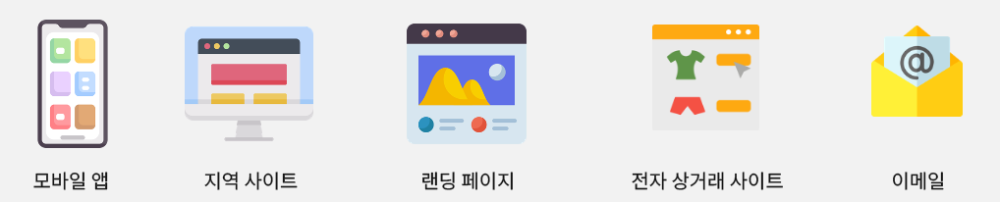
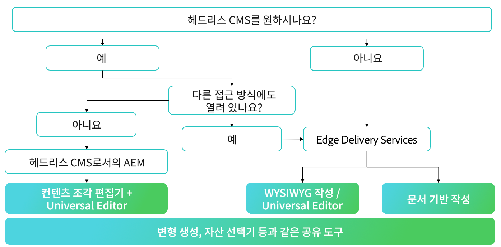
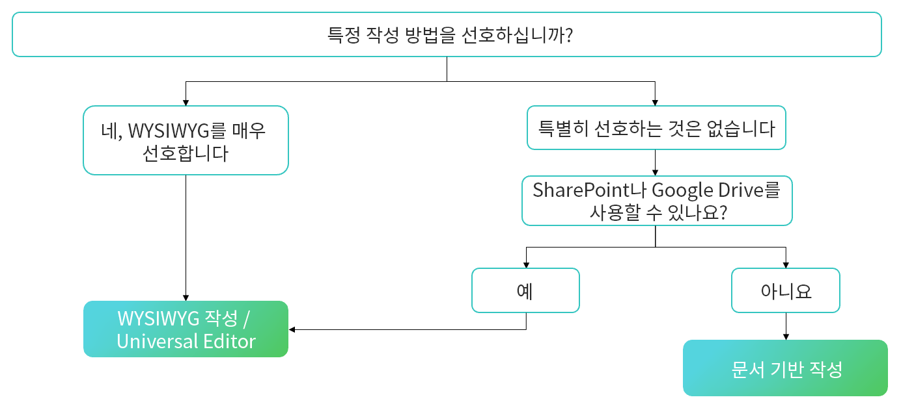

# 작성 방법 선택 {#authoring-methods}

AEM에서 콘텐츠를 작성하는 방법을 결정할 때 중요한 고려 사항을 학습하여 콘텐츠 작성자에게 최상의 결정을 내릴 수 있도록 지원합니다.

## 고려 사항 개요 {#overview}

AEM의 유연성은 문서 기반 작성 또는 WYSIWYG 작성을 선택했는지 여부에 관계없이 작성 요구 사항을 충족하도록 해줍니다. 고려 사항을 시작할 때 다음 사항을 염두에 두십시오.

* **항상 콘텐츠 작성자를 결정에 참여시킵니다.** - 콘텐츠 작성자는 전문가이며 통찰력이 중요합니다.
* **여러 작성 방법을 구현할 수 있습니다.** - Adobe은 필요에 따라 단순하게 시작하고 복잡성을 계층화할 것을 권장하지만 하나의 프로젝트에서 여러 작성 방법을 함께 사용할 수 있습니다.
* **언제든지 나중에 제작 방법을 변경할 수 있습니다.** - 귀하가 결정한 항목이 잠겨 있지 않습니다. Adobe의 자동화된 마이그레이션 도구의 지원을 통해 한 방법에서 다른 방법으로 변경하는 것은 간단합니다.
* **구현 전에 결정하는 것이 아니라 구현의 일부로 결정해야 합니다.** - AEM은 하나의 통합 제품이므로 이 중요한 결정은 계약 협상의 일부가 될 필요가 없습니다. AEM을 구입하면 모든 것을 얻을 수 있습니다. 오히려 이는 구현 중 결정하는 것입니다.

Adobe을 통해 구현의 일부로 요구 사항에 가장 적합한 방법(또는 방법)을 결정할 수 있습니다.

## 한 가지 사이즈가 모든 사이즈에 맞지는 않습니다. {#one-size}

AEM의 모든 구현에는 고유한 워크플로우와 목표가 있습니다. 한 프로젝트에는 자체 게시를 담당하는 콘텐츠 작성자가 포함된 간단한 작성 모델이 포함될 수 있습니다. 반면에 다른 기여자와 승인의 복잡한 네트워크가 있을 수 있습니다.

프로젝트마다 사용 사례가 다를 수 있습니다(및 여러 개).

Adobe은 이를 이해하므로 한 가지 방법으로 모든 환경에 적합한 접근 방식을 제공하지 않습니다. AEM은 사용자의 요구 사항에 가장 적합한 콘텐츠 제작과 콘텐츠 전달을 위한 다양한 접근 방식을 제공하는 단일 솔루션입니다.

최선의 접근법을 결정하기 위해서는 네 가지 항목을 고려해야 한다.

1. [콘텐츠 게재 기본 설정이 있습니까?](#content-delivery)
1. [콘텐츠 작성 환경 설정이 있습니까?](#content-authoring)
1. [프로젝트 목표가 무엇입니까?](#project-goals)
1. [현재 직면한 작성 과제는 무엇입니까?](#authoring-challenges)

## 컨텐츠 전달 환경 설정 {#content-delivery}

첫 번째 고려 사항은 콘텐츠를 전달하는 방식이어야 합니다. Edge Delivery Services은 매우 빠른 사이트를 제공하지만 headless 게재에 중점을 둘 수 있습니다. 다음 진단트리는 옵션을 고려하는 데 도움이 될 수 있습니다.

이를 통해 필요한 사항을 결정할 수 있습니다.

* 콘텐츠 조각 편집기 및/또는 유니버설 편집기를 사용하여 [Headless CMS로서 AEM](/help/headless/introduction.md).
* [문서 기반 편집](/help/edge/docs/authoring.md) 또는 [유니버설 편집기로 WYSIWYG 작성을 사용하는 AEM Edge Delivery Services.](/help/edge/wysiwyg-authoring/authoring.md)

## 콘텐츠 작성 환경 설정 {#content-authoring}

다음 고려 사항은 콘텐츠를 작성하는 방법입니다. 다음 진단트리는 옵션을 고려하는 데 도움이 될 수 있습니다.

이를 통해 필요한 사항을 결정할 수 있습니다.

* [문서 기반 편집을 사용하는 AEM Edge Delivery Services](/help/edge/docs/authoring.md)
* [유니버설 편집기로 WYSIWYG 작성.](/help/edge/wysiwyg-authoring/authoring.md)

## 프로젝트 목표 {#project-goals}

작성 성공은 어떤 모습입니까? 프로젝트의 성공을 어떻게 정의합니까?

* 더 많은 사람이 콘텐츠를 만들 수 있도록 해야 하지만, 새 도구 세트에 대한 교육을 피하려는 경우. (문서 기반 작성 고려)
* 생성하는 콘텐츠의 양을 늘려야 할 수도 있습니다. (문서 기반 작성 고려)
* 시각적 콘텐츠 레이아웃에 초점을 맞추되 코딩 지식의 필요성을 최소화해야 할 수 있습니다. (WYSIWYG 작성을 고려하십시오.)

구현을 시작할 때 명확하게 설명된 프로젝트 목표는 작성 방법에 대한 올바른 결정을 내리는 데 도움이 될 것입니다.

## 작성 문제 {#authoring-challenges}

마지막으로 콘텐츠를 작성하는 데 직면한 구체적인 과제를 생각해 보십시오.

* CMS 외부에서 만든 콘텐츠로 작업을 중복하여 가져오거나 복사하여 붙여넣어야 할 수 있습니다. (문서 기반 작성 고려)
* 작성자에게 CMS 사용 방법을 교육하는 데 필요한 시간을 줄여야 할 수도 있습니다. (문서 기반 작성 고려)
* 작성자가 콘텐츠의 시각적 레이아웃을 자주 편집해야 하므로 지속적인 개발자 지원이 필요할 수 있습니다. (WYSIWYG 작성을 고려하십시오.)
