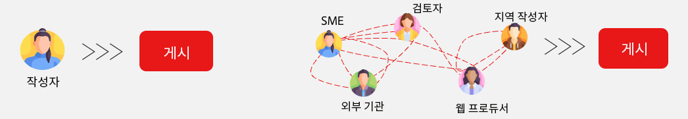

# 작성 방법 선택 {#authoring-methods}

AEM에서 콘텐츠 작성자를 위한 최선의 결정을 내리는 데 도움이 되는 콘텐츠를 작성하는 방법을 결정할 때 중요한 고려 사항을 알아봅니다.

## 고려 사항 개요 {#overview}

AEM의 유연성 덕분에 문서 기반 작성을 선택하든 WYSIWYG 작성을 선택하든 상관없이 작성 요구 사항을 충족할 수 있습니다. 고려 사항을 시작할 때 다음 사실을 명심하십시오.

* **항상 콘텐츠 작성자가 의사 결정에 참여하도록 하십시오.** - 콘텐츠 작성자는 전문가이며 그 인사이트가 매우 중요합니다.
* **여러 가지 작성 방법을 구현할 수 있습니다.** - Adobe는 필요에 따라 단순하게 시작해서 복잡성을 고려하여 높여가는 것을 권장하지만 하나의 프로젝트에서 여러 작성 방법을 함께 사용할 수 있습니다.
* **작성 방법은 나중에 언제든지 변경 가능합니다.** - 무엇을 결정하든 거기에 구속되지 않습니다. Adobe의 자동 마이그레이션 도구를 사용하면 한 방법에서 다른 방법으로 쉽게 변경할 수 있습니다.
* **구현 전에 결정해서는 안 되며, 구현의 일부로서 결정해야 합니다.** - AEM은 하나의 통합된 제품이므로 이 중요한 결정이 계약 협상에 포함될 필요는 없습니다. AEM을 구매하면 모두 받을 수 있습니다. 오히려 이는 구현 중에 내리는 결정입니다.

Adobe는 구현의 일부로 요구 사항에 가장 적합한 방법을 결정하는 데 도움이 됩니다.

## 상황에 따라 다를 수 있습니다. {#one-size}

AEM이 구현하는 모든 방법에는 고유한 워크플로와 목표가 있습니다. 어떤 프로젝트는 콘텐츠 작성자가 자신의 발행물에 대한 책임을 지는 간단한 작성 모델을 포함할 수 있습니다. 반면에 다른 회사에는 복잡한 기여자 네트워크와 승인이 있을 수 있습니다.

프로젝트마다 사용 사례가 다를(또는 여러 개일) 수 있습니다.

Adobe는 이를 이해하므로 획일적인 접근 방식을 제공하지 않습니다. AEM은 콘텐츠 게재를 위해 다양한 접근 방식과 사용자의 요구에 가장 적합한 콘텐츠 제작을 제공하는 단일 솔루션입니다.

최선의 접근 방식을 결정하려면 네 가지 항목을 고려해야 합니다.

1. [선호하는 콘텐츠 게재 환경이 있습니까?](#content-delivery)
1. [선호하는 콘텐츠 작성 환경이 있습니까?](#content-authoring)
1. [프로젝트 목표가 무엇입니까?](#project-goals)
1. [현재 직면한 작성 관련 과제가 무엇입니까?](#authoring-challenges)

## 콘텐츠 게재 환경 설정 {#content-delivery}

콘텐츠를 어떻게 게재할 것인지를 가장 먼저 고려해야 합니다. Edge Delivery Services는 번개처럼 빠른 사이트를 제공하지만 아마도 귀하는 Headless 게재에 초점을 맞추고 있을 것입니다. 다음 의사 결정 트리는 옵션을 고려하는 데 도움이 될 수 있습니다.

다음이 필요한지 여부를 결정하는 데 도움이 될 수 있습니다.

* 콘텐츠 조각 편집기 및/또는 범용 편집기를 사용한 [AEM as a headless CMS](/help/headless/introduction.md).
* [문서 기반 편집](/help/edge/docs/authoring.md) 또는 [범용 편집기가 포함된 WYSIWYG 작성](/help/edge/wysiwyg-authoring/authoring.md)을 사용한 AEM Edge Delivery Services.

## 콘텐츠 작성 환경 설정 {#content-authoring}

다음으로 고려해야 할 사항은 “콘텐츠를 어떻게 작성할 것인가”입니다. 다음 의사 결정 트리는 옵션을 고려하는 데 도움이 될 수 있습니다.

다음이 필요한지 여부를 결정하는 데 도움이 될 수 있습니다.

* [문서 기반 편집](/help/edge/docs/authoring.md)을 사용한 AEM Edge Delivery Services.
* [범용 편집기가 포함된 WYSIWYG 작성](/help/edge/wysiwyg-authoring/authoring.md).

## 프로젝트 목표 {#project-goals}

작성이 성공하면 어떤 모습입니까? 프로젝트의 성공을 어떻게 정의합니까?

* 더 많은 사용자가 콘텐츠를 만들 수 있게 하면서도 새로운 도구 세트에 대한 교육은 피하고 싶을 수 있습니다. (문서 기반 작성을 고려하십시오.)
* 생성하는 콘텐츠의 양을 늘려야 할 수도 있습니다. (문서 기반 작성을 고려하십시오.)
* 시각적 콘텐츠 레이아웃에 집중하되 코딩 지식의 필요성을 최소화해야 할 수도 있습니다. (WYSIWYG 작성을 고려하십시오.)

구현을 시작할 때 프로젝트 목표를 명확하게 명시하면 작성 방법에 대해 정보에 입각한 결정을 내리는 데 도움이 됩니다.

## 작성 과제 {#authoring-challenges}

마지막으로 콘텐츠를 제작할 때 직면하는 특정 과제를 고려하십시오.

* CMS 외부에서 생성된 콘텐츠로 작업이 중복되어 가져올 수도 있고 복사하여 붙여넣어야 할 수도 있습니다. (문서 기반 작성을 고려하십시오.)
* CMS 사용 방법에 대한 작성자 교육에 필요한 시간을 줄여야 할 수 있습니다. (문서 기반 작성을 고려하십시오.)
* 작성자가 콘텐츠의 시각적 레이아웃을 편집하는 경우가 많아 개발자의 지속적인 지원이 필요할 수 있습니다. (WYSIWYG 작성을 고려하십시오.)
