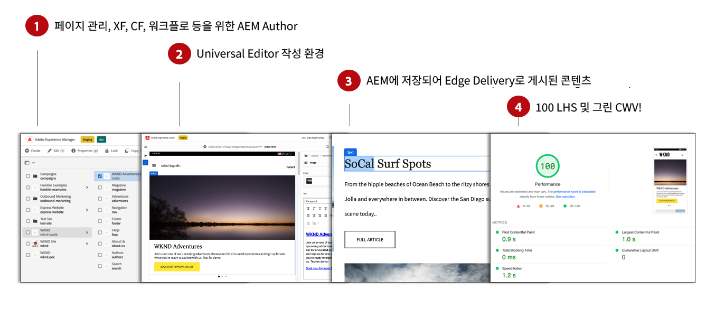
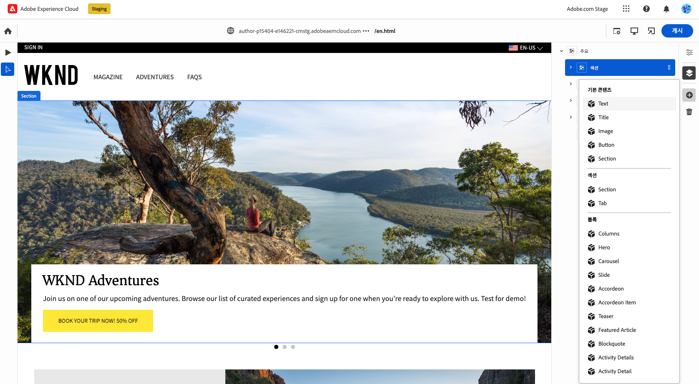
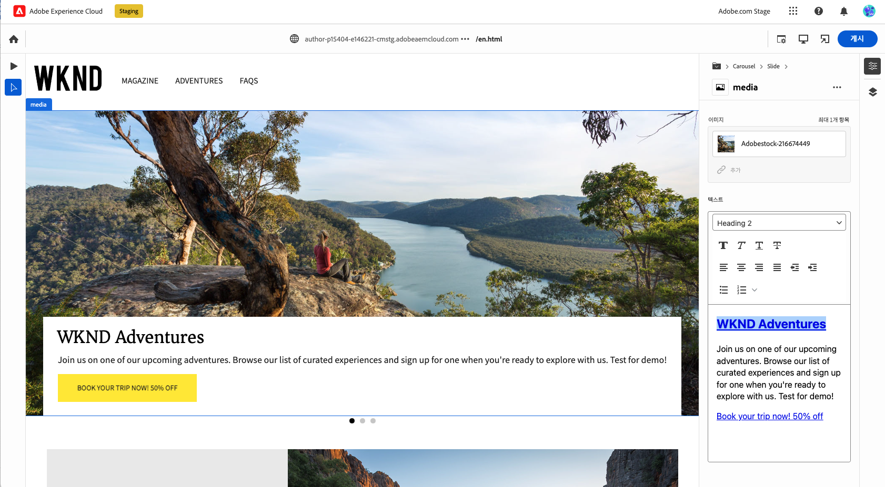

# Edge Delivery Services 컨텐츠 작성 {#authoring-edge}

Edge Delivery Services을 사용하면 쉽고 빠르고 유연하게 작성할 수 있습니다. Edge Delivery Services을 위한 컨텐츠를 작성하는 두 가지 옵션이 있습니다.

* [문서 기반 작성](#document-based) - Microsoft Word 또는 Google 문서 등
* [유니버설 편집기](#universal-editor) - AEM 내 콘텐츠 작성을 위한 최신 UI

## 문서 기반 작성 {#document-based}

문서 기반 작성의 경우 Microsoft Word 및 Google Docs 등 다양한 소스로 작업할 수 있습니다. 이러한 소스의 문서는 웹 사이트의 페이지가 됩니다. 제목, 목록, 이미지, 글꼴 요소 및 비디오는 모두 초기 소스에서 내 웹 사이트로 전송할 수 있습니다. SEO 용도로 메타데이터를 추가하거나 블록을 사용하여 구조화된 콘텐츠로 작업하고 기능을 추가할 수 있습니다.

문서 기반 작성에 대한 자세한 내용은 을 참조하십시오. [이 문서는 Edge Delivery Services 설명서에 있습니다.](https://www.aem.live/docs/authoring)

## 유니버설 편집기 작성 {#universal-editor}

as a Cloud Service으로 Edge Delivery ServicesAEM 를 사용할 때 가장 기본적인 사실은 사용자가 작성하는 콘텐츠가 AEMas a Cloud Service 에서 지속된다는 것입니다.

1. [AEM 작성 환경](/help/sites-cloud/authoring/getting-started/quick-start.md) 는 새 페이지, 경험 조각, 콘텐츠 조각 등의 만들기와 같은 콘텐츠 관리에 사용됩니다.
   * 워크플로우, MSM, 번역, 론치 등과 같은 AEM의 모든 기능을 사용할 수 있습니다.
1. [유니버설 편집기](/help/implementing/universal-editor/authoring.md) 는 AEM에서 관리되는 콘텐츠를 작성하는 데 사용됩니다.
   * 유니버설 편집기는 콘텐츠 작성을 위한 새롭고 현대적인 UI를 제공합니다.
   * 작성을 위해 AEM에서는 HTML을 렌더링하지만 Edge Delivery Services의 스크립트, 스타일, 아이콘 및 기타 리소스를 포함합니다.
   * 범용 편집기를 사용하지만 모든 변경 사항은 AEM으로 유지됩니다.
   * 범용 편집기는 아직 AEM 페이지 편집기와 기능 패리티가 아니며 일부 AEM 기능은 범용 편집기에서 사용하지 못할 수 있습니다.
1. 범용 편집기로 작성하고 AEM에 지속되는 콘텐츠는 Edge Delivery Services에 게시됩니다.
   * 콘텐츠는 AEM에 저장된 상태로 유지됩니다.
   * AEM은 수집에 필요한 의미 체계 HTML을 렌더링합니다.
   * 컨텐츠가 Edge Delivery Services에 게시됩니다.
1. [Edge Delivery Services](https://www.aem.live/home) 100% Lighthouse 점수를 확인합니다.

블록은 Edge Delivery Services이 제공하는 페이지의 기본 구성 요소입니다. 작성자는 Adobe에 의해 표준으로 제공되는 기본 블록 또는 개발자에 의해 프로젝트에 맞게 사용자 지정된 블록 중에서 선택할 수 있습니다.

범용 편집기는 블록을 드래그 앤 드롭하여 콘텐츠를 작성할 수 있는 현대적이고 직관적인 GUI를 제공합니다.

그런 다음 속성 레일에서 블록의 세부 사항을 구성할 수 있습니다.

범용 편집기를 사용하여 작성하는 방법에 대한 자세한 내용은 문서를 참조하십시오 [범용 편집기로 콘텐츠 작성](/help/implementing/universal-editor/authoring.md)

## 시작하는 방법 {#how-to-get-started}

이 기능에 액세스하려면 Adobe 담당자에게 문의하십시오.
