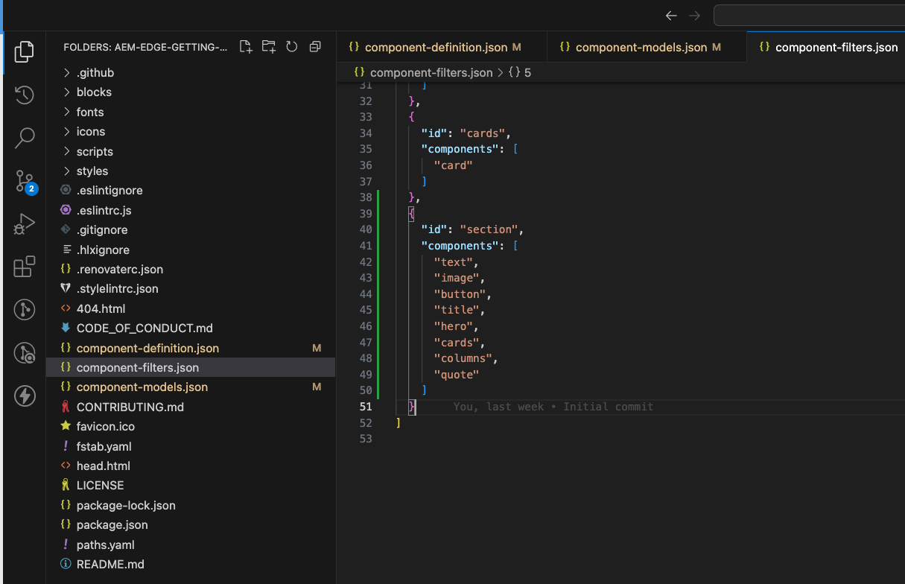
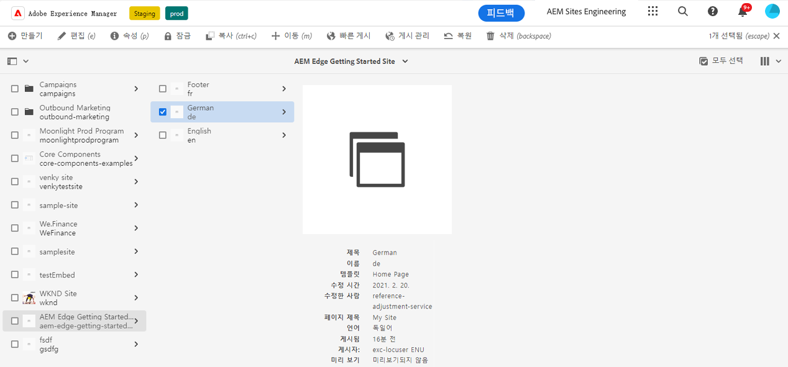
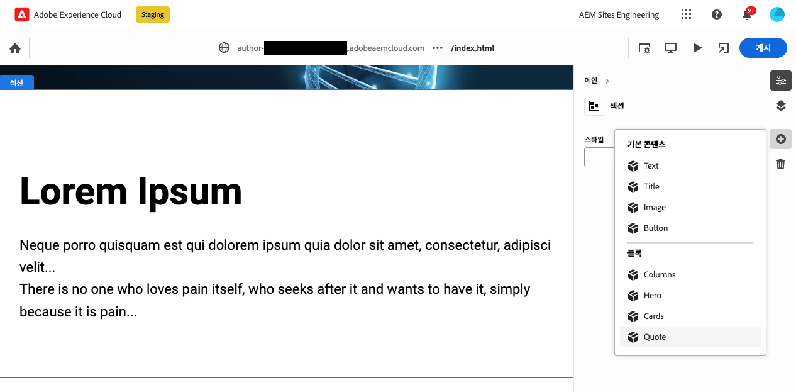
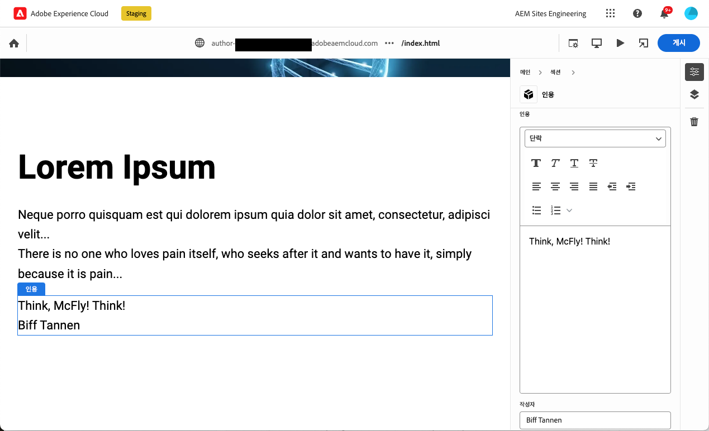
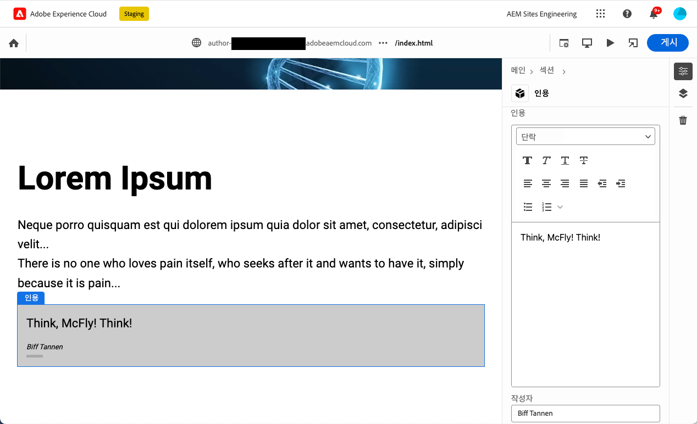

# 범용 편집기에서 사용하기 위해 계측된 블록 만들기 {#create-block}

Edge Delivery Services 프로젝트를 사용하여 AEM 작성에서 범용 편집기와 함께 사용하기 위해 계측된 블록을 만드는 방법에 대해 알아봅니다.

{{aem-authoring-edge-early-access}}

## 사전 요구 사항 {#prerequisites}

이 안내서에서는 Edge Delivery Services 프로젝트를 사용하여 AEM 작성에서 범용 편집기용으로 계측된 블록을 만드는 방법에 대한 단계별 지침을 제공합니다. 구성 요소 추가, 유니버설 편집기에서 구성 요소 정의 로드, 페이지 게시, 블록 장식 및 스타일 구현, 프로덕션 변경 사항 적용 및 확인 작업에 대해 설명합니다. 이 안내서를 완료하면 프로젝트에 대한 새 블록을 만들고 배포할 수 있습니다.

이 안내서를 사용하려면 범용 편집기와 Edge Delivery Services 프로젝트를 사용하여 AEM 작성에 대한 기존 지식이 있어야 합니다. 이 안내서를 시작하기 전에 이미 Edge Delivery Services에 액세스할 수 있고 다음을 포함한 기본 사항을 잘 알고 있어야 합니다.

* 다음을 완료했습니다. [Edge Delivery Service 튜토리얼.](/help/edge/developer/tutorial.md)
* 다음에 대한 액세스 권한이 있습니다. [AEM Cloud Service 샌드박스.](/help/implementing/cloud-manager/getting-access-to-aem-in-cloud/introduction-sandbox-programs.md)
* 다음을 보유하고 있습니다. [이(가) 동일한 샌드박스 환경에서 유니버설 편집기를 활성화했습니다.](/help/implementing/universal-editor/getting-started.md)
* 다음을 완료했습니다. [Edge Delivery Services을 사용한 AEM 작성을 위한 개발자 시작 안내서](/help/edge/edge-dev-getting-started.md) 가이드.

이 안내서는 [Edge Delivery Services을 사용한 AEM 작성을 위한 개발자 시작 안내서](/help/edge/edge-dev-getting-started.md) 가이드.

## 프로젝트에 새 블록 추가 {#add-block}

이 안내서에서는 페이지에서 기억할 수 있는 따옴표를 렌더링하기 위한 블록을 빌드합니다.

이 예제를 단순화하기 위해 `main` 프로젝트 저장소의 분기입니다. 물론 실제 프로젝트에는 [개발 모범 사례를 따라야 합니다](https://www.aem.live/docs/dev-collab-and-good-practices) 다른 분기에서 개발하고 끌어오기 요청을 통해 모든 변경 사항을 검토한 후에 로 병합합니다. `main`.

Adobe은 3단계 접근 방식으로 블록을 개발할 것을 권장합니다.

1. 블록에 대한 정의와 모델을 생성하고 검토하고 프로덕션으로 가져옵니다.
1. 새 블록으로 콘텐츠를 만듭니다.
1. 새 블록의 장식과 스타일을 구현합니다.

다음 따옴표 블록 예제는 이 방법을 따릅니다.

### 블록 정의 및 모델 만들기 {#create-block-model}

1. 에서 생성한 GitHub 프로젝트를 로컬로 복제 [Edge Delivery Services을 사용한 AEM 작성을 위한 개발자 시작 안내서](/help/edge/edge-dev-getting-started.md) 안내하고 선택한 편집기에서 엽니다.

   * Microsoft 코드는 여기에서 예시 목적으로 사용됩니다.

   

1. 편집 `component-definition.json` 프로젝트의 루트에 있는 파일을 새 견적 블록에 대해 다음 정의를 추가하고 파일을 저장합니다.

   ```json
   {
     "title": "Quote",
     "id": "quote",
     "plugins": {
       "xwalk": {
         "page": {
           "resourceType": "core/franklin/components/block/v1/block",
           "template": {
             "name": "Quote",
             "model": "quote",
             "quote": "<p>Think, McFly! Think!</p>",
             "author": "Biff Tannen"
           }
         }
       }
     }
   }
   ```

   

1. 편집 `component-models.json` 프로젝트의 루트에 파일을 추가하고 다음을 추가합니다 [모델 정의](/help/implementing/universal-editor/field-types.md#model-structure) 를 사용하여 새 견적 블록을 만들고 파일을 저장합니다.

   * 문서를 참조하십시오. [Edge Delivery Services 프로젝트를 사용한 AEM 작성을 위한 콘텐츠 모델링](/help/edge/content-modeling.md) 콘텐츠 모델을 만들 때 고려해야 할 사항에 대해 자세히 알아보십시오.

   ```json
   {
     "id": "quote",
     "fields": [
        {
          "component": "text-area",
          "name": "quote",
          "value": "",
          "label": "Quote",
          "valueType": "string"
        },
        {
          "component": "text-input",
          "valueType": "string",
          "name": "author",
          "label": "Author",
          "value": ""
        }
      ]
   }
   ```

   

1. 편집 `component-filters.json` 프로젝트의 루트에 있는 파일을 참조하고 견적 블록을 [필터 정의](/help/implementing/universal-editor/customizing.md#filtering-components) 블록을 섹션에 추가하고 파일을 저장할 수 있도록 합니다.

   ```json
   {
     "id": "section",
     "components": [
       "text",
       "image",
       "button",
       "title",
       "hero",
       "cards",
       "columns",
       "quote"
      ]
   }
   ```

   

1. git을 사용하여 다음 변경 사항을 `main` 분기입니다.

   * 커밋: `main` 는 설명 목적으로만 사용됩니다. [모범 사례 따르기](https://www.aem.live/docs/dev-collab-and-good-practices) 실제 프로젝트 작업에 대해 가져오기 요청을 사용합니다.

### 블록으로 콘텐츠 만들기 {#create-content}

이제 기본 견적 블록이 정의되어 샘플 프로젝트에 커밋되었으므로 기존 페이지에 견적 블록을 추가할 수 있습니다.

1. AEM 브라우저에서 as a Cloud Service으로 로그인합니다. [사이트 콘솔을 사용하여](/help/sites-cloud/authoring/getting-started/basic-handling.md) 에서 만든 사이트로 이동합니다. [Edge Delivery Services을 사용한 AEM 작성을 위한 개발자 시작 안내서](/help/edge/edge-dev-getting-started.md) 페이지를 안내하고 선택합니다.

   * 이 경우, `index` 는 설명 목적으로 사용됩니다.

   

1. 탭 또는 클릭 **편집** 콘솔의 도구 모음에서 를 클릭하면 유니버설 편집기가 열립니다.

   * 페이지를 로드하려면 탭하거나 클릭해야 할 수 있습니다 **Adobe으로 로그인** 범용 편집기에서 AEM에 인증합니다.

1. 범용 편집기에서 섹션을 선택합니다. 속성 레일에서 을 탭하거나 클릭합니다. **추가** 아이콘을 클릭한 다음 새 항목 선택 **견적** 메뉴에서 차단합니다.

   * 다음 **추가** 아이콘은 더하기 기호입니다.
   * 선택한 객체의 파란색 윤곽선에 레이블이 지정된 탭이 있는 경우 단면을 선택했다는 것을 알 수 있습니다 **섹션**.
   * 이 예제에서는 의 약간 위에 있는 을 탭하거나 클릭합니다. **로렘 입숨** 머리글은 머리글과 로렘 ipsum 텍스트가 포함된 섹션을 선택합니다.

   

1. 페이지가 다시 로드되고 견적 블록이 선택한 섹션의 하단에 기본 콘텐츠가에 지정됩니다. `component-definitions.json` 파일.

   * 따옴표 블록은 즉석 또는 속성 레일에서 다른 블록으로 선택 및 편집할 수 있습니다.
   * 스타일링은 추가 단계에서 적용됩니다.

   

1. 견적의 콘텐츠에 만족하면 을 탭하거나 클릭하여 페이지를 게시할 수 있습니다. **게시** 단추를 클릭합니다.

1. 게시된 페이지로 이동하여 콘텐츠가 게시되었는지 확인합니다. 링크는 와 유사합니다. `https://<branch>--<repo>--<owner>.hlx.page`

   

### 블록 스타일 지정 {#style-block}

작동하는 견적 블록이 있으므로 여기에 스타일을 적용할 수 있습니다.

1. 프로젝트의 편집기로 돌아갑니다.

1. 만들기 `quote` 폴더 `blocks` 폴더를 삭제합니다.

   

1. 새 항목 `quote` 폴더, 추가 `quote.js` 다음 JavaScript를 추가하여 블록 장식을 구현하고 파일을 저장하는 파일입니다.

   ```javascript
   export default function decorate(block) {
     const [quoteWrapper] = block.children;
   
     const blockquote = document.createElement('blockquote');
     blockquote.textContent = quoteWrapper.textContent.trim();
     quoteWrapper.replaceChildren(blockquote);
   }
   ```

   


1. 다음에서 `quote` 폴더, 추가 `quote.css` 다음 CSS 코드를 추가하고 파일을 저장하여 블록의 스타일을 정의하는 파일입니다.

   ```css
   .block.quote {
       background-color: #ccc;
       padding: 0 0 24px;
       display: flex;
       flex-direction: column;
       margin: 1rem 0;
   }
   
   .block.quote blockquote {
       margin: 16px;
       text-indent: 0;
   }
   
   .block.quote > div:last-child > div {
       margin: 0 16px;
       font-size: small;
       font-style: italic;
       position: relative;
   }
   
   .block.quote > div:last-child > div::after {
       content: "";
       display: block;
       position: absolute;
       left: 0;
       bottom: -8px;
       height: 5px;
       width: 30px;
       background-color: darkgray;
   }
   ```

   

1. git을 사용하여 다음 변경 사항을 `main` 분기입니다.

   * 커밋: `main` 는 설명 목적으로만 사용됩니다. [모범 사례 따르기](https://www.aem.live/docs/dev-collab-and-good-practices) 실제 프로젝트 작업에 대해 가져오기 요청을 사용합니다.

1. 프로젝트의 페이지를 편집하던 유니버설 편집기의 브라우저 탭으로 돌아가서 페이지를 다시 로드하여 스타일이 지정된 블록을 확인합니다.

1. 페이지에서 이제 스타일의 따옴표 블록을 참조하십시오.

   

1. 게시된 페이지로 이동하여 변경 사항이 프로덕션에 푸시되었는지 확인합니다. 링크는 와 유사합니다. `https://<branch>--<repo>--<owner>.hlx.page`

   

축하합니다! 이제 완전히 작동하는 스타일의 견적 블록이 있습니다. 이 예제를 사용하여 프로젝트별 블록을 직접 디자인할 수 있습니다.

## 다른 작업 분기 사용 {#other-branches}

이 안내서를 통해 다음을 직접 커밋할 수 있었습니다. `main` 단순함을 위한 분기입니다. 샘플 저장소에서 실험의 경우 일반적으로 문제가 되지 않습니다. 실제 프로젝트 작업의 경우 [개발 모범 사례를 따라야 합니다](https://www.aem.live/docs/dev-collab-and-good-practices) 다른 분기에서 개발하고 끌어오기 요청을 통해 모든 변경 사항을 검토한 후에 로 병합합니다. `main`.

에서 을(를) 개발하지 않는 경우 `main` 분기, 다음을 추가할 수 있습니다. `?ref=<branch>` 을 클릭하여 Universal Editor 위치 표시줄을 통해 분기에서 페이지를 로드합니다. `<branch>` 는 프로젝트의 미리보기 또는 라이브 URL에 사용되는 분기 이름입니다(예: ). `https://<branch>--<repo>--<owner>.hlx.page`.

새 모델을 사용하여 콘텐츠를 게시하는 것은 모델이 `main` 분기입니다.
