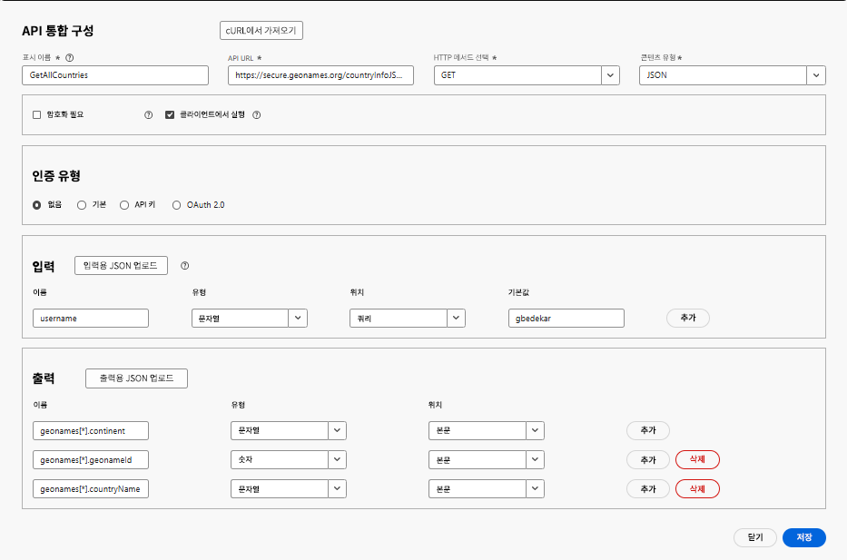
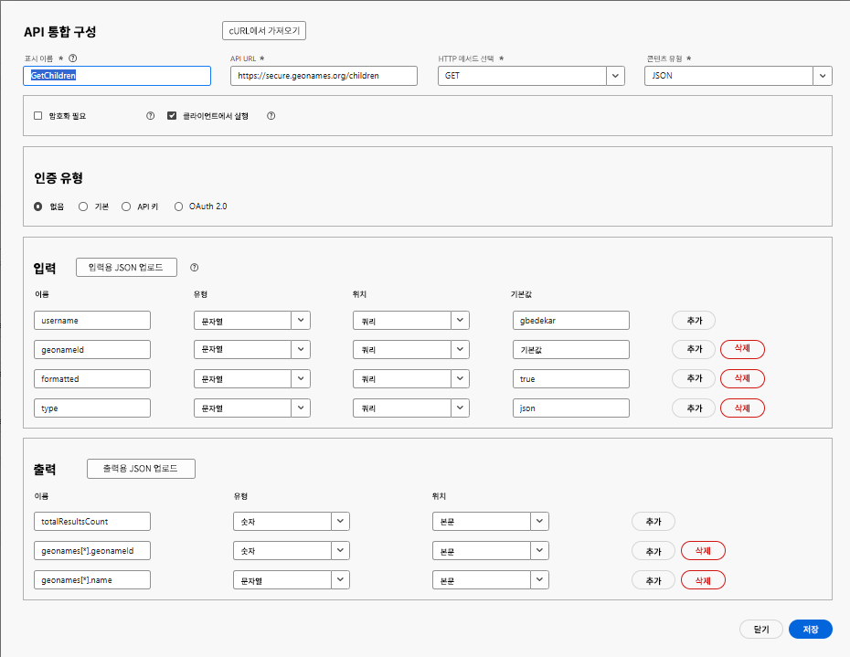

# API 통합 만들기

이 튜토리얼에서는 2개의 API 통합을 만듭니다.

- GetAllCountries는 국가 목록을 반환합니다.
- GetChildren - geonameId로 표현되는 국가 또는 주의 바로 아래 하위 항목을 반환합니다.

## GetAllCountries - API 통합 구성

- API 통합 구성

   - 표시 이름: GetAllCountries → 시스템에서 이 API에 해당하는 레이블.

   - API URL: `https://secure.geonames.org/countryInfoJSON` - 호출하고 있는 엔드포인트.

   - HTTP 메서드: GET - 간단한 GET 요청을 만들고 있습니다.

   - 콘텐츠 유형: JSON - 응답은 JSON 형식으로 표시됩니다.

- 옵션:

   - 암호화 필요 선택 해제 - HTTPS 이외의 암호화 계층 없음.

   - 클라이언트에서 실행 선택 - 호출이 서버측이 아닌 클라이언트/브라우저에서 실행됩니다.
- 인증 유형
   - 없음 - GeoNames API는 헤더에 OAuth 또는 API 키가 필요하지 않기 때문
- 입력:
   - 입력 섹션은 API로 전송되는 항목을 정의합니다
   - **사용자 이름** → 유형: 문자열, 쿼리에서 전송됨, 기본값: gbedekar.
   - 모든 요청은 ?username=gbedekar를 URL에 추가합니다.
- 출력
   - 출력은 추출하고 사용할 JSON 응답의 필드를 정의합니다.
GeoNames 응답은 다음과 같은 형식입니다.

  
   - geonames 배열 내부에서 2개의 필드 매핑:

     geonames[*].geonameId → 숫자로 표시됨

     geonames[*].countryName → 문자열로 표시됨

     [*]는 배열에서 각 국가마다 반복됨을 의미합니다.

## GetChildren

쿼리 매개변수로서의 geoNamesId가 전달된 위치의 바로 아래 위치에 해당하는 GeoName을 요구합니다.

- API 통합 구성

   - 표시 이름: GetAllCountries → 시스템에서 이 API에 해당하는 레이블.

   - API URL: `https://secure.geonames.org/children` → 호출하고 있는 엔드포인트.

   - HTTP 메서드: GET → 간단한 GET 요청을 만들고 있습니다.

   - 콘텐츠 유형: JSON → 응답은 JSON 형식으로 표시됩니다.

- 옵션:

   - 암호화 필요 선택 해제 → HTTPS 이외의 암호화 계층 없음.

   - 클라이언트에서 실행 선택 → 호출이 서버측이 아닌 클라이언트/브라우저에서 실행됩니다.
- 인증 유형
   - 없음 - GeoNames API는 헤더에 OAuth 또는 API 키가 필요하지 않기 때문
- 입력:
   - API로 전송되는 항목을 정의합니다.
   - **사용자 이름** → 유형: 문자열, 쿼리에서 전송됨, 기본값: gbedekar.
   - 모든 요청은 ?username=gbedekar를 URL에 추가합니다.
   - **geonameId** -> 형식: 문자열. geonameId로 표현되는 국가/주의 하위 항목을 반환합니다.
   - **유형** =>문자열. json으로 설정하면 JSON 형식으로 응답이 반환됩니다.
- 출력
   - 추출하고 사용할 JSON 응답의 필드를 정의합니다.
GeoNames 응답은 다음과 같은 형식입니다.

  
   - geonames 배열 내부에서 2개의 필드 매핑:

     geonames[*].geonameId → 숫자로 표시됨

     geonames[*].name → 문자열로 표시됨

     [*]는 배열에서 각 국가마다 반복됨을 의미합니다.

