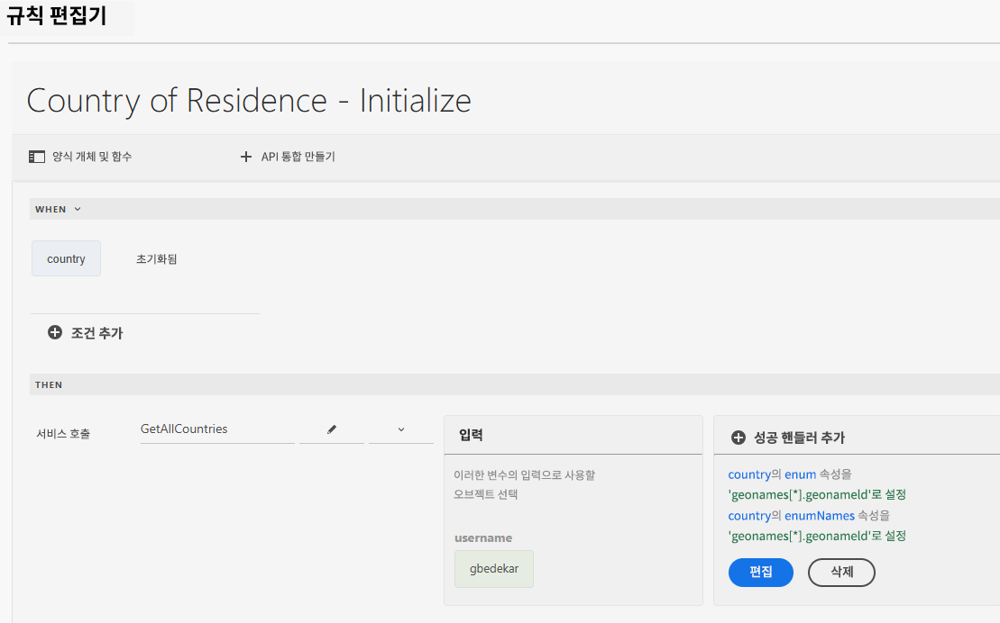
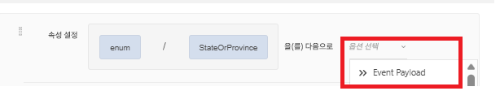
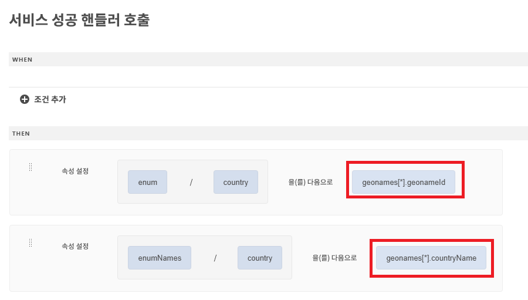
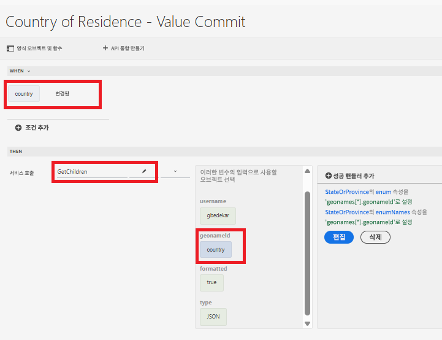
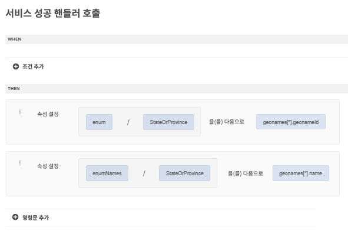

# 범용 편집기를 사용하여 양식 만들기

범용 편집기를 사용하여 다음 양식을 만듭니다. 양식에는 API 통합을 사용하여 값을 채우는 3개의 드롭다운 목록이 있습니다

## 컨트리 오브 레지던스

초기화되면 거주 국가 드롭다운이 API 호출 결과로 채워집니다.

## 성공 핸들러

성공 처리기는 국가 드롭다운 목록의 enum 및 enumNames를 geonames 배열의 적절한 값으로 설정하도록 정의되었습니다. 지리 이름 배열은 이벤트 페이로드 옵션에서 사용할 수 있습니다.

## 하위 값 가져오기

시/도 드롭다운 목록은 사용자가 거주 국가 드롭다운 목록에서 선택한 경우 채워집니다. 선택한 국가와 연결된 geonameId가 입력 매개 변수로 GetChildren API 통합에 전달됩니다

성공 처리기는 StateOrProvince 드롭다운 필드의 enum/enumNames를 설정하도록 정의되었습니다.

시/도를 선택하면 시/도 드롭다운 목록을 채우는 데 사용되는 위에서 언급한 패턴에 따라 시/도 드롭다운 목록을 채울 수 있습니다.