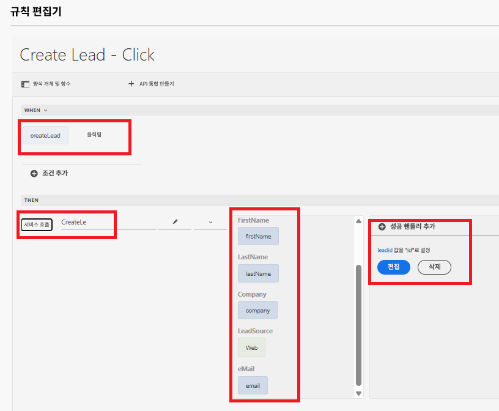

# API 통합을 사용하여 Salesforce 리드 객체 만들기

이 사용 사례는 Salesforce에서 API 통합을 사용하여 리드를 생성하는 방법을 안내합니다. 프로세스가 끝나면 다음이 가능해집니다.

보안 API 액세스를 사용 설정하려면 [Salesforce에서 연결된 앱](https://help.salesforce.com/s/articleView?id=platform.ev_relay_create_connected_app.htm&type=5)을 설정합니다.

웹 브라우저에서 실행되는 코드(예: JavaScript)가 특정 원점에서 Salesforce과 통신할 수 있도록 CORS(원점 간 리소스 공유)를 구성하고, 아래와 같이 원점을 허용 목록에 추가합니다.


## 연결된 앱 설정

다음 설정은 연결된 앱에서 사용됩니다. 요구 사항에 따라 OAuth 범위를 지정할 수 있습니다.


## API 통합 만들기

| 이름 | 값 |
|--------------------------------|------------------|
| API url | https://`<your-domain>`d.my.salesforce.com/services/data/v32.0/sobjects/Lead |
| 클라이언트 ID | 연결된 앱 고유의 설정 |
| 클라이언트 비밀 | 연결된 앱 고유의 설정 |
| OAuth URL | https://login.salesforce.com/services/oauth2/authorize |
| 액세스 토큰 URL | https://`<your-domain>`/services/oauth2/token |
| 새로 고침 토큰 URL | https://`<your-domain>`/services/oauth2/token |
| 인증 범위 | api chatter_api full id openid refresh_token visualforce web |
| 인증 헤더 | 인증 전달자 |


## 입력 및 출력 매개변수

API 호출에 해당하는 입력 매개변수를 정의하고 다음 json을 사용하여 출력 매개변수를 매핑합니다.

```json
{
    "id": "00QKY000001LyJR2A0",
    "success": true
}
```


## 양식 만들기

범용 편집기를 사용하여 간단한 적응형 양식을 만들어 아래와 같이 리드 개체 세부 정보를 캡처합니다. 


규칙 편집기를 사용하여 리드 생성 확인란의 클릭 이벤트를 처리합니다. 아래와 같이 입력 매개변수를 적절한 양식 개체의 값에 매핑합니다. 새로 만든 리드 개체의 ID를 `leadid` TextField 개체에 표시합니다.


## 통합 테스트

- 양식 미리보기
- 의미 있는 값을 입력합니다.
- API 호출을 트리거하려면 `Create Lead` 확인란을 선택합니다.
- 새로 생성된 리드 개체의 리드 ID가 `Lead ID` 텍스트 필드에 표시됩니다.