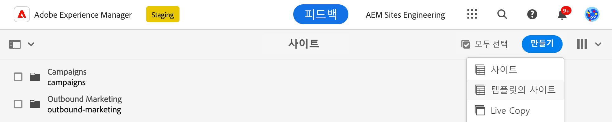
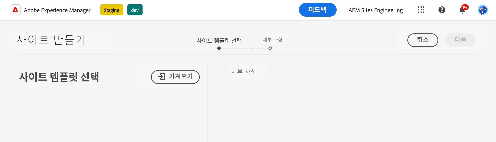
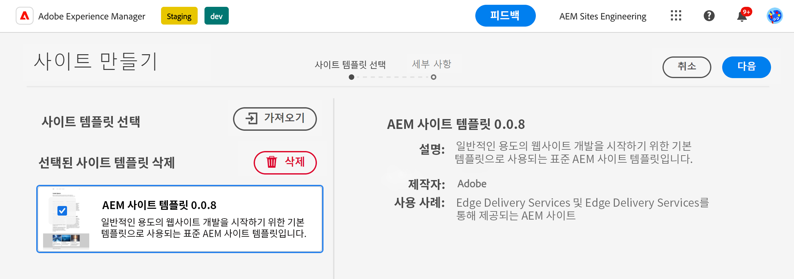
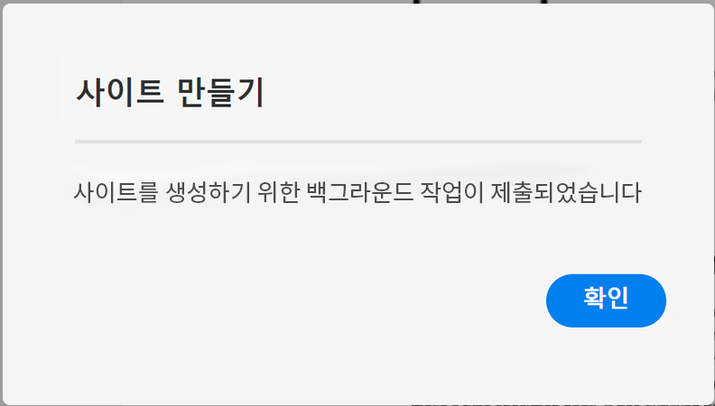
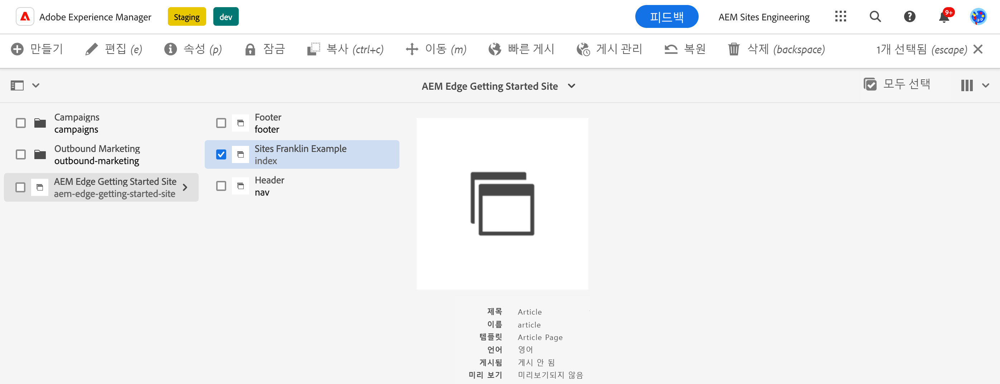
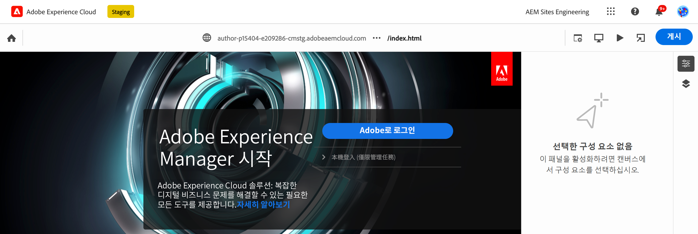
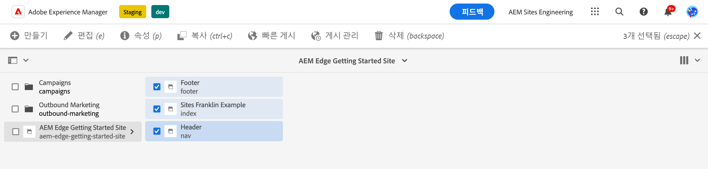

# Edge Delivery Services을 사용하여 AEM 작성 {#edge-dev-getting-started}

이 안내서를 사용하면 Edge Delivery Services 및 컨텐츠 작성용 범용 편집기를 사용하여 새 Adobe Experience Manager 사이트를 시작하고 실행할 수 있습니다.

{{aem-authoring-edge-early-access}}

## 사전 요구 사항 {#prerequisites}

이 안내서를 시작하기 전에 의 기본 사항을 잘 알고 있고 다음을 포함한 Edge Delivery Services에 액세스할 수 있어야 합니다.

* 다음을 완료했습니다. [Edge Delivery Service 튜토리얼.](/help/edge/developer/tutorial.md)
* 다음에 대한 액세스 권한이 있습니다. [AEM Cloud Service 샌드박스.](/help/implementing/cloud-manager/getting-access-to-aem-in-cloud/introduction-sandbox-programs.md)
* 다음을 보유하고 있습니다. [이(가) 동일한 샌드박스 환경에서 유니버설 편집기를 활성화했습니다.](/help/implementing/universal-editor/getting-started.md)

## 적합한 편집기 선택 {#editor-choice}

AEM에서는 두 개의 서로 다른 콘텐츠 편집기를 제공하며 상황에 따라 사용할 편집기의 선택 사항이 달라집니다.

* **유니버설 편집기** - 새 사이트의 기본 선택 항목이어야 합니다.
* **AEM 페이지 편집기** - 기존 AEM Sites에서 Edge Delivery Services으로 마이그레이션하기 위해 선택해야 합니다.

이 안내서는 범용 편집기를 사용하는 Edge Delivery Services에 대한 AEM 프로젝트에 중점을 둡니다. 문서 보기 [Edge Delivery Services을 위한 개발](/help/edge/developing.md) 올바른 편집기를 선택하고 기존 AEM 사이트를 Edge Delivery Services으로 마이그레이션하는 방법에 대한 자세한 내용을 참조하십시오.

## AEM 작성 및 Edge Delivery Services 시작하기 {#getting-started}

완료하면 [사전 요구 사항](#prerequisites) 및 다음을 생성함 [범용 편집기 사용 선택,](#editor-choice) 자체 프로젝트를 시작할 수 있습니다.

### GitHub 프로젝트 만들기 {#create-github-project}

먼저 Adobe 템플릿을 기반으로 GitHub에서 새 프로젝트를 만들어야 합니다.

1. 다음으로 이동 [`https://github.com/adobe-rnd/aem-boilerplate-xwalk`](https://github.com/adobe-rnd/aem-boilerplate-xwalk) 및 클릭 **이 템플릿 사용** 및 선택 **새 저장소 만들기**.

   * 이 옵션을 보려면 GitHub에 로그인해야 합니다.

   

1. 기본적으로 저장소가 사용자에게 할당됩니다. 필요에 따라 변경하고 저장소 이름과 설명을 입력한 다음 을(를) 클릭합니다. **저장소 만들기**.

   

1. 동일한 브라우저의 새 탭에서 다음 위치로 이동합니다. [`https://github.com/apps/aem-code-sync`](https://github.com/apps/aem-code-sync) 및 클릭 **구성**.

   

1. 클릭 **구성** 이전 단계에서 새 저장소를 생성한 조직의 경우.

   

1. AEM 코드 동기화 GitHub 페이지의 **저장소 액세스**, 선택 **선택한 저장소만**&#x200B;이전 단계에서 생성한 저장소를 선택한 다음 을 클릭합니다 **저장**.

   

1. AEM 코드 동기화가 설치되면 확인 화면이 표시됩니다. 새 저장소의 브라우저 탭으로 돌아갑니다.

   

1. 다음을 클릭합니다. `fstab.yaml` 파일을 열어 다음 **이 파일 편집** 아이콘을 클릭하여 편집합니다.

   

1. 편집 `fstab.yaml` 프로젝트의 마운트 지점을 업데이트하는 파일입니다. 기본 Google 문서 URL을 AEM as a Cloud Service 작성 인스턴스의 URL로 바꾼 다음 **변경 내용 커밋...**.

   * `https://<aem-author>/bin/franklin.delivery/<owner>/<repository>/main`
   * 마운트 지점을 변경하면 Edge Delivery Services에게 사이트 콘텐츠를 찾을 수 있는 위치가 표시됩니다.

   

1. 원하는 대로 커밋 메시지를 추가한 다음 **변경 내용 커밋**, 다음을 커밋합니다. `main` 분기입니다.

   

1. 리포지토리의 루트로 돌아가서 를 클릭합니다. `paths.yaml` 그리고 **이 파일 편집** 아이콘.

   

1. 기본 매핑을 다음으로 바꾸기 `/content/<site-name>/:/` 및 클릭 **변경 내용 커밋...**.

   * 사용자 정의 제공 `<site-name>`. 나중에 필요합니다.
   * 매핑은 Edge Delivery Services에게 AEM 저장소의 콘텐츠를 사이트 URL에 매핑하는 방법을 알려줍니다.

   

1. 원하는 대로 커밋 메시지를 추가한 다음 **변경 내용 커밋**, 다음을 커밋합니다. `main` 분기입니다.

   

### 새 AEM 사이트 만들기 및 편집 {#create-aem-site}

이제 GitHub 프로젝트가 있으므로 프로젝트에서 사용할 수 있는 새 AEM 사이트를 만들어야 합니다.

>[!NOTE]
>
>범용 편집기를 사용하여 사이트를 편집하려면 Chromium 기반 브라우저를 사용해야 합니다.

1. 다음을 통해 Adobe 엔지니어링에서 Edge Delivery Services으로 최신 AEM 작성 사이트 템플릿을 요청합니다. [프로젝트 Slack 채널.](/help/edge/docs/slack.md)

1. AEM as a Cloud Service 제작 인스턴스에 로그인하고 사이트 콘솔로 이동한 다음 를 탭하거나 클릭합니다 **만들기** -> **템플릿의 사이트**.

   

1. 다음에서 **사이트 템플릿 선택** 사이트 만들기 마법사의 탭에서 **가져오기** 단추를 클릭하여 새 템플릿을 가져옵니다.

   

1. Adobe 엔지니어링에서 제공한 Edge Delivery Services 사이트 템플릿을 사용하여 AEM 저작을 업로드합니다.

1. 템플릿을 가져오면 마법사에 나타납니다. 탭하거나 클릭하여 선택한 다음 탭하거나 클릭합니다 **다음**.

   

1. 다음 필드를 입력한 다음 탭하거나 클릭합니다 **만들기**.

   * **사이트 제목** - 사이트에 대한 설명 제목을 추가합니다.
   * **사이트 제목** - 다음을 사용합니다. `<site-name>` 에 정의한 [이전 단계입니다.](#create-github-project)
   * **GitHub URL** - 이전 단계에서 생성한 GitHub 프로젝트의 URL을 사용합니다.

   

1. AEM은 대화 상자를 통해 사이트 생성을 확인합니다. 탭 또는 클릭 **확인** 취소하십시오.

   

1. 사이트 콘솔에서 다음 위치로 이동합니다. `index.html` 을 클릭하고 을 탭하거나 클릭합니다. **편집** 을 클릭합니다.

   

1. 유니버설 편집기가 새 탭에서 열립니다. 탭하거나 클릭해야 할 수 있습니다. **Adobe으로 로그인** 을 클릭하여 페이지를 편집합니다.

   

이제 범용 편집기를 사용하여 사이트를 편집할 수 있습니다. 다음을 참조하십시오. [범용 편집기 설명서](/help/implementing/universal-editor/authoring.md) 추가 정보.

### 새 사이트 게시 {#publishing}

범용 편집기를 사용하여 새 사이트 편집을 마치면 콘텐츠를 게시할 수 있습니다.

1. 사이트 콘솔에서 새 사이트에 대해 만든 모든 페이지를 선택한 다음 을 탭하거나 클릭합니다 **빠른 게시** 을 클릭합니다.

   

1. 탭 또는 클릭 **게시** 확인 대화 상자에서 프로세스를 시작합니다.

   

1. 동일한 브라우저에서 새 탭을 열고 새 사이트의 URL로 이동합니다.

   * `https://main--<site-name>--<owner>.hlx.page`

1. 게시된 콘텐츠를 확인합니다.

   
