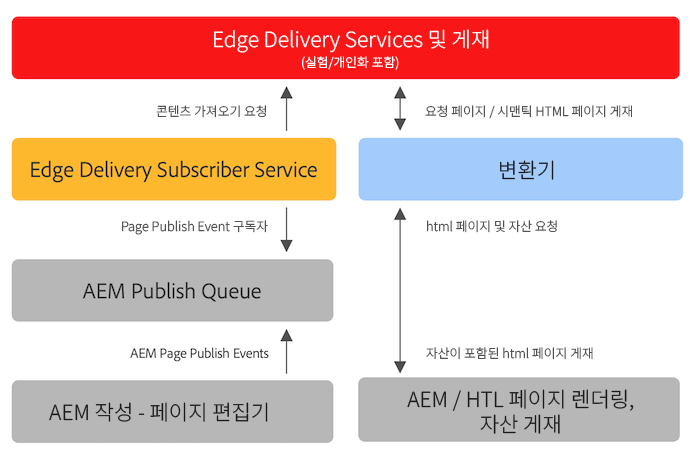

# 기존 AEM 프로젝트와 함께 Edge Delivery Services 사용 {#existing-projects}

새 AEM 프로젝트가 Edge Delivery Services의 혜택을 받을 때까지 기다릴 필요가 없습니다. Edge Delivery Services을 기존 AEM 프로젝트에 통합할 수 있으므로 성능 향상을 즉시 활용할 수 있습니다.

## AEM 페이지 편집기 제한 사항 {#page-editor}

Edge Delivery Services이 등장하기 전에 AEM에서 관리되는 콘텐츠는 AEM 페이지 편집기를 사용하여 편집되었습니다. Edge Delivery Services이 도입되기 전에 프로젝트가 시작된 경우 페이지 편집기를 사용하는 것이 거의 확실합니다.

AEM 페이지 편집기는 [AEM 구성 요소](/help/implementing/developing/components/overview.md) 예: [핵심 구성 요소.](https://experienceleague.adobe.com/docs/experience-manager-core-components/using/introduction.html) 이러한 구성 요소는 Edge Delivery Services과 호환되지 않습니다. 이러한 이유로 기존 AEM 프로젝트에 Edge Delivery Services을 도입하려면 다음 두 단계가 필요합니다.

* [1단계 - 프런트엔드 교체](#replace-front-end)
* [2단계 - 범용 편집기로 전환](#switch-ue)

## 1단계 - 프런트엔드 교체 {#replace-front-end}

1단계에서는 기존 AEM 사이트 구조, 구성 요소 및 작성 도구를 계속 사용할 수 있습니다. 웹 사이트 렌더링은 JavaScript 및 CSS를 사용하는 블록을 사용하여 다시 빌드되고 Edge Delivery Services을 통해 전달됩니다.

다음을 참조하십시오. [섹션 작성](/help/edge/developer/block-collection.md) Edge Delivery 서비스를 위한 블록 및 개발 방법에 대한 자세한 내용은 Edge Delivery Services 설명서 를 참조하십시오.

AEM에서 렌더링된 HTML 출력을 변환하여 Edge Delivery Services으로 보내려면 App Builder의 변환기가 필요합니다.

2단계는 기술 중복을 제거하여 프로세스를 완료합니다. AEM 작성자의 HTL 및 Java가 포함된 AEM 핵심 구성 요소, 에지 전달의 JS 기반 블록 및 nodeJS 기반 변환기.

## 2단계 - 범용 편집기로 전환 {#switch-ue}

이 단계에서 AEM 페이지 편집기는 범용 편집기로 대체됩니다. 범용 편집기는 블록에서 직접 작업할 수 있으므로 AEM 핵심 구성 요소 및 변환기가 더 이상 필요하지 않습니다.

## 시작하는 방법 {#how-to-get-started}

이 기능에 액세스하려면 Adobe 담당자에게 문의하십시오.
