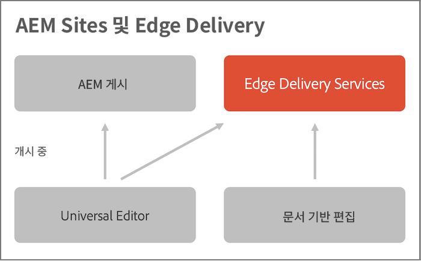

# Edge Delivery Services 개요 {#edge-delivery-services}

Edge Delivery Services를 사용하여 AEM은 참여 및 전환을 유도하는 탁월한 경험을 제공합니다. 이를 위해 AEM은 빠르게 작성 및 개발할 수 있는 영향력이 큰 경험을 제공합니다. 작성자가 콘텐츠를 빠르게 업데이트 및 게시하고 새 사이트를 신속하게 시작할 수 있는 신속한 개발 환경을 지원하는 구성 가능한 서비스 세트입니다. 그에 따라 Edge Delivery Services를 사용하여 전환을 개선하고, 비용을 절감하고, 최고의 콘텐츠 속도를 제공할 수 있습니다.

Edge Delivery Services를 사용하여 다음과 같은 작업을 수행할 수 있습니다.

* 완벽한 Lighthouse 점수로 빠른 사이트를 만들고 실시간 모니터링(RUM)을 통해 사이트 성능을 지속적으로 모니터링합니다.
* 콘텐츠 소스를 분리하여 작성 효율성을 높입니다. 기본적으로 WYSIWYG와 문서 기반 작성 을 모두 사용할 수 있습니다. 따라서 동일한 웹 사이트에서 여러 콘텐츠 소스로 작업할 수 있습니다.
* 기본 제공 실험 프레임워크를 사용하여 성능에 영향을 주지 않고도 빠르게 테스트를 작성 및 실행하고 테스트 승자 프로덕션에 대한 빠른 릴리스를 제공할 수 있습니다.

## 개요 {#overview}

Edge Delivery Services는 웹 사이트에서 콘텐츠를 작성하는 방법을 보다 유연하게 제공하는 구성 가능한 서비스 세트입니다. 두 가지를 모두 사용할 수 있습니다. [AEM 콘텐츠 관리](https://experienceleague.adobe.com/docs/experience-manager-cloud-service/content/sites/authoring/getting-started/concepts.html) 및 를 사용하여 WYSIWYG 작성 [유니버설 편집기](/help/sites-cloud/authoring/universal-editor/authoring.md) 뿐만 아니라 [문서 기반 작성.](https://www.aem.live/docs/authoring)

다음 다이어그램은 Microsoft Word(문서 기반 작성)에서 콘텐츠를 편집하고 Edge Delivery Services에 게시하는 방법을 보여 줍니다. 또한 유니버설 편집기를 사용하여 WYSIWYG를 편집하는 모습도 보여줍니다.

Microsoft Word 또는 Google 문서의 콘텐츠를 직접 사용하여 해당 소스가 웹 사이트의 페이지가 되도록 할 수 있습니다. 또한 제목, 목록, 이미지, 글꼴 요소는 모두 초기 소스에서 웹 사이트로 전송할 수 있습니다. 새 콘텐츠는 리빌드 프로세스 없이 즉시 추가됩니다.

Edge Delivery Services는 GitHub를 활용하므로 GitHub 저장소에서 바로 코드를 관리 및 배포할 수 있습니다. 예를 들어 Google Docs 또는 Microsoft Word에서 콘텐츠를 작성하고, GitHub의 CSS 및 JavaScript를 사용하여 사이트 기능을 개발할 수 있습니다. 준비가 되면 Sidekick 브라우저 확장 기능을 사용하여 콘텐츠 업데이트를 미리 보고 게시합니다.

Edge Delivery Services 문서에 대한 추가 참조:

* Edge Delivery를 시작하는 방법에 대한 자세한 내용은 [빌드 섹션](https://www.aem.live/docs/#build)을 참조하십시오.
* Edge Delivery를 사용하여 콘텐츠를 작성 및 게시하는 방법을 이해하려면 [게시 섹션](https://www.aem.live/docs/authoring)을 참조하십시오.
* 웹 사이트 프로젝트를 올바르게 시작하는 방법을 이해하려면 [Launch 섹션](https://www.aem.live/docs/#launch)을 참조하십시오.

## Edge Delivery Services 및 기타 Adobe Experience Cloud 제품 {#edge-other-products}

Edge Delivery Services는 Adobe Experience Manager의 일부이므로 Edge Delivery Services 및 AEM Sites는 동일한 도메인에서 함께 존재할 수 있으며, 이는 대규모 웹 사이트에서 일반적인 사용 사례입니다. 또한 Edge Delivery Services의 콘텐츠는 AEM Sites 페이지에서 간단히 사용할 수 있으며 그 반대의 경우도 마찬가지입니다.

다음을 참조하십시오. [Edge Delivery Services이 있는 WYSIWYG용 개발자 시작 안내서](/help/edge/wysiwyg-authoring/edge-dev-getting-started.md) AEM 및 Edge Delivery Services을 사용하여 작성할 프로젝트를 시작하는 방법에 대해 알아봅니다.

Edge Delivery Services을 사용할 수도 있습니다. [Adobe Target,](https://www.aem.live/developer/target-integration) [RUM(실시간 사용 모니터링)](https://www.aem.live/developer/rum) 사이트의 사용 및 성능을 진단하려면 [시작.](https://experienceleague.adobe.com/en/docs/experience-platform/tags/home)

## Edge Delivery Services 시작하기 {#getting-started}

[시작하기 - 개발자 튜토리얼](https://www.aem.live/developer/tutorial)에 따라 Edge Delivery Services 사용을 쉽게 시작할 수 있습니다.

## Adobe에서 도움 받기 {#getting-help}

Adobe에서는 Edge Delivery Services에 도움이 되는 세 가지 채널을 제공합니다.

* 일반적인 문의는 [커뮤니티 리소스](#community-resources)와 협력할 수 있습니다.
* 특정 질문은 [제품 협업 채널](#collaboration-channel)에 액세스할 수 있습니다.
* [지원 티켓을 기록](#support-ticket)하여 주요 및 중요한 문제를 해결할 수 있습니다.

### 커뮤니티 리소스에 액세스 {#community-resources}

Adobe은 Edge Delivery Services, WYSIWYG 및 문서 기반 작성에 대한 최상의 커뮤니티 참여 및 지원을 통해 사용자에게 권한을 부여하기 위해 최선을 다하고 있습니다.

* [Experience League 커뮤니티](https://adobe.ly/3Q6kTKl)에 참여하여 질의하고, 피드백을 공유하고, 토론을 시작하고, Adobe 전문가와 AEM Advisor/Champs의 지원을 요청하고, 비슷한 생각을 가진 사람들과 실시간으로 소통할 수 있습니다.
* 보다 일반적인 플랫폼인 [디스코드 채널](https://discord.gg/aem-live)에 참여하여 실시간으로 상호 작용하고 아이디어를 빠르게 교환할 수 있습니다.

### 제품 협업 채널에 액세스하는 방법 {#collaboration-channel}

사용자와의 직접적인 소통 채널이 가지는 가치를 고려하여 모든 AEM 프로젝트는 시작부터 속도, 주요 업데이트와 체감 품질에 대한 확장 보고를 위해 Slack 채널을 설정합니다. Adobe로부터 조직과 관련된 Slack 채널에 가입하라는 초대를 받게 됩니다.

자세한 내용은 [Slack 봇 사용](https://www.aem.live/docs/slack) 문서를 참조하십시오.

프로비저닝된 제품 협업 채널을 통해 Adobe 제품 팀과 협력하여 제품 사용 또는 모범 사례에 대한 질문에 답변할 수 있습니다. 서비스 수준 목표(SLT)는 제품 협업 채널을 통해 대화와 연결되지 않습니다.

### 지원 티켓 기록 {#support-ticket}

제품 문제 해결에 추가 조사가 필요하고 응답 SLT를 충족해야 하는 경우 Admin Console을 사용하여 다음 프로세스에 따라 지원 티켓을 제출할 수 있습니다.

1. [표준 지원 프로세스에 따라](https://experienceleague.adobe.com/?support-tab=home#support) 티켓을 생성합니다.
1. 티켓 제목에서 **Edge Delivery**&#x200B;를 추가합니다.
1. 설명에서 문제 설명 외에 다음 세부 정보를 제공합니다.

   * 라이브 웹 사이트의 URL입니다. 예: `www.mydomain.com`.
   * 원본 웹 사이트의 URL(`.hlx` URL)입니다.

## 다음 단계 {#whats-next}

[Edge Delivery Services 사용](/help/edge/using.md) 검토로 시작하십시오.
