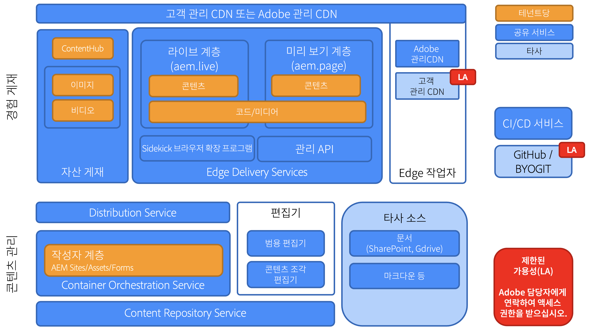

# Edge Delivery Services 개요 {#edge-delivery-services}

## Edge Delivery Services란? {#what-is-edge}

Edge Delivery Services은 웹 사이트를 구축하고 제공하는 방법을 재구상하여 속도, 간소화 및 확장성을 최적화하는 최신 콘텐츠 전달 프레임워크입니다. Adobe Experience Manager의 핵심 부분이며, 렌더링 및 전달을 네트워크의 가장 자리, 사용자에게 가깝게 푸시하여 더 빠른 디지털 경험을 가능하게 합니다.

CDN(콘텐츠 전송 네트워크)을 대체하는 것이 아니라 자체 CDN 또는 포함된 [Adobe 관리 CDN과 원활하게 통합됩니다.](/help/implementing/dispatcher/cdn.md)

>[!TIP]
>
>**바로 직접 체험해보고 싶으신가요?**
>
>바로 체험하고자 하시는 경우 [aem.live에서 튜토리얼을 확인](https://www.aem.live/developer/ue-tutorial)해 30분 내에 AEM을 작성하여 Edge Delivery Services 프로젝트를 직접 시작해보실 수 있습니다.

## 왜 Edge Delivery Services? {#why-edge}

### 검색 기능 및 트래픽 향상 {#increase-traffic}

Edge Delivery 웹 사이트는 검색 엔진에 최적화(SEO)되었으며 LLM에 대해 생성 엔진에 최적화(GEO)되었습니다. 이를 통해 유기 트래픽의 기존 및 향후 모든 소스에서 높은 가시성과 검색 가능성을 확보할 수 있습니다. **성능을 최우선으로 하는 종단 간 아키텍처**&#x200B;는 참여에 긍정적인 영향을 미치는 즐거운 고객 경험을 보장합니다.

### 개발자 효율성 {#developer-efficientcy}

수개월, 수년이 아닌 수일, 수주 안에 살아라! Edge Delivery은 모든 도구를 제공합니다. **최신 웹 개발자** 사랑: GitHub, 자동 재로드를 통한 로컬 개발, 성능, 간소화 및 문제 없음: 전송 없음, 번들 없음, 구성 없음, 오버헤드 없음.

Edge Delivery의 간소화는 AI 코드 생성에 이상적인 복잡한 프레임워크, 도구 또는 프로세스를 사용할 필요가 없습니다. 일반 HTML, 최신 CSS 및 바닐라 JavaScript을 사용하여 그 어느 때보다 빠르게 파격적인 경험을 만들 수 있습니다. 작업에 집중하고 새로운 도구를 교육하고 학습하는 데 드는 시간을 줄일 수 있습니다.

Edge Delivery을 사용하면 모든 개발자가 라이트하우스 점수 100점을 달성할 수 있습니다.

### 여러 콘텐츠 소스 지원 {#multiple-content-sources}

다양한 솔루션의 콘텐츠를 **기존 AEM 인스턴스를 모두 포함**&#x200B;하는 Edge Delivery과 직접 통합할 수 있습니다. 작성자는 이미 알고 있는 도구를 사용하여 더 빠른 속도를 얻기 위해 SharePoint과 같은 모든 시스템의 콘텐츠를 관리하고 **Edge Delivery에 게시**&#x200B;할 수 있습니다.

### 구성 가능한 아키텍처 {#composable-architeture}

Headless 또는 headful이든 적절한 형식으로 적절한 콘텐츠를 전달하고 적절한 장식을 추가하여 모든 채널에서 눈에 띄는 경험이 될 수 있습니다.

## 작동 방식 {#how-does-it-work}

Edge Delivery Services는 웹 사이트에서 콘텐츠를 작성하는 방법을 보다 유연하게 제공하는 구성 가능한 서비스 세트입니다. 이는 AEM Publish/Dispatcher 및 기존의 경험 구축 방식을 멀티 클라우드 SaaS 솔루션 및 순수 프론트엔드 개발 접근 방식으로 AEM 핵심 구성 요소로 대체합니다.

Edge Delivery Services는 GitHub를 활용하므로 GitHub 저장소에서 바로 코드를 관리 및 배포할 수 있습니다. 새 콘텐츠는 리빌드 프로세스 없이 즉시 추가됩니다.

## 작성 {#authoring}

### 직접 편집 {#in-context-editing}

[유니버설 편집기](/help/implementing/universal-editor/introduction.md)는 콘텐츠를 실시간으로 편집할 수 있는 사용자 지정 가능한 원스톱 플레이스이며 시각적 미리 보기를 통해 컨텍스트에 맞게 편집할 수 있습니다(WYSIWYG).

* AEM 작성 및 유니버설 편집기를 사용하면 headless 또는 headful과 관계없이 작성자 효율성을 높일 수 있습니다.
* 워크플로 및 거버넌스 등, AEM의 포괄적인 콘텐츠 관리 기능을 활용할 수도 있습니다.
* 다양한 확장 지점을 활용하여 고유한 프로세스 및 통합을 지원할 수 있습니다.
* GitHub에서 CSS와 JavaScript를 사용하여 사이트 기능을 개발할 수 있습니다.

### 문서 기반 편집 {#document-based-editing}

[컨텐츠를 문서로 관리하는 문서 기반 작성](https://www.aem.live/docs/authoring) 방법도 있습니다. 많은 기업들이 초기 콘텐츠를 만드는 곳에 SharePoint을 두고 있기 때문에 Microsoft Word는 인기 있는 선택입니다. SharePoint 및 Word에서 직접 콘텐츠를 게시하고 새 도구를 배울 필요가 없으므로 콘텐츠를 AEM에 복사하고 붙여넣는 번거로움이 제거됩니다. SharePoint이 없는 고객은 Google 드라이브를 대체 드라이브로 사용할 수도 있습니다.

## 운영 원격 분석 {#telemetry}

Adobe Experience Manager은 [운영 원격 분석](https://www.aem.live/docs/operational-telemetry)을 사용하여 Adobe Experience Manager 기반 사이트에서 기능 및 성능 문제를 검색하고 해결하는 데 반드시 필요한 작업 데이터를 수집합니다. 작동 원격 분석 데이터를 사용하여 성능 문제를 진단하고 실험의 효과를 측정할 수 있습니다. 운영 원격 분석은 [샘플링](https://www.aem.live/docs/operational-telemetry#operational-telemetry-data-is-sampled)&#x200B;(모든 페이지 보기의 일부만 모니터링됨) 및 [개인 식별 정보의 올바른 제외](https://www.aem.live/docs/operational-telemetry#what-data-is-being-collected)&#x200B;(PII)를 통해 방문자의 개인 정보를 유지합니다.

## 탐색 시작 {#start-exploring}

범용 편집기 및 Edge Delivery Services을 사용하여 AEM 작성을 시작하십시오.

* Edge Delivery Services 설명서 [Edge Delivery Services](https://www.aem.live)
* 범용 편집기가 포함된 AEM 작성에 대한 개요는 aem.live 설명서에 나와 있는 [Edge Delivery Services를 위한 AEM 작성 ](https://www.aem.live/docs/aem-authoring)문서를 참조하십시오.
* 개발자 개요는 aem.live 설명서에 나와 있는 [시작하기 - 범용 편집기 개발자 튜토리얼](https://www.aem.live/developer/ue-tutorial) 문서를 참조하십시오.

## Edge Delivery Services 및 기타 Adobe Experience Cloud 제품 {#edge-other-products}

Edge Delivery Services는 Adobe Experience Manager의 일부입니다. 따라서 Edge Delivery Services와 AEM Sites는 동일 도메인에서 함께 존재할 수 있으며, 이는 대규모 웹 사이트의 일반적인 사용 사례입니다. 또한 AEM Sites 페이지에서 Edge Delivery Services의 콘텐츠를 원활하게 사용할 수 있으며 그 반대의 경우도 마찬가지입니다.

[Adobe Target](https://www.aem.live/developer/target-integration) 및 [Launch.](https://experienceleague.adobe.com/ko/docs/experience-platform/tags/home)에서 Edge Delivery Services을 사용할 수도 있습니다.

## Adobe에서 도움 받기 {#getting-help}

Adobe은 Edge Delivery Services에 도움이 되는 세 가지 계층을 제공합니다.

* 일반적인 문의는 [커뮤니티 리소스](#community-resources)와 협력할 수 있습니다.
* 특정 질문은 [제품 협업 채널](#collaboration-channel)에 액세스할 수 있습니다.
* [지원 티켓을 로그하여](#support-ticket) 계약상 지원 SLA 내에서 **주요 문제 및 중요한 문제를 해결하십시오**.

### 커뮤니티 리소스에 액세스 {#community-resources}

Adobe는 사용자에게 Edge Delivery Services, 범용 편집기가 포함된 AEM 작성 및 문서 기반 작성에 대한 최고의 커뮤니티 참여와 지원을 제공하기 위해 최선을 다하고 있습니다.

* [Experience League 커뮤니티](https://adobe.ly/3Q6kTKl)에 참여하여 질의하고, 피드백을 공유하고, 토론을 시작하고, Adobe 전문가와 AEM Advisor/Champs의 지원을 요청하고, 비슷한 생각을 가진 사람들과 실시간으로 소통할 수 있습니다.
* 보다 일반적인 플랫폼인 [디스코드 채널](https://discord.gg/aem-live)에 참여하여 실시간으로 상호 작용하고 아이디어를 빠르게 교환할 수 있습니다.

### 지원 티켓 기록 {#support-ticket}

{{support-ticket}}
