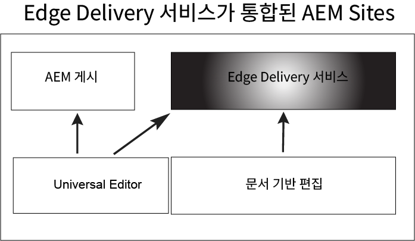

# Edge Delivery Services 시작하기 {#getstart-edge}

Edge Delivery Services를 사용하여 AEM은 참여 및 전환을 유도하는 탁월한 경험을 제공합니다. 이를 위해 AEM은 빠르게 작성 및 개발할 수 있는 영향력이 큰 경험을 제공합니다. 작성자가 콘텐츠를 빠르게 업데이트 및 게시하고 새 사이트를 신속하게 시작할 수 있는 신속한 개발 환경을 지원하는 구성 가능한 서비스 세트입니다. 그에 따라 Edge Delivery Services를 사용하여 전환을 개선하고, 비용을 절감하고, 최고의 콘텐츠 속도를 제공할 수 있습니다.

Edge Delivery를 사용하여 다음과 같은 작업을 수행할 수 있습니다.

* 완벽한 Lighthouse Score를 사용하여 빠른 사이트를 만들고 실제 사용자 모니터링(RUM)을 통해 사이트 실적을 지속적으로 모니터링합니다.
* 콘텐츠 소스를 분리하여 작성 효율성을 높입니다. 기본 제공되는 AEM 작성과 문서 기반 작성을 모두 사용할 수 있습니다. 따라서 동일한 웹 사이트에서 여러 콘텐츠 소스로 작업할 수 있습니다.
* 기본 제공 실험 프레임워크를 사용하여 성능에 영향을 주지 않고도 빠르게 테스트를 작성 및 실행하고 테스트 승자 프로덕션에 대한 빠른 릴리스를 제공할 수 있습니다.

## Edge Delivery 작동 방식 {#edge-works}

다음 다이어그램은 Microsoft® Word(문서 기반 편집)에서 콘텐츠를 편집하고 Edge Delivery에 게시하는 방법을 보여 줍니다. 또한 다양한 편집기를 사용하는 기존 AEM 게시 방법을 보여 줍니다.

Edge Delivery는 웹 사이트에서 콘텐츠를 작성하는 방법을 보다 유연하게 제공하는 구성 가능한 서비스 세트입니다. 앞에서 언급한 바와 같이 [AEM 작성](https://experienceleague.adobe.com/docs/experience-manager-cloud-service/content/sites/authoring/getting-started/concepts.html)과 [문서 기반 작성](https://www.hlx.live/docs/authoring)을 모두 사용할 수 있습니다.

예를 들어 Microsoft® Word 또는 Google 문서에서 직접 콘텐츠를 사용할 수 있습니다. 즉, 해당 소스의 문서가 웹 사이트의 페이지가 될 수 있습니다. 또한 제목, 목록, 이미지, 글꼴 요소는 모두 초기 소스에서 웹 사이트로 전송할 수 있습니다. 새로운 콘텐츠는 재구축 프로세스 없이 즉시 추가됩니다.

Edge 전달은 GitHub를 사용하므로 고객은 GitHub 저장소에서 직접 코드를 관리하고 배포할 수 있습니다. 예를 들어 Google 문서 또는 Microsoft® Word로 컨텐츠를 작성하고 GitHub에서 CSS 및 JavaScript를 사용하여 사이트의 기능을 개발할 수 있습니다 . 준비가 되면 Sidekick 브라우저 확장 기능을 사용하여 콘텐츠 업데이트를 미리 보고 게시할 수 있습니다.

추가 참조:

* Edge Delivery를 시작하는 방법에 대한 자세한 내용은 Edge Delivery 설명서의 [빌드](https://www.hlx.live/docs/#build) 섹션을 참조하십시오.
* Edge Delivery를 사용하여 콘텐츠를 작성 및 게시하는 방법을 이해하려면 [게시 섹션](https://www.hlx.live/docs/authoring)을 참조하십시오.
* 웹 사이트 프로젝트를 올바르게 시작하는 방법을 이해하려면 [론치 섹션](https://www.hlx.live/docs/#launch)을 참조하십시오.

## Edge Delivery Services 및 기타 Adobe Experience Cloud 제품 {#edge-other-products}

Edge Delivery Services는 Adobe Experience Manager의 일부이므로 Edge Delivery 및 AEM Sites는 동일한 도메인에서 함께 존재할 수 있습니다. 이는 대규모 웹 사이트의 일반적인 사용 사례입니다. 뿐만 아니라 Edge 전달의 콘텐츠를 AEM Sites 페이지에서 그리고 역으로 쉽게 사용할 수 있습니다.

Adobe Target, Analytics 및 Launch에서 Edge Delivery Services을 사용할 수도 있습니다.

## Edge Delivery Services에 대한 액세스 {#getting-access}

Edge Delivery Services 사용을 시작하는 것은 쉽습니다. [시작하기 - 개발자 튜토리얼](https://www.hlx.live/developer/tutorial) 절차에 따라 시작합니다.

## Adobe에서 도움 받기 {#adobe-gethelp}

프로비저닝된 제품 협업 채널(액세스 세부 정보는 아래 참조)을 통해 Adobe 제품 팀과 협력하여 제품 사용 또는 모범 사례에 대한 질문에 답변할 수 있습니다. 제품 공동 작업 채널을 통한 대화와 연결된 서비스 수준 약관(SLT)이 없습니다. 제품 문제에 추가 조사 및 문제 해결이 필요하고 응답 SLT를 충족해야 하는 경우 다음 사항에 따라 지원 티켓을 제출할 수 있습니다. [지원 프로세스](https://experienceleague.adobe.com/?lang=en&amp;support-tab=home#support).

Adobe에서는 Edge Delivery Services에 도움이 되는 세 가지 채널을 제공합니다.

* 일반적인 문의는 커뮤니티 리소스와 협력
* 특정 질문은 제품 협업 채널에 액세스
* 지원 티켓을 기록하여 주요 및 중요한 문제 해결

### 커뮤니티 리소스에 액세스 {#community-resource}

Adobe는 사용자에게 Edge Delivery Services와 문서 기반 작성에 대한 최고의 커뮤니티 참여와 지원을 제공하기 위해 최선을 다하고 있습니다. [Experience League 커뮤니티](https://adobe.ly/3Q6kTKl)에 참여하여 질의하고, 피드백을 공유하고, 토론을 시작하고, Adobe 전문가와 AEM Advisor/Champs의 지원을 요청하고, 비슷한 생각을 가진 사람들과 실시간으로 소통할 수 있습니다. 보다 일반적인 플랫폼인 [디스코드 채널](https://discord.gg/aem-live)에 참여하여 실시간으로 상호 작용하고 아이디어를 빠르게 교환할 수 있습니다.

### 제품 협업 채널에 액세스하는 방법 {#collab-channel}

고객과의 직접 통신 채널의 가치를 고려하여 출시되는 모든 AEM 고객은 속도, 주요 업데이트 및 경험 품질에 대한 크기 조정된 보고를 위한 Slack 채널을 구축하게 됩니다. Adobe에서 조직 고유의 Slack 채널에 가입하라는 초대를 받습니다.

자세한 내용은 [Slack 봇 사용](https://www.hlx.live/docs/slack) 문서를 참조하십시오.

### 지원 티켓 기록 {#support-ticket}

Admin Console을 통해 지원 티켓을 기록하는 단계:

1. 티켓 제목에서 **Edge Delivery**&#x200B;를 추가합니다.
2. 설명에 다음 세부 정보를 입력합니다.

   * 라이브 웹 사이트의 URL입니다. 예: [www.mydomain.com].
   * 원본 웹 사이트의 URL(.hlx URL)입니다.

## 다음 단계 {#whats-next}

검토 시작 [Edge Delivery Services 사용](/help/edge/using.md).

## 유용한 리소스 {#useful-resources}

Edge Delivery Services에 대한 자세한 내용은 [Edge Delivery Services 문서 설명서](https://www.hlx.live/docs/)를 참조하십시오.
