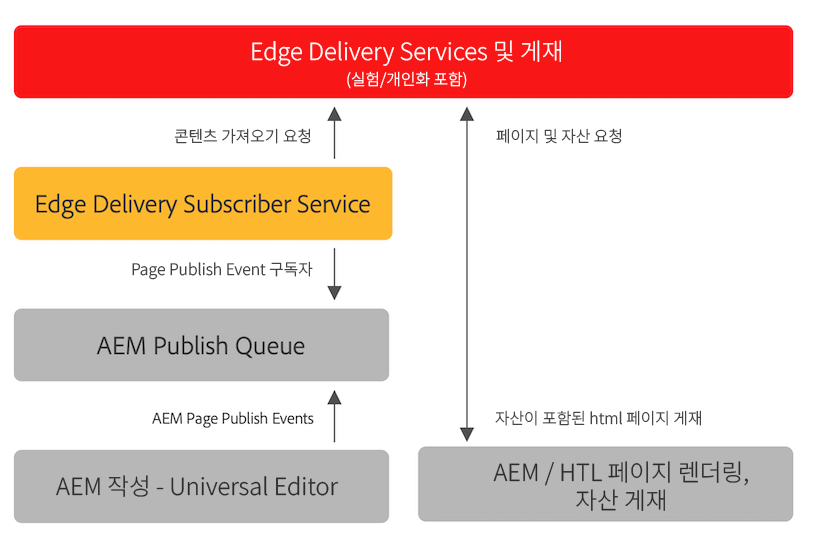

# Edge Delivery Services용 콘텐츠 게시 {#publishing-edge}

Edge Delivery Services를 사용하여 콘텐츠 소스에 관계없이 원활하게 콘텐츠를 게시합니다.

* 문서 기반 콘텐츠 - Edge Delivery Services 설명서의 [게시 섹션](/help/edge/docs/authoring.md)을 참조하십시오.
* AEM 콘텐츠 - 자세한 내용은 아래를 참조하십시오.

## AEM에서 흐름 게시 {#publishing-flow}

Universal Editor를 사용하여 AEM 콘텐츠를 작성하는 경우, Universal Editor의 **게시** 버튼을 클릭하기만 하면 간단하게 게시할 수 있습니다. [Universal Editor를 사용하여 콘텐츠 게시](/help/implementing/universal-editor/publishing.md) 문서를 참조하십시오.

게시할 때 정보 흐름은 다음과 같습니다. 작성자가 게시를 시작하면 이 흐름은 자동으로 이루어지며, 여기에 정보 제공 목적으로 설명되어 있습니다.

1. 콘텐츠 작성자는 Universal Editor에서 AEM 콘텐츠를 게시합니다.
1. 게시 이벤트가 Adobe 파이프라인 큐로 푸시됩니다.
1. Edge Delivery 게시 서비스는 관련 이벤트를 Edge Delivery 관리 API에 전달합니다.
1. Edge Delivery는 AEM 작성자에서 유의미한 HTML을 가져와서 수집합니다.
1. AEM은 게시 상태로 업데이트됩니다.

## 시작 방법 {#how-to-get-started}

이 기능에 액세스하려면 Adobe 담당자에게 문의하십시오.
