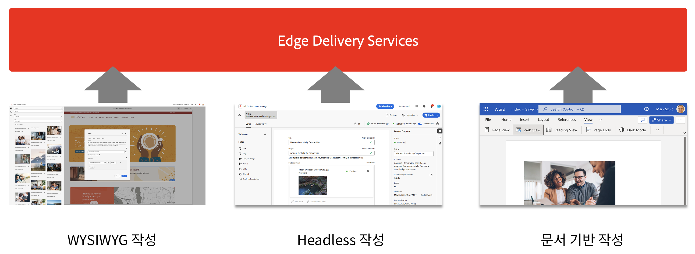
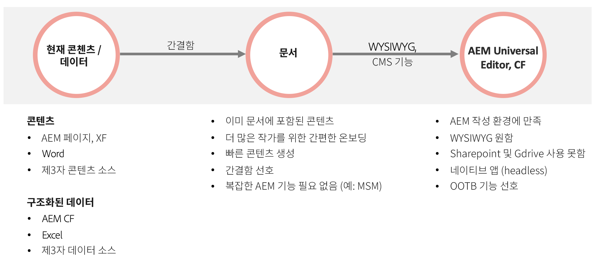

# Edge Delivery Services 사용 {#usingedge}

Edge Delivery Services를 사용하면 작성자가 콘텐츠를 빠르게 업데이트 및 게시하고 새 사이트를 신속하게 시작할 수 있는 빠른 개발 환경을 제작할 수 있습니다. 이를 위해 동일한 웹 사이트에서 여러 콘텐츠 소스로 작업하고, 선택한 소스에 관계없이 게시를 간소화할 수 있습니다. 따라서 인터넷에서 라이브로 콘텐츠를 편집하고 보는 데까지 단 몇 초밖에 걸리지 않습니다.

Edge Delivery Services는 콘텐츠 소스에서 분리되며 다양한 콘텐츠 소스의 콘텐츠를 수집할 수 있습니다.

여러 콘텐츠 소스에서 수집하면 사용자에게 최대의 유연성이 제공됩니다. Adobe에서는 프로젝트에 가장 적합한 콘텐츠 소스를 선택하는 데 도움이 되는 지침을 제공합니다.

콘텐츠 소스가 미리 정의되어 있거나 유연하지 않은 경우가 있습니다(예: 프로젝트에서 Sharepoint 또는 Google 드라이브를 사용할 수 없음). 그러나 대부분의 경우 도구는 미리 정의되어 있지 않으며 선택할 수 있는 도구 또한 다양합니다.

Adobe의 안내 원칙은 단순성입니다. 문서 기반 작성으로 시작하고 필요한 경우 복잡성을 추가합니다. 도구 변경이 필요한 경우, AEM의 Edge Delivery Services 통합에 콘텐츠 마이그레이션이 포함됩니다.

## 작성 {#authoring-edge}

Edge Delivery Services를 사용하여 쉽고, 빠르고, 유연하게 콘텐츠를 작성할 수 있습니다. 문서 기반 작성 을 사용하거나 범용 편집기를 사용하여 AEM에서 작성하도록 선택할 수 있습니다.

자세한 내용은 [Edge Delivery Services용 콘텐츠 작성](authoring.md) 문서를 참조하십시오.

## 게시 {#publishing-edge}

Edge Delivery Services를 사용하여 콘텐츠 소스에 관계없이 원활하게 콘텐츠를 게시합니다.

자세한 내용은 [Edge Delivery Services용 콘텐츠 게시](publishing.md) 문서를 참조하십시오.

## 개발 {#developing-edge}

Edge Delivery Services는 블록 개념을 기반으로 합니다. AEM에는 프로젝트 요구 사항을 충족하도록 확장할 수 있는 사전 정의된 블록의 포괄적인 라이브러리가 함께 제공됩니다. Edge Delivery Services 프로젝트의 코드는 GitHub에서 관리됩니다.

자세한 내용은 [Edge Delivery Services용 개발](developing.md) 문서를 참조하십시오.

## 기존 AEM 프로젝트 {#existing-projects}

새로운 AEM 프로젝트가 Edge Delivery Services의 이점을 얻을 수 있을 때까지 기다릴 필요가 없습니다. Edge Delivery Services를 기존 AEM 프로젝트에 통합하여 성능 향상을 즉시 활용할 수 있습니다.

자세한 내용은 [기존 AEM 프로젝트와 함께 Edge Delivery Services 사용](existing-projects.md) 문서를 참조하십시오.
