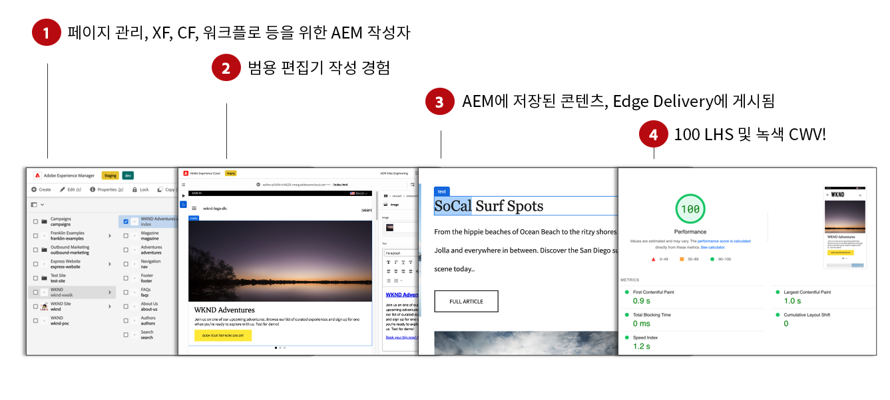
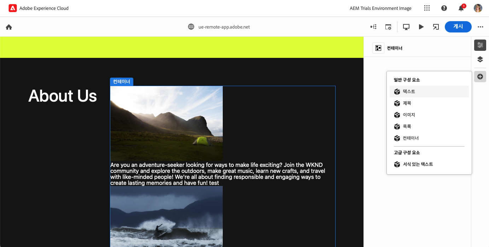
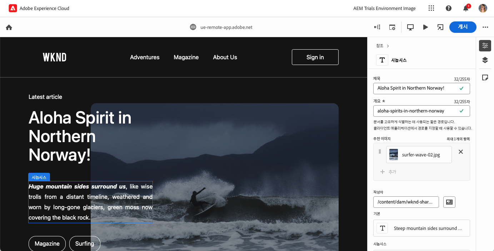

# Edge Delivery Services용 WYSIWYG 콘텐츠 작성 {#authoring-edge}

Edge Delivery Services를 사용하여 쉽고, 빠르고, 유연하게 콘텐츠를 작성할 수 있습니다. Edge Delivery Services용 콘텐츠를 작성하기 위한 두 가지 옵션이 있습니다.

* [범용 편집기](#universal-editor) - AEM 내 콘텐츠를 작성하기 위한 최신 what-you-see-is-what-you-get(WYSIWYG) UI
* [문서 기반 작성](#document-based) - Microsoft Word 또는 Google Docs 등

## 범용 편집기 작성 {#universal-editor}

AEM as a Cloud Service와 함께 Edge Delivery Services를 사용할 때 이해해야 할 가장 기본적인 사실은 작성한 콘텐츠가 AEM as a Cloud Service에 저장된다는 것입니다.

1. [AEM Sites 환경](/help/sites-cloud/authoring/quick-start.md)은 새 페이지 생성, 경험 조각, 콘텐츠 조각 등과 같은 콘텐츠 관리에 사용됩니다.
   * 워크플로, MSM, 번역, 실행 등의 모든 AEM 기능을 사용할 수 있습니다.
1. [범용 편집기](/help/sites-cloud/authoring/universal-editor/authoring.md)는 AEM에서 관리되는 콘텐츠를 작성하는 데 사용됩니다.
   * 범용 편집기는 콘텐츠 작성을 위한 새로운 최신 UI를 제공합니다.
   * AEM은 작성을 위해 HTML을 렌더링하지만 Edge Delivery Services의 스크립트, 스타일, 아이콘 및 기타 리소스를 포함합니다.
   * 범용 편집기를 사용하더라도, 모든 변경 사항은 AEM에 유지됩니다.
   * 범용 편집기는 아직 AEM 페이지 편집기가 있는 기능 패리티에 없으며, 일부 AEM 기능은 범용 편집기에서 사용하지 못할 수도 있습니다.
1. 범용 편집기로 작성하고 AEM에 저장된 콘텐츠는 Edge Delivery Services에 게시됩니다.
   * 콘텐츠는 AEM에 계속 저장됩니다.
   * AEM은 수집에 필요한 유의미한 HTML을 렌더링합니다.
   * 콘텐츠는 Edge Delivery Services에 게시됩니다.
1. [Edge Delivery Services](/help/edge/developer/keeping-it-100.md)는 100%의 Lighthouse 점수를 보장합니다.

블록은 Edge Delivery Services에서 제공하는 페이지의 기본 구성 요소입니다. 작성자는 Adobe에서 표준으로 제공하는 기본 블록 또는 개발자가 프로젝트에 맞게 사용자 정의한 블록 중에서 선택할 수 있습니다.

범용 편집기는 블록을 추가하고 배열하여 콘텐츠를 작성할 수 있는 현대적이고 직관적인 GUI를 제공합니다.

그런 다음 속성 패널에서 블록의 세부 정보를 구성할 수 있습니다.

범용 편집기를 사용하여 작성하는 방법에 대한 자세한 내용은 [범용 편집기를 사용하여 콘텐츠 작성](/help/sites-cloud/authoring/universal-editor/authoring.md)을 참조하십시오.

AEM 및 Edge Delivery Services를 사용하여 자신의 프로젝트를 작성하는 방법을 알아보려면 [Edge Delivery Services를 사용한 WYSIWYG 작성용 개발자 시작 안내서](/help/edge/wysiwyg-authoring/edge-dev-getting-started.md)를 참조하십시오.

## 추가 작성 방법  {#authoring-methods}

WYSIWYG 작성은 콘텐츠 작성자를 위한 강력하고 직관적인 도구입니다. 그러나 작성 사용 사례가 다양하기 때문에 AEM은 추가 작성 솔루션을 제공합니다.

AEM이 제공하는 문서 기반 작성 및 Headless를 포함한 작성 솔루션에 대해 자세히 알아보려면 [작성 방법 선택](/help/edge/authoring-methods.md) 문서를 참조하십시오.
