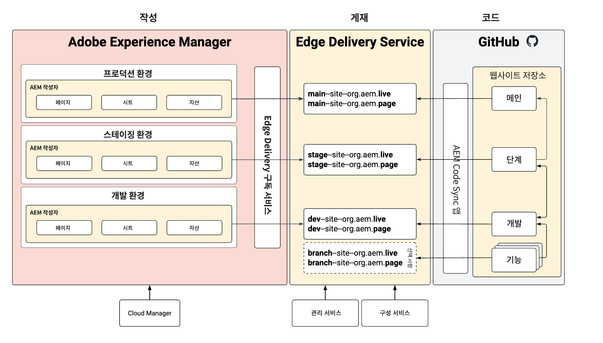

# 저장소 없는 스테이징 및 프로덕션 환경 {#repoless-stage-prod}

저장소 없이 단일 코드 베이스를 활용하여 스테이징 및 프로덕션 환경에 대해 별도의 사이트를 설정하는 방법을 알아봅니다.

## 개요 {#overview}

스테이징 환경과 별도로 프로덕션 환경을 위한 사이트를 설정하는 것이 좋습니다. 별도의 스테이징 및 프로덕션 설정을 위해 두 번째 사이트를 설정하는 작업은 [다중 사이트 관리에 필요한 설정](/help/edge/wysiwyg-authoring/repoless-msm.md)과 비슷합니다. 실제로 필요한 경우 MSM 사이트 구조와 결합할 수 있습니다.

이 문서에서는 별도의 스테이징 및 프로덕션 환경을 보여 주는 일반적인 예시를 사용합니다. 원하는 환경에 맞게 별도의 환경을 만들 수 있습니다.

## 요구 사항 {#requirements}

저장소 없는 스테이징 및 프로덕션 환경을 구성하려면 먼저 다음 작업을 완료해야 합니다.

* 이 문서에서는 [Edge Delivery Services를 사용한 WYSIWYG 작성을 위한 개발자 시작 안내서](/help/edge/wysiwyg-authoring/edge-dev-getting-started.md)를 기반으로 프로젝트 사이트를 이미 만들었다고 가정합니다.
* [프로젝트에 대해 저장소 없는 구성 설정 기능을 이미 활성화](/help/edge/wysiwyg-authoring/repoless.md)했어야 합니다.

## 구성 {#configuration}

이 문서에서는 동일한 코드 베이스를 사용하여 프로젝트에 대한 별도의 프로덕션 사이트를 설정하는 방법을 설명합니다. 다음과 같은 가정하에 수행되었습니다.

* 스테이징 사이트는 이미 설정되었으며 이제 프로덕션 사이트에 대한 구성을 만들려고 합니다.
* AEM 작성의 콘텐츠 구조는 비슷합니다.
* 스테이징과 프로덕션에는 동일한 경로 매핑이 사용됩니다.

이 예시에서는 wknd라는 프로젝트에 대한 프로덕션 사이트가 이미 생성되었고 GitHub 저장소도 wknd라고 한다고 가정합니다.

별도의 프로덕션 사이트를 구성하는 데는 두 단계가 있습니다.

1. [프로덕션 환경에 대한 새로운 Edge Delivery Services 사이트를 만듭니다](#create-edge-site).
1. [프로덕션 사이트의 AEM에서 클라우드 구성을 업데이트합니다](#update-cloud-configuration).

### 프로덕션 환경에 대한 새로운 Edge Delivery Services 사이트 만들기 {#create-edge-site}

1. 프로그램의 인증 토큰과 기술 계정을 가져옵니다.
   * 프로그램의 [액세스 토큰](/help/edge/wysiwyg-authoring/repoless.md#access-token)과 [기술 계정을 얻는](/help/edge/wysiwyg-authoring/repoless.md#access-control) 방법에 대한 자세한 내용은 **여러 사이트에서 코드 재사용** 문서를 참조하십시오.
1. 구성 서비스에 다음 호출을 수행하여 새 사이트를 만듭니다. 다음 사항을 고려하십시오.
   * POST URL의 프로젝트 이름은 새로 만드는 사이트 이름이어야 합니다. 이 에시에서는 `wknd-prod`입니다.
   * `code` 구성은 처음 프로젝트를 만들 때 사용한 것과 동일해야 합니다.
   * `content` > `source` > `url`은 새로 만드는 사이트 이름에 맞게 조정해야 합니다. 이 에시에서는 `wknd-prod`입니다.
   * 즉, POST URL의 사이트 이름과 `content` > `source` > `url`이 동일해야 합니다.
   * `admin` 블록을 조정하여 사이트에 대한 전체 관리자 액세스 권한을 보유해야 하는 사용자를 정의합니다.
      * 이는 이메일 주소 배열입니다.
      * 와일드카드 `*`를 사용할 수 있습니다.
      * 자세한 내용은 [작성자에 대한 인증 구성](https://www.aem.live/docs/authentication-setup-authoring#default-roles) 문서를 참조하십시오.

   ```text
   curl --request POST \
     --url https://admin.hlx.page/config/<your-github-org>/sites/wknd-prod.json \
     --header 'x-auth-token: <your-token>' \
     --header 'Content-Type: application/json' \
     --data '{
       "code": {
           "owner": "<your-github-org>",
           "repo": "wknd",
           "source": {
               "type": "github",
               "url": "https://github.com/<your-github-org>/wknd"
           }
       },
       "content": {
           "source": {
               "url": "https://author-p<programID>-e<environmentID>.adobeaemcloud.com/bin/franklin.delivery/<your-github-org>/wknd-prod/main",
               "type": "markup",
               "suffix": ".html"
           }
       },
       "access": {
           "admin": {
               "role": {
                   "admin": [
                       "<email>@<domain>.<tld>"
                   ],
                   "config_admin": [
                       "<tech-account-id>@techacct.adobe.com"
                   ]
               },
               "requireAuth": "auto"
           }
       }
   }'
   ```

1. 구성 서비스에 다음 호출을 수행하여 새 사이트에 대한 경로 매핑을 추가합니다.

   ```text
   curl --request POST \
     --url https://admin.hlx.page/config/<your-github-org>/sites/wknd-prod/public.json \
     --header 'x-auth-token: <your-token>' \
     --header 'Content-Type: application/json' \
     --data '{
       "paths": {
           "mappings": [
               "/content/wknd/:/"
           ],
           "includes": [
               "/content/wknd/"
           ]
       }
   }'
   ```

`https://main--wknd-prod--<your-github-org>.aem.page/config.json`을 호출하고 반환된 JSON 콘텐츠를 확인하여 새 사이트의 공개 구성이 제대로 작동하는지 확인합니다.

### 프로덕션 사이트의 AEM에서 클라우드 구성 업데이트 {#update-cloud-configuration}

이전 섹션에서 전용 프로덕션 사이트에 대해 만든 새로운 Edge Delivery Sites를 사용하도록 프로덕션 AEM을 구성해야 합니다. 이 예시에서 프로덕션 환경의 `/content/wknd`에 있는 콘텐츠는 사용자가 만든 `wknd-prod` 사이트를 사용해야 한다는 사실을 알아야 합니다.

1. AEM 프로덕션 인스턴스에 로그인하고 **도구** -> **클라우드 서비스** -> **Edge Delivery Services 구성**&#x200B;으로 이동합니다.
1. 프로젝트에 대해 자동으로 생성된 구성을 선택합니다.
1. 도구 모음에서 **속성**&#x200B;을 탭하거나 클릭합니다.
1. **Edge Delivery Services 구성** 창에서:
   * **조직** 필드에 GitHub 조직을 입력합니다.
   * 사이트 이름을 이전 섹션에서 만든 사이트 이름으로 변경합니다. 이 경우에는 `wknd-prod`입니다.
   * 프로젝트 유형을 **저장소 없는 구성 설정이 포함된 aem.live**&#x200B;로 변경합니다.
1. **저장 및 닫기**&#x200B;를 탭하거나 클릭합니다.

## 설정 확인 {#verify}

이제 필요한 구성을 모두 변경했으므로 모든 것이 예상대로 작동하는지 확인하십시오.

1. AEM 프로덕션 작성 인스턴스에 로그인합니다.
1. **탐색** -> **사이트**&#x200B;로 이동한 후 **사이트 콘솔**&#x200B;로 이동합니다.
1. 사이트에서 페이지를 선택합니다.
1. 도구 모음에서 **편집**&#x200B;을 탭하거나 클릭합니다.
1. 페이지가 범용 편집기에서 제대로 렌더링되고 사이트 루트와 동일한 코드를 사용하는지 확인합니다.
1. 페이지를 변경하고 다시 게시합니다.
1. `https://main--wknd-prod--<your-github-org>.aem.page`에서 해당 페이지에 대한 새로운 Edge Delivery Services 사이트를 방문합니다.

변경 사항이 표시되면 별도의 프로덕션 사이트 설정이 제대로 작동하는 것입니다.

## 사용 {#usage}

프로젝트를 저장소 없는 스테이징 및 프로덕션 환경으로 구성하면 해당 환경의 코드를 독립적으로 관리할 수 있습니다. 다음 다이어그램은 AEM, Edge Delivery Services 사이트, GitHub 저장소의 다양한 환경에서 콘텐츠 관계를 보여 줍니다.


