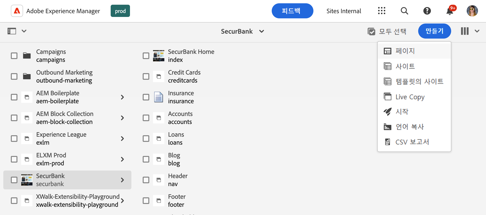
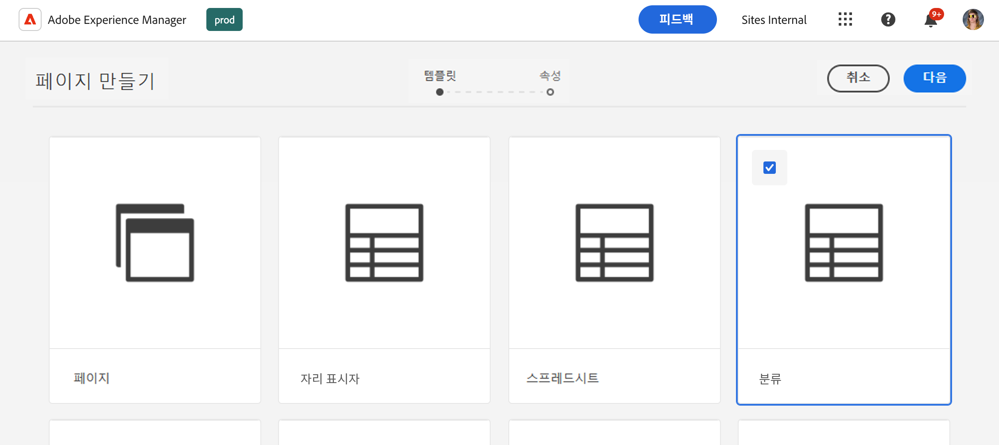
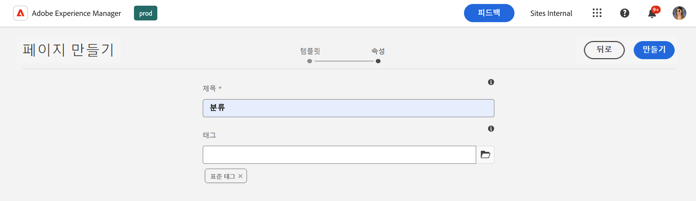
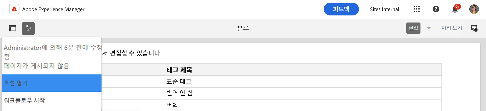
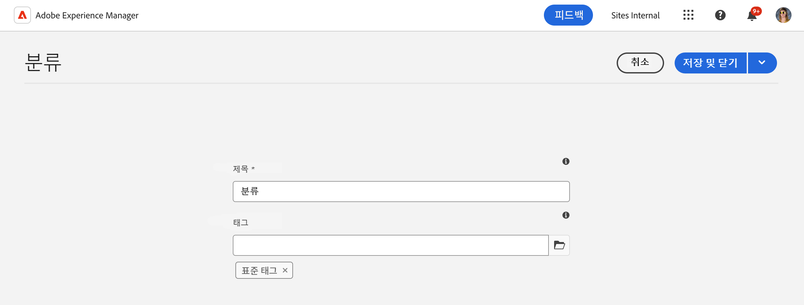

# 분류 데이터 관리 {#managing-taxonomy-data}

Edge Delivery Services 사이트를 통해 AEM과 함께 태그를 사용하기 위한 분류 데이터를 관리하는 방법에 대해 알아봅니다.

## 소개 {#introduction}

태깅은 페이지를 구성하고 관리하는 데 도움이 되는 중요한 기능입니다. AEM의 [태그 지정 콘솔](/help/sites-cloud/administering/tags.md#tagging-console)을 사용하면 다양한 태그 분류를 만들어 페이지를 구성할 수 있습니다.

이러한 태그는 콘텐츠를 구성할 때 사용자와 작성자에게만 유용하며 독자에게도 유용할 수 있습니다. 태그와 해당 분류법은 페이지의 구성 요소에서 사용하여 독자가 콘텐츠를 탐색할 수 있습니다.

범용 편집기는 태그의 ID에서만 작동합니다. 콘텐츠에 대한 분류 페이지를 만들면 콘텐츠를 렌더링할 때 해당 정보를 사용할 수 있도록 모든 언어로 된 이러한 태그의 설명이 범용 편집기에 표시됩니다.

## 분류 페이지 만들기 {#creating}

[AEM의 다른 모든 페이지](/help/sites-cloud/authoring/sites-console/creating-pages.md)와 같이 분류법이 만들어졌습니다.

1. [**사이트** 콘솔로 이동합니다.](/help/sites-cloud/authoring/sites-console/introduction.md)

1. 분류를 만들 위치를 선택합니다.

1. **만들기** -> **페이지**&#x200B;를 탭하거나 클릭합니다.

   

1. **페이지 만들기** 마법사의 **템플릿** 탭에서 **분류** 템플릿을 선택하고 **다음**&#x200B;을 탭하거나 클릭합니다.

   

1. **페이지 만들기** 마법사의 **속성** 탭에서 페이지에 대해 의미 있는 **제목**&#x200B;을 제공하고 **태그** 필드에서 [태그 선택기를 사용](/help/sites-cloud/authoring/sites-console/tags.md)하여 분류법에 포함할 태그 또는 네임스페이스를 선택합니다.

   

1. **만들기**&#x200B;를 탭하거나 클릭합니다.

분류 페이지가 생성됩니다. **성공** 대화 상자에서 **완료** 대화 상자를 탭하거나 클릭하여 메시지를 취소하거나 **열기**&#x200B;를 탭하거나 클릭하여 [페이지 편집기에서 페이지를 편집할 수 있습니다.](/help/sites-cloud/authoring/page-editor/introduction.md)

다음 단계에서 사용할 분류 페이지의 결과 페이지 이름을 기록해 두십시오.

## 분류 페이지 편집 {#editing}

AEM의 다른 페이지와 마찬가지로 분류 페이지 편집을 시작합니다.

1. [**사이트** 콘솔로 이동합니다.](/help/sites-cloud/authoring/sites-console/introduction.md)

1. 편집할 분류를 선택합니다.

1. 작업 표시줄에서 **편집**&#x200B;을 탭하거나 클릭합니다.

1. 페이지 편집기가 열리고 분류법이 표시됩니다.

   * 분류 페이지는 페이지 편집기에서 읽기 전용입니다.

   

1. 도구 모음에서 **페이지 정보** 아이콘을 탭하거나 클릭한 다음 **속성 열기**&#x200B;를 선택합니다.

   

1. **페이지 속성** 창에서 페이지 이름을 업데이트하고 태그 선택기를 사용하여 분류법에 포함된 태그와 네임스페이스를 업데이트할 수 있습니다.

   

1. **저장 및 닫기**&#x200B;를 탭하거나 클릭합니다.

선택한 태그 및 네임스페이스에서 분류법의 콘텐츠가 자동으로 생성되므로 페이지 편집기에 표시되는 페이지는 읽기 전용입니다. 분류법의 콘텐츠를 자동으로 생성하는 일종의 필터 역할을 합니다. 따라서 편집기에서 페이지를 직접 편집할 필요가 없습니다.

AEM은 기본 태그 및 네임스페이스를 업데이트할 때 분류 페이지의 콘텐츠를 자동으로 업데이트합니다. 그러나 변경 후 [분류를 다시 게시](#publishing)하여 해당 변경 내용을 사용자가 사용할 수 있도록 해야 합니다.

## 분류법 게시를 위한 paths.json 업데이트 {#paths-json}

[Edge Delivery Services 사이트의 표 형식 데이터를 관리하고 게시할 때와 마찬가지로](/help/edge/wysiwyg-authoring/tabular-data.md) 프로젝트의 `paths.json` 파일을 업데이트하여 분류 데이터를 게시할 수 있도록 해야 합니다.

1. GitHub에서 프로젝트의 루트를 엽니다.

1. `paths.json` 파일을 탭하거나 클릭하여 세부 정보를 연 다음 **편집** 아이콘을 엽니다.

   

1. 새 분류 페이지를 `.json` 리소스에 매핑할 줄을 추가합니다.

   ```json
   {
     "mappings": [
      "/content/<site-name>/:/",
      "/content/<site-name>/<taxonomy-page-name>:/<taxonomy-json-name>.json"
     ]
   }
   ```

   * `<taxonomy-page-name>`은(는) 사용자가 만든 [분류 페이지의 이름과 일치해야 합니다.](#creating)
   * `<taxonomy-json-name>`은(는) 사용자가 선택한 올바른 이름일 수 있습니다.

1. **변경 사항 커밋...**&#x200B;을 클릭하여 `main`에 변경 사항을 저장합니다.

   * 프로세스에 따라 `main`에 커밋하거나 가져오기 요청을 만듭니다.

이 프로세스는 분류 페이지당 한 번만 수행하면 됩니다. 완료되면 분류법을 게시할 수 있습니다.

## 분류 게시 {#publishing}

분류는 게시될 때까지 범용 편집기 또는 사용자가 사용할 수 없습니다.

분류 페이지는 [도구 모음의 **빠른 Publish** 또는 **게시 관리** 아이콘을 사용하여 다른 페이지와 같이 게시됩니다.](/help/sites-cloud/authoring/sites-console/publishing-pages.md)

다음을 수행할 때마다 분류 페이지를 다시 게시해야 합니다.

* 분류 페이지를 편집합니다.
* 분류 페이지에 포함된 태그 및 네임스페이스를 편집하거나 추가합니다.

새 분류 페이지를 만드는 경우 먼저 [매핑을 프로젝트의 `paths.json` 파일에 추가해야 합니다.](#paths-json)

## 분류 정보 액세스 {#accessing}

분류법이 게시되면 해당 정보가 범용 편집기에서 활용되어 사용자에게 표시될 수 있습니다.

다음 주소에서 분류법을 JSON 데이터로 액세스할 수 있습니다.

`https://<branch>--<repository>--<owner>.hlx.page/<taxonomy-json-name>.json`

[프로젝트의 `paths.json` 파일에 분류를 매핑할 때 정의한 `<taxonomy-json-name>`을(를) 사용합니다.](#paths-json) 분류법 데이터는 다음 예제와 같이 JSON 데이터로 반환됩니다.

```json
{
  "total": 3,
  "offset": 0,
  "limit": 3,
  "data": [
    {
      "tag": "default:",
      "title": "Standard Tags"
    },
    {
      "tag": "do-not-translate",
      "title": "Do Not Translate"
    },
    {
      "tag": "translate",
      "title": "Translate"
    }
  ],
  ":type": "sheet"
}
```

이 JSON 데이터는 분류법을 업데이트하고 다시 게시하면 자동으로 업데이트됩니다. 앱에서 사용자를 위해 프로그래밍 방식으로 이 정보에 액세스할 수 있습니다.

[여러 언어로 태그를 유지 관리하는 경우](/help/sites-cloud/administering/tags.md#managing-tags-in-different-languages) ISO2 언어 코드를 `sheet=` 매개 변수 값으로 전달하여 해당 언어에 액세스할 수 있습니다.
