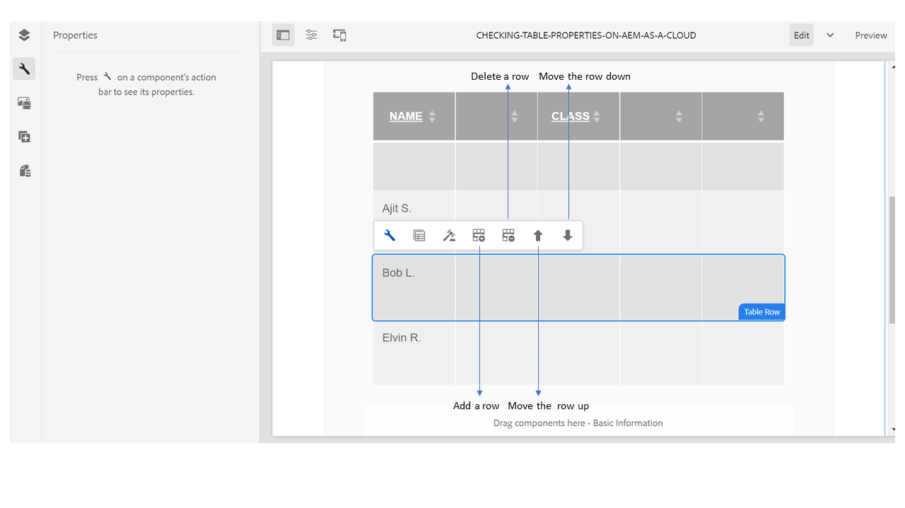

# 적응형 양식의 표 {#tables-in-adaptive-forms}

<span class="preview"> [새 적응형 양식 만들기](/help/forms/creating-adaptive-form-core-components.md) 또는 [AEM Sites 페이지에 적응형 양식 추가](/help/forms/create-or-add-an-adaptive-form-to-aem-sites-page.md) 작업을 할 때 현대적이고 확장 가능한 데이터 캡처 [코어 구성 요소](https://experienceleague.adobe.com/docs/experience-manager-core-components/using/adaptive-forms/introduction.html)를 사용하는 것이 좋습니다. 이러한 구성 요소는 적응형 양식 만들기 작업이 대폭 개선되어 우수한 사용자 경험을 보장할 수 있게 되었음을 나타냅니다. 이 문서에서는 기초 구성 요소를 사용하여 적응형 양식을 작성하는 이전 접근법에 대해 설명합니다. </span>


| 버전 | 문서 링크 |
| -------- | ---------------------------- |
| AEM 6.5 | [여기 클릭](https://experienceleague.adobe.com/docs/experience-manager-65/forms/adaptive-forms-basic-authoring/adaptive-forms-tables.html) |
| AEM as a Cloud Service | 이 문서 |


표를 사용하면 복잡한 데이터를 효과적이고 단순하며 체계적으로 나타낼 수 있습니다. 사용자가 정보를 쉽게 식별하고 행 및 열의 정렬된 배열로 입력을 제공하는 데 도움이 됩니다. 금융 서비스 및 정부 조직의 양식에서는 대부분 숫자를 입력하고 계산을 수행하기 위해 큰 데이터 테이블이 필요합니다.

AEM Forms은 구성 요소 브라우저의 사이드바에 적응형 양식에서 표를 만들 수 있는 표 구성 요소를 제공합니다. 이 솔루션이 제공하는 몇 가지 주요 기능은 다음과 같습니다.

* 모바일 장치의 응답형 레이아웃
* 구성 가능한 행 및 열
* 런타임 시 행의 동적 추가 및 삭제
* 셀 결합 또는 병합 및 분할
* 화면 판독기에서 액세스할 수 있음
* CSS를 사용한 사용자 지정 레이아웃
* XDP 테이블 구성 요소와 호환 및 매핑됨
* XSD 복합 유형 요소를 사용하여 행 또는 셀 추가 지원
* XML 파일의 데이터 병합

## 표 만들기 {#create-a-table}

표를 만들려면 구성 요소 브라우저의 적응형 양식의 사이드 킥에서 표 구성 요소를 드래그 앤 드롭하십시오. 기본적으로 테이블에는 머리글 행을 포함하여 2개의 열과 3개의 행이 있습니다.


### 머리글 및 본문 셀 정보 {#about-header-and-body-cells}

머리글 셀은 텍스트 필드입니다. 헤더의 레이블을 변경하려면 헤더 셀을 마우스 오른쪽 단추로 클릭하고 **편집**. 편집 대화 상자에서 **값** 필드 및 클릭 **확인**.

기본적으로 본문 셀은 텍스트 상자입니다. 본문 셀을 숫자 상자, 날짜 선택기 또는 드롭다운 목록과 같이 사이드 킥에서 사용할 수 있는 다른 적응형 양식 구성 요소로 바꿀 수 있습니다.

예를 들어 다음 표의 첫 번째 본문 행에는 텍스트 상자, 날짜 선택기 및 드롭다운 목록 구성 요소가 셀로 포함되어 있습니다.


병합할 셀을 선택하고 마우스 오른쪽 단추를 클릭한 다음 을 선택하여 둘 이상의 본문 셀을 병합할 수 있습니다 **병합**. 또한 병합된 셀을 마우스 오른쪽 단추로 클릭하고 를 선택하여 분할할 수 있습니다 **셀 분할**.

### 행 및 열 추가, 삭제, 이동 {#add-delete-move-rows-and-columns}

행이나 열을 추가 및 삭제하고 테이블에서 행을 위아래로 이동할 수 있습니다.

#### 행 추가, 삭제 또는 이동

행을 추가, 삭제 또는 이동하려면 행의 임의의 셀을 누릅니다. 콘텐츠 브라우저 열기  해당 행을 선택하고 도구 모음 옵션을 사용하여 선택한 행을 강조 표시합니다. 여기서 행을 추가하거나 삭제하거나 위아래로 이동할 수 있습니다.

* 다음 **[!UICONTROL 위로 이동]** 및 **[!UICONTROL 아래로 이동]** 선택한 행을 위아래로 이동합니다.

* 다음 **[!UICONTROL 열 추가]** 선택한 행 아래에 행이 추가됩니다.

* 다음 **[!UICONTROL 열 삭제]** 선택한 행이 삭제됩니다.



행을 두 번 클릭하여 이름, 바인드 참조, 반복 설정, CSS 클래스와 같은 행의 속성을 구성합니다.


#### 열 추가 또는 삭제

열을 추가하거나 삭제하려면 헤더 섹션의 텍스트 셀을 클릭합니다. 열을 추가하거나 삭제할 수 있는 옵션이 있는 도구 모음이 열립니다.


>[!NOTE]
>
>테이블에 원하는 개수의 행을 추가할 수 있지만 추가할 수 있는 최대 열 수는 6개입니다. 또한 테이블에서 머리글 행을 삭제할 수 없습니다.

### 테이블 설명 추가 {#add-table-description}

표에 대한 설명을 추가하여 화면 판독기에서 해석하고 읽을 수 있도록 정보가 구성되는 방식을 설명할 수 있습니다. 설명을 추가하려면 다음 작업을 수행하십시오.

1. 표를 선택하고 을 누릅니다  를 클릭하여 사이드바에서 속성을 확인합니다.
1. [액세스 가능성] 탭에서 요약을 지정합니다.
1. **완료**&#x200B;를 클릭합니다.

### 테이블의 열 정렬 {#sortcolumnstable}

적응형 양식의 테이블에서 열을 기준으로 데이터를 정렬할 수 있습니다. 열의 값을 오름차순 또는 내림차순으로 정렬할 수 있습니다.

정렬은 다음을 포함하는 테이블 열에 적용할 수 있습니다.

* 정적 텍스트
* 데이터 모델 개체 속성
* 정적 텍스트 및 데이터 모델 개체 속성의 조합

테이블 열에 정렬을 적용하려면 테이블 열 셀에 숫자 상자, 숫자 스텝퍼, 날짜 입력 필드, 날짜 선택기, 텍스트 또는 텍스트 상자 구성 요소가 포함되어야 합니다.

정렬을 활성화하려면

1. 표를 선택하고 을 누릅니다  (구성). 다음을 사용하여 테이블을 선택할 수도 있습니다. **콘텐츠** 대화형 통신의 사이드 킥에 있는 브라우저.
1. 선택 **정렬 활성화**.
1. 누르기  테이블 속성을 저장합니다. 열 헤더의 정렬 아이콘 위쪽 및 아래쪽 화살표는 정렬이 활성화되었음을 나타냅니다.

   

1. 다음으로 전환 **미리 보기** 모드 를 클릭하여 출력을 확인합니다. 테이블은 테이블의 첫 번째 열을 기준으로 자동으로 정렬됩니다.
1. 열 헤더를 클릭하여 열을 기준으로 값을 정렬합니다.

   위쪽 화살표가 있는 열 머리글은 테이블이 해당 열을 기준으로 정렬됨을 나타냅니다. 또한 열의 값이 오름차순으로 표시됩니다.

   

   마찬가지로 아래쪽 화살표가 있는 열 머리글은 열의 값이 내림차순으로 표시됨을 나타냅니다.

   의 표를 변경할 수도 있습니다. **미리 보기** 을(를) 클릭하고 열 헤더를 다시 클릭하여 열 값을 정렬합니다.

## 표의 열 너비 설정 {#set-column-width}

다음 단계를 실행하여 테이블에 대한 열 너비를 설정합니다.

1. 다음에서 **[!UICONTROL 콘텐츠]** 탭에서 다음을 누릅니다. **[!UICONTROL 표]** 구성 요소를 클릭하고 구성 을 탭합니다()아이콘 을 사용하여 메시지를 보낼 수 있습니다.

1.쉼표로 구분된 값 목록을 **[!UICONTROL 열 너비]** 테이블에 있는 각 열의 비례 폭을 지정하는 필드입니다. 예를 들어 3개의 열이 포함된 테이블의 경우 2,4,6을 **[!UICONTROL 열 너비]** 필드의 결과에 따라 열의 너비는 첫 번째 열의 경우 2/12, 두 번째 열의 경우 4/12, 세 번째 열의 경우 6/12로 설정됩니다. 첫 번째 열의 너비로서 2/12는 테이블 너비의 1/6을 나타냅니다. 마찬가지로 4/12는 두 번째 열 너비를 테이블 너비의 1/3로 설정하고 6/12는 세 번째 열 너비를 테이블 너비의 절반으로 설정합니다.

## 표 스타일 구성 {#configure}

페이지 도구 모음의 스타일 모드를 사용하여 표의 스타일을 정의할 수 있습니다. 스타일 모드로 전환하고 표 스타일을 편집하려면 다음 단계를 수행하십시오

1. 페이지 도구 모음에서 미리보기 전에  > **스타일**.

1. 사이드바에서 표를 선택하고 편집 버튼을 탭합니다 .
사이드바에서 스타일 속성을 확인할 수 있습니다.


>[!NOTE]
>
>의 값을 변경하여 머리글 및 본문 행의 색상 테마를 변경할 수 있습니다. [변수 줄이기](https://lesscss.org//). 자세한 내용은 [AEM Forms의 테마](/help/forms/themes.md).

## 동적으로 행 추가 또는 삭제 {#add-or-delete-a-row-dynamically}

테이블은 런타임 시 동적으로 행을 추가하거나 삭제할 수 있는 기본 지원을 제공합니다.

1. 테이블 행을 선택하고 을 누릅니다 .
1. 반복 설정 탭에서 테이블의 행 수를 제한할 최소 및 최대 개수를 지정합니다.
1. **완료**&#x200B;를 클릭합니다.

런타임 또는 미리보기에서 **+** 및  단추를 클릭하여 행을 추가하거나 삭제합니다.


>[!NOTE]
>
>표의 왼쪽 모바일 레이아웃에 있는 헤더에서는 행을 동적으로 추가하거나 삭제할 수 없습니다.

## 테이블의 표현식 {#expressions-in-a-table}

적응형 양식의 테이블을 사용하면 JavaScript로 표현식을 작성하여 표나 행 표시 또는 숨기기, 모든 숫자를 더하고 셀의 합계를 표시, 셀을 활성화 또는 비활성화, 사용자 입력의 유효성 검사 등과 같은 동작을 유도할 수 있습니다. 이러한 표현식은 적응형 양식 스크립팅 모델 API를 사용합니다.

테이블 및 행은 표현식에서 반환된 값에 따라 가시성을 제어하기 위해 가시성 표현식만 지원하지만 셀은 다음 표현식을 지원합니다.

* **초기화 스크립트:** 를 입력하여 필드의 초기화에 대한 작업을 수행할 수 있습니다.
* **값 커밋 스크립트:** 필드 값이 변경된 후 양식의 구성 요소를 변경합니다.

>[!NOTE]
>
>XFA 변경/종료 스크립트도 동일한 필드에 적용되는 경우 XFA 변경/종료 스크립트는 값 커밋 스크립트 전에 실행됩니다.

* **표현식 계산**: 필드의 값을 자동으로 계산합니다.
* **유효성 검사 표현식**: 필드의 유효성 검사.
* **표현식 액세스**: 필드를 활성화/비활성화합니다.
* **가시성 표현식**: 필드 및 패널의 가시성을 제어합니다.

테이블 또는 행에 대한 가시성 표현식은 해당 구성 요소 편집 대화 상자의 패널 속성 탭에서 정의할 수 있습니다. 셀의 표현식은 구성 요소 편집 대화 상자의 스크립트 탭에서 정의할 수 있습니다.

적응형 양식 클래스, 이벤트, 개체 및 공개 API의 전체 목록은 다음을 참조하십시오. [적응형 양식을 위한 JavaScript 라이브러리 API 참조](https://helpx.adobe.com/experience-manager/6-5/forms/javascript-api/index.html).

## 모바일 레이아웃 {#mobile-layouts}

적응형 양식의 표는 유동적이고 반응형 레이아웃으로 인해 일치하지 않는 경험 모바일 장치를 제공합니다. AEM Forms에서는 표에 대해 왼쪽의 머리글과 축소 가능한 열의 두 가지 유형의 모바일 레이아웃을 제공합니다.

테이블에 대한 구성 요소 편집 대화 상자의 스타일 탭에서 테이블에 대한 모바일 레이아웃을 구성할 수 있습니다.

### 왼쪽 머리글 {#headers-on-left}

왼쪽 레이아웃의 머리글에서 표의 머리글은 왼쪽에 배치되고 한 셀만 머리글에 나타납니다. 이 레이아웃의 각 행은 개별 섹션으로 표시됩니다. 다음 이미지는 데스크탑의 테이블을 모바일 디바이스의 테이블과 비교합니다.


왼쪽 레이아웃에 헤더가 있는 테이블의 데스크탑 보기


왼쪽 레이아웃에 헤더가 있는 테이블의 모바일 보기

### 축소 가능한 열 레이아웃 {#collapsible-columns-layout}

축소 가능 열 레이아웃에서 표의 열은 장치 크기에 따라 한 개 또는 두 개의 열을 표시하도록 축소되는 반면 다른 열은 축소됩니다. 축소/확장 아이콘을 클릭하여 테이블의 다른 열을 볼 수 있습니다.

>[!NOTE]
>
>축소 가능한 열 레이아웃은 모바일 디바이스에 최적화되어 있지만 사용 가능한 너비가 테이블의 모든 열을 표시하는 데 충분하지 않은 경우 데스크탑에서도 작동합니다.

다음 이미지는 축소된 열과 확장된 열이 있는 장치에서 표가 어떻게 보이는지 비교합니다.


모바일 장치에 표시되는 열이 두 개만 있는 테이블의 축소된 열


모바일 장치에서 표의 확장된 열

## 테이블의 데이터 병합 {#merge-data-in-a-table}

적응형 양식의 테이블을 사용하면 XML 파일의 데이터를 사용하여 런타임 시 테이블을 채울 수 있습니다. 데이터 XML 파일은 AEM Forms 서버가 실행 중인 시스템의 로컬 파일 시스템이나 CRX 저장소에 있을 수 있습니다.

XML 파일의 데이터로 채울 다음의 은행 거래 요약 테이블을 예로 들어 보겠습니다.


이 예제에서 Element name 속성은 다음과 같습니다.

* 행: **Row1**
* 트랜잭션 날짜의 본문 셀 **tableItem1**
* 설명 아래의 본문 셀은 **tableItem2**
* 거래 유형의 본문 셀은 다음과 같습니다. **유형**
* 금액(USD) 아래의 본문 셀은 **tableItem3**

다음 형식의 데이터가 포함된 XML 파일입니다.

```xml
<?xml version="1.0" encoding="UTF-8"?><afData>
  <afUnboundData>
    <data>
 <typeSelect>0</typeSelect>
 <Row1>
      <tableItem1>2015-01-08</tableItem1>
      <tableItem2>Purchase laptop</tableItem2>
      <type>0</type>
      <tableItem3>12000</tableItem3>
 </Row1>
 <Row1>
      <tableItem1>2015-01-05</tableItem1>
      <tableItem2>Transport expense</tableItem2>
      <type>0</type>
      <tableItem3>120</tableItem3>
 </Row1>
 <Row1>
      <tableItem1>2014-01-08</tableItem1>
      <tableItem2>Laser printer</tableItem2>
      <type>0</type>
      <tableItem3>500</tableItem3>
 </Row1>
 <Row1>
      <tableItem1>2014-12-08</tableItem1>
      <tableItem2>Credit card payment</tableItem2>
      <type>0</type>
      <tableItem3>300</tableItem3>
 </Row1>
 <Row1>
      <tableItem1>2015-01-06</tableItem1>
      <tableItem2>Interest earnings</tableItem2>
      <type>1</type>
      <tableItem3>12000</tableItem3>
 </Row1>
 <Row1>
      <tableItem1>2015-01-05</tableItem1>
      <tableItem2>Payment from a client</tableItem2>
      <type>1</type>
      <tableItem3>500</tableItem3>
 </Row1>
 <Row1>
      <tableItem1>2015-01-08</tableItem1>
      <tableItem2>Food expense</tableItem2>
      <type>0</type>
      <tableItem3>120</tableItem3>
 </Row1>
 </data>
  </afUnboundData>
  <afBoundData>
    <data/>
  </afBoundData>
  <afBoundData/>
</afData>
```

샘플 XML에서 행의 데이터는 `<Row1>` 태그 : 표에 있는 행의 요소 이름입니다. 다음 범위 내 `<Row1>` 태그는 각 셀의 데이터가 요소 이름의 태그 내에 정의됩니다. 예: `<tableItem1>`, `<tableItem2>`, `<tableItem3>`, 및 `<type>`.

런타임 시 이 데이터를 테이블과 병합하려면 wcmmode가 비활성화된 절대 XML 위치에 테이블이 포함된 적응형 양식을 지정해야 합니다. 예를 들어 적응형 양식이 다음 위치에 있는 경우 *https://localhost:4502/myForms/bankTransaction.html* 그리고 데이터 XML 파일은에 저장됩니다. *C:/myTransactions/bankSummary.xml*, 다음 URL에서 데이터가 있는 테이블을 볼 수 있습니다.

*https://localhost:4502/myForms/bankTransaction.html?dataRef=file:/// C:/myTransactions/bankSummary.xml&amp;wcmmode=disabled*


## XDP 구성 요소 및 XSD 복합 유형 사용 {#use-xdp-components-and-xsd-complex-types}

XFA 양식 템플릿을 기반으로 적응형 양식을 만든 경우 AEM Content Finder의 데이터 모델 탭에서 XFA 요소를 사용할 수 있습니다. 테이블을 포함한 이러한 XFA 요소를 적응형 양식으로 드래그 앤 드롭할 수 있습니다.

XFA 테이블 요소는 테이블 구성 요소에 매핑되고 적응형 양식에서 즉시 작동합니다. XDP 테이블의 모든 속성과 기능은 적응형 양식으로 이동할 때 유지되며, 기본 적응형 양식 테이블에서 수행하는 것처럼 모든 작업을 수행할 수 있습니다. 예를 들어 XDP 테이블의 행이 반복 가능으로 표시된 경우 적응형 양식에서도 삭제할 때 반복됩니다.

또한 XDP 하위 양식을 드래그 앤 드롭하여 테이블에 새 행을 추가할 수 있습니다. 그러나 중첩된 하위 양식은 삭제할 수 없습니다.

>[!NOTE]
>
>머리글 행이 없는 XDP 테이블은 적응형 양식 표 구성 요소에 매핑되지 않습니다. 대신 유동 레이아웃이 있는 적응형 양식 패널 구성 요소에 매핑됩니다. 또한 XDP의 중첩된 테이블을 적응형 양식에 추가하면 내부 테이블을 유지하면서 외부 테이블이 패널로 변환됩니다.

또한 XSD 복합 유형 요소 그룹을 드래그 앤 드롭하여 테이블 행을 만들 수 있습니다. 요소를 삭제한 행 바로 아래에 새 행이 만들어집니다. XSD 복합 형식 요소를 사용하여 만든 셀은 XSD에 대한 바인딩 참조를 유지합니다. 요소를 셀에 끌어 놓아 본문 셀을 XSD 복합 유형 요소로 바꿀 수도 있습니다.

>[!NOTE]
>
>XDP 테이블 구성 요소, 하위 양식 또는 XSD 복합 형식의 요소 수는 행에 있는 셀 수를 초과할 수 없습니다. 예를 들어 셀이 세 개만 있는 행에는 네 개의 요소를 놓을 수 없습니다. 오류가 발생합니다.
>
>요소의 수가 행의 셀 수보다 적으면 새 행에서 먼저 요소를 기준으로 셀을 추가한 다음 기본 셀이 행의 나머지 셀을 채우도록 추가됩니다. 예를 들어, 4개의 셀이 있는 행에 3개 요소의 그룹을 놓으면, 처음 세 셀은 놓은 요소를 기반으로 하고 나머지 한 셀은 기본 테이블 셀입니다.

## 주요 고려 사항 {#key-considerations}

* XSD 기반 테이블을 작성하는 동안 행을 위아래로 이동하면 양식 제출 시 생성된 데이터 XML에서 테이블 행의 일부 데이터 손실이 표시됩니다.
* 기본 테이블의 각 본문 셀에는 사전 정의된 요소 이름이 연결되어 있습니다. 적응형 양식에 다른 표를 추가하면 새 표의 기본 본문 셀이 첫 번째 표와 동일한 요소 이름을 갖게 됩니다. 이러한 시나리오에서는 양식 제출 시 생성된 데이터에 테이블 중 하나의 기본 본문 셀에만 데이터가 포함됩니다. 따라서 기본 본문 셀의 요소 이름을 변경하여 테이블 간에 고유한 이름을 유지하고 데이터 손실을 방지해야 합니다.

  기본 본문 셀에만 적용할 수 있습니다. 표에 행이나 열을 더 추가하면 기본값이 아닌 본문 셀에 대한 고유한 요소 이름이 자동으로 생성됩니다.
