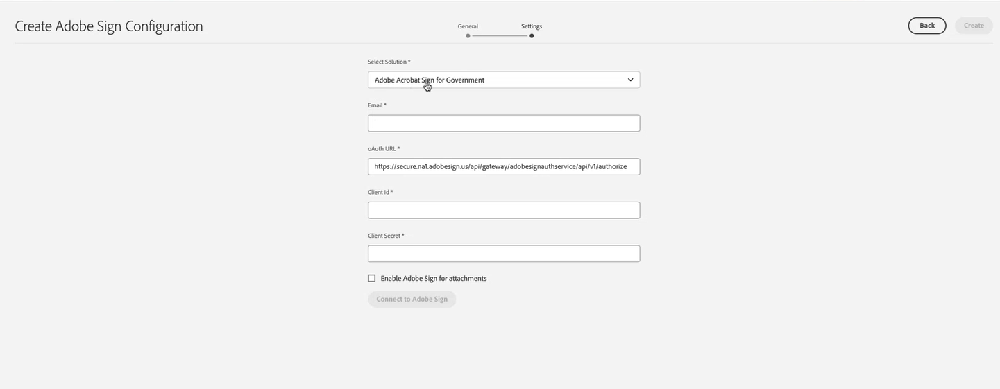

# 연결 [!DNL AEM Forms] as a Cloud Service [!DNL Adobe Acrobat Sign] {#integrate-adobe-sign-with-aem-forms}

[!DNL Adobe Acrobat Sign] 은 적응형 Forms 및 AEM 워크플로우에 대한 전자 서명 워크플로우를 활성화합니다. 전자 서명은 법무, 판매, 임금, 인적 자원 관리 등의 다양한 분야에서 문서를 처리하는 워크플로를 개선합니다.

대표적인 [!DNL Adobe Acrobat Sign] 및 적응형 양식 시나리오에서 사용자는 서비스에 적용할 적응형 양식에 정보를 입력합니다. 신용 카드 신청 양식과 시민 혜택 양식을 예로 들 수 있습니다. 사용자가 신청 양식에 정보를 입력하고 이를 제출한 뒤 서명하면, 이후의 액션이 가능하도록 양식이 서비스 제공자에게 전달됩니다. 서비스 제공자는 신청서를 검토하고 [!DNL Adobe Acrobat Sign]을 사용해 신청을 승인된 것으로 표시합니다. AEM Forms은 정부용 Adobe Acrobat Sign 및 Adobe Acrobat Sign Solutions을 모두 지원합니다. 라이선스 및 요구 사항에 따라 다음 솔루션 중 하나와 AEM Forms을 통합하거나 연결할 수 있습니다.

* [AEM Forms과 Adobe Acrobat Sign 연결](#adobe-sign)
* [AEM Forms과 Adobe Acrobat Sign Solutions for Government 연결](#adobe-acrobat-sign-for-government)

## AEM Forms과 Adobe Acrobat Sign 연결 {#adobe-sign}

연결하려면 **[!DNL AEM Forms]** 포함 **[!DNL Adobe Acrobat Sign]**&#x200B;의 사전 요구 사항 섹션에 나열된 소프트웨어 및 계정을 설정하고 Forms as a Cloud Service 작성자 및 게시 인스턴스에서 Adobe Sign Cloud Service을 구성합니다.

### AEM Forms과 Adobe Acrobat Sign을 연결하기 위한 사전 요구 사항 {#prerequisites-for-adobe-sign}

를 통합하려면 다음 설정이 필요합니다 [!DNL Adobe Acrobat Sign] 포함 [!DNL AEM Forms]:

1. 활성 [Adobe Acrobat Sign 개발자 계정](https://acrobat.adobe.com/us/en/sign/developer-form.html).
1. An [Adobe Acrobat Sign API 애플리케이션](https://www.adobe.io/apis/documentcloud/sign/docs.html#!adobedocs/adobe-sign/master/gstarted/create_app.md).
1. [!DNL Adobe Acrobat Sign] API 애플리케이션의 자격 증명(클라이언트 ID 및 클라이언트 보안).
1. (정부 ID 기반 인증만 해당) [인증 방법 활성화](https://helpx.adobe.com/sign/using/adobesign-authentication-government-id.html#AuditReport) 정부 ID 인증용.


### AEM Forms 작성자 및 게시 인스턴스와 Adobe Acrobat Sign 연결 {#configure-adobe-sign-with-aem-forms}

전제 조건이 갖추어지면 다음 단계를 통해 작성자 인스턴스에서 [!DNL AEM Forms]를 사용하여 [!DNL Adobe Acrobat Sign]을 구성하십시오.

1. AEM Forms 작성자 인스턴스에서 **[!UICONTROL 도구]**  > **[!UICONTROL 일반]** > **[!UICONTROL 구성 브라우저]**.
1. 다음에서 **[!UICONTROL 구성 브라우저]** 페이지, 탭 **[!UICONTROL 만들기]**.
1. 다음에서 **[!UICONTROL 구성 만들기]** 대화 상자, 지정 **[!UICONTROL 제목]** 구성의 경우 활성화 **[!UICONTROL 클라우드 구성]**, 및 탭 **[!UICONTROL 만들기]**. 이를 통해 Cloud Service를 저장하는 구성 컨테이너가 생성됩니다. 폴더 이름에는 공백이 없어야 합니다.
1. 다음으로 이동 **[!UICONTROL 도구]**  > **[!UICONTROL Cloud Services]** > **[!UICONTROL Adobe Acrobat Sign]** 이전 단계에서 생성한 구성 컨테이너를 엽니다.

   >[!NOTE]
   >
   >적응형 양식을 만들 때에서 컨테이너 이름을 지정합니다 **[!UICONTROL 구성 컨테이너]** 필드.

1. 구성 페이지에서 을 누릅니다. **[!UICONTROL 만들기]** 만들려면 [!DNL Adobe Acrobat Sign] AEM Forms의 구성
1. 다음에서 **[!UICONTROL 일반]** 의 탭 **[!UICONTROL Adobe Acrobat Sign 구성 만들기]** 페이지, 지정 **[!UICONTROL 이름]** 구성을 보려면 다음을 누르십시오. **[!UICONTROL 다음]**. 다음을 선택적으로 지정할 수 있습니다. **[!UICONTROL 제목]** 을(를) 찾아 선택 **[!UICONTROL 축소판]** 구성.

1. 이제 다음을 수행할 수 있습니다 **[!UICONTROL 솔루션 선택]** 선택 [!DNL Adobe Acrobat Sign].

   

1. 현재 브라우저 창의 URL을 메모장에 복사하고 부품을 제거합니다 `/ui#/aem` URL에서 을 구성하는 데 수정된 URL이 필요합니다. [!DNL Adobe Acrobat Sign] 을 사용한 애플리케이션 [!DNL AEM Forms]: 이후 단계에서 사용할 수 있습니다. 누르기 **[!UICONTROL 다음]**.

1. 다음에서 **[!UICONTROL 설정]** 탭, **[!UICONTROL OAuth URL]** 필드에는 기본 URL이 포함되어 있습니다. URL 형식은 다음과 같습니다.

   `https://<shard>/public/oAuth/v2`

   예:
   `https://secure.na1.echosign.com/public/oauth/v2`

   여기에서

   **na1**&#x200B;은 기본값 데이터베이스 분할을 의미합니다. 데이터베이스 분할의 값을 수정할 수 있습니다. [!DNL  Adobe Acrobat Sign] 클라우드 구성이 [올바른 분할](https://helpx.adobe.com/sign/using/identify-account-shard.html)을 가리켜야 합니다.

   Adobe Experience Manager 기능이나 구성 요소에 대한 또 다른 [!DNL Adobe Acrobat Sign] 구성을 생성하는 경우, 모든 [!DNL Adobe Acrobat Sign] 클라우드 구성이 동일한 분할을 가리켜야 합니다.

   >[!NOTE]
   >
   > 유지 **Adobe Acrobat Sign 구성 만들기** 페이지가 열립니다. 닫지 마세요. 다음을 검색할 수 있습니다. **클라이언트 ID** 및 **클라이언트 암호** 에 대한 OAuth 설정을 구성한 후 [!DNL Adobe Acrobat Sign] 다음 단계에 설명된 대로 애플리케이션.


1. [!DNL Adobe Acrobat Sign] 애플리케이션에 대한 OAuth 설정을 구성합니다.

   1. 브라우저 창을 열고 [!DNL Adobe Acrobat Sign] 개발자 계정에 로그인합니다.
   1. 다음에 대해 구성된 애플리케이션 선택 [!DNL AEM Forms], 및 탭 **[!UICONTROL 애플리케이션에 대한 OAuth 구성]**.
   1. 다음에서 **[!UICONTROL 리디렉션 URL]** 상자에서 이전 단계(8단계)에서 복사한 URL을 추가하고 을 클릭합니다. **[!UICONTROL 저장]**.
   1. 에 대해 다음 범위 활성화 [!DNL Adobe Acrobat Sign] 애플리케이션 및 클릭 **[!UICONTROL 저장]**.

   * [!DNL aggrement_read]
   * [!DNL aggrement_write]
   * [!DNL aggrement_send]
   * [!DNL widget_read]
   * [!DNL widget_write]
   * [!DNL workflow_read]

   [!DNL Adobe Acrobat Sign] 애플리케이션에 대한 OAuth 설정을 구성하고 키를 얻는 방법에 대한 단계별 정보는 [애플리케이션에 대한 oAuth 설정 구성](https://www.adobe.io/apis/documentcloud/sign/docs.html#!adobedocs/adobe-sign/master/gstarted/configure_oauth.md) 개발자 문서를 참조하십시오.

   

1. 로 돌아가기 **[!UICONTROL Adobe Acrobat Sign 구성 만들기]** 페이지를 가리키도록 업데이트하는 중입니다. 다음에서 **[!UICONTROL 설정]** 탭에서 [**[!UICONTROL 클라이언트 ID]** (애플리케이션 ID라고도 함) 및 **[!UICONTROL 클라이언트 암호]**]. 사용 [Adobe Acrobat Sign 애플리케이션의 클라이언트 ID 및 클라이언트 암호](https://opensource.adobe.com/acrobat-sign/developer_guide/helloworld.html#get-the-app-id-and-secret) 이전 단계에서 을(를) 만들었습니다.

1. 다음 항목 선택 **[!UICONTROL 첨부 파일에 Adobe Acrobat Sign 사용]** 적응형 양식에 첨부된 파일을 해당 파일에 추가하는 옵션 [!DNL Adobe Acrobat Sign] 서명을 위해 문서를 보냈습니다.

1. 누르기 **[!UICONTROL Adobe Acrobat Sign에 연결]**. 자격 증명을 입력하라는 메시지가 뜨면 **사용자 이름** 및 **암호** 생성 시 사용된 계정 [!DNL Adobe Acrobat Sign] 응용 프로그램. 확인을 요청하는 경우 다음에 대한 액세스 권한: `your developer account`, 클릭 **[!UICONTROL 액세스 허용]**. 자격 증명이 올바르고 [!DNL Adobe Acrobat Sign] 개발자 계정에 대한 [!DNL AEM Forms]의 액세스를 허용하면 아래에 제시된 것과 비슷한 성공 메시지가 표시됩니다.

   

1. 누르기 **[!UICONTROL 만들기]** 을(를) 만들려면 [!DNL Adobe Acrobat Sign] 구성.

1. 구성을 선택하고 **[!UICONTROL 게시]**&#x200B;을 클릭하고 구성을 선택한 다음 을 클릭합니다 **[!UICONTROL 게시]**. 해당 게시 환경에 구성이 복사됩니다.

1. 위의 모든 단계를 개발자, 스테이지 및 생산 인스턴스(어느 것이든 남은 인스턴스에)에 반복하여, 해당 환경을 위한 [!DNL AEM Forms]를 사용한 [!DNL Adobe Acrobat Sign] 구성을 완료합니다.

이제 다음을 수행할 수 있습니다. [적응형 양식에 Adobe Acrobat Sign 필드 추가 사용](working-with-adobe-sign.md). Cloud Service에 사용되는 구성 컨테이너를 [!DNL Adobe Acrobat Sign]을 위해 활성화하고자 하는 모든 적응형 양식에 추가해야 합니다. 적응형 양식의 속성에서 구성 컨테이너를 지정할 수 있습니다.

## AEM Forms과 Adobe Acrobat Sign Solutions for Government 연결 {#adobe-acrobat-sign-for-government}

|주의|[!BADGE 프리릴리스 설명서]{type=Caution tooltip="노란색 상태"}
<span class="preview"> 이 섹션에는 프리릴리스 설명서와 변경될 수 있는 사항이 포함되어 있습니다.</span>

AEM Forms과 Adobe Acrobat Sign Solutions for Government를 연결하는 것은 여러 단계로 구성됩니다. 여기에는 다음이 포함됩니다.

* AEM 인스턴스에 대한 리디렉션 URL 만들기
* 리디렉션 URL 및 범위를 Adobe Sign Solutions for Government 팀과 공유
* Adobe Sign 팀으로부터 자격 증명 받기
* 수신한 자격 증명을 사용하여 AEM Forms과 Adobe Acrobat Sign Solutions for Government 연결


AEM Forms은 개발, 스테이지 및 프로덕션 환경을 as a Cloud Service으로 제공합니다. 의 개발 환경을 Adobe Acrobat Sign Solutions for Government와 연결하는 것으로 시작하고 나중에 스테이지와 프로덕션 환경을 연결할 수 있습니다.

### 시작하기 전 {#prerequisites-for-adobe-sign-for-acrobat-sign-for-government}

AEM Forms과 Adobe Acrobat Sign 솔루션 연결을 시작하기 전에 [Adobe Acrobat Sign Solutions for Government](https://opensource.adobe.com/acrobat-sign/signgov/gstarted.html#account-provisioning) 계정이 프로비저닝되었습니다.


### AEM Forms as a Cloud Service과 Adobe Acrobat Sign Solutions for Government 연결 {#connect-adobe-acrobat-sign-for-government}

#### AEM 인스턴스에 대한 리디렉션 URL 만들기

1. Forms as a Cloud Service 작성자 인스턴스에서 **[!UICONTROL 도구]**  > **[!UICONTROL 일반]** > **[!UICONTROL 구성 브라우저]**.
1. 다음에서 **[!UICONTROL 구성 브라우저]** 페이지, 탭 **[!UICONTROL 만들기]**.
1. 다음에서 **[!UICONTROL 구성 만들기]** 대화 상자, 지정 **[!UICONTROL 제목]** 구성의 경우 활성화 **[!UICONTROL 클라우드 구성]**, 및 탭 **[!UICONTROL 만들기]**. 이를 통해 Cloud Service를 저장하는 구성 컨테이너가 생성됩니다. 폴더 이름에는 공백이 없어야 합니다.
1. 다음으로 이동 **[!UICONTROL 도구]**  > **[!UICONTROL Cloud Services]** > **[!UICONTROL Adobe Acrobat Sign]** 이전 단계에서 생성한 구성 컨테이너를 엽니다. 적응형 양식을 만들 때에서 컨테이너 이름을 지정합니다 **[!UICONTROL 구성 컨테이너]** 필드.
1. 구성 페이지에서 을 누릅니다. **[!UICONTROL 만들기]** 만들려면 [!DNL Adobe Acrobat Sign] AEM Forms의 구성
1. 현재 브라우저 창의 URL을 메모장에 복사하고 제거합니다. `/ui#/aem` URL에서 이 URL을 라고 합니다. `re-direct URL`. 다음 섹션에서는 `re-direct URL` 및 `Scopes` Adobe Sign 팀 및 요청 자격 증명(클라이언트 ID 및 클라이언트 암호)과 함께 사용할 수 있습니다.


#### 리디렉션 URL 및 범위를 Adobe Sign 팀과 공유하고 자격 증명을 받습니다

Adobe Acrobat Sign for Government Solutions 팀은 `re-direct URL` 또한 Adobe Acrobat Sign 애플리케이션(아래 나열됨)에 대해 활성화할 특정 범위를 사용하여 AEM Forms을 Adobe Acrobat Sign Solutions for Government에 연결할 수 있는 자격 증명(클라이언트 ID 및 클라이언트 암호)을 생성할 수 있습니다.

공유 `scopes` (아래에 나열됨) 및 `re-direct URL` Adobe Acrobat Sign for Government Solution 담당자와 함께 이전 섹션의 마지막 단계를 만들고 기록했습니다([Adobe Professional Services 팀원](https://opensource.adobe.com/acrobat-sign/signgov/gstarted.html#password)).

**_범위_**

* [!DNL aggrement_read]
* [!DNL aggrement_write]
* [!DNL aggrement_send]
* [!DNL widget_read]
* [!DNL widget_write]
* [!DNL workflow_read]
* [!DNL offline_access]

담당자는 자격 증명을 생성하고 사용자와 공유합니다. 다음 섹션에서는 자격 증명(클라이언트 ID 및 클라이언트 암호)을 사용하여 AEM Forms을 Adobe Acrobat Sign Solutions for Government에 연결합니다.

#### 수신한 자격 증명을 사용하여 AEM Forms과 Adobe Acrobat Sign Solutions for Government를 연결합니다.

1. 를 엽니다. `re-direct URL` 을 클릭합니다. 을(를) 만들고 적어 두었습니다. `re-direct URL` 의 마지막 단계에서 [AEM 인스턴스에 리디렉션 URL 만들기](#create-redirect-url) 섹션.

1. 다음에서 **[!UICONTROL 일반]** 의 탭 **[!UICONTROL Adobe Sign 구성 만들기]** 페이지, 지정 **[!UICONTROL 이름]** 구성을 보려면 다음을 누르십시오. **[!UICONTROL 다음]**. 다음을 선택적으로 지정할 수 있습니다. **[!UICONTROL 제목]** 을(를) 찾아 선택 **[!UICONTROL 축소판]** 구성. **[!UICONTROL 다음]**&#x200B;을 클릭합니다.

1. 다음에서 **[!UICONTROL 설정]** 의 탭 **[!UICONTROL Adobe Sign 구성 만들기]** 페이지, **[!UICONTROL 솔루션 선택]** 옵션, 선택 [!DNL Adobe Acrobat Sign Solutions for Government].

   

1. 다음에서 **[!UICONTROL 이메일]** 필드를 생성하고 정부 계정용 Adobe Acrobat Sign Solutions과 연결된 이메일 주소를 지정합니다.

1. 다음 **[!UICONTROL OAuth URL]** 필드는 Adobe Sign 데이터베이스 분할을 지정합니다. 필드에는 기본 URL이 포함되어 있습니다. URL은 변경하지 마십시오.

1. 정부 솔루션 담당자용 Adobe Acrobat Sign에서 공유한 자격 증명 사용([Adobe Professional Services 팀원]) 이전 섹션에서 [**[!UICONTROL 클라이언트 ID]** 및 **[!UICONTROL 클라이언트 암호]**].

1. 다음 항목 선택 **[!UICONTROL 첨부 파일에 Adobe Acrobat Sign 사용]** 적응형 양식에 첨부된 파일을 해당 파일에 추가하는 옵션 [!DNL Adobe Acrobat Sign] 서명을 위해 문서를 보냈습니다.

1. 누르기 **[!UICONTROL Adobe Sign에 연결]**. 자격 증명을 입력하라는 메시지가 뜨면 [!DNL Adobe Acrobat Sign] 애플리케이션 생성 시 사용한 계정의 사용자 이름과 비밀번호를 입력합니다. 다음에 대한 액세스를 확인해달라는 메시지가 뜨는 경우 `your developer account`, 클릭 **[!UICONTROL 액세스 허용]**. 자격 증명이 올바르고 [!DNL Adobe Acrobat Sign] 개발자 계정에 대한 [!DNL AEM Forms]의 액세스를 허용하면 아래에 제시된 것과 비슷한 성공 메시지가 표시됩니다.

   

   <!-- > When prompted for credentials, provide username and password of the account used while creating [!DNL Adobe Acrobat Sign] application. When asked to confirm access for `your developer account`, Click **[!UICONTROL Allow Access]**. -->

1. 누르기 **[!UICONTROL 만들기]** 을 클릭하여 구성을 만듭니다.

1. 구성을 선택하고 **[!UICONTROL 게시]**&#x200B;을 클릭하고 구성을 선택한 다음 을 클릭합니다 **[!UICONTROL 게시]**. 해당 게시 환경에 구성이 복제됩니다.

1. 위의 모든 단계를 개발자, 스테이지 및 생산 인스턴스(어느 것이든 남은 인스턴스에)에 반복하여, 해당 환경을 위한 [!DNL AEM Forms]를 사용한 [!DNL Adobe Acrobat Sign Solutions for Government] 구성을 완료합니다.

이제 다음을 수행할 수 있습니다. [적응형 양식에서 Adobe Acrobat Sign 필드 추가 사용](working-with-adobe-sign.md) 또는 [AEM 워크플로](/help/forms/aem-forms-workflow-step-reference.md#sign-document-step-sign-document-step). Cloud Service 구성에 사용되는 구성 컨테이너를 활성화할 모든 적응형 Forms에 추가해야 합니다 [!DNL Adobe Acrobat Sign]. 적응형 양식의 속성에서 구성 컨테이너를 지정할 수 있습니다.

## (AEM Workflow만 해당) [!DNL Adobe Acrobat Sign] 스케줄러를 구성하여 서명 상태 동기화 {#configure-adobe-sign-scheduler-to-sync-the-signing-status}

[!DNL Adobe Acrobat Sign] 워크플로 단계를 사용해 적응형 양식에 서명할 때, 워크플로 단계의 구성에 따라 양식이 서명자들 간에 전달되거나 모든 서명자에게 동시에 전달될 수 있습니다. [!DNL Adobe Acrobat Sign]이 활성화된 적응형 양식은 모든 서명자가 서명 프로세스를 완료한 후에만 Experience Manager Forms Server에 제출됩니다.

기본값으로 [!DNL Adobe Acrobat Sign] 스케줄러 서비스는 서명자 응답을 24시간마다 점검(가져옴)합니다. 해당 환경에 맞게 기본값 간격을 변경할 수 있습니다.

기본 간격을 변경하려면 [크론 표현식](https://en.wikipedia.org/wiki/Cron#CRON_expression) 대상: **sign.status.exp** 의 속성 **Adobe Acrobat Sign 구성 서비스** 구성.

예를 들어 매일 오전 00:00에 구성 서비스를 실행하려면 **sign.status.exp** 의 속성 **Adobe Acrobat Sign 구성 서비스** 지정할 구성 `0 0 0 1/1 * ? *`. 다음의 JSON 파일은 매일 오전 00:00에 구성 서비스를 실행하는 예를 나타낸 것입니다.

```json
{
  "sign.status.exp":"0 0 0 1/1 * ? *"
}
```

구성의 값을 설정하려면 [AEM SDK를 사용해 OSGi 구성을 생성](https://experienceleague.adobe.com/docs/experience-manager-cloud-service/implementing/deploying/configuring-osgi.html?lang=en#generating-osgi-configurations-using-the-aem-sdk-quickstart)하고 Cloud Service 인스턴스에 [구성을 배포](https://experienceleague.adobe.com/docs/experience-manager-cloud-service/implementing/using-cloud-manager/deploy-code.html?lang=en#deployment-process)하십시오.


## 관련 문서 {#related-articles}

* [적응형 양식에서 Adobe Acrobat Sign 사용](working-with-adobe-sign.md)

* [적응형 Forms과 함께 Adobe Acrobat Sign 사용하기 우수 사례](https://medium.com/adobetech/using-adobe-sign-to-e-sign-an-adaptive-form-heres-the-best-way-to-do-it-dc3e15f9b684)
