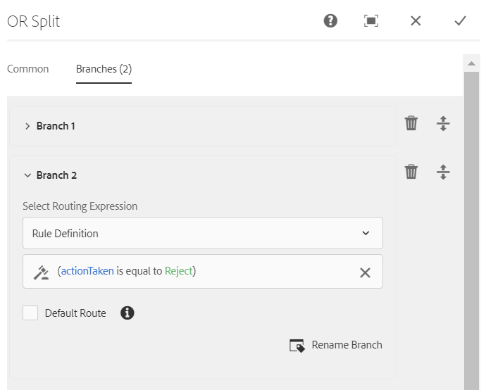

# OSGi의 Forms 중심 워크플로우{#forms-centric-workflow-on-osgi}

기업은 수백, 수천 개의 양식, 다양한 백엔드 시스템, 온라인 또는 오프라인 데이터 소스에서 데이터를 수집합니다. 또한 반복적인 검토 및 승인 프로세스를 포함하는 데이터에 대한 결정을 내리는 동적 사용자 집합이 있습니다.

내부 및 외부 대상자를 위한 검토 및 승인 워크플로와 함께 대규모 조직 및 기업은 반복적인 작업을 수행합니다. 예를 들어 PDF 문서를 다른 형식으로 변환하는 경우 이러한 작업을 수동으로 수행하는 경우 많은 시간과 자원이 소요됩니다. 또한 기업은 문서에 디지털 서명을 하고 나중에 사전 정의된 형식으로 사용할 수 있도록 양식 데이터를 보관해야 하는 법적 요구 사항이 있습니다.

## OSGi에서 Forms 중심 워크플로우 소개 {#introduction-to-forms-centric-workflow-on-osgi}

AEM 워크플로를 사용하여 적응형 Forms 기반 워크플로를 신속하게 구축할 수 있습니다. 이러한 워크플로우는 검토 및 승인, 비즈니스 프로세스 플로우, 문서 서비스 시작, Adobe Sign 서명 워크플로와 통합 및 유사한 작업에 사용할 수 있습니다. 예를 들어 신용 카드 신청 처리, 사원 휴가 승인 워크플로, 양식을 PDF 문서로 저장 등이 있습니다. 또한 이러한 워크플로우는 조직 내에서 또는 네트워크 방화벽에서 사용할 수 있습니다.

OSGi의 Forms 중심 워크플로우를 사용하면 JEE 스택에 완전한 프로세스 관리 기능을 설치하지 않고도 OSGi 스택에서 다양한 작업을 위한 워크플로우를 빠르게 빌드하고 배포할 수 있습니다. 워크플로의 개발 및 관리에서는 익숙한 AEM Workflow 및 AEM Inbox 기능을 사용합니다. 워크플로우는 여러 소프트웨어 시스템, 네트워크, 부서 및 조직에 걸쳐 실제 비즈니스 프로세스를 자동화하는 기반을 구성합니다.

설정되면 이러한 워크플로우를 수동으로 트리거하여 정의된 프로세스를 완료하거나 사용자가 양식을 제출할 때 프로그래밍 방식으로 실행할 수 있습니다 <!-- or [correspondence management](cm-overview.md) letter-->. <!-- With this enhanced AEM Workflow capabilities, [!DNL AEM Forms] offers two distinct, yet similar, capabilities. As part of your deployment strategy, you need to decide which one works for you. See a [comparison](capabilities-osgi-jee-workflows.md) of the Forms-centric AEM Workflows on OSGi and Process Management on JEE. Moreover, for the deployment topology see, [Architecture and deployment topologies for [!DNL AEM Forms]]((aem-forms-architecture-deployment.md). -->

OSGi에서 Forms 중심 워크플로가 확장됨 [AEM 받은 편지함](https://experienceleague.adobe.com/docs/experience-manager-cloud-service/sites/authoring/getting-started/inbox.html#authoring) AEM Workflow 편집기에 대한 지원을 추가할 수 있는 추가 구성 요소(단계)를 제공합니다. [!DNL AEM Forms]-centric 워크플로. <!-- The extended AEM Inbox has functionalities similar to [[!DNL AEM Forms] Workspace](introduction-html-workspace.md). Along with managing human-centric workflows (Approval, Review, and so on), you can use AEM workflows to automate [document services](https://experienceleague.adobe.com/docs/experience-manager-65/developing/extending-aem/extending-workflows/workflows-step-ref.html#extending-aem)-related operations (for example, Generate PDF) and electronically signing (Adobe Sign) documents. -->

모두 [!DNL AEM Forms] 워크플로우 단계는 변수 사용을 지원합니다. 변수를 사용하면 런타임 시 워크플로우 단계에서 여러 단계에 걸쳐 메타데이터를 보관하고 전달할 수 있습니다. 다양한 유형의 데이터를 저장하기 위해 다양한 유형의 변수를 만들 수 있습니다. 관련된 동일한 형식의 데이터의 여러 인스턴스를 저장하는 변수 컬렉션(배열)을 만들 수도 있습니다. 일반적으로 변수 또는 변수 컬렉션은 보유하고 있는 값을 기반으로 결정을 내려야 하거나 나중에 프로세스에서 필요한 정보를 저장해야 할 때 사용합니다. 이러한 Forms 중심 워크플로 구성 요소(단계)에서 변수를 사용하는 방법에 대한 자세한 내용은 다음을 참조하십시오. [OSGi의 Forms 중심 워크플로우 - 단계 참조](aem-forms-workflow-step-reference.md). 변수 만들기 및 관리에 대한 자세한 내용은 [AEM 워크플로우의 변수](variable-in-aem-workflows.md).

다음 다이어그램은 OSGi에서 Forms 중심 워크플로우를 만들고 실행하고 모니터링하는 엔드 투 엔드 절차를 보여 줍니다.

## 시작하기 전 {#before-you-start}

* 워크플로우는 실제 비즈니스 프로세스를 나타냅니다. 실제 비즈니스 프로세스와 비즈니스 프로세스 참여자 목록을 준비하십시오. 또한 워크플로우를 만들기 전에 보충 자료(적응형 Forms, PDF 문서 등)를 준비하십시오.
* 워크플로우에는 여러 단계가 있을 수 있습니다. 이러한 단계는 AEM 받은 편지함에 표시되며 워크플로우의 진행 상황을 보고하는 데 도움이 됩니다. 비즈니스 프로세스를 논리적 단계로 나눕니다.
* AEM Workflow의 할당 작업 단계를 구성하여 사용자 또는 할당자에게 이메일 알림을 보낼 수 있습니다. 그래서, [이메일 알림 활성화](#configure-email-service).
* 워크플로는 디지털 서명에 Adobe 서명을 사용할 수도 있습니다. 워크플로우에서 Adobe Sign을 사용하려는 경우 [Adobe Sign 구성 [!DNL AEM Forms]](adobe-sign-integration-adaptive-forms.md) 워크플로우에서 사용하기 전에.

## 워크플로우 모델 만들기 {#create-a-workflow-model}

워크플로우 모델은 비즈니스 프로세스의 로직과 플로우로 구성됩니다. 일련의 단계로 구성됩니다. 이러한 단계는 AEM 구성 요소입니다. 필요에 따라 매개 변수 및 스크립트를 사용하여 워크플로우 단계를 확장하여 더 많은 기능과 제어를 제공할 수 있습니다. [!DNL AEM Forms] 에서는 즉시 사용할 수 있는 AEM 단계 외에 몇 가지 단계를 제공합니다. AEM 및 의 자세한 목록 [!DNL AEM Forms] 단계, 참조 [AEM Workflow 단계 참조](https://experienceleague.adobe.com/docs/experience-manager-65/developing/extending-aem/extending-workflows/workflows-step-ref.html#extending-aem) 및 [OSGi의 Forms 중심 워크플로우 - 단계 참조](aem-forms-workflow.md).

AEM은 제공된 워크플로우 단계를 사용하여 워크플로우 모델을 만들 수 있는 직관적인 사용자 인터페이스를 제공합니다. 워크플로우 모델을 만드는 단계별 지침은 다음을 참조하십시오. [워크플로우 모델 만들기](https://experienceleague.adobe.com/docs/experience-manager-cloud-service/sites/authoring/workflows/overview.html#workflows). 다음 예제에서는 승인 및 검토 워크플로우에 대한 워크플로우 모델을 만드는 단계별 지침을 제공합니다.

>[!NOTE]
>
>워크플로우 모델을 만들거나 편집하려면 워크플로우 편집기 그룹의 멤버여야 합니다.

### 승인 및 검토 워크플로우에 대한 모델 만들기 {#create-a-model-for-an-approval-and-review-workflow}

승인 및 검토 워크플로우는 결정을 내리는 데 사람의 개입이 필요한 작업을 위한 것입니다. 다음 예제에서는 프런트 오피스 뱅킹 에이전트가 채울 모기지 대출 신청에 대한 워크플로 모델을 만듭니다. 지원서가 작성되면 승인을 위해 전송됩니다. 이후 Adobe Sign을 이용하여 전자서명 신청자에게 승인된 신청서를 발송하게 된다.

이 예제는 아래에 첨부된 패키지로 사용할 수 있습니다. 패키지 관리자를 사용하여 예제를 가져오고 설치합니다. 다음 단계를 수행하여 응용 프로그램의 워크플로 모델을 수동으로 만들 수도 있습니다.

이 예제는 프런트 오피스 뱅킹 에이전트가 채울 모기지 응용 프로그램의 워크플로 모델을 만듭니다. 신청서를 작성하면 승인을 위해 전송됩니다. 나중에 승인된 애플리케이션은 Adobe Sign을 사용하여 전자 서명을 위해 고객에게 전송됩니다. 패키지 관리자를 사용하여 예를 가져오고 설치할 수 있습니다.

[파일 가져오기](assets/example-mortgage-loan-application.zip)

1. 워크플로우 모델 콘솔을 엽니다. 기본 URL은 `https://[server]:[port]/libs/cq/workflow/admin/console/content/models.html/etc/workflow/models`
1. 선택 **만들기**, 그런 다음 **모델 만들기**. 워크플로 모델 추가 대화 상자가 나타납니다.
1. 다음을 입력합니다. **제목** 및 **이름** (선택 사항). 예: 담보 대출 신청. 누르기 **완료**.
1. 새로 만든 워크플로우 모델을 선택한 다음 을 누릅니다 **편집**. 이제 워크플로우 단계를 추가하여 비즈니스 논리를 구축할 수 있습니다. 처음 워크플로우 모델을 만들 때 다음과 같은 내용이 포함됩니다.

   * 단계: 플로우 시작 및 플로우 종료. 이 단계는 워크플로의 시작과 끝을 나타냅니다. 이러한 단계는 필수이며 편집하거나 제거할 수 없습니다.
   * 1단계로 이름이 지정된 예제 참가자 단계입니다. 이 단계는 관리 사용자에게 작업 항목을 할당하도록 구성되었습니다. 이 단계를 제거합니다.

1. 이메일 알림을 활성화합니다. OSGi에서 Forms 중심 워크플로우를 구성하여 사용자 또는 피할당자에게 이메일 알림을 전송할 수 있습니다. 이메일 알림을 활성화하려면 다음 구성을 수행하십시오.

   1. 다음 위치에서 AEM 구성 관리자로 이동합니다. `https://[server]:[port]/system/console/configMgr`.
   1. 를 엽니다. **[!UICONTROL 일별 CQ 메일 서비스]** 구성. 다음에 대한 값 지정 **[!UICONTROL SMTP 서버 호스트 이름]**, **[!UICONTROL SMTP 서버 포트,]** 및 **[!UICONTROL &quot;보낸 사람&quot; 주소]** 필드. **[!UICONTROL 저장]**&#x200B;을 클릭합니다.
   1. 를 엽니다. **[!UICONTROL 일별 CQ 링크 외부화]** 구성. 다음에서 **[!UICONTROL 도메인]** 필드에 로컬, 작성자 및 게시 인스턴스에 대한 실제 호스트 이름/IP 주소 및 포트 번호를 지정합니다. **[!UICONTROL 저장]**&#x200B;을 클릭합니다.

1. 워크플로우 단계를 만듭니다. 워크플로우에는 여러 단계가 있을 수 있습니다. 이러한 단계는 AEM 받은 편지함에 표시되며 워크플로우의 진행 상황을 보고합니다.

   단계를 정의하려면  아이콘을 클릭하여 워크플로 모델 속성을 열고 **단계** 탭을 클릭하고 워크플로 모델의 단계를 추가한 다음 을 누릅니다 **저장 및 닫기**. 예시 모기지 신청의 경우 단계(예: 대출 요청, 대출 요청 상태, 서명될 문서 및 서명된 대출 문서)를 생성합니다.

1. 을(를) 드래그 앤 드롭합니다 **작업 할당** 단계 브라우저를 사용하여 워크플로 모델을 탐색합니다. 이를 모델의 첫 번째 단계로 만듭니다.

   작업 할당 구성 요소는 워크플로에서 만든 작업을 사용자 또는 그룹에 할당합니다. 작업 할당과 함께 구성 요소를 사용하여 작업에 대한 적응형 양식 또는 비대화형 PDF을 지정할 수 있습니다. 적응형 양식은 사용자의 입력을 받아들여야 하며 비대화형 PDF 또는 읽기 전용 적응형 양식은 검토 전용 워크플로우에 사용됩니다.

   단계를 사용하여 작업의 동작을 제어할 수도 있습니다. 예를 들어, 자동 기록 문서 생성, 특정 사용자 또는 그룹에 작업 할당, 제출된 데이터의 경로, 미리 채울 데이터의 경로 및 기본 작업 등이 있습니다. 작업 할당 단계의 옵션에 대한 자세한 내용은 [OSGi의 Forms 중심 워크플로우 - 단계 참조](aem-forms-workflow.md) 문서.

   

   모기지 애플리케이션 예제의 경우, 작업이 완료되면 작업 할당 단계를 구성하여 읽기 전용 적응형 양식을 사용하고 PDF 문서를 표시합니다. 또한 대출 요청을 승인할 수 있는 사용자 그룹을 선택합니다. 다음에서 **작업** 탭, 비활성화 **제출** 옵션을 선택합니다. 만들기 **actionTaken** String 데이터 형식의 변수를 지정하고 **경로 변수**. 예: actionTaken. 또한 승인 및 거부 경로를 추가합니다. 경로는 AEM 받은 편지함에 별도의 작업(버튼)으로 표시됩니다. 워크플로는 사용자가 탭한 작업(버튼)을 기반으로 분기를 선택합니다.

   저당 신청과 같이 구성된 지정 태스크 단계의 모든 필드에 대한 전체 값 세트에 대해 섹션의 시작에서 다운로드할 수 있는 예제 패키지를 가져올 수 있습니다.

1. 단계 브라우저에서 OR 분할 구성 요소를 워크플로우 모델로 드래그 앤 드롭합니다. OR 분할은 워크플로우에 분할을 만들고 그 후 하나의 분기만 활성화됩니다. 이 단계를 통해 조건부 처리 경로를 워크플로우에 도입할 수 있습니다. 필요에 따라 각 분기에 워크플로 단계를 추가합니다.

   규칙 정의, ECMA 스크립트 또는 외부 스크립트를 사용하여 분기에 대한 라우팅 표현식을 정의할 수 있습니다.

   표현식 편집기를 사용하여 분기 1 및 분기 2에 대한 라우팅 표현식을 만듭니다. 이러한 라우팅 표현식은 AEM 받은 편지함의 사용자 작업을 기반으로 분기를 선택하는 데 도움이 됩니다.

   **분기 1에 대한 라우팅 표현식**

   사용자가 탭할 때 **승인** AEM 받은 편지함에서 분기 1이 활성화됩니다.

   

   **분기 2에 대한 라우팅 표현식**

   사용자가 탭할 때 **거부** AEM 받은 편지함에서 분기 2가 활성화됩니다.

   

   변수를 사용하여 라우팅 표현식을 만드는 방법에 대한 자세한 내용은 [의 변수 [!DNL AEM Forms] 워크플로](variable-in-aem-workflows.md).

1. 비즈니스 논리를 구축하기 위한 다른 워크플로우 단계를 추가합니다.

   모기지 예제의 경우 아래 이미지에 표시된 대로 기록 문서 생성, 두 개의 작업 단계 할당 및 서명 문서 단계를 모델의 분기 1에 추가합니다. 작업 할당 단계 중 하나는 표시 및 보내기 **신청자에게 대출 서류에 서명하다** 외 할당 작업 구성 요소 **서명된 문서를 표시하려면**. 또한 할당 작업 구성 요소를 분기 2에 추가합니다. 사용자가 AEM 받은 편지함에서 거부를 탭하면 활성화됩니다.

   담보 대출 신청에 대해 구성된 할당 작업 단계, 기록 문서 단계 및 서명 문서 단계의 모든 필드에 대한 전체 값 세트에 대해 이 섹션의 시작에서 다운로드할 수 있는 예제 패키지를 가져옵니다.

   워크플로우 모델이 준비되었습니다. 다양한 방법을 통해 워크플로우를 시작할 수 있습니다. 자세한 내용은 [OSGi에서 Forms 중심 워크플로우 실행](#launch).

   

## Forms 중심의 워크플로우 애플리케이션 만들기 {#create-a-forms-centric-workflow-application}

응용 프로그램은 워크플로우와 연결된 적응형 양식입니다. 받은 편지함을 통해 애플리케이션이 제출되면 관련 워크플로우가 시작됩니다. AEM 받은 편지함에서 Forms 워크플로우를 애플리케이션으로 사용할 수 있도록 설정 및 [!DNL AEM Forms] 앱, 워크플로 애플리케이션을 만들려면 다음을 수행하십시오.

>[!NOTE]
>
>워크플로우 응용 프로그램을 만들고 관리하려면 fd-administrator 그룹의 멤버여야 합니다.

1. AEM 작성자 인스턴스에서  > **[!UICONTROL Forms]** > **[!UICONTROL 워크플로우 응용 프로그램 관리]** 및 탭 **[!UICONTROL 만들기]**.
1. 워크플로 응용 프로그램 만들기 창에서 다음 필드에 대한 입력을 제공하고 탭합니다 **만들기**. 새 응용 프로그램이 만들어지고 [워크플로우 응용 프로그램] 화면에 나열됩니다.

<table>
 <tbody>
  <tr>
   <td>필드</td>
   <td>설명</td>
  </tr>
  <tr>
   <td>제목</td>
   <td>제목은 AEM 받은 편지함에 표시되며 사용자가 애플리케이션을 선택하는 데 도움이 됩니다. 설명으로 유지하십시오. 예: 저축 계정 개설 애플리케이션.  </td>
  </tr>
  <tr>
   <td>이름 </td>
   <td>응용 프로그램의 이름을 지정합니다. 영문자, 숫자, 하이픈 및 밑줄을 제외한 모든 문자는 하이픈으로 대체됩니다. </td>
  </tr>
  <tr>
   <td>설명</td>
   <td>설명은 AEM 받은 편지함에 표시됩니다. 설명 필드에 응용 프로그램에 대한 자세한 정보를 제공합니다. 예: 애플리케이션 용도.  </td>
  </tr>
  <tr>
   <td>적응형 양식</td>
   <td>
적응형 양식의 경로를 지정합니다. 사용자가 애플리케이션을 시작하면 지정된 적응형 양식이 표시됩니다.
 
<strong>참고</strong>: 워크플로 애플리케이션은 한 페이지 이상이거나 Apple iPad에서 스크롤해야 하는 양식 및 PDF 문서를 지원하지 않습니다. Apple iPad에서 애플리케이션을 열었을 때 적응형 양식 또는 PDF 문서가 페이지보다 길면 두 번째 페이지의 양식 필드 및 콘텐츠가 손실됩니다.
 </td>
  </tr>
  <tr>
   <td>그룹 액세스</td>
   <td>
그룹을 선택하십시오. 응용 프로그램은 선택한 그룹의 구성원에게만 AEM 받은 편지함에 표시됩니다. 액세스 그룹 옵션을 사용하면 [!DNL workflow-users] 선택 가능한 그룹입니다. 
   </td>
  </tr>
  <tr>
   <td>미리 채우기 서비스</td>
   <td>선택 <a href="prepopulate-adaptive-form-fields.md#aem-forms-custom-prefill-service" target="_blank">미리 채우기 서비스</a> 적응형 양식용.  </td>
  </tr>
  <tr>
   <td>워크플로우 모델</td>
   <td>선택 <a href="aem-forms-workflow.md#create-a-workflow-model">워크플로 모델</a> 응용 프로그램용. 워크플로우 모델은 비즈니스 프로세스의 로직과 플로우로 구성됩니다. </td>
  </tr>
  <tr>
   <td>데이터 파일 경로</td>
   <td>crx-repository에서 데이터 파일의 경로를 지정합니다. 경로는 적응형 양식 페이로드를 기준으로 하며 데이터 파일의 이름을 포함합니다. 해당되는 경우 확장명을 포함하여 파일의 전체 이름을 항상 포함하십시오. 예: [payload]/data.xml. </td>
  </tr>
  <tr>
   <td>첨부 파일 경로</td>
   <td>crx-repository에 있는 첨부 파일 폴더의 경로를 지정합니다. 첨부 파일 경로는 페이로드 위치에 상대적입니다. 예: [payload]/data.xml. </td>
  </tr>
  <tr>
   <td>기록 문서 경로</td>
   <td>crx-repository에 있는 기록 문서 파일의 경로를 지정합니다. 경로는 적응형 양식 페이로드 위치를 기준으로 합니다. 해당되는 경우 확장명을 포함하여 파일의 전체 이름을 항상 포함하십시오. 예: [payload]/DOR/creditcard.pdf.</td>
  </tr>
 </tbody>
</table>

## OSGi에서 Forms 중심 워크플로우 실행 {#launch}

다음을 수행하여 Forms 중심 워크플로우를 시작하거나 트리거할 수 있습니다.

* [AEM 받은 편지함에서 애플리케이션 제출](#inbox)
* [다음에서 애플리케이션 제출 [!DNL AEM Forms] 앱](#afa)

* [적응형 양식 제출](#af)
* [감시 폴더 사용](#watched)

* [대화형 통신 또는 편지 제출](#letter)

### AEM 받은 편지함에서 애플리케이션 제출 {#inbox}

만든 워크플로우 응용 프로그램은 받은 편지함에서 응용 프로그램으로 사용할 수 있습니다. 의 멤버인 사용자 [!DNL workflow-users] 그룹은 연결된 워크플로우를 트리거하는 애플리케이션을 작성하고 제출할 수 있습니다. AEM 받은 편지함을 사용하여 응용 프로그램을 제출하고 작업을 관리하는 방법에 대한 자세한 내용은 [AEM 받은 편지함에서 Forms 애플리케이션 및 작업 관리](manage-applications-inbox.md).

<!-- ### Submitting an application from [!DNL AEM Forms] App {#afa}

The [!DNL AEM Forms] app syncs with an [!DNL AEM Forms] server and lets you make changes to the form data, tasks, workflow applications, and saved information (drafts/templates) in your account. For more information, see [[!DNL AEM Forms] app]((aem-forms-app.md) and related articles.-->

### 적응형 양식 제출 {#af}

적응형 양식의 제출 액션을 구성하여 적응형 양식 제출 시 워크플로우를 시작할 수 있습니다. 적응형 Forms은 다음을 제공합니다. **AEM 워크플로우 호출** 제출 액션을 클릭하여 적응형 양식 제출 시 워크플로우를 시작합니다. 제출 액션에 대한 자세한 내용은 [제출 액션 구성](configuring-submit-actions.md). 다음을 통해 적응형 양식을 제출하려면 [!DNL AEM Forms] 앱, 동기화 활성화 [!DNL AEM Forms] 응용 양식 속성의 앱입니다.

<!-- You can configure an Adaptive Form to sync, submit, and trigger a workflow from [!DNL AEM Forms] app. For details, see [working with a form]((working-with-form.md). -->

<!-- ### Using a watched folder {#watched}

An administrator (a member of fd-administrators group) can configure a network folder to run a pre-configured workflow when a user places a file (such as a PDF file) in the folder. After the workflow completes, it can save the result file to a specified output folder. Such a folder is known as [Watched Folder](watched-folder-in-aem-forms.md). Perform the following procedure to configure a watched folder to launch a workflow:

1. On your AEM author instance, go to  > **[!UICONTROL Forms]** > **[!UICONTROL Configure Watched Folder]**. A list of already configured watched folders is displayed.
1. Tap **[!UICONTROL New]**. A list of fields is displayed. Specify a value for the following fields to configure a Watched Folder for a workflow:

<table>
 <tbody>
  <tr>
   <td>Field</td>
   <td>Description</td>
  </tr>
  <tr>
   <td>Name</code></td>
   <td>Specify the name of the Watched Folder. This field support only alphanumeric.</td>
  </tr>
  <tr>
   <td>Path</code></td>
   <td>Specify the physical location of the Watched Folder. In a clustered environment, use a shared network folder that is accessible from AEM cluster node.</td>
  </tr>
  <tr>
   <td>Process Files Using</code></td>
   <td>Select the Workflow </code>option. </td>
  </tr>
  <tr>
   <td>Workflow Model</code></td>
   <td>Select a workflow model.  </td>
  </tr>
  <tr>
   <td>Output File Pattern</code></td>
   <td>Specify the directory structure for output files and directories. </a>.</td>
  </tr>
 </tbody>
</table>

1. Tap **Advanced**. Specify a value for the following field and taps **Create**. The Watched Folder is configured to launch a workflow. Now, whenever a file is placed in the input directory of the Watched Folder, the specified workflow is triggered.

   | Field |Description |
   |---|---|
   | Payload Mapper Filter |When you create a watched folder, it creates a folder structure in the crx-repository. The folder structure can serve as a payload to the workflow. You can write a script to map an AEM Workflow to accept inputs from the watched folder structure. An out of the box implementation is available and listed in the Payload Mapper Filter. If you do not have a custom implementation, select the default implementation. |

   The Advanced tab contains more fields. Most of these fields contain a default value. To learn about all the fields, see the [Create or Configure a watched folder]((admin-help/configuring-watched-folder-endpoints.md) article. -->

<!-- ### Submitting an interactive communication or a letter {#letter}

You can associate and execute a Forms-centric workflow on OSGi on submission of an interactive communication or a letter. In correspondence management workflows are used for post processing interactive communications and letters. For example, emailing, printing, faxing, or archiving final letters. For detailed steps, see [Post processing of interactive communications and letters](submit-letter-topostprocess.md).

## Additional Configurations {#additional-configurations}

### Configure email service {#configure-email-service}

You can use the Assign Task and Send Email steps of AEM Workflows to send an email. Perform the following steps to specify email servers and other configurations required to send email:

1. Go to AEM configuration manager at `https://[server]:[port]/system/console/configMgr`.
1. Open the **[!UICONTROL Day CQ Mail Service]** configuration. Specify a value for the **[!UICONTROL SMTP server host name]**, **[!UICONTROL SMTP server port,]** and **[!UICONTROL "From" address]** fields. Click **[!UICONTROL Save]**.
1. Open the **[!UICONTROL Day CQ Link Externalizer]** configuration. In the **[!UICONTROL Domains]** field, specify the actual hostname/IP address and port number for local, author, and publish instances. Click **[!UICONTROL Save]**. -->

### 워크플로 인스턴스 제거 {#purge-workflow-instances}

워크플로 인스턴스 수를 최소화하면 워크플로 엔진의 성능이 향상되므로 완료되었거나 실행 중인 워크플로 인스턴스를 저장소에서 정기적으로 제거할 수 있습니다. 자세한 내용은, [정기적인 워크플로 인스턴스 제거](https://experienceleague.adobe.com/docs/experience-manager-cloud-service/operations/maintenance.html?lang=ko-KR) 워크플로 인스턴스 삭제
