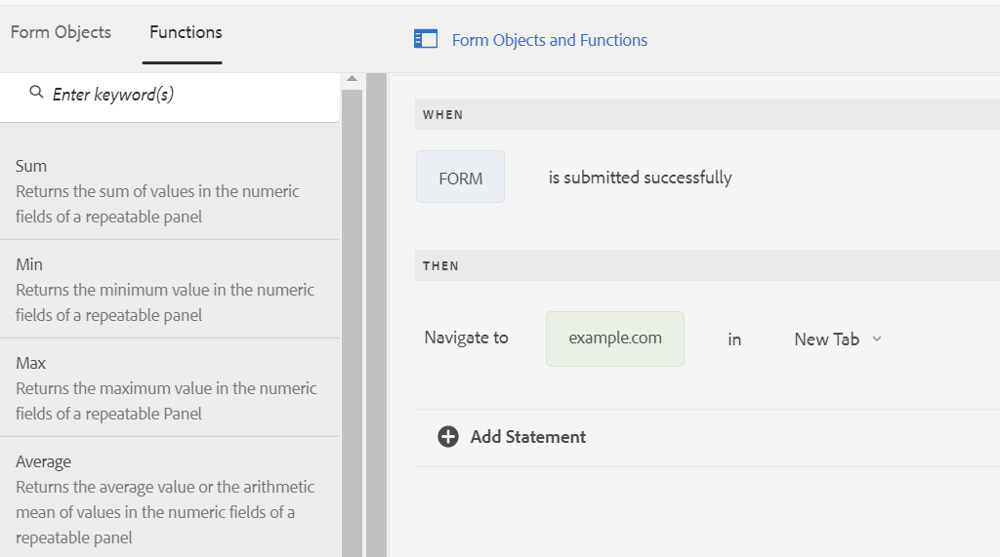

# AEM Adaptive Forms의 비동기 제출 구성 {#asynchronous-submission-of-adaptive-forms}


| 버전 | 문서 링크 |
| -------- | ---------------------------- |
| AEM 6.5 | [여기 클릭](https://experienceleague.adobe.com/docs/experience-manager-65/forms/adaptive-forms-advanced-authoring/asynchronous-submissions-adaptive-forms.html) |
| AEM as a Cloud Service | 이 문서 |


일반적으로 웹 양식은 동기식으로 제출하도록 구성됩니다. 동기 제출의 경우 사용자가 양식을 제출하면 승인 페이지, 감사 페이지 또는 제출 실패 시 오류 페이지로 리디렉션됩니다. 하지만 백그라운드에서 클라이언트-서버 상호 작용이 발생하는 동안 웹 페이지가 정적인 단일 페이지 애플리케이션과 같은 최신 웹 경험은 인기를 얻고 있습니다. 비동기 제출을 구성하여 적응형 Forms에서 이 경험을 제공할 수 있습니다.

비동기 제출의 경우, 사용자가 양식을 제출할 때 양식 개발자는 다른 양식 또는 웹 사이트의 별도 섹션으로 리디렉션하는 것과 같은 별도의 경험을 플러그인합니다. 작성자는 또한 데이터를 다른 데이터 저장소에 보내거나 사용자 지정 분석 엔진을 추가하는 것과 같은 별도의 서비스를 플러그인할 수 있습니다. 비동기 제출의 경우, 제출된 양식 데이터가 서버에서 유효성이 검사될 때 양식이 다시 로드되지 않거나 해당 URL이 변경되지 않으므로 적응형 양식은 단일 페이지 애플리케이션처럼 동작합니다.

적응형 Forms에서의 비동기 제출에 대한 자세한 내용은 계속 읽으십시오.

## 비동기 제출 구성 {#configure}

적응형 양식에 대한 비동기 제출을 구성하려면 다음 작업을 수행하십시오.

1. 적응형 양식 작성 모드에서 양식 컨테이너 개체를 선택하고 을(를) 선택하여 해당 속성을 엽니다.
1. **[!UICONTROL 제출]** 속성 섹션에서 **[!UICONTROL 비동기 제출 사용]**&#x200B;을 사용하도록 설정합니다.
1. **[!UICONTROL 제출 시]** 섹션에서 다음 옵션 중 하나를 선택하여 양식 제출을 성공적으로 수행합니다.

   * **[!UICONTROL URL로 리디렉션]**: 양식을 제출할 때 지정된 URL 또는 페이지로 리디렉션합니다. URL을 지정하거나 **[!UICONTROL 리디렉션 URL/경로]** 필드에서 페이지의 경로를 찾아 선택할 수 있습니다.
   * **[!UICONTROL 메시지 표시]**: 양식 제출 시 메시지를 표시합니다. **[!UICONTROL 메시지 표시]** 옵션 아래의 텍스트 필드에 메시지를 작성할 수 있습니다. 텍스트 필드는 서식 있는 텍스트 서식을 지원합니다.

1. 속성을 저장하려면 을 선택합니다.

## 비동기 제출 작동 방식 {#how-asynchronous-submission-works}

[!DNL Experience Manager Forms]은(는) 양식 제출을 위한 기본 성공 및 오류 처리기를 제공합니다. 핸들러는 서버 응답을 기반으로 실행되는 클라이언트측 함수입니다. 양식을 제출하면 유효성 검사를 위해 데이터가 서버로 전송되며, 이 서버는 제출에 대한 성공 또는 오류 이벤트에 대한 정보와 함께 응답을 클라이언트에 반환합니다. 정보는 관련 핸들러에 매개 변수로 전달되어 함수를 실행합니다.

또한 양식 작성자와 개발자는 양식 수준에서 규칙을 작성하여 기본 핸들러를 재정의할 수 있습니다. 자세한 내용은 [규칙을 사용하여 기본 처리기 재정의](#custom)를 참조하십시오.

먼저 성공 및 오류 이벤트에 대한 서버 응답을 검토하겠습니다.

### 제출 성공 이벤트에 대한 서버 응답 {#server-response-for-submission-success-event}

제출 성공 이벤트에 대한 서버 응답 구조는 다음과 같습니다.

```json
{oneOf: [
{  properties : {
     contentType : {"type" : "string",  "enum" : ["xmlschema", "jsonschema"]},
    data : {type : "string", description : "Form data in XML or  JSON  format"},
   thankYouOption : {type : "string"}
   }},
  properties : {
     contentType : {"type" : "string",  "enum" : ["xmlschema", "jsonschema"]},
    data : {type : "string", description : "Form data in XML or  JSON  format"},
   thankYouContent: {type: "string"}
   }
]

}
```

양식 제출이 성공적으로 수행된 경우의 서버 응답은 다음과 같습니다.

* 양식 데이터 형식 유형: XML 또는 JSON
* XML 또는 JSON 형식의 양식 데이터
* 양식에서 구성한 대로 페이지로 리디렉션하거나 메시지를 표시하는 옵션 선택됨
* 양식에 구성된 페이지 URL 또는 메시지 콘텐츠

성공 핸들러가 서버 응답을 읽고 이에 따라 구성된 페이지 URL로 리디렉션되거나 메시지가 표시됩니다.

### 제출 오류 이벤트에 대한 서버 응답 {#server-response-for-submission-error-event}

제출 오류 이벤트에 대한 서버 응답 구조는 다음과 같습니다.

```json
{
   errorCausedBy : "<CAPTCHA_VALIDATION or SERVER_SIDE_VALIDATION>",

   errors : [
               { "somExpression" : "<SOM Expression>",
                 "errorMessage"  : "<Error Message>"
               },
               ...
             ]
 }
```

양식 제출에 오류가 있는 경우의 서버 응답은 다음과 같습니다.

* 오류 원인, CAPTCHA 또는 서버측 유효성 검사 실패
* 유효성 검사에 실패한 필드의 SOM 표현식 및 해당 오류 메시지가 포함된 오류 개체 목록

오류 처리기는 서버 응답을 읽고 이에 따라 양식에 오류 메시지를 표시합니다.

## 규칙을 사용하여 기본 처리기 재정의 {#custom}

양식 개발자와 작성자는 양식 수준에서 규칙을 작성하여 기본 처리기를 재정의할 수 있습니다. 성공 및 오류 이벤트에 대한 서버 응답은 개발자가 규칙의 `$event.data`을(를) 사용하여 액세스할 수 있는 양식 수준에서 노출됩니다.

성공 및 오류 이벤트를 처리하는 규칙을 작성하려면 다음 단계를 수행하십시오.

1. 작성 모드에서 적응형 양식을 열고 양식 개체를 선택한 다음 을(를) 선택하여 규칙 편집기를 엽니다.
1. 양식 개체 트리에서 **[!UICONTROL 양식]**&#x200B;을(를) 선택하고 **[!UICONTROL 만들기]**&#x200B;를 선택합니다.
1. **[!UICONTROL 상태 선택]** 드롭다운 목록에서 **[!UICONTROL 이(가) 제출되었습니다]** 또는 **[!UICONTROL 제출이 실패했습니다]**.
1. 선택한 상태에 대해 **[!UICONTROL Then]** 동작을 정의합니다. 예를들어 **[!UICONTROL 다음으로 이동]**&#x200B;을 선택한 다음 URL을 입력하거나 붙여 넣습니다. **[!UICONTROL 함수]** 탭을 사용하여 모든 함수를 규칙으로 드래그할 수도 있습니다.

   

1. **[!UICONTROL 완료]**&#x200B;를 선택하여 규칙을 저장합니다.