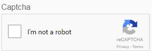

# 적응형 Forms에서 CAPTCHA 사용{#using-captcha-in-adaptive-forms}

| 버전 | 문서 링크 | | -------- | ---------------------------- | | AEM 6.5 |    [여기를 클릭하십시오.](https://experienceleague.adobe.com/docs/experience-manager-65/forms/adaptive-forms-basic-authoring/captcha-adaptive-forms.html)                  | | AEM AS A CLOUD SERVICE | 이 문서 |
=======

<span class="preview"> Adobe은 현대적이고 확장 가능한 데이터 캡처를 사용할 것을 권장합니다 [핵심 구성 요소](https://experienceleague.adobe.com/docs/experience-manager-core-components/using/adaptive-forms/introduction.html) 대상 [새 적응형 Forms 만들기](/help/forms/creating-adaptive-form-core-components.md) 또는 [AEM Sites 페이지에 적응형 Forms 추가](/help/forms/create-or-add-an-adaptive-form-to-aem-sites-page.md). 이러한 구성 요소는 적응형 Forms 작성의 중요한 발전을 나타내어 인상적인 사용자 경험을 보장합니다. 이 문서에서는 기초 구성 요소를 사용하여 적응형 Forms을 작성하는 이전 방법에 대해 설명합니다. </span>


CAPTCHA(Complete Automated Public Turning test to tell Computers and Humans Apart)는 온라인 거래에서 일반적으로 사용되는 프로그램으로 인간과 자동화된 프로그램 또는 봇을 구별합니다. 문제를 제기하고 사용자 응답을 평가하여 사이트와 상호 작용하는 사람인지 보트인지를 확인합니다. 테스트 실패 시 사용자가 진행할 수 없도록 하고 봇이 스팸이나 악의적인 목적을 게시하지 않도록 해 온라인 거래를 안전하게 만드는 데 도움을 준다.

[!DNL AEM Forms] 는 적응형 Forms에서 CAPTCHA를 지원합니다. Google의 reCAPTCHA 서비스를 사용하여 CAPTCHA를 구현할 수 있습니다.

>[!NOTE]
>
>* [!DNL AEM Forms] reCaptcha v2만 지원합니다. 다른 버전은 지원되지 않습니다.
>* 적응형 Forms의 CAPTCHA는의 오프라인 모드에서 지원되지 않습니다. [!DNL AEM Forms] 앱.
>

## Google에서 reCAPTCHA 서비스 구성 {#google-reCAPTCHA}

양식 작성자는 Google의 reCAPTCHA 서비스를 사용하여 적응형 Forms에서 CAPTCHA를 구현할 수 있습니다. 사이트를 보호하기 위한 고급 CAPTCHA 기능을 제공합니다. reCAPTCHA 작동 방식에 대한 자세한 내용은 [Google recaptcha](https://developers.google.com/recaptcha/).



에서 reCAPTCHA 서비스를 구현하려면 [!DNL AEM Forms]:

1. 획득 [reCAPTCHA API 키 쌍](https://www.google.com/recaptcha/admin) Google에서. 여기에는 사이트 키 및 비밀이 포함되어 있습니다.
1. 클라우드 서비스에 대한 구성 컨테이너를 만듭니다.

   1. 다음으로 이동 **[!UICONTROL 도구 > 일반 > 구성 브라우저]**.
      * 다음을 참조하십시오. [구성 브라우저](https://experienceleague.adobe.com/docs/experience-manager-65/administering/introduction/configurations.html?lang=en#introduction) 설명서 를 참조하십시오.
   1. 클라우드 구성에 대한 전역 폴더를 활성화하려면 다음을 수행하거나 클라우드 서비스 구성에 대한 다른 폴더를 만들고 구성하려면 이 단계를 건너뜁니다.

      1. 구성 브라우저에서 **[!UICONTROL 글로벌]** 폴더 및 탭 **[!UICONTROL 속성]**.

      1. 구성 속성 대화 상자에서 다음을 활성화합니다 **[!UICONTROL 클라우드 구성]**.
      1. 누르기 **[!UICONTROL 저장 및 닫기]** 구성을 저장하고 대화 상자를 종료합니다.

   1. 구성 브라우저에서 **[!UICONTROL 만들기]**.
   1. 구성 만들기 대화 상자에서 폴더의 제목을 지정하고 을 활성화합니다 **[!UICONTROL 클라우드 구성]**.
   1. 누르기 **[!UICONTROL 만들기]** 을 클릭하여 클라우드 서비스 구성에 대해 활성화된 폴더를 만듭니다.

1. reCAPTCHA에 대한 클라우드 서비스를 구성합니다.

   1. Experience Manager 작성자 인스턴스에서  > **[!UICONTROL Cloud Services]**.
   1. 누르기 **[!UICONTROL reCAPT차]**. Configurations 페이지가 열립니다. 이전 단계에서 만든 구성 컨테이너를 선택하고 을 누릅니다 **[!UICONTROL 만들기]**.
   1. reCAPTCHA 서비스에 대한 이름, 사이트 키 및 비밀 키를 지정하고 을 누릅니다 **[!UICONTROL 만들기]** 을 클릭하여 클라우드 서비스 구성을 생성합니다.
   1. 구성 요소 편집 대화 상자에서 1단계에서 얻은 사이트 및 비밀 키를 지정합니다. 누르기 **[!UICONTROL 설정 저장]** 그런 다음 을 누릅니다 **[!UICONTROL 확인]** 구성을 완료합니다.

   reCAPTCHA 서비스가 구성되면 적응형 Forms에서 사용할 수 있습니다. 자세한 내용은 [적응형 Forms에서 CAPTCHA 사용](#using-captcha).

## 적응형 Forms에서 CAPTCHA 사용 {#using-captcha}

적응형 Forms에서 CAPTCHA를 사용하려면

1. 편집 모드에서 적응형 양식을 엽니다.

   >[!NOTE]
   >
   > 적응형 양식을 만들 때 선택한 구성 컨테이너에 reCAPTCHA 클라우드 서비스가 포함되어 있는지 확인합니다. 적응형 양식 속성을 편집하여 양식과 연결된 구성 컨테이너를 변경할 수도 있습니다.

1. 구성 요소 브라우저에서 **[!UICONTROL Captcha]** 구성 요소를 적응형 양식에 추가합니다.

   >[!NOTE]
   >
   > * 적응형 양식에서 Captcha 구성 요소를 두 개 이상 사용하는 것은 지원되지 않습니다. 또한 소극적 로드로 표시된 패널 또는 조각에서는 CAPTCHA를 사용하지 않는 것이 좋습니다.
   > * Captcha는 시간에 민감하며 약 1분 후에 만료됩니다. 따라서 적응형 양식에서 Captcha 구성 요소를 제출 단추 바로 앞에 배치하는 것이 좋습니다.

1. 추가한 Captcha 구성 요소를 선택하고 을 누릅니다  속성을 편집합니다.
1. CAPTCHA 위젯의 제목을 지정합니다. 기본값은 입니다. **[!UICONTROL Captcha]**. 선택 **[!UICONTROL 제목 숨기기]** 제목을 표시하지 않으려는 경우
1. 다음에서 **[!UICONTROL Captcha 서비스]** 드롭다운, 선택 **[!UICONTROL reCAPT차]** 에 설명된 대로 구성한 경우 reCAPTCHA 서비스를 활성화하려면 다음을 수행하십시오 [Google의 reCAPTCHA 서비스](#google-reCAPTCHA). 설정 드롭다운에서 구성을 선택합니다.
1. 다음으로 유형 선택 **[!UICONTROL 기본]** 또는 **[!UICONTROL 콤팩트]** reCAPTCHA 위젯용 다음을 선택할 수도 있습니다. **[!UICONTROL 숨김]** 의심되는 활동이 있는 경우에만 CAPTCHA 문제를 표시하는 옵션입니다. 아래에 표시된 reCAPTCHA로 보호된 배지는 보호된 양식에 표시됩니다.

   

   >[!NOTE]
   >
   > 선택 안 함 **[!UICONTROL 기본값]** 기본 Experience Manager CAPTCHA 서비스가 더 이상 사용되지 않으므로 CAPTCHA 서비스 드롭다운에서 을 사용하십시오.

1. 속성을 저장합니다.

reCAPTCHA 서비스가 적응형 양식에서 활성화됩니다. 양식을 미리 보고 CAPTCHA가 작동하는 것을 볼 수 있습니다.

### 규칙에 따라 CAPTCHA 구성 요소 표시 또는 숨기기 {#show-hide-captcha}

적응형 양식의 구성 요소에 적용하는 규칙에 따라 CAPTCHA 구성 요소를 표시하거나 숨기도록 선택할 수 있습니다. 구성 요소를 탭하고 을 선택합니다. , 및 탭 **[!UICONTROL 만들기]** 을 클릭하여 규칙을 만듭니다. 규칙 만들기에 대한 자세한 내용은 [규칙 편집기](rule-editor.md).

예를 들어 CAPTCHA 구성 요소는 양식의 통화 값 필드에 25000보다 큰 값이 있는 경우에만 적응형 양식에 표시해야 합니다.

탭 **[!UICONTROL 통화 값]** 양식에 필드를 입력하고 다음 규칙을 만듭니다.


>[!NOTE]
>
> reCAPTCHA v2 구성을 선택하고 크기를 로 설정하면 [!UICONTROL 숨김], 표시/숨기기 옵션은 비활성화 상태로 유지됩니다.

### CAPTCHA 유효성 검사 {#validate-captcha}

양식을 제출하거나 사용자 작업 및 조건에 대한 CAPTCHA 유효성 검사의 기초가 될 때 적응형 양식에서 CAPTCHA의 유효성을 검사할 수 있습니다.

#### 양식 제출 시 CAPTCHA 유효성 검사 {#validation-form-submission}

적응형 양식을 제출할 때 CAPTCHA의 유효성을 자동으로 검사하려면 다음 작업을 수행하십시오.

1. CAPTCHA 구성 요소를 탭하고 을 선택합니다  구성 요소 속성을 봅니다.
1. 다음에서 **[!UICONTROL CAPTCHA 유효성 검사]** 섹션, 선택 **[!UICONTROL 양식 제출 시 CAPTCHA 유효성 검사]**.
1. 누르기  구성 요소 속성을 저장합니다.

#### 사용자 작업 및 조건에 대한 CAPTCHA 유효성 검사 {#validate-captcha-user-action}

조건 및 사용자 작업을 기반으로 CAPTCHA의 유효성을 검사하려면 다음을 수행하십시오.

1. CAPTCHA 구성 요소를 탭하고 을 선택합니다  구성 요소 속성을 봅니다.
1. 다음에서 **[!UICONTROL CAPTCHA 유효성 검사]** 섹션, 선택 **[!UICONTROL 사용자 작업에 대한 CAPTCHA 유효성 검사]**.
1. 누르기  구성 요소 속성을 저장합니다.

[!DNL Experience Manager Forms] 다음을 제공합니다 `ValidateCAPTCHA` 사전 정의된 조건을 사용하여 CAPTCHA의 유효성을 검사하기 위한 API입니다. 사용자 지정 제출 액션을 사용하거나 적응형 양식의 구성 요소에 대한 규칙을 정의하여 API를 호출할 수 있습니다.

다음은 의 예입니다 `ValidateCAPTCHA` 사전 정의된 조건을 사용하여 CAPTCHA의 유효성을 검사하기 위한 API:

```javascript
if (slingRequest.getParameter("numericbox1614079614831").length() >= 5) {
     GuideCaptchaValidatorProvider apiProvider = sling.getService(GuideCaptchaValidatorProvider.class);
        String formPath = slingRequest.getResource().getPath();
        String captchaData = slingRequest.getParameter(GuideConstants.GUIDE_CAPTCHA_DATA);
        if (!apiProvider.validateCAPTCHA(formPath, captchaData).isCaptchaValid()){
            response.setStatus(400);
            return;
        }
    }
```

이 예제는 `ValidateCAPTCHA` API는 양식을 작성하는 동안 사용자가 지정한 숫자 상자의 자릿수가 5보다 큰 경우에만 양식에서 CAPTCHA를 확인합니다.

**옵션 1: 사용 [!DNL Experience Manager Forms] 사용자 지정 제출 액션을 사용하여 CAPTCHA의 유효성을 검사하기 위한 CAPTCHA API**

다음 단계를 수행하여 을 사용합니다. `ValidateCAPTCHA` 사용자 지정 제출 액션을 사용하여 CAPTCHA의 유효성을 검사하기 위한 API:

1. 다음을 포함하는 스크립트 추가 `ValidateCAPTCHA` 사용자 지정 제출 액션에 대한 API입니다. 사용자 지정 제출 액션에 대한 자세한 내용은 [적응형 Forms에 대한 사용자 지정 제출 액션 만들기](custom-submit-action-form.md).
1. 에서 사용자 지정 제출 액션의 이름을 선택합니다. **[!UICONTROL 제출 액션]** 드롭다운 목록 **[!UICONTROL 제출]** 적응형 양식의 속성입니다.
1. 누르기 **[!UICONTROL 제출]**. CAPTCHA는에 정의된 조건을 기반으로 유효성이 검사됩니다. `ValidateCAPTCHA` 사용자 지정 제출 액션의 API입니다.

**옵션 2: 사용 [!DNL Experience Manager Forms] 양식을 제출하기 전에 사용자 작업에서 CAPTCHA의 유효성을 검사하기 위한 CAPTCHA API 확인**

을 호출할 수도 있습니다. `ValidateCAPTCHA` 적응형 양식의 구성 요소에 규칙을 적용하여 만든 API.

예를 들어 **[!UICONTROL CAPTCHA 유효성 검사]** 를 클릭하고, 단추를 클릭할 때 서비스를 호출하는 규칙을 만듭니다.

다음 그림은 를 클릭할 때 서비스를 호출하는 방법을 보여 줍니다. **[!UICONTROL CAPTCHA 유효성 검사]** 단추:


다음을 포함하는 사용자 정의 서블릿을 호출할 수 있습니다. `ValidateCAPTCHA` 규칙 편집기를 사용하는 API이며, 유효성 검사 결과에 따라 적응형 양식의 제출 단추를 활성화하거나 비활성화합니다.

마찬가지로 규칙 편집기를 사용하여 적응형 양식에서 CAPTCHA의 유효성을 검사하는 사용자 지정 방법을 포함할 수 있습니다.

### 사용자 지정 CAPTCHA 서비스 추가 {#add-custom-captcha-service}

[!DNL Experience Manager Forms] 는 reCAPTCHA를 CAPTCHA 서비스로 제공합니다. 그러나 에 표시할 사용자 지정 서비스를 추가할 수 있습니다. **[!UICONTROL CAPTCHA 서비스]** 드롭다운 목록입니다.

다음은 적응형 양식에 추가 CAPTCHA 서비스를 추가하는 인터페이스의 샘플 구현입니다.

```javascript
package com.adobe.aemds.guide.service;

import org.osgi.annotation.versioning.ConsumerType;

/**
 * An interface to provide captcha validation at server side in Adaptive Form
 * This interface can be used to provide custom implementation for different captcha services.
 */
@ConsumerType
public interface GuideCaptchaValidator {
    /**
     * This method should define the actual validation logic of the captcha
     * @param captchaPropertyNodePath path to the node with CAPTCHA configurations inside form container
     * @param userResponseToken  The user response token provided by the CAPTCHA from client-side
     *
     * @return  {@link GuideCaptchaValidationResult} validation result of the captcha
     */
     GuideCaptchaValidationResult validateCaptcha(String captchaPropertyNodePath, String userResponseToken);

    /**
     * Returns the name of the captcha validator. This should be unique among the different implementations
     * @return  name of the captcha validator
     */
     String getCaptchaValidatorName();
}
```

`captchaPropertyNodePath` 는 Sling 저장소에 있는 CAPTCHA 구성 요소의 리소스 경로를 나타냅니다. 이 속성을 사용하여 CAPTCHA 구성 요소와 관련된 세부 사항을 포함합니다. 예를 들어, `captchaPropertyNodePath` 에는 CAPTCHA 구성 요소에 구성된 reCAPTCHA 클라우드 구성에 대한 정보가 포함되어 있습니다. 클라우드 구성 정보는 다음을 제공합니다 **[!UICONTROL 사이트 키]** 및 **[!UICONTROL 비밀 키]** reCAPTCHA 서비스 구현 설정.

`userResponseToken` 은(는) `g_recaptcha_response` 폼에서 CAPTCHA를 푼 후에 생성됩니다.

### reCAPTCHA 서비스 도메인 편집 {#reCAPTCHA-service-domain}

reCAPTCHA 서비스는 `https://www.recaptcha.net/` 을 기본 도메인으로 설정합니다. 설정할 설정을 수정할 수 있습니다 `https://www.google.com/` 또는 reCAPTCHA 서비스 로드, 렌더링 및 유효성 검사를 위한 사용자 지정 도메인 이름입니다.

설정 **[!UICONTROL af.cloudservices.recaptcha.domain]** 의 속성 **[!UICONTROL 적응형 양식 및 대화형 통신 웹 채널 구성]** 지정할 구성 `https://www.google.com/` 또는 기타 모든 사용자 정의 도메인 이름. 다음 JSON 파일에는 샘플이 표시됩니다.

```json
{
  "af.cloudservices.recaptcha.domain": "https://www.google.com/"
}
```

구성의 값을 설정하려면 [AEM SDK를 사용해 OSGi 구성을 생성](https://experienceleague.adobe.com/docs/experience-manager-cloud-service/implementing/deploying/configuring-osgi.html?lang=en#generating-osgi-configurations-using-the-aem-sdk-quickstart)하고 Cloud Service 인스턴스에 [구성을 배포](https://experienceleague.adobe.com/docs/experience-manager-cloud-service/implementing/using-cloud-manager/deploy-code.html?lang=en#deployment-process)하십시오.
