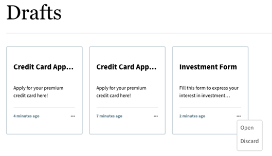

# 포털에 적응형 Forms 나열 {#publish-forms-on-portal}

일반적인 양식 중심의 포털 배포 시나리오에서 양식 개발 및 포털 개발은 두 가지 단절 활동입니다. 양식 디자이너는 리포지토리에서 양식을 디자인하고 저장하는 동안 웹 개발자는 양식을 나열하고 양식 제출을 처리하는 웹 응용 프로그램을 만듭니다. 양식 저장소와 웹 애플리케이션 간에 통신이 없으므로 Forms이 웹 계층에 복사됩니다.

이러한 시나리오는 종종 관리 문제와 생산 지연을 초래합니다. 예를 들어 저장소에서 최신 버전의 양식을 사용할 수 있는 경우 웹 계층에서 양식을 바꾸고 웹 애플리케이션을 수정한 다음 공개 사이트에서 양식을 재배포해야 합니다. 웹 애플리케이션을 다시 배포하면 일부 서버 다운타임이 발생할 수 있습니다. 일반적으로 서버 다운타임은 계획된 작업이므로 변경 사항을 즉시 공개 사이트로 푸시할 수 없습니다.

AEM Forms은 관리 오버헤드와 프로덕션 지연을 줄이는 포털 구성 요소를 제공합니다. 구성 요소를 사용하면 웹 개발자가 Adobe Experience Manager(AEM)를 사용하여 작성된 웹 사이트에서 Forms 포털을 만들고 사용자 지정할 수 있습니다.

Form Portal 구성 요소를 사용하여 다음 기능을 추가할 수 있습니다.

* 사용자 지정된 레이아웃의 목록 양식입니다. 기본적으로 목록 보기 및 카드 보기 레이아웃이 제공됩니다. 자신만의 사용자 지정 레이아웃을 만들 수 있습니다.
* 목록을 작성하는 동안 사용자 지정 메타데이터 및 사용자 지정 작업을 표시할 수 있습니다.
* AEM Forms Portal 구성 요소가 사용 중인 게시 인스턴스에 Forms UI에서 게시한 목록 양식입니다.
* 최종 사용자가 양식을 HTML 및 PDF 형식으로 렌더링할 수 있도록 허용합니다.
* 제목 및 설명을 기반으로 양식 검색을 활성화합니다.
* 사용자 지정 CSS를 사용하여 포털의 모양과 느낌을 사용자 지정합니다.
* 양식에 대한 링크를 만듭니다.
* 최종 사용자가 만든 적응형 Forms 관련 초안 및 제출 사항을 나열합니다.

## Forms 포털 페이지의 구성 요소 {#forms-portal-components}

AEM Forms은 다음과 같은 포털 구성 요소를 즉시 제공합니다.

* 검색 및 목록: 이 구성 요소를 사용하면 양식 저장소에서 포털 페이지로 양식을 나열할 수 있고 지정된 기준에 따라 양식을 나열하는 구성 옵션을 제공할 수 있습니다.

* 초안 및 제출: 검색 및 목록 구성 요소에는 Forms 작성자가 공개한 양식이 표시되지만 초안 및 제출 구성 요소에는 이후 및 제출된 양식을 완료하기 위해 초안으로 저장된 양식이 표시됩니다. 이 구성 요소는 로그인한 사용자에게 개인화된 경험을 제공합니다.

* 링크: 이 구성 요소를 사용하여 페이지의 어디에서든 양식에 대한 링크를 만들 수 있습니다.

다음을 수행할 수 있습니다. [즉시 사용 가능한 Forms 포털 구성 요소 가져오기](#import-forms-portal-components-aem-archetype) AEM Project Archetype. 가져온 후 다음 구성을 수행합니다.
* [외부 스토리지 구성](#configure-azure-storage-adaptive-forms)
* [Forms 포털 구성 요소 활성화](#enable-forms-portal-components)
* [Forms 포털 구성 요소 구성](#configure-forms-portal-components)

## Forms 포털 구성 요소 가져오기 {#import-forms-portal-components-aem-archetype}

AEM Forms as a Cloud Service에서 즉시 사용 가능한 Forms 포털 구성 요소를 가져오려면 다음 단계를 수행하십시오.

1. **로컬 개발 인스턴스에서 Cloud Manager Git 저장소를 복제합니다.**  Cloud Manager Git 저장소에는 기본 AEM 프로젝트가 포함되어 있습니다. 다음을 기반으로 합니다. [AEM Archetype](https://github.com/adobe/aem-project-archetype/). Cloud Manager UI의 셀프서비스 Git 계정 관리를 사용하여 Cloud Manager Git 저장소를 복제하여 로컬 개발 환경에서 프로젝트를 가져옵니다. 저장소 액세스에 대한 자세한 내용은 [저장소 액세스](https://experienceleague.adobe.com/docs/experience-manager-cloud-manager/using/managing-code/accessing-repos.html).

1. **만들기 [!DNL Experience Manager Forms] as a [Cloud Service] 프로젝트:** 만들기 [!DNL Experience Manager Forms] as a [Cloud Service] 프로젝트 기준 [AEM Archetype 27](https://github.com/adobe/aem-project-archetype/releases/tag/aem-project-archetype-27) 나중에 Archetype을 통해 개발자는 [!DNL AEM Forms] as a Cloud Service. 또한 빠르게 시작하는 데 도움이 되는 몇 가지 샘플 테마 및 템플릿이 포함되어 있습니다.

   만들려면 [!DNL Experience Manager Forms] as a Cloud Service 프로젝트입니다. 명령 프롬프트를 열고 아래 명령을 실행하십시오. 포함할 항목 [!DNL Forms] 특정 구성, 테마 및 템플릿, 설정 `includeForms=y`.

   ```shell
   mvn -B archetype:generate -DarchetypeGroupId=com.adobe.aem -DarchetypeArtifactId=aem-project-archetype -DarchetypeVersion=30 -DaemVersion="cloud" -DappTitle="My Site" -DappId="mysite" -DgroupId="com.mysite" -DincludeForms="y"
   ```

   또한, 변경 `appTitle`, `appId`, 및 `groupId`를 입력하여 위의 명령을 사용할 수 있습니다.

   프로젝트가 준비되면 `<core.forms.components.version>x.y.z</core.forms.components.version>` 최상위 수준의 속성 `pom.xml` 최신 버전의 를 반영하는 Archetype 프로젝트 [core-forms-components](https://github.com/adobe/aem-core-forms-components) (으)로 `AEM Archetype` 프로젝트.

1. **프로젝트를 로컬 개발 환경에 배포합니다.** 다음 명령을 사용하여 로컬 개발 환경에 배포할 수 있습니다

   `mvn -PautoInstallPackage clean install`

   전체 명령 목록은 다음을 참조하십시오 [빌드 및 설치](https://experienceleague.adobe.com/docs/experience-manager-core-components/using/developing/archetype/using.html?lang=en#building-and-installing)

1. [에 코드 배포 [!DNL AEM Forms] as a Cloud Service 환경](https://experienceleague.adobe.com/docs/experience-manager-cloud-service/content/implementing/developing/aem-project-content-package-structure.html#embeddeds).


## 적응형 Forms을 위한 Azure 스토리지 구성 {#configure-azure-storage-adaptive-forms}

[[!DNL Experience Manager Forms] 데이터 통합](data-integration.md) 다음을 제공합니다 [!DNL Azure] 양식을 와 통합하기 위한 스토리지 구성 [!DNL Azure] 스토리지 서비스. 양식 데이터 모델을 사용하여 와 상호 작용하는 적응형 Forms을 만들 수 있습니다 [!DNL Azure] 비즈니스 워크플로를 활성화하는 서버입니다.

### 스토리지 구성 경로 {#create-azure-storage-configuration}

이러한 단계를 실행하기 전에 Azure 스토리지 계정과 액세스 키가 있고에 대한 액세스 권한을 부여했는지 확인하십시오. [!DNL Azure] 저장소 계정입니다.

1. 다음으로 이동 **[!UICONTROL 도구]** > **[!UICONTROL Cloud Services]** > **[!UICONTROL Azure 스토리지]**.
1. 구성을 만들 폴더를 선택하고 을 누릅니다 **[!UICONTROL 만들기]**.
1. 에서 구성의 제목을 지정합니다. **[!UICONTROL 제목]** 필드.
1. 의 이름을 지정합니다. [!DNL Azure] 의 저장소 계정 **[!UICONTROL Azure 스토리지 계정]** 필드.

### Forms 포털용 통합 스토리지 커넥터 구성 {#configure-usc-forms-portal}

AEM Workflow용 통합 스토리지 커넥터를 구성하려면 다음 단계를 수행하십시오.

1. 다음으로 이동 **[!UICONTROL 도구]** > **[!UICONTROL Forms]** > **[!UICONTROL 통합 스토리지 커넥터]**.
1. 다음에서 **[!UICONTROL Forms 포털]** 섹션, 선택 **[!UICONTROL Azure]** 다음에서 **[!UICONTROL 스토리지]** 드롭다운 목록입니다.
1. 다음을 지정합니다. [azure 스토리지 구성에 대한 구성 경로](#create-azure-storage-configuration) 다음에서 **[!UICONTROL 스토리지 구성 경로]** 필드.
1. 누르기 **[!UICONTROL 게시]** 그런 다음 을 누릅니다 **[!UICONTROL 저장]** 구성을 저장합니다.

## Forms 포털 구성 요소 활성화 {#enable-forms-portal-components}

Adobe Experience Manager(AEM) 사이트에서 핵심 구성 요소(기본 포털 구성 요소 포함)를 사용하려면 프록시 구성 요소를 만들어 사이트에 맞게 활성화해야 합니다. 프록시 구성 요소를 만들고 포털 구성 요소를 활성화하려면 다음을 참조하십시오. [핵심 구성 요소 사용](https://experienceleague.adobe.com/docs/experience-manager-core-components/using/get-started/using.html?lang=en#create-proxy-components).

포털 구성 요소가 활성화되면 사이트 페이지의 작성자 인스턴스에서 사용할 수 있습니다.

## Forms 포털 구성 요소 추가 및 구성 {#configure-forms-portal-components}

포털 구성 요소를 추가 및 구성하여 AEM을 사용하여 작성된 웹 사이트에서 Forms 포털을 만들고 사용자 지정할 수 있습니다. 다음을 확인합니다. [구성 요소가 활성화되었습니다.](#enable-forms-portal-components) Forms 포털에서 사용하기 전에.

구성 요소를 추가하려면 구성 요소 창에서 페이지의 레이아웃 컨테이너로 구성 요소를 드래그 앤 드롭하거나 레이아웃 컨테이너에서 추가 아이콘을 탭하고 [!UICONTROL 새 구성 요소 삽입] 대화 상자.

### 초안 및 제출 구성 요소 구성 {#configure-drafts-submissions-component}

초안 및 제출 구성 요소에는 나중에 제출한 양식을 완료하기 위해 초안으로 저장된 양식이 표시됩니다. 구성하려면 구성 요소를 탭한 다음 을 탭합니다 . 다음에서 [!UICONTROL 초안 및 제출] 대화 상자에서 초안 또는 제출된 양식으로 양식 목록을 표시하는 제목을 지정합니다. 구성 요소에 초안 양식이나 제출된 양식을 카드 또는 목록 형식으로 나열할지 여부도 선택합니다.




### 검색 및 목록 구성 요소 구성 {#configure-search-lister-component}

검색 및 목록 구성 요소는 페이지에 적응형 양식을 나열하고 나열된 양식에 검색을 구현하는 데 사용됩니다.


구성하려면 구성 요소를 탭한 다음 을 탭합니다 . 다음 [!UICONTROL 검색 및 목록 작성자] 대화 상자가 열립니다.

1. 다음에서 [!UICONTROL 표시] 탭에서 다음을 구성합니다.
   * 위치 **[!UICONTROL 제목]**, 검색 및 목록 구성 요소의 제목을 지정합니다. 직설적인 제목을 사용하면 양식 목록에서 빠른 검색을 수행할 수 있습니다.
   * 다음에서 **[!UICONTROL 레이아웃]** 목록에서 카드 또는 목록 형식으로 양식을 나타내는 레이아웃을 선택합니다.
   * 선택 **[!UICONTROL 검색 숨기기]** 및 **[!UICONTROL 정렬 숨기기]** 검색 및 정렬 기준 기능을 숨깁니다.
   * 위치 **[!UICONTROL 툴팁]**&#x200B;를 클릭하고 구성 요소를 마우스로 가리키면 표시되는 툴팁을 제공합니다.
1. 다음에서 [!UICONTROL 자산 폴더] 탭에서 양식을 가져와서 페이지에 나열하는 위치를 지정합니다. 여러 폴더 위치를 구성할 수 있습니다.
1. 다음에서 [!UICONTROL 결과] 탭에서 페이지당 표시할 최대 양식 수를 구성합니다. 기본값은 페이지당 8개의 양식입니다.

### 링크 구성 요소 구성 {#configure-link-component}

링크 구성 요소를 사용하여 페이지에서 적응형 양식에 대한 링크를 제공할 수 있습니다. 구성하려면 구성 요소를 탭한 다음 을 탭합니다 . 다음 [!UICONTROL 링크 구성 요소 편집] 대화 상자가 열립니다.

1. 다음에서 [!UICONTROL 표시] 탭에서 링크가 나타내는 양식을 쉽게 식별할 수 있도록 링크 캡션 및 도구 설명을 제공합니다.
1. 다음에서 [!UICONTROL 자산 정보] 탭에서 에셋이 저장되는 저장소 경로를 지정합니다.
1. 다음에서 [!UICONTROL 쿼리 매개 변수] 탭에서 키-값 쌍 형식으로 추가 매개변수를 지정합니다. 링크를 클릭하면 이러한 추가 매개 변수가 양식과 함께 전달됩니다.

## Adobe Sign을 사용하여 비동기 양식 제출 구성 {#configure-asynchronous-form-submission-using-adobe-sign}

모든 수신자가 서명식을 완료한 경우에만 적응형 양식을 제출하도록 구성할 수 있습니다. Adobe Sign을 사용하여 설정을 구성하려면 아래 단계를 따르십시오.

1. 작성자 인스턴스에서 편집 모드로 적응형 양식을 엽니다.
1. 왼쪽 창에서 속성 아이콘을 탭하고 **[!UICONTROL 전자 서명]** 옵션을 선택합니다.
1. 선택 **[!UICONTROL Adobe Sign 활성화]**. 다양한 구성 옵션이 표시됩니다.
1. 다음에서 [!UICONTROL 양식 제출] 섹션에서 **[!UICONTROL 모든 수신자가 서명식을 완료한 후]** 양식 제출 액션을 구성하는 옵션입니다. 여기서 서명은 모든 수신자에게 먼저 양식이 전송됩니다. 모든 수신자가 양식에 서명하면 양식이 제출됩니다.

## 적응형 Forms을 초안으로 저장 {#save-adaptive-forms-as-drafts}

양식을 나중에 완성하기 위해 초안으로 저장할 수 있습니다. 양식을 초안으로 저장하는 두 가지 방법이 있습니다.
* 양식 구성 요소에 &quot;양식 저장&quot; 규칙(예: 버튼)을 만듭니다. 버튼을 클릭하면 규칙이 트리거되고 양식이 초안으로 저장됩니다.
* 자동 저장 기능을 활성화하십시오. 지정된 이벤트나 구성된 시간 간격 후에 양식을 저장합니다.

### 적응형 양식을 초안으로 저장하는 규칙 만들기 {#rule-to-save-adaptive-form-as-draft}

버튼 등 양식 구성 요소에 &quot;양식 저장&quot; 규칙을 만들려면 아래 단계를 수행합니다.

1. 작성자 인스턴스에서 편집 모드로 적응형 양식을 엽니다.
1. 왼쪽 창에서 을 누릅니다.  을(를) 끌어서 놓습니다. [!UICONTROL 단추] 구성 요소를 양식에 추가합니다.
1. 탭 [!UICONTROL 단추] 구성 요소를 마우스로 가리킨 다음 .
1. 탭 [!UICONTROL 규칙 편집] 아이콘을 클릭하여 규칙 편집기를 엽니다.
1. 누르기 **[!UICONTROL 만들기]** 을 클릭하여 규칙을 구성하고 생성할 수 있습니다.
1. 다음에서 [!UICONTROL 날짜] 섹션에서 &quot;클릭됨&quot;을 선택하고 [!UICONTROL 그러면] 섹션에서 &quot;양식 저장&quot; 옵션을 선택합니다.
1. 누르기 **[!UICONTROL 완료]** 을 눌러 규칙을 저장합니다.

### 자동 저장 사용 {#enable-auto-save}

적응형 양식에 대한 자동 저장 기능을 다음과 같이 구성할 수 있습니다.

1. 작성자 인스턴스에서 편집 모드로 적응형 양식을 엽니다.
1. 왼쪽 창에서  및 확장 [!UICONTROL 자동 저장] 옵션을 선택합니다.
1. 다음 항목 선택 **[!UICONTROL 사용]** 양식의 자동 저장을 활성화하려면 이 확인란을 선택합니다. 다음을 구성할 수 있습니다.
* 기본적으로 [!UICONTROL 적응형 양식 이벤트] 가 &quot;true&quot;로 설정되어 있으면 모든 이벤트 후에 양식이 자동으로 저장됨을 의미합니다.
* 위치 [!UICONTROL 트리거], 이벤트 발생에 따라 또는 특정 시간 간격 후에 자동 저장을 트리거하도록 구성합니다.
