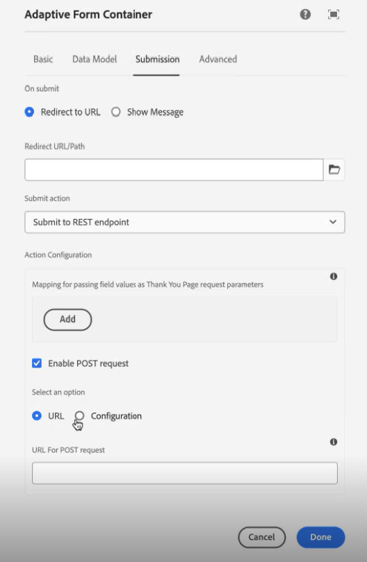

# REST 끝점 제출 작업에 대한 적응형 양식 구성

 구성을 사용하여 REST 끝점을 지정하는 기능은 얼리 어답터 프로그램이며 핵심 구성 요소 및 Edge Delivery Services Forms에만 적용됩니다. 공식 전자 메일 ID로 `aem-forms-ea@adobe.com`에 작성하여 얼리어답터 프로그램에 참여하고 기능에 대한 액세스를 요청할 수 있습니다. 

**[!UICONTROL REST 끝점에 제출]** 작업을 사용하여 제출된 데이터를 REST URL에 게시합니다. URL은 내부 서버(양식이 렌더링되는 서버) 또는 외부 서버일 수 있습니다.

AEM as a Cloud Service에서는 양식 제출을 처리하기 위한 다양한 제출 액션을 제공합니다. [적응형 양식 제출 액션](/help/forms/aem-forms-submit-action.md) 문서에서 이러한 옵션에 대해 자세히 알아볼 수 있습니다.

## 장점

적응형 Forms에 대한 **[!UICONTROL REST 끝점에 제출]** 제출 액션을 구성하는 것의 이점 중 일부는 다음과 같습니다.

* RESTful API를 통해 양식 데이터를 외부 시스템 및 서비스와 매끄럽게 통합할 수 있습니다.
* 적응형 Forms의 데이터 제출을 유연하게 처리하여 다이내믹하고 복잡한 데이터 구조를 지원합니다.
* REST 끝점 URL의 매개 변수에 대한 양식 필드의 동적 매핑을 지원하여 조정 및 사용자 지정 가능한 데이터 제출을 허용합니다.

## REST 끝점에 제출 작업 구성 {#steps-to-configure-submit-to-restendpoint-submit-action}

>[!BEGINTABS]

>[!TAB 기초 구성 요소]

Foundation 구성 요소를 기반으로 적응형 양식에 대해 Swagger Open API 사양을 기반으로 제출 액션을 구성하려면 다음을 수행합니다.

1. 편집할 적응형 양식을 열고 적응형 양식 컨테이너 속성의 **[!UICONTROL 제출]** 섹션으로 이동합니다.
1. **[!UICONTROL 작업 제출]** 드롭다운 목록에서 **[!UICONTROL Rest 끝점에 제출]**&#x200B;을 선택합니다.

   

   데이터를 내부 서버에 게시하려면 리소스 경로를 제공합니다. 데이터는 리소스 경로에 게시됩니다. 예, `/content/restEndPoint`. 이러한 POST 요청의 경우 제출 요청의 인증 정보가 사용됩니다.
이 옵션을 사용하면 타겟 REST 엔드포인트를 직접 입력할 수 있습니다.
데이터를 외부 서버에 게시하려면 URL을 제공합니다. URL 형식은 `https://host:port/path_to_rest_end_point`입니다. POST 요청을 익명으로 처리하는 경로를 구성해야 합니다.
   

   위 예에서 사용자는 매개변수 `param1`을 사용하여 캡처한 정보를 `textbox`에 입력했습니다. `param1`을 사용하여 캡처한 데이터를 게시하는 구문은 다음과 같습니다.

   `String data=request.getParameter("param1");`

   마찬가지로 XML 데이터와 첨부 파일 게시에 사용되는 매개변수는 `dataXml` 및 `attachments`입니다.

   예를 들어 스크립트의 이 두 매개변수를 사용하여 데이터를 REST 엔드포인트로 구문 분석합니다. 다음 구문을 사용하여 데이터를 저장하고 구문 분석합니다.

   `String data=request.getParameter("dataXml");`
   `String att=request.getParameter("attachments");`

   이 예제에서 `data`은 XML 데이터를 저장하고 `att`은 첨부 파일 데이터를 저장합니다.
**[!UICONTROL REST 엔드포인트에 제출]** 제출 액션은 양식에 입력된 데이터를 HTTP GET 요청의 일부로 구성된 확인 페이지에 제출합니다. 요청할 필드의 이름을 추가할 수 있습니다. 요청의 형식은 다음과 같습니다.
   `{fieldName}={request parameter name}`

   아래 이미지에 표시된 대로 `param1`과 `param2`는 다음 액션의 **텍스트 상자** 및 **숫자 상자** 필드에서 복사된 값이 포함된 매개변수로 전달됩니다.

   

   또한 **[!UICONTROL POST 요청을 활성화]**&#x200B;하고 요청을 게시하는 URL을 제공할 수 있습니다. 양식을 호스팅하는 AEM 서버에 데이터를 제출하려면 AEM 서버 루트 경로에 해당되는 상대 경로를 사용합니다. 예, `/content/forms/af/SampleForm.html`. 데이터를 다른 서버에 제출하려면 절대 경로를 사용합니다.

1. **[!UICONTROL 완료]**&#x200B;를 클릭합니다.

>[!TAB 핵심 구성 요소]

핵심 구성 요소를 기반으로 적응형 양식에 대한 Swagger Open API 사양을 기반으로 제출 액션을 구성하려면 다음 작업을 수행하십시오.

1. 콘텐츠 브라우저를 열고 적응형 양식의 **[!UICONTROL 안내서 컨테이너]** 구성 요소를 선택합니다.
1. 안내서 컨테이너 속성  아이콘을 클릭합니다. 적응형 양식 컨테이너 대화 상자가 열립니다.
1. **[!UICONTROL 제출]** 탭을 클릭합니다.
1. **[!UICONTROL 작업 제출]** 드롭다운 목록에서 **[!UICONTROL Rest 끝점에 제출]**&#x200B;을 선택합니다.

   

   데이터를 내부 서버에 게시하려면 리소스 경로를 제공합니다. 데이터는 리소스 경로에 게시됩니다. 예, `/content/restEndPoint`. 해당 게시 요청이 있는 경우 제출 요청에 대한 인증 정보가 사용됩니다.

   REST 끝점을 지정하는 두 가지 옵션이 있습니다.

   +++ URL

   이 옵션을 사용하면 타겟 REST 엔드포인트를 직접 입력할 수 있습니다.
데이터를 외부 서버에 게시하려면 URL을 제공합니다. URL 형식은 `https://host:port/path_to_rest_end_point`입니다. POST 요청을 익명으로 처리하는 경로를 구성해야 합니다.

   

   위 예에서 사용자는 매개변수 `param1`을 사용하여 캡처한 정보를 `textbox`에 입력했습니다. `param1`을 사용하여 캡처한 데이터를 게시하는 구문은 다음과 같습니다.

   `String data=request.getParameter("param1");`

   마찬가지로 XML 데이터와 첨부 파일 게시에 사용되는 매개변수는 `dataXml` 및 `attachments`입니다.

   예를 들어 스크립트의 이 두 매개변수를 사용하여 데이터를 REST 엔드포인트로 구문 분석합니다. 다음 구문을 사용하여 데이터를 저장하고 구문 분석합니다.

   `String data=request.getParameter("dataXml");`
   `String att=request.getParameter("attachments");`

   이 예에서 `data`는 XML 데이터를 저장하고 `att`는 첨부 파일 데이터를 저장합니다.

   **[!UICONTROL REST 엔드포인트에 제출]** 제출 액션은 양식에 입력된 데이터를 HTTP GET 요청의 일부로 구성된 확인 페이지에 제출합니다. 요청할 필드의 이름을 추가할 수 있습니다. 요청의 형식은 다음과 같습니다.

   `{fieldName}={request parameter name}`

   아래 이미지에 표시된 대로 `param1`과 `param2`는 다음 액션의 **텍스트 상자** 및 **숫자 상자** 필드에서 복사된 값이 포함된 매개변수로 전달됩니다.

   

   또한 **[!UICONTROL POST 요청을 활성화]**&#x200B;하고 요청을 게시하는 URL을 제공할 수 있습니다. 양식을 호스팅하는 AEM 서버에 데이터를 제출하려면 AEM 서버 루트 경로에 해당되는 상대 경로를 사용합니다. 예, `/content/forms/af/SampleForm.html`. 데이터를 다른 서버에 제출하려면 절대 경로를 사용합니다.

   +++

   +++구성

   이 옵션을 사용하면 AEM의 구성 브라우저를 통해 관리되는 사전 정의된 HTTP 구성을 추가할 수 있습니다. 서비스 나머지 끝점 인증 유형 및 콘텐츠 유형에 대해 만든 구성을 선택할 수 있습니다. 인증 유형 및 콘텐츠 유형에 대한 자세한 내용은 [데이터 원본 구성](/help/forms/configure-data-sources.md#configure-restful-services-using-service-endpoint-configure-restful-services-service-endpoint)을 참조하세요.

   +++

1. **[!UICONTROL 완료]**&#x200B;를 클릭합니다.

>[!TAB 범용 편집기]

범용 편집기에서 작성된 적응형 양식에 대해 Swagger Open API 사양을 기반으로 제출 액션을 구성하려면 다음 작업을 수행하십시오.

1. 편집할 적응형 양식을 엽니다.
1. 편집기에서 **양식 속성 편집** 확장을 클릭합니다.
**양식 속성** 대화 상자가 나타납니다.
   >[!NOTE]
   >
   > * 범용 편집기 인터페이스에 **양식 속성 편집** 아이콘이 보이지 않는 경우 Extension Manager에서 **양식 속성 편집** 확장을 사용하도록 설정하십시오.
   > * 범용 편집기에서 확장을 활성화하거나 비활성화하는 방법에 대해 알아보려면 [Extension Manager 기능 하이라이트](https://developer.adobe.com/uix/docs/extension-manager/feature-highlights/#enablingdisabling-extensions) 문서를 참조하십시오.
1. **제출** 탭을 클릭하고 **[!UICONTROL 나머지 끝점에 제출]** 제출 액션을 선택합니다.

   데이터를 내부 서버에 게시하려면 리소스 경로를 제공합니다. 데이터는 리소스 경로에 게시됩니다. 예, `/content/restEndPoint`. 해당 게시 요청이 있는 경우 제출 요청에 대한 인증 정보가 사용됩니다.

   REST 끝점을 지정하는 두 가지 옵션이 있습니다.

   +++ URL

   이 옵션을 사용하면 타겟 REST 엔드포인트를 직접 입력할 수 있습니다.
데이터를 외부 서버에 게시하려면 URL을 제공합니다. URL 형식은 `https://host:port/path_to_rest_end_point`입니다. POST 요청을 익명으로 처리하는 경로를 구성해야 합니다.

   

   위 예에서 사용자는 매개변수 `param1`을 사용하여 캡처한 정보를 `textbox`에 입력했습니다. `param1`을 사용하여 캡처한 데이터를 게시하는 구문은 다음과 같습니다.

   `String data=request.getParameter("param1");`

   마찬가지로 XML 데이터와 첨부 파일 게시에 사용되는 매개변수는 `dataXml` 및 `attachments`입니다.

   예를 들어 스크립트의 이 두 매개변수를 사용하여 데이터를 REST 엔드포인트로 구문 분석합니다. 다음 구문을 사용하여 데이터를 저장하고 구문 분석합니다.

   `String data=request.getParameter("dataXml");`
   `String att=request.getParameter("attachments");`

   이 예에서 `data`는 XML 데이터를 저장하고 `att`는 첨부 파일 데이터를 저장합니다.

   **[!UICONTROL REST 엔드포인트에 제출]** 제출 액션은 양식에 입력된 데이터를 HTTP GET 요청의 일부로 구성된 확인 페이지에 제출합니다. 요청할 필드의 이름을 추가할 수 있습니다. 요청의 형식은 다음과 같습니다.

   `{fieldName}={request parameter name}`

   아래 이미지에 표시된 대로 `param1`과 `param2`는 다음 액션의 **텍스트 상자** 및 **숫자 상자** 필드에서 복사된 값이 포함된 매개변수로 전달됩니다.

   

   또한 **[!UICONTROL POST 요청을 활성화]**&#x200B;하고 요청을 게시하는 URL을 제공할 수 있습니다. 양식을 호스팅하는 AEM 서버에 데이터를 제출하려면 AEM 서버 루트 경로에 해당되는 상대 경로를 사용합니다. 예, `/content/forms/af/SampleForm.html`. 데이터를 다른 서버에 제출하려면 절대 경로를 사용합니다.

   +++

   +++구성

   이 옵션을 사용하면 AEM의 구성 브라우저를 통해 관리되는 사전 정의된 HTTP 구성을 추가할 수 있습니다. 서비스 나머지 끝점 인증 유형 및 콘텐츠 유형에 대해 만든 구성을 선택할 수 있습니다. 인증 유형 및 콘텐츠 유형에 대한 자세한 내용은 [데이터 원본 구성](/help/forms/configure-data-sources.md#configure-restful-services-using-service-endpoint-configure-restful-services-service-endpoint)을 참조하세요.

   +++

1. **[!UICONTROL 저장 및 닫기]**&#x200B;를 클릭합니다.

>[!ENDTABS]

<!-- ### Configure submit action based on Service Rest Endpoint {#config-service-endpoint-auth}

1. Open the Content browser, and select the **[!UICONTROL Guide Container]** component of your Adaptive Form.
2. Click the Guide Container properties  icon. The Adaptive Form Container dialog box opens. 
3. Click the  **[!UICONTROL Submission]** tab. 
4. From the **[!UICONTROL Submit Action]** drop-down list, select **[!UICONTROL Submit to Rest endpoint]**.
5. Enable the POST request.
6. Specify the REST endpoint URL.
7. Select the Configuration you have created for your Service Rest Endpoint Authentication Type and the Content Types. To know more about Authentication Type and the Content Types, visit [configure data sources](/help/forms/configure-data-sources.md#configure-restful-services-using-service-endpoint-configure-restful-services-service-endpoint).
    
8. Click Done. -->

## 모범 사례

* 외부 서버에 데이터를 게시할 때 URL이 안전한지 확인하고 민감한 정보를 보호하기 위해 POST 요청을 익명으로 처리하도록 경로를 구성합니다.
* REST URL에서 필드를 매개변수로 전달하려면 필드가 다른 패널에 배치되는 경우에도 모든 필드의 요소 이름이 서로 달라야 합니다.

## 관련 문서

{{af-submit-action}}
