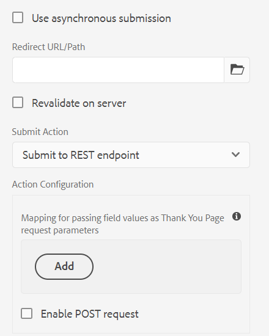

# 적응형 양식 제출 액션 {#configuring-the-submit-action}

<span class="preview"> 핵심 구성 요소를 사용하여 [AEM Sites 페이지에 적응형 양식을 추가하거나](/help/forms/create-or-add-an-adaptive-form-to-aem-sites-page.md) [독립 적응형 양식을 만드는 것](/help/forms/creating-adaptive-form-core-components.md)이 좋습니다. </span>


| 버전 | 문서 링크 |
| -------- | ---------------------------- |
| AEM 6.5 | [여기 클릭](https://experienceleague.adobe.com/docs/experience-manager-65/forms/adaptive-forms-basic-authoring/configuring-submit-actions.html) |
| AEM as a Cloud Service | 이 문서 |
| 적용 대상 | ✅ 적응형 양식 핵심 구성 요소, ❎ [적응형 양식 기초 구성 요소](/help/forms/configuring-submit-actions.md) |


제출 액션을 사용하면 적응형 양식을 통해 캡처되는 데이터의 대상을 선택할 수 있습니다. 사용자가 적응형 양식에서 **[!UICONTROL 제출]** 버튼을 클릭하면 제출 액션이 트리거됩니다. 핵심 구성 요소를 기반으로 하는 적응형 양식의 Forms as a Cloud Service는 다수의 사전 빌드된 제출 액션을 제공합니다. 이러한 기본 제공 제출 액션을 통해 다음과 같은 작업을 수행할 수 있습니다.

* 이메일을 통해 양식 데이터를 손쉽게 전송합니다.
* 데이터 전송 도중 Microsoft Power Automate 흐름 또는 AEM Workflow를 시작합니다.
* 양식 데이터를 Microsoft SharePoint Server, Microsoft Azure Blob Storage 또는 Microsoft OneDrive로 바로 전송합니다.
* 양식 데이터 모델을 사용하여 데이터를 구성된 데이터 소스에 원활하게 전송합니다.
* 편리하게 데이터를 REST 엔드포인트에 제출합니다.

또한 [기본 제출 액션을 확장](custom-submit-action-form.md)하여 나만의 제출 액션을 만들 수 있습니다.

## 적응형 양식의 제출 액션 선택 및 구성 {#select-and-configure-submit-action}

양식의 제출 액션을 선택하고 구성하려면 다음 작업을 수행하십시오.

1. 콘텐츠 브라우저를 열고 적응형 양식의 **[!UICONTROL 안내서 컨테이너]** 구성 요소를 선택합니다.
1. 안내서 컨테이너 속성  아이콘을 클릭합니다. 적응형 양식 컨테이너 대화 상자가 열립니다.

1. **[!UICONTROL 제출]** 탭을 클릭합니다.

   

1. 요구 사항에 따라 **[!UICONTROL 제출 액션]**&#x200B;을 선택하고 구성합니다. 선택한 제출 액션에 대한 자세한 내용은 다음을 참조하십시오.

   * [이메일 보내기](#send-email)
   * [SharePoint에 제출](#submit-to-sharedrive)
   * [양식 데이터 모델을 사용하여 제출](#submit-using-form-data-model)
   * [Azure Blob 스토리지에 제출](#azure-blob-storage)
   * [REST 엔드포인트에 제출](#submit-to-rest-endpoint)
   * [OneDrive에 제출](#submit-to-onedrive)
   * [AEM Workflow 호출](#invoke-an-aem-workflow)
   * [Power Automate에 제출](#microsoft-power-automate)

## 이메일 보내기 {#send-email}

성공적인 양식 제출 시 한 명 이상의 수신자에게 이메일을 보내려면 **[!UICONTROL 이메일 보내기]** 제출 액션을 활용할 수 있습니다. 이 액션을 통해 미리 정의된 형식의 양식 데이터를 포함하는 이메일을 만들 수 있습니다. 예를 들어 제출된 양식 데이터에서 고객 이름, 배송 주소, 주 이름과 우편번호를 검색하는 다음 템플릿을 고려합니다.

    ```
    
    ${customer_Name} 님, 안녕하세요.
    
    기본 배송 주소가 다음과 같이 설정됩니다.
    ${customer_Name},
    ${customer_Shipping_Address},
    ${customer_State},
    ${customer_ZIPCode}
    
    감사합니다.
    WKND
    
    ```

>[!NOTE]
>
> * 모든 양식 필드가 적응형 양식 내 다른 패널에 배치되는 경우에도 고유 요소 이름을 지정하는 것이 중요합니다.
> * AEM as a Cloud Service를 사용하는 경우 아웃바운드 이메일을 암호화해야 합니다. 아웃바운드 이메일 기능은 기본적으로 비활성화되어 있습니다. 기능을 활성화하려면 지원 티켓을 [액세스 권한 요청](https://experienceleague.adobe.com/docs/experience-manager-cloud-service/implementing/developing/development-guidelines.html?lang=ko#sending-email)에 제출합니다.

또한 **[!UICONTROL 이메일 보내기]** 제출 액션은 이메일에 첨부 파일과 기록 문서(DoR)를 포함하는 옵션을 제공합니다.

[!UICONTROL 기록 문서(DoR) 첨부] 옵션을 활성화하려면 [기록 문서(DoR)를 생성하는 적응형 양식 구성](generate-document-of-record-core-components.md)에 대한 설명서를 참조하십시오. 적응형 양식 속성에서 이 옵션을 활성화할 수 있습니다.

<!-- [!NOTE]
>
>Send PDF via Email Submit Action is applicable only to Adaptive Forms that use XFA template as form model. 

>[!NOTE]
>
>Ensure that the [AEM_Installation_Directory]\crx-quickstart\temp\datamanager\ASM folder
>exists. The directory is required to temporarily store attachments. If the directory does not exist, create it. -->

<!--

>[!CAUTION]
>
>If you  [prefill](prepopulate-adaptive-form-fields.md) a form template,  a Form Data Model or schema based Adaptive Form with XML or JSON data complaint to a schema (XML schema, JSON schema , form template, or form data model) that is data does not contain &lt;afData&gt;, &lt;afBoundData&gt;, and &lt;/afUnboundData&gt; tags, then the data of unbounded fields (Unbounded fields are Adaptive Form fields without [bindref](prepopulate-adaptive-form-fields.md) property) of the Adaptive Form is lost. 

>[!CAUTION]
>
>If you [prefill](prepopulate-adaptive-form-fields.md) a form template, a Form Data Model or schema based Adaptive Form with XML or JSON data complaint to a schema (XML schema, JSON schema, or form data model) that does not contain &lt;afData&gt;, &lt;afBoundData&gt;, and &lt;/afUnboundData&gt; tags, then the data of unbounded fields (Unbounded fields are Adaptive Form fields without [bindref](prepopulate-adaptive-form-fields.md) property) of the Adaptive Form is lost.


-->

## SharePoint에 제출 {#submit-to-sharedrive}

**[!UICONTROL SharePoint에 제출]** 제출 액션은 적응형 양식을 Microsoft® SharePoint Storage와 연결합니다. 양식 데이터 파일, 첨부 파일 또는 기록 문서를 연결된 Microsoft® SharePoint Storage에 제출할 수 있습니다. 적응형 양식에서 **[!UICONTROL SharePoint에 제출]** 제출 액션을 사용하려면

1. [SharePoint 구성 만들기](#create-a-sharepoint-configuration-create-sharepoint-configuration): AEM Forms를 Microsoft® SharePoint Storage에 연결합니다.
2. [적응형 양식에서 SharePoint에 제출 액션 사용](#use-sharepoint-configuartion-in-af): Adaptive Form을 구성된 Microsoft® SharePoint에 연결합니다.

### SharePoint 구성 만들기 {#create-sharepoint-configuration}

AEM Forms를 Microsoft® SharePoint Storage에 연결하려면

1. **AEM Forms** 인스턴스 > **[!UICONTROL 도구]** > **[!UICONTROL 클라우드 서비스]** > **[!UICONTROL Microsoft® SharePoint]**&#x200B;로 이동합니다.
1. **구성 컨테이너**&#x200B;를 선택합니다. 구성 컨테이너의 확인란을 클릭하지 마십시오. 구성 컨테이너의 이름을 클릭하여 선택합니다. 선택한 구성 컨테이너에 구성을 저장합니다.
1. **[!UICONTROL 만들기]**를 클릭합니다. SharePoint 구성 마법사가 나타납니다.
   
1. **[!UICONTROL 제목]**, **[!UICONTROL 클라이언트 ID]**, **[!UICONTROL 클라이언트 보안]** 및 **[!UICONTROL OAuth URL]**&#x200B;을 지정합니다. OAuth URL의 클라이언트 ID, 클라이언트 보안, 테넌트 ID를 검색하는 방법에 대한 자세한 내용은 [Microsoft® Documentation](https://learn.microsoft.com/en-us/graph/auth-register-app-v2)을 참조하십시오.
   * Microsoft® Azure 포털에서 앱의 `Client ID` 및 `Client Secret`를 검색할 수 있습니다.
   * Microsoft® Azure 포털에서 리디렉션 URI를 `https://[author-instance]/libs/cq/sharepoint/content/configurations/wizard.html`로 추가합니다. `[author-instance]`를 AEM Forms 작성자 인스턴스의 URL로 대체합니다.
   * `offline_access` 및 `Sites.Manage.All` API 권한을 추가하여 읽기/쓰기 권한을 제공합니다.
   * OAuth URL 사용: `https://login.microsoftonline.com/tenant-id/oauth2/v2.0/authorize`. Microsoft® Azure 포털에서 `<tenant-id>`를 앱의 `tenant-id`로 대체합니다.

   >[!NOTE]
   >
   > **클라이언트 보안** 필드는 Azure Active Directory 애플리케이션 구성에 따라 필수 또는 선택 사항입니다. 애플리케이션을 구성하여 클라이언트 보안을 사용하는 경우 클라이언트 보안을 제공해야 합니다.

1. **[!UICONTROL 연결]**&#x200B;을 클릭합니다. 연결이 완료되면 `Connection Successful` 메시지가 나타납니다.

1. 데이터를 저장할 폴더를 선택하려면 **SharePoint Site** > **문서 라이브러리** > **SharePoint 폴더**&#x200B;를 선택합니다.

   >[!NOTE]
   >
   >* 기본적으로 `forms-ootb-storage-adaptive-forms-submission` 폴더는 선택한 SharePoint Site에서 사용할 수 있습니다. 폴더를 사용할 수 없으면 **폴더 만들기**&#x200B;를 사용하여 폴더를 만듭니다.

이제 적응형 양식에서 **SharePoint에 제출** 제출 액션에 대한 SharePoint Sites 구성을 사용할 수 있습니다.

### 적응형 양식에서 SharePoint에 제출 액션 사용 {#use-sharepoint-configuartion-in-af}

이전 섹션에서 만든 SharePoint 구성을 사용하여 데이터 또는 기록 문서를 SharePoint 폴더에 저장할 수 있습니다. 적응형 양식에서 SharePoint에 제출 액션을 사용하려면 다음 단계를 수행하십시오.

1. [적응형 양식](/help/forms/creating-adaptive-form.md)을 만듭니다. 적응형 양식을 만드는 동안 [SharePoint 구성 만들기](#create-sharepoint-configuration)에 사용되는 [!UICONTROL 구성 컨테이너]를 선택합니다.

   >[!NOTE]
   >
   > [!UICONTROL 구성 컨테이너]가 선택되지 않으면 제출 액션 속성 창에 글로벌 [!UICONTROL 스토리지 구성] 폴더가 나타납니다.

1. **제출 액션**&#x200B;을 **[!UICONTROL SharePoint에 제출]**&#x200B;로 선택합니다.
1. 구성된 **[!UICONTROL 스토리지 구성]**&#x200B;을 선택합니다. 양식 데이터와 기록 문서를 저장할 폴더를 SharePoint에 지정합니다.
1. **[!UICONTROL 저장]**&#x200B;을 클릭하여 제출 설정을 저장합니다.

양식을 제출하면 지정된 Microsoft® Sharepoint Storage 위치(폴더)에 데이터가 저장됩니다.
저장된 데이터의 폴더 구조는 `/folder_name/form_name/year/month/date/submission_id/data`입니다.

## 양식 데이터 모델을 사용하여 제출 {#submit-using-form-data-model}

**[!UICONTROL 양식 데이터 모델을 사용하여 제출]** 제출 액션은 양식 데이터 모델에 지정된 데이터 모델 오브젝트의 제출된 적응형 양식 데이터를 해당 데이터 소스에 씁니다. 제출 액션을 구성할 때 데이터 소스에 다시 쓰려는 제출된 데이터가 있는 데이터 모델 오브젝트를 선택할 수 있습니다.

또한 양식 데이터 모델과 기록 문서(DoR)를 사용하여 양식 첨부 파일을 데이터 소스에 제출할 수 있습니다. 양식 데이터 모델에 대한 자세한 내용은 [[!DNL AEM Forms] 데이터 통합](data-integration.md)을 참조하십시오.

## REST 엔드포인트에 제출 {#submit-to-rest-endpoint}

**[!UICONTROL REST 엔드포인트에 제출]** 액션을 사용하여 제출된 데이터를 REST URL에 게시합니다. URL은 내부 서버(양식이 렌더링되는 서버) 또는 외부 서버일 수 있습니다.

데이터를 내부 서버에 게시하려면 리소스 경로를 제공합니다. 데이터는 리소스 경로에 게시됩니다. 예: /content/restEndPoint. 해당 게시 요청이 있는 경우 제출 요청에 대한 인증 정보가 사용됩니다.

데이터를 외부 서버에 게시하려면 URL을 제공합니다. URL 형식은 `https://host:port/path_to_rest_end_point`입니다. POST 요청을 익명으로 처리하는 경로를 구성해야 합니다.


위 예에서 사용자는 매개변수 `param1`을 사용하여 캡처한 정보를 `textbox`에 입력했습니다. `param1`을 사용하여 캡처한 데이터를 게시하는 구문은 다음과 같습니다.

`String data=request.getParameter("param1");`

마찬가지로 XML 데이터와 첨부 파일 게시에 사용되는 매개변수는 `dataXml` 및 `attachments`입니다.

예를 들어 스크립트의 이 두 매개변수를 사용하여 데이터를 REST 엔드포인트로 구문 분석합니다. 다음 구문을 사용하여 데이터를 저장하고 구문 분석합니다.

`String data=request.getParameter("dataXml");`
`String att=request.getParameter("attachments");`

이 예에서 `data`는 XML 데이터를 저장하고 `att`는 첨부 파일 데이터를 저장합니다.

**[!UICONTROL REST 엔드포인트에 제출]** 제출 액션은 양식에 입력된 데이터를 HTTP GET 요청의 일부로 구성된 확인 페이지에 제출합니다. 요청할 필드 이름을 추가할 수 있습니다. 요청의 형식은 다음과 같습니다.

`{fieldName}={request parameter name}`

아래 이미지에 표시된 대로 `param1`과 `param2`는 다음 액션의 **텍스트 상자** 및 **숫자 상자** 필드에서 복사된 값이 포함된 매개변수로 전달됩니다.


또한 **[!UICONTROL POST 요청을 활성화]**&#x200B;하고 요청을 게시하는 URL을 제공할 수 있습니다. 양식을 호스팅하는 AEM 서버에 데이터를 제출하려면 AEM 서버 루트 경로에 해당되는 상대 경로를 사용합니다. 예, `/content/forms/af/SampleForm.html`. 데이터를 다른 서버에 제출하려면 절대 경로를 사용합니다.

>[!NOTE]
>
>REST URL에서 필드를 매개변수로 전달하려면 필드가 다른 패널에 배치되는 경우에도 모든 필드의 요소 이름이 서로 달라야 합니다.

<!-- ## Send PDF via Email {#send-pdf-via-email}

The **Send PDF via Email** Submit Action sends an email with a PDF containing form data, to one or more recipients on successful submission of the form.

>[!NOTE]
>
>This Submit Action is available for XFA-based Adaptive Forms and XSD-based adaption forms that have the Document of Record template. -->

<!-- ## Invoke a forms workflow {#invoke-a-forms-workflow}

The **Submit to Forms workflow** submit option sends a data xml and file attachments (if any) to an existing Adobe LiveCycle or [!DNL AEM Forms] on JEE process.

For information about how to configure the Submit to forms workflow Submit Action, see [Submitting and processing your form data using forms workflows](submit-form-data-livecycle-process.md). -->


<!--
## Forms Portal Submit Action {#forms-portal-submit-action}

The **Forms Portal Submit Action** option makes form data available through an [!DNL AEM Forms] portal.

For more information about the Forms Portal and Submit Action, see [Drafts and submissions component](draft-submission-component.md). -->

## AEM Workflow 호출 {#invoke-an-aem-workflow}

**[!UICONTROL AEM Workflow 호출]** 제출 액션은 적응형 양식을 [AEM Workflow](https://experienceleague.adobe.com/docs/experience-manager-65/developing/extending-aem/extending-workflows/workflows-models.html?lang=ko#extending-aem)와 연결합니다. 양식이 제출되면 연결된 워크플로가 작성자 인스턴스에서 자동으로 시작됩니다. 데이터 파일, 첨부 파일과 기록 문서를 워크플로의 페이로드 위치 또는 변수에 저장할 수 있습니다. 워크플로가 외부 데이터 스토리지로 표시되고 외부 데이터 스토리지로 구성되면 변수 옵션만 제공됩니다. 워크플로 모델에 제공되는 변수 목록에서 선택할 수 있습니다. 워크플로 생성 시점이 아닌 이후 단계에서 워크플로가 외부 데이터 스토리지로 표시되면 필수 변수 구성이 마련되었는지 확인합니다.

제출 액션은 워크플로가 외부 데이터 스토리지로 표시되면 워크플로의 페이로드 위치 또는 변수에 다음을 배치합니다.

* **데이터 파일**: 적응형 양식에 제출된 데이터가 포함됩니다. **[!UICONTROL 데이터 파일 경로]** 옵션을 사용하여 페이로드를 기준으로 파일 이름과 파일 경로를 지정할 수 있습니다. 예를 들어 `/addresschange/data.xml` 경로는 `addresschange`라는 폴더를 만들고 페이로드를 기준으로 배치합니다. 또한 `data.xml`만 지정하여 폴더 계층 구조를 만들지 않고도 제출된 데이터만 전송할 수 있습니다. 워크플로가 외부 데이터 스토리지로 표시되면 변수 옵션을 사용하고 워크플로 모델에 제공되는 변수 목록에서 변수를 선택합니다.

* **첨부 파일**: **[!UICONTROL 첨부 파일 경로]** 옵션을 사용하여 폴더 이름을 지정하면 적응형 양식에 업로드된 첨부 파일을 저장할 수 있습니다. 페이로드를 기준으로 폴더를 생성합니다. 워크플로가 외부 데이터 스토리지로 표시되면 변수 옵션을 사용하고 워크플로 모델에 제공되는 변수 목록에서 변수를 선택합니다.

* **기록 문서**: 적응형 양식에 생성된 기록 문서가 포함됩니다. **[!UICONTROL 기록 문서 경로]** 옵션을 사용하여 페이로드를 기준으로 기록 문서 파일 이름과 파일 경로를 지정할 수 있습니다. 예를 들어 `/addresschange/DoR.pdf` 경로는 `addresschange`라는 폴더를 만들고 페이로드를 기준으로 `DoR.pdf`를 배치합니다. 또한 `DoR.pdf`만 지정하여 폴더 계층 구조를 만들지 않고도 기록 문서만 저장할 수 있습니다. 워크플로가 외부 데이터 스토리지로 표시되면 변수 옵션을 사용하고 워크플로 모델에 제공되는 변수 목록에서 변수를 선택합니다.

**[!UICONTROL AEM Workflow 호출]** 제출 액션을 사용하기 전에 **[!UICONTROL AEM DS 설정 서비스]** 구성에 다음을 구성합니다.

* **[!UICONTROL 처리 서버 URL]**: 처리 서버는 Forms 또는 AEM Workflow가 트리거되는 서버입니다. AEM 작성자 인스턴스 또는 다른 서버의 URL과 동일할 수 있습니다.

* **[!UICONTROL 처리 서버 사용자 이름]**: 워크플로 사용자의 사용자 이름

* **[!UICONTROL 처리 서버 암호]**: 워크플로 사용자의 암호


## OneDrive에 제출 {#submit-to-onedrive}

**[!UICONTROL OneDrive에 제출]** 제출 액션은 적응형 양식을 Microsoft® OneDrive와 연결합니다. 양식 데이터, 파일, 첨부 파일 또는 기록 문서를 연결된 Microsoft® OneDrive Storage에 제출할 수 있습니다. 적응형 양식에서 [!UICONTROL OneDrive에 제출] 제출 액션을 사용하려면

1. [OneDrive 구성 만들기](#create-a-onedrive-configuration-create-onedrive-configuration): AEM Forms를 Microsoft® OneDrive Storage에 연결합니다.
2. [적응형 양식에서 OneDrive에 제출 액션 사용](#use-onedrive-configuration-in-an-adaptive-form-use-onedrive-configuartion-in-af): Adaptive Form을 구성된 Microsoft® OneDrive에 연결합니다.

### OneDrive 구성 만들기 {#create-onedrice-configuration}

AEM Forms를 Microsoft® OneDrive Storage에 연결하려면

1. **AEM Forms 작성자** 인스턴스 > **[!UICONTROL 도구]** > **[!UICONTROL 클라우드 서비스]** > **[!UICONTROL Microsoft® OneDrive]**&#x200B;로 이동합니다.
1. **[!UICONTROL Microsoft® OneDrive]**&#x200B;를 선택하면 **[!UICONTROL OneDrive 브라우저]**&#x200B;로 리디렉션됩니다.
1. **구성 컨테이너**&#x200B;를 선택합니다. 선택한 구성 컨테이너에 구성을 저장합니다.
1. **[!UICONTROL 만들기]**&#x200B;를 클릭합니다. OneDrive 구성 마법사가 나타납니다.

   

1. **[!UICONTROL 제목]**, **[!UICONTROL 클라이언트 ID]**, **[!UICONTROL 클라이언트 보안]** 및 **[!UICONTROL OAuth URL]**&#x200B;을 지정합니다. OAuth URL의 클라이언트 ID, 클라이언트 보안, 테넌트 ID를 검색하는 방법에 대한 자세한 내용은 [Microsoft® Documentation](https://learn.microsoft.com/en-us/graph/auth-register-app-v2)을 참조하십시오.
   * Microsoft® Azure 포털에서 앱의 `Client ID` 및 `Client Secret`를 검색할 수 있습니다.
   * Microsoft® Azure 포털에서 리디렉션 URI를 `https://[author-instance]/libs/cq/onedrive/content/configurations/wizard.html`로 추가합니다. `[author-instance]`를 작성자 인스턴스의 URL로 대체합니다.
   * `offline_access` 및 `Files.ReadWrite.All` API 권한을 추가하여 읽기/쓰기 권한을 제공합니다.
   * OAuth URL 사용: `https://login.microsoftonline.com/tenant-id/oauth2/v2.0/authorize`. Microsoft® Azure 포털에서 `<tenant-id>`를 앱의 `tenant-id`로 대체합니다.

   >[!NOTE]
   >
   > **클라이언트 보안** 필드는 Azure Active Directory 애플리케이션 구성에 따라 필수 또는 선택 사항입니다. 애플리케이션을 구성하여 클라이언트 보안을 사용하는 경우 클라이언트 보안을 제공해야 합니다.

1. **[!UICONTROL 연결]**&#x200B;을 클릭합니다. 연결이 완료되면 `Connection Successful` 메시지가 나타납니다.

1. 이제 **[!UICONTROL OneDrive 컨테이너]** > **[OneDrive 폴더]**&#x200B;를 선택하여 데이터를 저장합니다.

   >[!NOTE]
   >
   >* 기본적으로 `forms-ootb-storage-adaptive-forms-submission`은 OneDrive 컨테이너에 존재합니다.
   > * 아직 존재하지 않는 경우 **폴더 만들기**&#x200B;를 클릭하여 폴더를 `forms-ootb-storage-adaptive-forms-submission`로 만듭니다.

이제 적응형 양식에서 제출 액션에 대한 OneDrive 스토리지 구성을 사용할 수 있습니다.

### 적응형 양식에서 OneDrive 구성 사용 {#use-onedrive-configuartion-in-af}

적응형 양식에서 만든 OneDrive 스토리지 구성을 사용하여 데이터 또는 생성된 기록 문서를 OneDrive 폴더에 저장할 수 있습니다. 적응형 양식에서 OneDrive 스토리지 구성을 다음과 같이 사용하려면 다음 단계를 수행하십시오.
1. [적응형 양식](/help/forms/creating-adaptive-form.md)을 만듭니다.

   >[!NOTE]
   >
   > * OneDrive 스토리지가 생성되면 적응형 양식에 대한 [!UICONTROL 구성 컨테이너]를 선택합니다.
   > * [!UICONTROL 구성 컨테이너]가 선택되지 않은 경우 제출 액션 속성 창에 글로벌 [!UICONTROL 스토리지 구성] 폴더가 나타납니다.

1. **제출 액션**&#x200B;을 **[!UICONTROL OneDrive에 제출]**로 선택합니다.
   
1. 데이터를 저장하려는 경우 **[!UICONTROL 스토리지 구성]**&#x200B;을 선택합니다.
1. **[!UICONTROL 저장]**&#x200B;을 클릭하여 제출 설정을 저장합니다.

양식이 제출되면 지정된 Microsoft® OneDrive Storage에 데이터가 저장됩니다.
데이터를 저장하는 폴더 구조는 `/folder_name/form_name/year/month/date/submission_id/data`입니다.

## Azure Blob 스토리지에 제출 {#submit-to-azure-blob-storage}

**[!UICONTROL Azure Blob Storage에 제출]** 제출 액션은 적응형 양식을 Microsoft® Azure 포털과 연결합니다. 양식 데이터, 파일, 첨부 파일 또는 기록 문서를 연결된 Azure Storage 컨테이너에 제출할 수 있습니다. Azure Blob Storage에 대한 제출 액션을 사용하려면

1. [Azure Blob Storage 컨테이너 만들기](#create-a-azure-blob-storage-container-create-azure-configuration): AEM Forms를 Azure Storage 컨테이너에 연결합니다.
2. [적응형 양식에서 Azure Storage 구성 사용](#use-azure-storage-configuration-in-an-adaptive-form-use-azure-storage-configuartion-in-af): Adaptive Form을 구성된 Azure Storage 컨테이너에 연결합니다.

### Azure Blob Storage 컨테이너 만들기 {#create-azure-configuration}

AEM Forms를 Azure Storage 컨테이너에 연결하려면
1. **AEM Forms 작성자** 인스턴스 > **[!UICONTROL 도구]** > **[!UICONTROL 클라우드 서비스]** > **[!UICONTROL Azure Storage]**&#x200B;로 이동합니다.
1. **[!UICONTROL Azure Storage]**&#x200B;를 선택하면 **[!UICONTROL Azure Storage 브라우저]**&#x200B;로 리디렉션됩니다.
1. **구성 컨테이너**&#x200B;를 선택합니다. 선택한 구성 컨테이너에 구성을 저장합니다.
1. **[!UICONTROL 만들기]**&#x200B;를 클릭합니다. Azure Storage 구성 만들기 마법사가 나타납니다.

   

1. **[!UICONTROL 제목]**, **[!UICONTROL Azure Storage 계정]** 및 **[!UICONTROL Azure 액세스 키]**&#x200B;를 지정합니다.

   * Microsoft® Azure 포털의 스토리지 계정에서 `Azure Storage Account` 이름과 `Azure Access key`를 검색할 수 있습니다.

1. **[!UICONTROL 저장]**&#x200B;을 클릭합니다.

이제 적응형 양식에서 제출 액션에 대한 Azure Storage 컨테이너 구성을 사용할 수 있습니다.

### 적응형 양식에서 Azure Storage 구성 사용 {#use-azure-storage-configuartion-in-af}

적응형 양식에서 만든 Azure Storage 컨테이너 구성을 사용하여 데이터 또는 생성된 기록 문서를 Azure Storage 컨테이너에 저장할 수 있습니다. 적응형 양식에서 Azure Storage 컨테이너 구성을 다음과 같이 사용하려면 다음 단계를 수행하십시오.
1. [적응형 양식](/help/forms/creating-adaptive-form.md)을 만듭니다.

   >[!NOTE]
   >
   > * OneDrive 스토리지가 생성되면 적응형 양식에 대한 [!UICONTROL 구성 컨테이너]를 선택합니다.
   > * [!UICONTROL 구성 컨테이너]가 선택되지 않은 경우 제출 액션 속성 창에 글로벌 [!UICONTROL 스토리지 구성] 폴더가 나타납니다.

1. **제출 액션**&#x200B;을 **[!UICONTROL Azure Blob Storage에 제출]**로 선택합니다.
   

1. 데이터를 저장하려는 경우 **[!UICONTROL 스토리지 구성]**&#x200B;을 선택합니다.
1. **[!UICONTROL 저장]**&#x200B;을 클릭하여 제출 설정을 저장합니다.

양식이 제출되면 지정된 Azure Storage 컨테이너 구성에 데이터가 저장됩니다.
데이터를 저장하는 폴더 구조는 `/configuration_container/form_name/year/month/date/submission_id/data`입니다.

구성의 값을 설정하려면 [AEM SDK를 사용하여 OSGi 구성을 생성](https://experienceleague.adobe.com/docs/experience-manager-cloud-service/implementing/deploying/configuring-osgi.html?lang=ko#generating-osgi-configurations-using-the-aem-sdk-quickstart)하고 Cloud Service 인스턴스에 [구성을 배포](https://experienceleague.adobe.com/docs/experience-manager-cloud-service/implementing/using-cloud-manager/deploy-code.html?lang=ko#deployment-process)합니다.


## Power Automate에 제출 {#microsoft-power-automate}

제출 시 Microsoft® Power Automate Cloud Flow를 실행하도록 적응형 양식을 구성할 수 있습니다. 구성된 적응형 양식은 캡처된 데이터, 첨부 파일 및 기록 문서를 처리를 위해 Power Automate Cloud Flow로 전송합니다. 이렇게 하면 Microsoft® Power Automate의 강력한 기능을 활용하면서 사용자 정의 데이터 캡처 환경을 구축하여 캡처된 데이터를 중심으로 비즈니스 로직을 구축하고 고객 워크플로를 자동화할 수 있습니다. 다음은 적응형 양식과 Microsoft® Power Automate를 통합한 후 수행할 수 있는 작업의 몇 가지 예입니다.

* Power Automate 비즈니스 프로세스에서 적응형 Forms 데이터 사용
* Power Automate를 사용하여 캡처한 데이터를 500개 이상의 데이터 소스 또는 공개적으로 사용 가능한 API로 전송
* 캡처된 데이터에 대해 복잡한 계산 수행
* 사전 정의된 일정에 따라 스토리지 시스템에 적응형 Forms 데이터 저장

적응형 Forms 편집기는 **Microsoft® Power Automate 플로우 호출** 제출 액션을 통해 적응형 양식 데이터, 첨부 파일 및 기록 문서를 Power Automate Cloud Flow로 전송합니다. 제출 액션을 사용하여 캡처된 데이터를 Microsoft® Power Automate로 보내려면 [Forms as a Cloud Service 인스턴스와 Microsoft® Power Automate 연결](forms-microsoft-power-automate-integration.md)

구성이 완료되면 다음을 사용합니다. [Microsoft® Power Automate 플로우 호출](forms-microsoft-power-automate-integration.md#use-the-invoke-a-microsoft&reg;-power-automate-flow-submit-action-to-send-data-to-a-power-automate-flow-use-the-invoke-microsoft-power-automate-flow-submit-action) 작업을 제출하여 Power Automate 흐름에 데이터를 전송합니다.

## 동기 제출 또는 비동기 제출 사용 {#use-synchronous-or-asynchronous-submission}

제출 액션은 동기 제출 또는 비동기 제출을 사용할 수 있습니다.

**동기 제출**: 일반적으로 웹 양식은 동기적으로 제출하도록 구성되어 있습니다. 동기 제출 시 사용자가 양식을 제출하면 승인 페이지, 감사 페이지 또는 제출 오류가 발생하는 경우 오류 페이지로 리디렉션됩니다. **[!UICONTROL 비동기 제출 사용]** 옵션을 선택하여 사용자를 웹 페이지로 리디렉션하거나 제출 시 메시지를 표시합니다.



**비동기 제출**: 클라이언트-서버 상호 작용이 백그라운드에서 발생하는 동안 웹 페이지가 정적으로 유지되면 단일 페이지 애플리케이션 등 최신 웹 경험의 인지도가 높아집니다. 이제 [비동기 제출을 구성](asynchronous-submissions-adaptive-forms.md)하여 적응형 양식을 통해 이 경험을 제공할 수 있습니다.

## 적응형 양식에서 서버측 유효성 재검사 {#server-side-revalidation-in-adaptive-form}

일반적으로 온라인 데이터 캡처 시스템에서 개발자는 몇 가지 비즈니스 규칙을 적용하기 위해 클라이언트측에 대해 JavaScript 유효성 검사를 일부 실시합니다. 단, 최신 브라우저에서 최종 사용자는 이러한 유효성 검사를 무시하고 웹 브라우저 DevTools 콘솔과 같은 다양한 기술을 사용하여 수동으로 제출 액션을 수행할 수 있습니다. 이러한 기술은 적응형 양식에도 유효합니다. 양식 개발자는 다양한 유효성 검사 논리를 만들 수 있지만 기술적 측면에서 최종 사용자는 이러한 유효성 검사 논리를 무시하고 잘못된 데이터를 서버에 제출할 수 있습니다. 잘못된 데이터로 인해 양식 작성자가 적용한 비즈니스 규칙이 깨질 수 있습니다.

서버측 유효성 재검사 기능을 통해 서버에서 적응형 양식을 디자인하면서 적응형 양식 작성자가 제공한 유효성 검사를 실행할 수도 있습니다. 양식 유효성 검사에 표시되는 데이터 제출 및 비즈니스 규칙 위반 사항에 발생할 수 있는 잠재적 손상을 방지할 수 있습니다.

### 서버의 유효성을 검사할 대상은 무엇일까요? {#what-to-validate-on-server-br}

서버에서 다시 실행되는 적응형 양식에 대한 즉시 사용할 수 있는(OOTB) 필드 유효성 검사는 다음과 같습니다.

* 필수
* 유효성 검사 픽처 구절
* 유효성 검사 표현식

### 서버측 유효성 검사 활성화 {#enabling-server-side-validation-br}

사이드바의 적응형 양식 컨테이너 아래에 있는 **[!UICONTROL 서버측 유효성 재검사]**&#x200B;를 사용하여 현재 양식에 대해 서버측 유효성 검사를 활성화하거나 비활성화합니다.


서버측 유효성 검사 활성화

최종 사용자가 이러한 유효성 검사를 무시하고 양식을 제출하면 서버에서 다시 유효성 검사를 수행합니다. 유효성 검사가 서버 끝에서 실패하면 제출 트랜잭션이 중지됩니다. 원래 양식이 최종 사용자에게 다시 표시됩니다. 캡처된 데이터와 제출된 데이터는 사용자에게 오류로 표시됩니다.

>[!NOTE]
>
>서버측 유효성 검사는 양식 모델의 유효성을 검사합니다. 별도의 클라이언트 라이브러리를 만들어 유효성을 검사하고 동일한 클라이언트 라이브러리에서 HTML 스타일링과 DOM 조작과 같은 다른 항목과 혼합하지 않는 것이 좋습니다.

### 유효성 검사 표현식에서 사용자 정의 함수 지원 {#supporting-custom-functions-in-validation-expressions-br}

**복잡한 유효성 검사 규칙**&#x200B;이 있는 경우에는 정확한 유효성 검사 스크립트는 사용자 정의 함수에 있고 작성자는 필드 유효성 검사 표현식에서 이러한 사용자 정의 함수를 호출합니다. 서버측 유효성 검사를 수행하면서 이 사용자 정의 함수 라이브러리를 이해하고 사용할 수 있도록 양식 작성자는 아래와 같이 적응형 양식 컨테이너 속성의 **[!UICONTROL 기본]** 탭 아래에서 AEM 클라이언트 라이브러리 이름을 구성할 수 있습니다.


유효성 검사 표현식에서 사용자 정의 함수 지원

작성자는 적응형 양식별로 사용자 정의 JavaScript 라이브러리를 구성할 수 있습니다. jquery 및 underscore.js 서드파티 라이브러리에 종속된 재사용 가능한 함수만 라이브러리에 유지됩니다.

## 제출 액션의 오류 처리 {#error-handling-on-submit-action}

AEM 보안 및 강화 지침의 일부로, 400.jsp, 404.jsp 및 500.jsp와 같은 사용자 정의 오류 페이지를 구성합니다. 이러한 핸들러는 양식 제출 시 400, 404 또는 500 오류가 나타나면 호출됩니다. 게시 노드에서 이러한 오류 코드가 트리거되면 핸들러가 호출되기도 합니다. 또한 다른 HTTP 오류 코드에 대한 JSP 페이지를 만들 수 있습니다.

양식 데이터 모델이나, 데이터에 `<afData>`, `<afBoundData>` 및 `</afUnboundData>` 태그가 포함되지 않은 스키마에 대해 XML 또는 JSON 데이터 컴플레인이 존재하는 스키마 기반 적응형 양식을 미리 채우는 경우 적응형 양식의 무제한 필드 데이터가 손실됩니다. 스키마는 XML 스키마, JSON 스키마 또는 양식 데이터 모델일 수 있습니다. 무제한 필드는 `bindref` 속성이 없는 적응형 양식 필드입니다.

<!-- For more information, see [Customizing Pages shown by the Error Handler](/help/sites-developing/customizing-errorhandler-pages.md). -->
