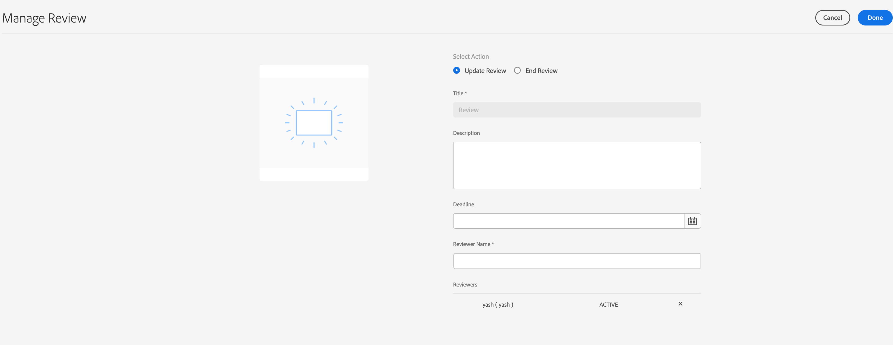

# 양식의 자산에 대한 검토 만들기 및 관리{#creating-and-managing-reviews-for-assets-in-forms}

## 리뷰 {#review}

검토는 한 명 이상의 검토자가 양식에서 사용할 수 있는 자산에 대해 주석을 달 수 있는 메커니즘입니다.

## 검토 설정 {#setting-up-a-review}

1. Forms 탭으로 이동하여 양식을 선택합니다.
1. 진행 중인 검토가 없는 양식에 검토 시작  아이콘이 작업 표시줄에 나타납니다. Start Review 를 클릭합니다.  아이콘.
1. 다음 정보를 입력합니다.

   * 제목: 필수 - 영숫자, 하이픈 또는 밑줄을 포함할 수 있습니다.
   * 설명: 선택 사항, 검토를 위한 목적/컨텐츠에 대한 설명.
   * 기한: 검토 종료 일자(선택 사항) 마감일이 지나면 작업이 &#39;기한 초과&#39;로 표시됩니다.
   * 검토자: 최소값은 필수입니다. 그룹 이름 또는 사용자 이름을 입력하면 서비스 사용자 그룹을 제외한 모든 일치하는 이름이 표시됩니다. 이름을 선택하고 추가를 클릭합니다.

1. 검토를 시작하려면 시작 을 클릭하십시오.

>[!NOTE]
>
>* 관리자는 양식 사용자와 연결된 모든 그룹에 액세스할 수 있습니다.
>* 서비스 사용자 그룹을 선택하여 검토할 수 없습니다.

### 검토를 설정할 때 발생하는 작업 {#actions-that-occur-when-a-review-is-set-up}

이 섹션에서는 검토를 만들거나 설정할 때 발생하는 상황에 대해 설명합니다.

1. 새 검토 작업이 생성되고 선택한 검토자에게 지정됩니다.
1. 모든 검토자에게 검토 작업이 할당됩니다. 작업이 알림 섹션에 나타납니다. 검토자는 알림을 클릭하거나 받은 편지함으로 이동하여 작업을 볼 수 있습니다. 검토자가 클릭하여 검토 작업을 열고, 양식을 보고, 주석을 추가할 수 있습니다.

   

   검토자 알림 경고

1. 양식의 검토자가 주석 상자를 사용할 수 있습니다. 다른 사용자는 주석을 볼 수 있지만 주석을 쓸 수는 없습니다.

## 검토 관리 {#managing-a-review}

>[!NOTE]
>
>진행 중인 검토만 수정할 수 있습니다. 완료된 검토는 수정할 수 없습니다.

1. Forms 탭으로 이동하여 양식을 선택합니다.

1. 자산에 검토 진행 중이며 사용자가 검토 개시자인 경우 검토 관리  작업 표시줄에 아이콘이 나타납니다. 검토 개시자만 검토를 관리(업데이트/종료)할 수 있습니다.

   검토 관리 를 클릭합니다 아이콘.

   개시자가 아닌 사용자의 경우 검토 관리 아이콘이 비활성화됩니다.

1. 정보를 표시하는 화면이 표시됩니다.

   * **제목**: 편집할 수 없습니다.

   * **설명**: 편집할 수 있습니다.

   * **기한**: 편집할 수 있습니다. 마감일을 현재 날짜 및 시간 이외의 날짜 및 시간으로 수정할 수 있습니다.

   * **검토자 이름**: 편집할 수 있습니다. 검토자를 추가하거나 제거할 수 있습니다. 작업 기한이 지난 경우 현재 날짜 이상으로 기한을 연장한 후에만 검토자를 추가할 수 있습니다.

1. 필요한 필드를 편집한 다음 완료를 클릭합니다.

   

   작업 관리자에서 업데이트된 상태 검토

1. 검토를 종료하려면 검토 종료를 누릅니다.

### 검토를 수정할 때 발생하는 작업 {#actions-that-occur-when-a-review-is-modified}

이 섹션에서는 검토 업데이트/종료에서 발생하는 사항에 대해 설명합니다.

1. 검토 설명이 수정되면 검토자와 개시자의 해당 작업이 업데이트됩니다.
1. 검토 최종 기한을 수정하면 검토자에 대한 해당 작업이 새 날짜로 업데이트됩니다.

1. 검토자가 제거된 경우:

   

   검토자 제거

   1. 완료되지 않으면 지정된 작업이 종료됩니다.
   1. 검토자가 더 이상 양식에 주석을 달 수 없습니다.

1. 검토자가 추가되는 경우:

   

   검토자 추가

   1. 검토 작업이 생성되고 새로 추가된 검토자에게 지정됩니다.
   1. 새로 추가된 검토자가 양식에 대한 주석을 추가할 수 있습니다.

1. 검토를 마치면:

   1. **검토자**: 각 검토자에 대해 검토와 관련된 불완전한 작업이 종료됩니다. 검토자의 알림 섹션에 더 이상 작업이 &#39;보류 중&#39;으로 표시되지 않습니다.
   1. **개시자**: 검토 개시자에 지정된 작업이 완료된 것으로 표시됩니다. 검토 개시자의 알림 섹션에서 작업이 제거됩니다.
   1. **모두**: 리뷰가 이전 검토 섹션에 나타납니다. 추가 주석을 추가할 수 없습니다.
      

