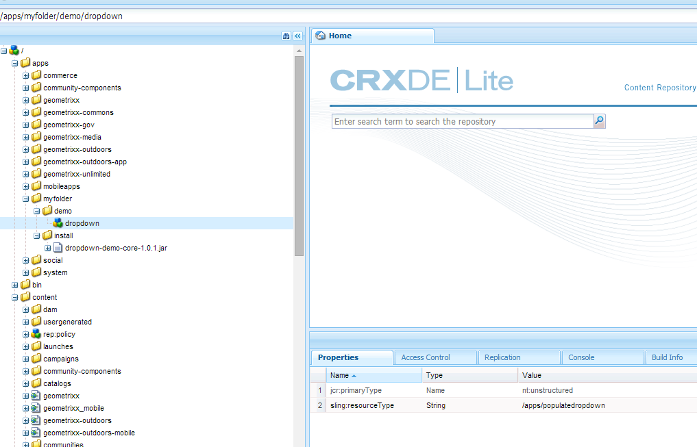

# 동적으로 드롭다운 목록 채우기 {#dynamically-populating-drop-down-lists}

## 사전 요구 사항 {#prerequisites}

* [OSGI 번들 만들기](https://helpx.adobe.com/experience-manager/using/creating-osgi-bundles-digital-marketing.html)
* [AEM 구성 요소 개발](https://experienceleague.adobe.com/docs/experience-manager-cloud-service/implementing/developing/full-stack/components-templates/overview.html#developing)
* [적응형 양식 만들기](creating-adaptive-form.md)
* [적응형 양식 작성](introduction-forms-authoring.md)

## 드롭다운 목록을 동적으로 채우는 절차 {#procedure-to-dynamically-populate-drop-down-lists}

을 채울 시나리오를 고려하십시오. **시/도** 드롭다운 목록은에서 선택하는 값을 기반으로 합니다. **국가** 드롭다운 목록입니다. 에서 호주를 선택하는 경우 **국가** 드롭다운 목록, **시/도** 드롭다운 목록에는 오스트레일리아 내의 상태가 표시됩니다. 다음 절차에서는 이 작업을 수행하는 방법에 대해 설명합니다.

1. 다음 모듈로 프로젝트를 만듭니다.

   * 드롭다운을 채우는 논리가 포함된 번들로, 이 경우 은 서블릿입니다.
   * .jar 파일을 포함하고 드롭다운 리소스가 있는 콘텐츠입니다. 서블릿은 이 리소스를 가리킵니다.

1. 국가 내의 상태 이름을 포함하는 배열을 반환하는 요청 매개변수 국가를 기반으로 서블릿을 작성합니다.

   ```java
   @Component(metatype = false)
   @Service(value = Servlet.class)
   @Properties({
           @Property(name = "sling.servlet.resourceTypes", value = "/apps/populatedropdown"),
           @Property(name = "sling.servlet.methods", value = {"GET", "POST"}),
           @Property(name = "service.description", value = "Populate states drop-down based on country value")
   })
   public class DropDownPopulator extends SlingAllMethodsServlet {
       private Logger logger = LoggerFactory.getLogger(DropDownPopulator.class);
   
       protected void doPost(SlingHttpServletRequest request,
                             final SlingHttpServletResponse response)
               throws ServletException, IOException {
           response.setHeader("Access-Control-Allow-Origin", "*");
           response.setContentType("application/json");
           response.setCharacterEncoding("UTF-8");
           try {
               String US_STATES[] = {"0=Alabama",
                       "1=Alaska",
                       "2=Arizona",
                       "3=Arkansas",
                       "4=California",
                       "5=Colorado",
                       "6=Connecticut",
                       "7=Delaware",
                       "8=Florida",
                       "9=Georgia",
                       "10=Hawaii",
                       "11=Idaho",
                       "12=Illinois",
                       "13=Indiana",
                       "14=Iowa",
                       "15=Kansas",
                       "16=Kentucky",
                       "17=Louisiana",
                       "18=Maine",
                       "19=Maryland",
                       "20=Massachusetts",
                       "21=Michigan",
                       "22=Minnesota",
                       "23=Mississippi",
                       "24=Missouri",
                       "25=Montana",
                       "26=Nebraska",
                       "27=Nevada",
                       "28=New Hampshire",
                       "29=New Jersey",
                       "30=New Mexico",
                       "31=New York",
                       "32=North Carolina",
                       "33=North Dakota",
                       "34=Ohio",
                       "35=Oklahoma",
                       "36=Oregon",
                       "37=Pennsylvania",
                       "38=Rhode Island",
                       "39=South Carolina",
                       "40=South Dakota",
                       "41=Tennessee",
                       "42=Texas",
                       "43=Utah",
                       "44=Vermont",
                       "45=Virginia",
                       "46=Washington",
                       "47=West Virginia",
                       "48=Wisconsin",
                       "49=Wyoming"};
               String AUSTRALIAN_STATES[] = {"0=Ashmore and Cartier Islands",
                       "1=Australian Antarctic Territory",
                       "2=Australian Capital Territory",
                       "3=Christmas Island",
                       "4=Cocos (Keeling) Islands",
                       "5=Coral Sea Islands",
                       "6=Heard Island and McDonald Islands",
                       "7=Jervis Bay Territory",
                       "8=New South Wales",
                       "9=Norfolk Island",
                       "10=Northern Territory",
                       "11=Queensland",
                       "12=South Australia",
                       "13=Tasmania",
                       "14=Victoria",
                       "15=Western Australia"};
               String country = request.getParameter("country");
               JSONArray stateJsonArray = new JSONArray();
               if (country.length() > 0) {
                   if ("australia".equalsIgnoreCase(country)) {
                       stateJsonArray = new JSONArray();
                       for (String state : AUSTRALIAN_STATES) {
                           stateJsonArray.put(state);
                       }
                   } else if ("unitedstates".equalsIgnoreCase(country)) {
                       stateJsonArray = new JSONArray();
                       for (String state : US_STATES) {
                           stateJsonArray.put(state);
                       }
                   }
                   response.setContentType("application/json");
                   response.getWriter().write(stateJsonArray.toString());
               }
   
           } catch ( Exception e) {
               logger.error(e.getMessage(), e);
           }
       }
   }
   ```

1. 앱의 특정 폴더 계층 구조에 드롭다운 노드를 만듭니다(예: /apps/myfolder/demo 아래에 노드 만들기). 다음을 확인합니다. `sling:resourceType` 노드에 대한 매개 변수는 서블릿이 가리키는 매개 변수와 동일합니다(/apps/populatedropdown).

   

1. 콘텐츠 노드를 패키징하고 .jar 파일을 특정 위치에 포함합니다(예: /apps/myfolder/demo/install/). 서버에 동일한 파일을 배포합니다.
1. 적응형 양식을 만들고 국가 및 주, 두 드롭다운 목록을 추가합니다. 국가 목록에는 국가 이름이 포함될 수 있습니다. 상태 목록은 첫 번째 목록에서 선택한 국가의 상태 이름을 동적으로 채울 수 있습니다.

   국가 목록에 표시할 국가의 이름을 추가합니다. 상태 목록에서 국가 목록에 있는 국가의 이름을 기반으로 채울 스크립트를 추가합니다.

     

   ```javascript
   JSON.parse(
       $.ajax({
           url: "/apps/myfolder/demo/dropdown",
           type: "POST",
           async: false,
           data: {"country": country.value},
            success: function(res){},
            error : function (message) {
                 guideBridge._guide.logger().log(message);
                 successFlag = false;
                 }
              })
   .responseText);
   ```

위의 코드가 구현된 샘플 적응형 양식(demo/AFdemo)이 포함된 콘텐츠 패키지

[파일 가져오기](assets/dropdown-demo-content-1.0.1-snapshot.zip)


>[!MORELIKETHIS]
>
>* [적응형 양식 필드 미리 채우기](/help/forms/prepopulate-adaptive-form-fields.md)
