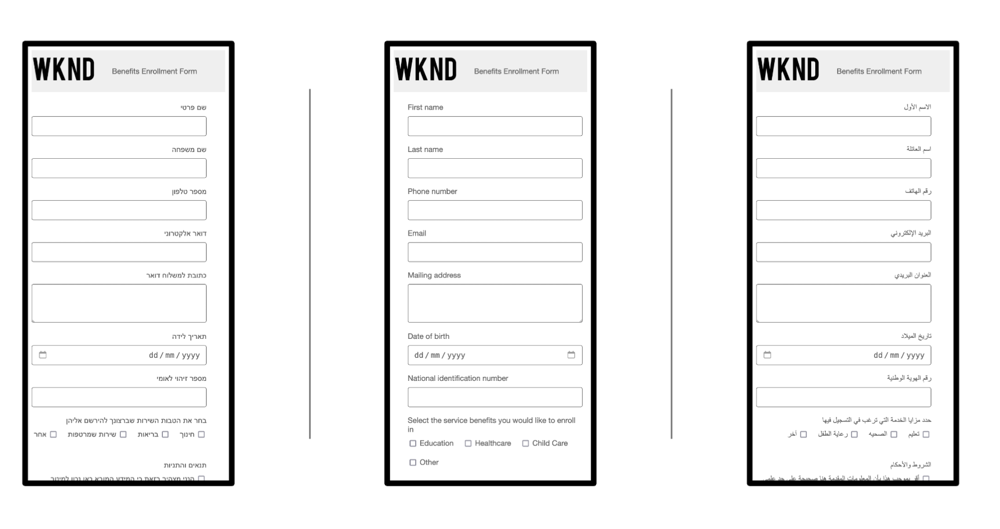

# AEM Forms 조기 액세스 프로그램

AEM Forms 조기 액세스 프로그램 은 다른 사람들보다 먼저 최신 기능에 독점적으로 액세스하고 개발을 구체화할 수 있는 특별한 기회를 제공합니다. 이 프로그램은 다음을 제공합니다.

* 최신 기술이 주류에 도달하기 전에 먼저 접해보십시오.
* 제품 팀과 함께 혁신하여 제품의 미래를 함께 형성하십시오. 사용 사례를 사용하여 개발을 안내하고 혁신이 성숙되도록 하며 실제 과제를 해결합니다.
* 론치 전에 피드백을 제공하고 스쿼시 문제를 해결하여 전체 릴리스 시 더 원활한 사용자 경험을 제공할 수 있습니다.

## 조기 액세스 프로그램에 가입하는 방법

조기 액세스 혁신을 위해 조기 액세스 프로그램에 참여하려면 공식 주소에서 [aem-forms-ea@adobe.com](mailto:aem-forms-ea@adobe.com)(으)로 이메일을 보내 액세스를 요청하면 됩니다. 전체 또는 특정 혁신에 대한 액세스를 요청할 수 있습니다.

## 초기 액세스 혁신

### AEM Forms Generative AI (Gen AI)

적응형 Forms을 위한 생성 AI는 양식 개발 프로세스에 완전히 새로운 수준의 권한과 편의성을 제공합니다. 지능형 AI 기능을 통해 이전보다 더 나은 양식을 더 빠르게 구축할 수 있습니다.

오퍼의 생성 AI 기능은 다음과 같습니다.

* **제품 쿼리에 대한 AI 도우미**: AEM 양식 관련 질문에 대한 답변을 즉시 받아 보십시오. 당사의 AI 비서는 고유한 개인 지식 베이스로 기능하여 플랫폼 내에서 직접 통찰력 있는 지침과 추천을 제공합니다.

* **적응형 양식 생성**: 생성 AI 프롬프트가 있는 완전한 양식을 쉽게 만들 수 있습니다. 생성 AI는 드롭오프를 줄이고 경험을 개인화하는 사용자 친화적인 양식을 자동으로 생성합니다.

* **Forms용 패널 생성**: AI가 중요한 작업을 수행하도록 합니다. 특정 데이터 수집 요구 사항에 맞게 미리 빌드된 양식 패널을 생성합니다. 예를 들어 결제 정보, 고객 환경 설정 또는 여행 세부 정보를 수집하기 위한 섹션을 생성합니다. 사전 정의된 레이아웃 및 기능으로 시간을 절약하고 일관성을 보장합니다.

* **양식 레이아웃 변경**: 생성 AI 프롬프트를 사용하여 다양한 레이아웃 및 디자인을 실험해 보십시오. 마법사나 탭 보기와 같은 다양한 레이아웃을 사용하여 폼에 가장 적합한 레이아웃을 선택하십시오. 생성 AI 프롬프트 를 사용하여 모바일 응답성에 대한 양식을 최적화하고 사용자가 좋아하는 시각적으로 매력적인 양식을 만들 수 있습니다.

* **제출 동작 구성**: 양식에 대한 제출 동작을 쉽게 구성하려면 생성 AI 프롬프트를 사용합니다. 사전 빌드된 제출 액션 라이브러리 또는 자체 개발 팀에서 만들고 배포한 사용자 지정 제출 액션 목록에서 선택합니다.

### AEM Forms Workfront Fusion Connector

AEM Forms Workfront Fusion Connector는 Adobe Experience Manager(AEM) Forms과 Adobe Workfront Fusion 간의 원활한 통합을 지원합니다. Adobe Workfront은 작업 관리 애플리케이션 역할을 하여 전체 작업 라이프사이클을 중앙 집중화하는 한편, Workfront Fusion은 Workfront과 다양한 비즈니스 애플리케이션 간의 연결을 용이하게 하는 통합 플랫폼 역할을 합니다.

AEM Forms Workfront Fusion Connector를 사용하면 적응형 양식 제출 시 자동으로 트리거되는 워크플로를 디자인할 수 있습니다. 예를 들어 제출된 데이터를 검토하는 작업을 특정 개인에게 할당하는 워크플로가 시작되어 적응형 양식을 통해 캡처된 정보를 기반으로 신청서를 승인하거나 거부할 수 있는 시나리오를 생각해 볼 수 있습니다. 이 간소화된 통합은 효율성을 높이고 워크플로우 프로세스에 새로운 수준의 자동화를 제공합니다.

시작할 준비가 되셨습니까? [Adobe Workfront Fusion에 적응형 양식 제출](/help/forms/submit-adaptive-form-to-workfront-fusion.md) 설명서는 혁신적인 기능을 사용하기 위한 단계별 안내서를 제공합니다.

<!--      -->

### 대화형 Forms

대화형 Forms 혁신을 통해 모든 AEM Sites 페이지에서 친숙한 챗봇과 같은 양식과 상호 작용할 수 있습니다.

대화형 Forms 구성 요소를 AEM Sites 페이지로 끌어다 놓고 시작할 수 있습니다. 코딩이 필요하지 않으므로 누구나 흥미롭고 사용하기 쉬운 대화형 Forms 경험을 빠르게 만들 수 있습니다.

대화형 Forms의 기능은 다음과 같습니다.

* **간단한 양식 검색**: 모든 AEM Sites 페이지에서 명확하고 대화식 인터페이스를 통해 필요한 정확한 양식을 찾으십시오.
* **채팅 스타일 완료**: 가상 도우미와 채팅하듯 한 번에 하나씩 질문에 답변합니다. 빠르고 직관적이며 대화처럼 느껴집니다.
* **제출하기 전에 미리 보기**: 제출을 누르기 전에 모든 항목을 다시 확인하십시오. 완료된 양식을 미리 보기하여 정확성을 보장하고 막판 실수를 방지하십시오.

대화형 Forms은 새로운 모습 그 이상입니다. 사용자 경험을 위한 획기적인 기능입니다.  참여를 확대하고, 양식 포기를 줄이고, 웹 사이트와 상호 작용하여 모든 사용자에게 보다 즐거운 경험을 선사합니다.

### Edge Delivery Services을 위한 WYSIWYG 작성

WYSIWYG 작성은 Edge Delivery Services에 적응형 양식을 작성하고 게시할 수 있는 WYSIWYG 인터페이스(범용 편집기 및 적응형 Forms 편집기)를 제공합니다. WYSIWYG 작성은 [문서 기반 작성](/help/edge/docs/forms/overview.md#document-based-authoring-features)의 모든 기능과 다양한 추가 기능을 제공합니다.

* 복잡한 로직을 생성하기 위한 고급 규칙 편집기.
* 사용자 정의 기능을 위한 서버측 확장성.
* 쉬운 양식 만들기 및 시각화를 위한 WYSIWYG 편집 경험.
* 제출된 데이터의 변조 방지 아카이브를 만드는 기록 문서 기능.
* 전자 서명을 위한 Adobe Sign 통합.
* 양식을 미리 채우고 데이터를 제출하기 위한 다양한 데이터 소스 통합.
* 다양한 데이터 소스와의 데이터 구조 및 상호 작용을 정의하기 위한 양식 데이터 모델(FDM).
* Microsoft SharePoint, Microsoft OneDrive, Adobe Workfront Fusion, Salesforce, Microsoft Dynamics 및 더 많은 데이터 소스에 데이터 제출을 포함하여 양식 제출을 처리하기 위한 여러 제출 작업 중에서 선택할 수 있습니다.

### AEM Forms-Marketo 커넥터

AEM Forms to Marketo 커넥터는 Adobe Experience Manager(AEM)로 빌드된 웹 양식(적응형 Forms)과 마케팅 자동화 플랫폼인 Marketo 간의 차이를 메웁니다.

누군가가 AEM Adaptive Forms으로 만든 양식을 웹 사이트에서 제출하면 커넥터는 제출된 데이터를 자동으로 Marketo으로 보내게 합니다. 따라서 수동으로 데이터를 입력할 필요가 없어지고 오류 위험이 줄어듭니다.

데이터 전송 프로세스를 간소화하여 커넥터를 통해 웹 사이트의 전환율을 향상시킬 수 있습니다. 리드 데이터를 Marketo으로 자동으로 보내면 자격을 갖춘 리드가 신속하게 육성 프로그램에 입력되도록 할 수 있습니다.

본질적으로 AEM Forms-Marketo 커넥터는 두 플랫폼의 장점을 활용하여 보다 효율적이고 효과적인 마케팅 단계를 만들 수 있도록 지원합니다.

## 추가적인 조기 액세스 혁신

### RTL(오른쪽에서 왼쪽) 언어 지원

이제 적응형 Forms을 RTL(오른쪽에서 왼쪽) 언어로 표시할 수 있으므로 보다 포괄적인 사용자 경험과 사용 편의성을 제공할 수 있습니다.

이 기능은 아랍어, 히브리어, 우르두어(RTL)에서 쓰고 읽는 언어에 적합하므로 양식의 이해도와 완성도가 향상됩니다.

적응형 Forms에서 RTL(오른쪽에서 왼쪽) 언어를 지원하면 다음과 같은 작업을 수행할 수 있습니다.

* **사용자 기반 확장**: 이제 RTL 언어에 더 익숙한 전 세계 20억 명 이상의 사용자에게 비즈니스를 제공할 수 있습니다.

* **향상된 사용자 경험 제공**: Forms은 오른쪽에서 왼쪽으로 자연스러운 텍스트 흐름, 적절한 UI 요소 정렬 및 사용자 읽기 습관을 미러링하는 직관적인 레이아웃으로 완벽하게 렌더링됩니다. 이렇게 하면 혼동이 줄어들고 양식 완료율이 높아집니다.

* **모바일 응답형 환경 제공**: 모바일 응답성이 내재되어 있으므로 모든 장치에서 Forms에 계속 액세스할 수 있으므로 데스크탑, 태블릿 및 스마트폰 전반에서 원활한 경험을 유지할 수 있습니다.

전반적으로 적응형 Forms의 RTL 언어 지원은 기업이 진정한 글로벌 양식을 디자인할 수 있도록 지원하여 도달 범위, 참여 및 포괄성을 향상시킵니다.

시작할 준비가 되셨습니까? [적응형 Forms RTL 설명서](/help/forms/supporting-new-language-localization-core-components.md)는 RTL 혁신 사용에 대한 단계별 안내서를 제공합니다.

### 향상된 봇 보호 방법

AEM Forms는 널리 사용되는 두 가지 CAPTCHA 솔루션인 Cloudflare Turnstile 및 hCaptcha에 대한 지원을 추가하여 보안 기능을 강화했습니다. 이미 사용 가능한 Google reCAPTCHA에 추가되어 봇 및 스팸 제출로부터 양식을 보호하는 데 있어 사용자에게 더 많은 선택권과 유연성을 제공합니다.

* **Cloudflare Turnstile**: 이 마찰 없는 CAPTCHA는 명시적인 상호 작용이 필요하지 않은 간단한 인증을 통해 사용자를 검증합니다. 양식에 완벽하게 통합되어 사용자 경험을 향상시킵니다.
* **hCaptcha**: 개인 정보 보호에 중점을 둔 이 CAPTCHA는 데이터 개인 정보 보호에 초점을 맞춘 사용자 친화적인 대안을 제공합니다. 보안과 사용자 경험 사이의 균형을 맞추는 것을 목표로 합니다.
* **Google reCAPTCHA**: AEM Forms는 reCAPTCHA v2와 reCAPTCHA Enterprise를 지속적으로 지원하여 안정적이고 잘 정립된 솔루션을 제공합니다.

AEM Forms는 다양한 CAPTCHA 옵션을 제공하여 특정 요구 사항에 가장 적합한 솔루션을 선택할 수 있도록 지원합니다.

이러한 CAPTCHA 솔루션을 적응형 양식과 통합할 준비가 되셨습니까? 설명서에는 [Cloudflare Turnstile](https://experienceleague.adobe.com/ko/docs/experience-manager-cloud-service/content/forms/adaptive-forms-authoring/authoring-adaptive-forms-core-components/create-an-adaptive-form-on-forms-cs/integrate-adaptive-forms-turnstile-core-components), [hCaptcha](https://experienceleague.adobe.com/ko/docs/experience-manager-cloud-service/content/forms/adaptive-forms-authoring/authoring-adaptive-forms-core-components/create-an-adaptive-form-on-forms-cs/integrate-adaptive-forms-hcaptcha-core-components) 및 [Google reCAPTCHA](https://experienceleague.adobe.com/ko/docs/experience-manager-cloud-service/content/forms/adaptive-forms-authoring/authoring-adaptive-forms-core-components/create-an-adaptive-form-on-forms-cs/captcha-adaptive-forms-core-components)에 대한 자세한 지침이 있습니다.

### Doc Assurance API

AEM Forms Doc Assurance API는 AEM Forms Cloud Service 커뮤니케이션 API 내의 도구 세트로, PDF 문서의 보안 및 사용자 상호 작용을 관리할 수 있습니다.

다음은 Doc Assurance API로 수행할 수 있는 작업에 대한 분류입니다.

* **문서 암호화 및 암호 해독**: 암호화로 해당 내용을 읽을 수 없도록 하여 문서를 Protect합니다. 전체 문서, 특정 컨텐츠, 메타데이터 또는 첨부 파일을 포함하여 PDF의 암호화되는 부분을 제어할 수 있습니다.

* **문서에 디지털 서명**: 유효성 검사 및 변조 불가능한 확인을 위해 문서에 디지털 서명을 추가하십시오. 이는 인증 목적 또는 문서 무결성을 보장하기 위해 사용할 수 있습니다

* **Reader 문서 확장(PDF 문서의 사용 권한 적용 또는 편집)**: 추가 사용 권한과 함께 Adobe Reader의 기능을 확장하여 조직에서 대화형 PDF 문서를 쉽게 공유할 수 있습니다.

  Reader 확장(사용 권한) API는 PDF 문서에 사용 권한을 추가합니다. 이 작업은 문서에 주석 추가, 양식 채우기, 문서 저장과 같이 Adobe Reader을 사용하여 PDF 문서를 열 때 일반적으로 사용할 수 없는 기능을 활성화합니다. 서드파티 사용자는 권한이 활성화된 문서에서 작동하는 데 추가 소프트웨어나 플러그인이 필요하지 않습니다.

  PDF 문서에 적절한 사용 권한이 추가되면 수신자는 Adobe Reader 내에서 활성화된 활동을 수행할 수 있습니다.

전체적으로 [Doc Assurance API](https://developer.adobe.com/experience-manager-forms-cloud-service-developer-reference/references/docassurance/)를 사용하면 추가 제어 계층을 추가하여 문서 보안 및 규정 준수를 개선할 수 있습니다.

### Forms 서비스 API

Forms 서비스는 데이터 캡처를 위한 대화형 PDF 양식을 생성합니다. 또한 기존 대화형 PDF 양식에서 데이터를 가져오거나 내보내고 제출된 데이터를 확인하는 데 사용할 수도 있습니다. 기능의 분류는 다음과 같습니다.

* **Forms 렌더링**: AEM Forms Designer를 사용하여 작성한 템플릿과 선택적으로 XML 데이터에서 대화형 PDF 양식을 생성합니다. 이를 통해 선택적으로 데이터를 미리 채운 채울 수 있는 PDF 양식을 기본적으로 생성합니다.

* **데이터 추출 및 가져오기**: 기존 PDF 양식으로 데이터를 가져올 뿐만 아니라 채워진 PDF 양식에서 데이터를 추출할 수 있습니다. XDP 및 XML 데이터 형식이 모두 지원되며, XFA가 아닌 PDF 형식(AcroForms라고도 함)으로 가져오기는 FDF 및 XFDF 데이터를 추가로 지원합니다.

* **데이터 유효성 검사**: AEM Forms Designer를 사용하여 만든 템플릿에 대해 XDP 또는 XML 형식으로 제출된 데이터의 유효성을 검사합니다.

## 추가 참조

* [AEM Forms의 최신 혁신 기능](/help/forms/latest-innovations.md)

* [AEM Forms as a Cloud Service의 기능](/help/forms/home.md)

* [AEM 6.5 Forms(AMS 및 온프레미스)와 AEM Forms as a Cloud Service(AEM CS Forms)의 차이점](/help/forms/notable-changes.md)

