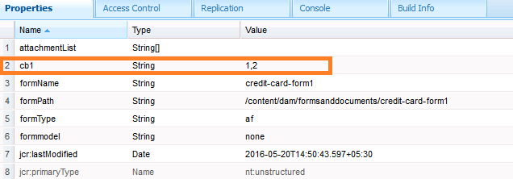

# 양식 제출 메타데이터에 사용자 데이터의 정보 추가 {#adding-information-from-user-data-to-form-submission-metadata}

양식의 요소에 입력된 값을 사용하여 초안 또는 양식 제출의 메타데이터 필드를 계산할 수 있습니다. 메타데이터를 사용하면 사용자 데이터를 기반으로 콘텐츠를 필터링할 수 있습니다. 예를 들어 사용자가 양식의 이름 필드에 John Doe를 입력합니다. 이 정보를 사용하여 이 제출을 이니셜 JD로 분류할 수 있는 메타데이터를 계산할 수 있습니다.

사용자가 입력한 값으로 메타데이터 필드를 계산하려면 메타데이터에 양식의 요소를 추가합니다. 사용자가 해당 요소에 값을 입력하면 스크립트는 해당 값을 사용하여 정보를 계산합니다. 이 정보는 메타데이터에 추가됩니다. 요소를 메타데이터 필드로 추가하면 해당 요소에 대한 키를 제공합니다. 키가 메타데이터의 필드로 추가되고 계산된 정보가 이에 대해 기록됩니다.

예를 들어, 건강 보험 회사는 양식을 게시합니다. 이 양식에서 필드는 최종 사용자의 연령을 캡처합니다. 고객은 여러 명의 사용자가 양식을 제출한 후 특정 연령 범위에서 모든 제출 내용을 확인하고자 합니다. 양식 수가 늘어남에 따라 복잡해지는 모든 데이터를 검토하지 않고 추가 메타데이터를 통해 고객을 지원합니다. 양식 작성자는 검색이 쉽도록 최종 사용자가 채운 속성/데이터를 최상위 수준에서 저장할 수 있도록 구성할 수 있습니다. 추가 메타데이터는 작성자가 구성한 대로 메타데이터 노드의 최상위 수준에 저장된 사용자 입력 정보입니다.

이메일 ID 및 전화 번호를 캡처하는 양식의 다른 예를 생각해 보십시오. 사용자가 이 양식을 익명으로 방문하고 양식을 포기하면 작성자는 이메일 ID 및 전화 번호를 자동으로 저장하도록 양식을 구성할 수 있습니다. 이 양식은 자동으로 저장되며 전화 번호와 이메일 ID는 초안의 메타데이터 노드에 저장됩니다. 이 구성의 사용 사례는 리드 관리 대시보드입니다.

## 메타데이터에 양식 요소 추가 {#adding-form-elements-to-metadata}

다음 단계를 수행하여 메타데이터에 요소를 추가합니다.

1. 편집 모드에서 적응형 양식을 엽니다.\
   편집 모드에서 양식을 열려면 양식 관리자에서 양식을 선택하고 을 누릅니다 **[!UICONTROL 열기]**.
1. 편집 모드에서 구성 요소를 선택하고 을 누릅니다  > **[!DNL Adaptive Form Container]**&#x200B;을 누른 다음 을 누릅니다 .
1. 사이드바에서 를 클릭합니다. **[!DNL Metadata]**.
1. 메타데이터 섹션에서 다음을 클릭합니다. **[!DNL Add]**.
1. 메타데이터 탭의 값 필드를 사용하여 스크립트를 추가합니다. 추가하는 스크립트는 양식의 요소에서 데이터를 수집하고 메타데이터에 공급되는 값을 계산합니다.

   예를 들어, **[!DNL true]** 입력한 기간이 21보다 큰 경우 메타데이터에 로그인됩니다. **[!DNL false]** 21 미만인 경우 기록됩니다. [메타데이터] 탭에 다음 스크립트를 입력합니다.

   `(agebox.value >= 21) ? true : false`

   

   메타데이터 탭에 입력된 스크립트

1. **[!DNL OK]**&#x200B;를 클릭합니다.

사용자가 메타데이터 필드로 선택한 요소에 데이터를 입력한 후, 계산된 정보가 메타데이터에 기록된다. 메타데이터를 저장하도록 구성한 저장소에서 메타데이터를 볼 수 있습니다.

## 업데이트된 양식 제출 메타데이터 보기: {#seeing-updated-form-nbsp-submission-metadata}

위의 예에서 메타데이터는 CRX 저장소에 저장됩니다. 메타데이터는 다음과 같습니다.

메타데이터에 확인란 요소를 추가하면 선택한 값이 쉼표로 구분된 문자열로 저장됩니다. 예를 들어 양식에 확인란 구성 요소를 추가하고 이름을 로 지정합니다. `checkbox1`. 확인란 구성 요소 속성에서 0, 1, 2 값에 대한 운전 면허증, 사회 보장 번호, 여권 항목을 추가합니다.

적응형 양식 컨테이너를 선택하고 양식 속성에서 메타데이터 키를 추가합니다 `cb1` 어떤 게 `checkbox1.value`을 클릭하고 양식을 게시합니다. 고객이 양식을 작성할 때 고객은 확인란 필드에서 Passport 및 사회 보장 번호 옵션을 선택합니다. 값 1과 2는 제출 메타데이터의 cb1 필드에 1, 2로 저장됩니다.

>[!NOTE]
>
>위의 예는 학습 목적만을 위한 것입니다. 에 구성된 대로 올바른 위치에서 메타데이터를 찾습니다. [!DNL Experience Manager Forms] 구현.