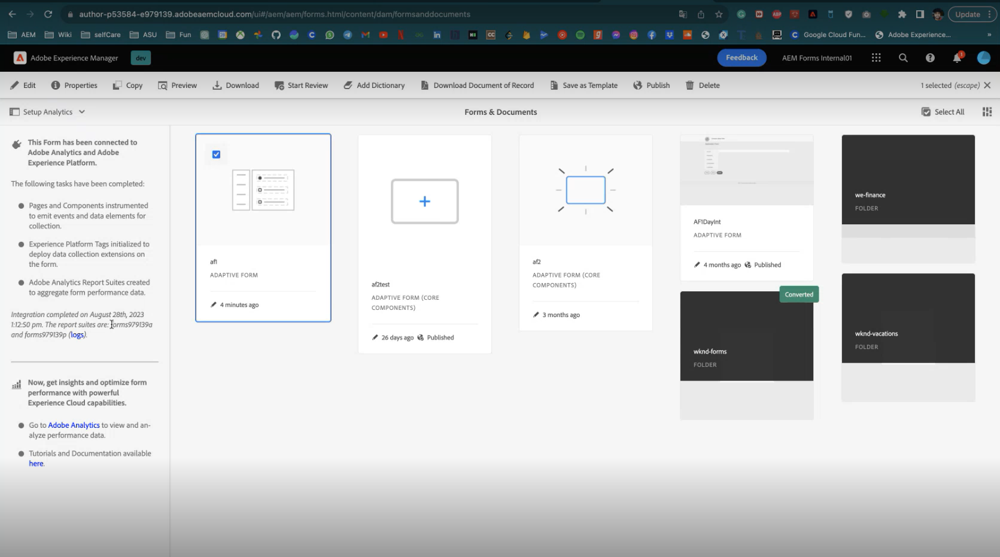
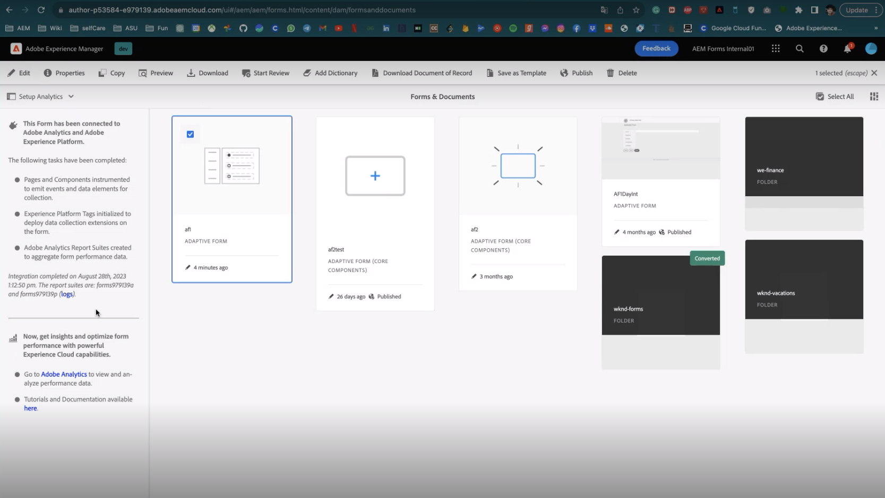

# Experience Cloud 설정 자동화를 사용하여 적응형 양식용 Adobe Analytics 활성화 {#integrate-adobe-analytics-to-aem-forms-with-experience-cloud-setup-automation}

 프리릴리스 기능이며 를 통해 액세스할 수 있습니다. [프리릴리스 채널](https://experienceleague.adobe.com/docs/experience-manager-cloud-service/content/release-notes/prerelease.html#new-features). 

Experience Cloud 설정 자동화는 양식과의 사용자 상호 작용을 추적 및 분석하고 방문자 상호 작용 및 참여에 대한 통찰력을 제공하는 데 도움이 되는 적응형 Forms에 Adobe Analytics을 연결하는 데 도움이 됩니다. Experience Cloud 설정 자동화는 완료 시간 및 중단점과 같은 지표를 평가하는 양식 성능 모니터링에도 도움이 됩니다. 이러한 분석은 일반적인 트렌드와 패턴을 식별하기 위해 익명 사용자와 같은 로그인 상태에 따라 사용자 행동을 구별하는 동시에 더 나은 사용자 경험을 위해 양식을 최적화하는 데 도움이 됩니다.

## Adobe Analytics과 적응형 Forms 통합의 이점 {#advantages-of-integrating-adobe-analytics-with-aem-forms}

* **최종 사용자 행동에 대한 통찰력**: Adobe Analytics은 최종 사용자 동작에 대한 통찰력을 얻고 사용자 작업, 드롭오프 및 완료율을 공개하여 개인이 양식에 참여하는 방법을 더 깊이 이해할 수 있도록 합니다.
* **기술 전문가가 아닌 비즈니스 사용자가 통찰력을 얻을 수 있도록 활성화**: Adobe Analytics은 사용하기 쉬운 인터페이스를 통해 기술 전문가가 아닌 사용자도 양식 사용 데이터에 액세스하고 해석할 수 있으므로 등록 경험을 개선하기 위한 데이터 기반 의사 결정을 촉진합니다.
* **사용을 기반으로 데이터 캡처 경험 최적화**: 조직에서 데이터 캡처의 문제점을 쉽게 식별하여 양식 활용성을 높이고 제출 성과를 높이는 타깃팅된 개선 사항을 제공합니다.

## 적응형 Forms 사용 지표 범위 {#scope-of-adaptive-forms-usage-metrics}

Adobe Analytics은 양식 사용에 대한 중요한 통찰력을 제공하도록 설계된 포괄적인 적응형 Forms 성능 지표 배열을 제공합니다. 다음 지표는 다음과 같습니다.

* **양식 렌디션, 양식 제출, 유효성 검사 오류 및 고유 방문자**&#x200B;를 통해 양식의 사용 및 효과를 평가할 수 있습니다.

* **방문자 인사이트** 방문 및 제출 빈도, 고유 방문자 수를 포함하여 양식 대상자에 대한 포괄적인 보기를 제공합니다.

* **장치 유형** 사용자가 양식에 액세스하는 데 사용하는 장치에 대해 알려 주는 데이터입니다.

* **지리적 분류** 에서는 양식 사용자의 지역 분포를 보여 줍니다.

* **트래픽 소스** 및 **인기 있는 양식** 최상위 참조 도메인과 가장 많이 방문한 양식으로 구성된 지표를 통해 트래픽이 발생하는 위치와 가장 많이 사용되는 양식을 파악할 수 있습니다.

* **상위 양식의 사용자 활동** 는 필드 방문, 양식 렌디션, 유효성 검사 오류, 포기한 양식 및 양식 제출에 대한 통찰력을 제공하여 사용자 행동을 분석할 수 있도록 합니다.

* **양식 체류 시간 타임라인** 에서는 사용자의 양식 참여를 타임라인 기반으로 볼 수 있습니다.

* **방문자 지원이 필요한 영역** 도움말 보기, 유효성 검사 오류 인스턴스 및 필드 방문 빈도가 포함된 지표로, 사용자가 양식을 작성하는 데 도움이 필요할 수 있는 위치를 강조 표시합니다.

{width="100%"}

각 지표에 대한 자세한 내용은 다음을 참조하십시오. [AEM Forms Analytics 보고서 보기 및 이해](/help/forms/view-understand-aem-forms-analytics-reports.md)

## 사전 요구 사항 {#prerequisites}

<!--
Analytics, Data Collection (Formerly Adobe Launch), and Experience Manager (experience.adobe.com)
-->

Adobe Experience Manager Forms에서 Experience Cloud 설정 자동화를 사용하려면 **Adobe Analytics 라이선스**, **데이터 수집(이전 Adobe 실행)** 추적 스크립트 관리 및 **Experience Platform Launch(API)** 능률적인 데이터 집계 및 통찰력 생성.

Experience Cloud 설정 자동화, Adobe Analytics 및 Experience Platform Launch API에 대한 활성 라이선스가 있는 경우 개발자 콘솔 내에서 해당 라이선스의 가용성을 확인해야 합니다.

Forms as a Cloud Service 환경에서 앞에서 설명한 것을 사용할 수 있는지 확인하려면 다음을 방문하십시오. [개발자 콘솔](https://developer.adobe.com/console/projects)로 이동하여 프로그램 id로 프로젝트를 검색합니다. 예를 들어 URL이 있는 환경에 대해 검색합니다 `https://author-p45913-e175111-cmstg.adobeaemcloud.com/index.html`, 프로그램 id는 `p45913-e175111`. Experience Cloud 설정 자동화, Adobe Analytics 및 Experience Platform Launch API가 나열되어 있는지 확인합니다. 이러한 항목이 나열되어 있으면 적응형 Forms에 대해 Adobe Analytics을 활성화할 수 있습니다.

{width="100%"}

<!-- 
>[!NOTE]
> If you have an active licenses for Experience Cloud Setup Automation, Adobe Analytics, and Experience Platform Launch API, you should verify their availability within your developer console.
-->

<!-- For more information about your available integrations, see [troubleshooting Adaptive Forms with Analytics Integration](https://experienceleague.adobe.com/docs/experience-manager-65/forms/integrate-aem-forms-with-experience-cloud-solutions/view-understand-aem-forms-analytics-reports.html)
-->

## Adobe Analytics 구성 {#configure-adobe-analytics}

적응형 Forms에 대해 Adobe Analytics을 활성화하고 구성하려면 아래 나열된 단계를 수행하십시오.

* [기초 구성 요소를 기반으로 적응형 Forms용 Adobe Analytics 활성화](#integrate-adobe-analytics-with-aem-forms-for-foundation-component)
* [핵심 구성 요소를 기반으로 적응형 Forms용 Adobe Analytics 활성화](#integrate-adobe-analytics-with-aem-forms-for-core-components)

### 적응형 Forms for Foundation 구성 요소로 Adobe Analytics 활성화 {#integrate-adobe-analytics-with-aem-forms-for-foundation-component}

1. 클라우드 서비스에 대한 구성 컨테이너 만들기:
   1. 다음으로 이동 **[!UICONTROL 도구 > 일반 > 구성 브라우저]**.
   1. 구성 컨테이너를 선택 또는 만들고 폴더 활성화 **[!UICONTROL 클라우드 구성]**.
   1. 누르기 **[!UICONTROL 저장 및 닫기]** 구성을 저장하고 대화 상자를 종료합니다.
1. AEM 인스턴스에서 **[Forms]** >> **[Forms 및 문서]**.
1. 다음 항목 선택 **[!UICONTROL 양식]** >> **[!UICONTROL 속성]**, **[!UICONTROL 구성 컨테이너]**&#x200B;에서 만들거나 선택한 구성 컨테이너를 선택합니다 **[!UICONTROL 구성 브라우저]** 1단계.
1. 왼쪽 레일에서 작업 패널을 선택하고 **Analytics 설정** 및 **Adobe Analytics 활성화**.
1. 보고서 세트에 선호하는 이름을 입력하고 **[!UICONTROL 다음]** 및 **[!UICONTROL 저장]**.
1. 프로젝트를 저장하면 적응형 양식과 Adobe Analytics이 통합되기 전까지 설정이 잠시 동안 실행되며 **통합 상태**.

   >[!NOTE]
   >
   >설정이 15분 이상 걸리는 경우 양식에 대한 분석을 활성화하도록 다시 시도하십시오.

1. AEM 인스턴스에서 **[!UICONTROL Forms]** >> **[Forms 및 문서]** 및 선택 **[!UICONTROL 양식]**, 아래 이미지에 표시된 대로 Adobe Analytics이 양식에 통합되었습니다.
1. 이제 다음을 볼 수 있습니다. [적응형 양식 Adobe Analytics 보고서](#view-adobe-analytics-report).

{width="100%"}

### 핵심 구성 요소에 대한 적응형 Forms으로 Adobe Analytics 활성화 {#integrate-adobe-analytics-with-aem-forms-for-core-components}

1. AEM 인스턴스에서 **[!UICONTROL Forms]** >> **[!UICONTROL Forms 및 문서]** 및 선택 **[!UICONTROL 양식]**.
1. 왼쪽의 작업 패널을 선택하고 **Analytics 설정** 및 **Adobe Analytics 활성화**.
1. 보고서 세트에 선호하는 이름을 입력하고 **[!UICONTROL 다음]** 및 **[!UICONTROL 저장]**.
1. 프로젝트를 저장하면 적응형 양식과 Adobe Analytics이 통합되기 전까지 설정이 잠시 동안 실행되며 **통합 상태**.

   >[!NOTE]
   >
   >설정이 15분 이상 걸리는 경우 양식에 대한 분석을 활성화하도록 다시 시도하십시오.

1. AEM 인스턴스에서 **[!UICONTROL Forms]** >> **[!UICONTROL Forms 및 문서]** 및 선택 **[!UICONTROL 양식]**, Adobe Analytics이 양식에 통합되었음을 알 수 있습니다.
1. 이제 다음을 볼 수 있습니다. [적응형 양식 Adobe Analytics 보고서](#view-adobe-analytics-report).

## 적응형 Forms Adobe Analytics 보고서 보기 {#view-adobe-analytics-report}

1. AEM 인스턴스에서 **[!UICONTROL Forms]** >> **[!UICONTROL Forms 및 문서]**.
1. 양식을 선택하면 Adobe Analytics이 왼쪽과 같이 Adobe Analytics용으로 활성화된 Forms에 통합됩니다.

   {width="100%"}

1. 클릭 **Adobe Analytics** 보고서를 보고 성과 데이터를 분석합니다.

수동 방법을 사용하여 적응형 양식과 Adobe Analytics을 연결하려면 다음을 방문하십시오. [AEM Forms과 Adobe Analytics 통합](/help/forms/integrate-aem-forms-with-adobe-analytics.md).
