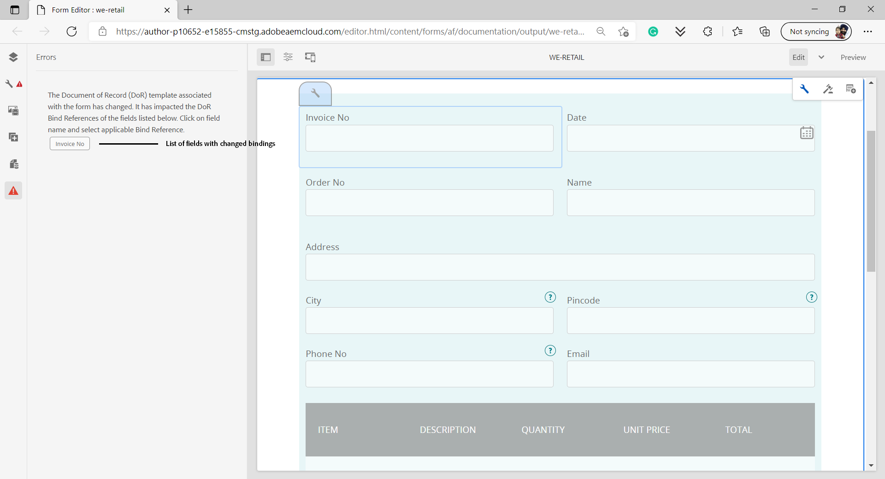

# 적응형 양식의 기록 문서 생성

## 개요 {#overview}

양식을 작성하거나 제출할 때 인쇄 또는 문서 형식으로 양식의 기록을 유지할 수 있습니다. 이 레코드를 DoR(기록 문서)이라고 합니다. 제출된 양식의 인쇄용 사본입니다. 고객이 나중에 작성한 정보에 대한 기록 문서를 참조하거나 기록 문서를 사용하여 양식과 컨텐츠를 PDF 형식으로 함께 보관할 수도 있습니다.


기록 문서를 만들기 위해 XFA 또는 Acroform 기반 템플릿을 적응형 양식을 통해 수집된 데이터와 병합합니다. 자동으로 또는 온디맨드로 기록 문서를 생성할 수 있습니다.
온디맨드 옵션을 사용하면 사용자 지정 XFA 또는 Acroform 기반 템플릿을 지정하여 기록 문서에 사용자 지정 모양을 제공할 수 있습니다.

다음과 같은 작업을 수행할 수 있습니다.

* [XFA 기반 기록 문서 생성](#generate-an-XFA-based-document-of-record)
* [Acroform 기반(Acrobat Form PDF) 기록 문서 생성](#generate-an-Acroform-based-document-of-record)
* [기록 문서 자동 생성](#auto-generate-a-document-of-record)

## 시작하기 전 {#components-to-automatically-generate-a-document-of-record}

기록 문서에 필요한 에셋을 배우고 준비하기 전에:

**기본 템플릿:** Forms Designer 또는 Acrobat Form(AcroForm)에서 작성된 XFA 템플릿(XDP 파일). [기본 템플릿](#base-template-of-a-document-of-record) 기록 문서의 스타일 및 브랜딩 정보를 지정하는 데 사용됩니다. 이전에 XFA 템플릿(XDP 파일)을 AEM Forms 인스턴스에 업로드했습니다

**적응형 양식:** 기록 문서를 생성할 적응형 양식입니다.

## XFA 기반 기록 문서 생성 {#generate-an-XFA-based-document-of-record}

XFA 템플릿(XDP 파일)을 AEM Forms 인스턴스에 업로드합니다. XFA 템플릿(XDP 파일)을 기록 문서의 템플릿으로 사용하도록 적응형 양식을 구성하려면 다음 단계를 수행하십시오.

1. Experience Manager 작성자 인스턴스에서 **[!UICONTROL Forms]** > **[!UICONTROL Forms 및 문서].**
1. 양식을 선택하고 **[!UICONTROL 속성]**.
1. 속성 창에서 을 누릅니다. **[!UICONTROL 양식 모델]**.
1. 다음에서  **[!UICONTROL 양식 모델]** 탭, **[!UICONTROL 다음에서 선택]** 드롭다운, 선택 **[!UICONTROL 스키마]** 또는 **[!UICONTROL 없음]**. 양식을 만들 때 양식 모델을 선택할 수도 있습니다.
1. 양식 모델 탭의 기록 문서 템플릿 구성 섹션에서 다음을 선택합니다. **양식 템플릿을 기록 문서 템플릿으로 연결**. 이 옵션을 선택하면 컴퓨터에서 사용할 수 있는 모든 XFA 템플릿(XDP 파일)이 표시됩니다. 적절한 파일을 선택합니다. 또한 적응형 양식 및 선택한 XFA 템플릿(XDP 파일)에 동일한 스키마(데이터 스키마)를 사용해야 합니다.
1. 클릭 **[!UICONTROL 완료.]**

이제 적응형 양식이 XDP 파일을 기록 문서의 템플릿으로 사용하도록 구성되었습니다. 다음 단계는 [적응형 양식 구성 요소를 해당 템플릿 필드와 바인딩](#bind-adaptive-form-components-with-template-fields).

## Acroform 기반 기록 문서 생성 {#generate-an-Acroform-based-document-of-record}

Adobe Acrobat PDF(Acroform)을 AEM Forms 인스턴스에 업로드합니다. 기록 문서의 템플릿으로 Adobe Acrobat PDF(Acroform)을 사용하도록 적응형 양식을 구성하려면 다음 단계를 수행하십시오.

1. Experience Manager 작성자 인스턴스에서 **[!UICONTROL Forms]** > **[!UICONTROL Forms 및 문서].**
1. 양식을 선택하고 **[!UICONTROL 속성]**.
1. 속성 창에서 을 누릅니다. **[!UICONTROL 양식 모델]**.
1. 다음에서  **[!UICONTROL 양식 모델]** 탭, **[!UICONTROL 다음에서 선택]** 드롭다운, 선택 **[!UICONTROL 스키마]** 또는 **[!UICONTROL 없음]**. 양식을 만들 때 양식 모델을 선택할 수도 있습니다.
1. 양식 모델 탭의 기록 문서 템플릿 구성 섹션에서 다음을 선택합니다. **양식 템플릿을 기록 문서 템플릿으로 연결**. 이 옵션을 선택하면 컴퓨터에서 사용할 수 있는 모든 Acrobat PDF(Acroform)가 표시됩니다. 적절한 파일을 선택합니다.
1. 클릭 **[!UICONTROL 완료.]**

이제 적응형 양식이 기록 문서의 템플릿으로 Acroform을 사용하도록 구성되었습니다. 다음 단계는 [적응형 양식 구성 요소를 해당 템플릿 필드와 바인딩](#bind-adaptive-form-components-with-template-fields).

## 기록 문서 자동 생성 {#auto-generate-a-document-of-record}

적응형 양식이 기록 문서를 자동으로 생성하도록 구성된 경우 양식이 변경될 때마다 기록 문서가 즉시 업데이트됩니다. 예를 들어 필드가 기존 적응형 양식에서 제거되는 경우 해당 필드도 제거되며 기록 문서에 표시되지 않습니다. 기록 문서를 자동으로 생성할 수 있는 많은 다른 이점이 있습니다. :

* 양식 개발자는 데이터 바인딩을 수동으로 유지 관리할 필요가 없습니다. 자동 생성된 기록 문서는 데이터 바인딩 관련 업데이트를 처리합니다.
* 양식 개발자는 기록 문서에서 제외됨으로 표시된 필드를 수동으로 숨길 필요가 없습니다. 자동 생성된 기록 문서는 이러한 필드를 제외하도록 사전 구성되어 있습니다.
* 자동 생성된 기록 문서 옵션을 사용하면 기록 문서에 대한 양식 템플릿을 만드는 데 필요한 시간이 절약됩니다.
* 자동 생성된 기록 문서 옵션을 사용하면 다양한 기본 템플릿을 사용하여 다양한 스타일 및 모양을 사용할 수 있습니다. 조직의 기록 문서에 가장 적합한 스타일과 모양을 선택하는 데 도움이 됩니다. 스타일을 지정하지 않으면 시스템 스타일이 기본값으로 설정됩니다.
* 자동 생성된 기록 문서는 양식의 모든 변경 사항이 기록 문서에 즉시 반영되도록 합니다.

기록 문서를 자동으로 생성하도록 적응형 양식을 구성하려면 다음 단계를 수행하십시오.

1. Experience Manager 작성자 인스턴스에서 **[!UICONTROL Forms]** > **[!UICONTROL Forms 및 문서].**
1. 양식을 선택하고 **[!UICONTROL 속성]**.
1. 속성 창에서 을 누릅니다. **[!UICONTROL 양식 모델]**.
1. 다음에서  **[!UICONTROL 양식 모델]** 탭, **[!UICONTROL 다음에서 선택]** 드롭다운, 선택 **[!UICONTROL 스키마]** 또는 **[!UICONTROL 없음]**. 양식을 만들 때 양식 모델을 선택할 수도 있습니다.
1. 양식 모델 탭의 기록 문서 템플릿 구성 섹션에서 다음을 선택합니다. **기록 문서 생성**.
1. 클릭 **[!UICONTROL 완료.]**

## 템플릿 필드와 적응형 양식 구성 요소 바인딩 {#bind-adaptive-form-components-with-template-fields}

적응형 양식 필드를 템플릿 필드와 바인딩하여 해당 기록 문서 필드에 캡처된 양식 데이터를 표시합니다. 적응형 양식 구성 요소를 해당 기록 문서 템플릿 필드와 바인딩하려면 다음 작업을 수행하십시오.

1. 편집에 사용자 정의 양식 템플릿을 사용하도록 구성된 적응형 양식을 엽니다.

1. 적응형 양식 구성 요소를 선택하고 구성 열기 를 클릭합니다.  아이콘. 속성 브라우저를 엽니다.

1. 속성 브라우저에서 필드를 찾아 선택합니다.

   * (AcroForm 템플릿의 경우) **[!UICONTROL 기록 문서 바인딩 참조 필드]** 속성.
   * (XFA 템플릿의 경우) **[!UICONTROL 데이터 모델 바인딩 참조]** 속성.

1. **[!UICONTROL 저장]**&#x200B;을 클릭합니다.

<!-- 
In the following video Adaptive Form components are binded with corresponding Acroform template fields and the Document of Record is sent as an email attachment.
-->

과 함께 이메일 보내기, 워크플로우 Experience Manager 제출 액션을 사용할 수 있습니다. [기록 문서 단계 및 기타 제출 액션](configuring-submit-actions.md) 기록 문서를 받을 수 있습니다.

## 기록 문서 템플릿에 대한 증분 업데이트 {#document-of-record-template-incremental-updates}

기록 템플릿의 적응형 양식 및 해당 문서는 일정 기간 동안 발전할 수 있습니다. 적응형 양식 또는 기록 문서 템플릿에 필드를 추가, 제거 또는 수정하도록 선택할 수 있습니다.

기록 문서 템플릿을 변경하고 변경된 기록 문서 템플릿을 AEM Forms에 업로드하면 적응형 Forms 편집기가 자동으로 변경된 바인딩을 감지하고 새 바인딩이 필요한 적응형 양식 구성 요소에 대해 알려줍니다. 기록 문서 템플릿에 대한 증분 업데이트를 수행할 수 있습니다.

예를 들어 조직, *We.Retail*&#x200B;에는 AcroForm 기반 기록 문서 템플릿이 있고, *we-retail-invoice.pdf*. 템플릿은 다음과 같습니다.


잠시 동안 템플릿을 사용한 후 조직에서 이름을 바꾸기로 결정합니다 `invoice-number` 필드 대상 `bill-number` 구매자의 필드 및 캡처 이메일 주소. 개발자는 의 이름을 업데이트합니다. `invoice-number` 필드에 추가하고 템플릿에 이메일 필드를 추가합니다. 또한 이라는 새 버전의 템플릿을 만듭니다.  *we-retail-invoice-v2.pdf*.


개발자가 업데이트된 템플릿을 업로드하여 적응형 양식에 적용합니다. 적응형 양식은 바인딩이 변경된 필드 목록을 자동으로 감지하고 표시합니다.



양식 개발자는 적응형 Forms 필드를 해당 기록 문서 템플릿과 바인딩합니다.
>[!VIDEO](assets/we-retail-binding.mp4)

이제 적응형 양식이 제출되면 업데이트된 기록 문서가 만들어집니다.


## 기록 문서 작업 시 주요 고려 사항 {#key-considerations-when-working-with-document-of-record}

적응형 Forms을 위한 기록 문서 작업 시 다음 고려 사항 및 제한 사항을 기억하십시오.

* 기록 문서 템플릿은 서식 있는 텍스트를 지원하지 않습니다. 따라서 정적 적응형 양식 또는 최종 사용자가 입력한 정보에 있는 모든 리치 텍스트는 기록 문서에 일반 텍스트로 표시됩니다.
* 적응형 양식의 문서 조각은 기록 문서에 표시되지 않습니다. 그러나 적응형 양식 조각은 지원됩니다.
* XML 스키마 기반 적응형 양식에 대해 생성된 기록 문서의 콘텐츠 바인딩은 지원되지 않습니다.
* 기록 문서의 현지화된 버전은 사용자가 기록 문서 렌더링을 요청할 때 로케일에 대한 요청에 따라 생성됩니다. 기록 문서의 현지화는 적응형 양식의 현지화와 함께 발생합니다. <!-- For more information on localization of Document of Record and Adaptive Forms see Using AEM translation workflow to localize Adaptive Forms and Document of Record.-->

<!-- ## Configure an adaptive form to generate  Document of Record {#adaptive-form-types-and-their-documents-of-record}

While creating an adaptive form, in the Form Model tab of Adaptive Form properties, select one the following option: 

* **None**
  Select the option to create an Adaptive Form without a form model. When the option is selected, the Document of Record is automatically generated for your Adaptive Form.

* **[Associate form template as a Document of Record template](creating-adaptive-form.md#create-an-adaptive-form-based-on-an-xfa-form-template)**
  
  Select the option to use an XFA Form as a template for Document of Record. 

* **[Generate Document of Record](creating-adaptive-form.md#create-an-adaptive-form-based-on-xml-or-json-schema)**
  Select the option to use an XFA Form as a template. When the option is selected, the Document of Record is automatically generated for your Adaptive Form. When you use an XML schema as a template for an Adaptive Form, ensure that the adaptive form and associated XFA Form use the same XML schema as your Adaptive Form
  

When you select a form model, configure Document of Record using options available under Document of Record Template Configuration. See [Document of Record Template Configuration](#document-of-record-template-configuration). -->

## 적응형 양식 요소 매핑 {#mapping-of-adaptive-form-elements}

다음 표에서는 적응형 양식 구성 요소와 해당 XFA 구성 요소 및 이러한 구성 요소가 기록 문서에 나타나는 경우를 설명합니다.

### 필드 {#fields}

<table>
 <tbody>
  <tr>
   <th>적응형 양식 구성 요소</th>
   <th>해당 XFA 구성 요소</th>
   <th>기록 문서 템플릿에 기본적으로 포함됩니까?</th>
   <th>메모</th>
  </tr>
  <tr>
   <td>버튼</td>
   <td>버튼</td>
   <td>false</td>
   <td> </td>
  </tr>
  <tr>
   <td>확인란</td>
   <td>체크 상자</td>
   <td>true</td>
   <td> </td>
  </tr>
  <tr>
   <td>날짜 선택</td>
   <td>날짜/시간 필드</td>
   <td>true</td>
   <td> </td>
  </tr>
  <tr>
   <td>드롭다운 목록</td>
   <td>드롭다운 목록</td>
   <td>true</td>
   <td> </td>
  </tr>
  <tr>
   <td>낙서 서명</td>
   <td>서명 낙서</td>
   <td>true</td>
   <td> </td>
  </tr>
  <tr>
   <td>숫자 상자</td>
   <td>숫자 필드</td>
   <td>true</td>
   <td> </td>
  </tr>
  <tr>
   <td>암호 상자</td>
   <td>암호 필드</td>
   <td>false</td>
   <td> </td>
  </tr>
  <tr>
   <td>라디오 버튼</td>
   <td>라디오 버튼</td>
   <td>true</td>
   <td> </td>
  </tr>
  <tr>
   <td>텍스트 상자</td>
   <td>텍스트 필드</td>
   <td>true</td>
   <td> </td>
  </tr>
  <tr>
   <td>재설정 버튼</td>
   <td>재설정 버튼</td>
   <td>false</td>
   <td> </td>
  </tr>
  <tr>
   <td>제출 버튼</td>
   <td><p>이메일 제출 단추</p> <p>HTTP 제출 단추</p> </td>
   <td>false</td>
   <td> </td>
  </tr>
  <tr>
   <td>사용 약관</td>
   <td> </td>
   <td>true</td>
   <td> </td>
  </tr>
  <tr>
   <td>첨부 파일</td>
   <td> </td>
   <td>false</td>
   <td>기록 문서 템플릿에서 사용할 수 없습니다. 첨부 파일을 통해 기록 문서에서만 사용할 수 있습니다.</td>
  </tr>
 </tbody>
</table>

### 컨테이너 {#containers}

<table>
 <tbody>
  <tr>
   <th>적응형 양식 구성 요소</th>
   <th>해당 XFA 구성 요소</th>
   <th>메모</th>
  </tr>
  <tr>
   <td>패널<br /> </td>
   <td>하위 양식<br /> </td>
   <td>반복 가능한 패널은 반복 가능한 하위 양식에 매핑됩니다.</td>
  </tr>
 </tbody>
</table>

### 정적 구성 요소 {#static-components}

| 적응형 양식 구성 요소 | 해당 XFA 구성 요소 | 메모 |
|---|---|---|
| 이미지 | 이미지 | 바운드 컨트롤이든 언바운드 컨트롤이든 TextDraw 및 Image 구성 요소는 기록 문서 설정을 사용하여 제외하지 않는 한 항상 XSD 기반 적응형 양식에 대한 기록 문서에 나타납니다. |
| 텍스트 | 텍스트 |

### 표 {#tables}

머리글, 바닥글 및 행과 같은 적응형 Forms 테이블 구성 요소는 해당 XFA 구성 요소에 매핑됩니다. 반복 가능한 패널을 기록 문서의 테이블에 매핑할 수 있습니다.

## 기록 문서의 기본 템플릿 {#base-template-of-a-document-of-record}

기본 템플릿은 기록 문서에 스타일 및 모양 정보를 제공합니다. 자동 생성된 기록 문서의 기본 모양을 사용자 지정할 수 있습니다. 예를 들어 기본 템플릿을 사용하여 회사 로고를 기록 문서의 헤더에 추가하고 저작권 정보를 추가할 수 있습니다.

기본 템플릿의 마스터 페이지는 기록 문서 템플릿의 마스터 페이지로 사용됩니다. 마스터 페이지에는 기록 문서에 적용할 수 있는 페이지 머리글, 페이지 바닥글 및 페이지 번호와 같은 정보가 있을 수 있습니다. 기록 문서 자동 생성을 위한 기본 템플릿을 사용하여 이러한 정보를 기록 문서에 적용할 수 있습니다. 기본 템플릿을 사용하면 필드의 기본 속성을 변경할 수 있습니다.

항상 팔로우 [기본 템플릿 규칙](#base-template-conventions) 기본 템플릿을 디자인할 때

## 기본 템플릿 규칙 {#base-template-conventions}

기본 템플릿은 기록 문서의 머리글, 바닥글, 스타일 및 모양을 정의하는 데 사용됩니다. 머리글과 바닥글에는 회사 로고와 저작권 텍스트와 같은 정보가 포함될 수 있습니다. 기본 템플릿의 첫 번째 마스터 페이지가 복사되어 기록 문서의 마스터 페이지로 사용됩니다. 이 페이지는 머리글, 바닥글, 페이지 번호 또는 기록 문서의 모든 페이지에 표시되어야 하는 기타 정보를 포함합니다. 기본 템플릿 규칙을 준수하지 않는 기본 템플릿을 사용하는 경우 기본 템플릿의 첫 번째 마스터 페이지가 여전히 기록 문서 템플릿에 사용됩니다. 해당 규칙에 따라 기본 템플릿을 디자인하고 기록 문서의 자동 생성에 사용하는 것이 좋습니다.

**기본 페이지 규칙**

* 기본 템플릿에서 루트 하위 양식 이름을 로 지정합니다. `AF_METATEMPLATE` 및 마스터 페이지는 다음과 같습니다 `AF_MASTERPAGE`.

* 이름이 인 마스터 페이지 `AF_MASTERPAGE` 다음 아래에 위치: `AF_METATEMPLATE` 머리글, 바닥글 및 스타일 정보를 추출할 때 루트 하위 양식이 선호됩니다.

* If `AF_MASTERPAGE` 이(가) 없으면 기본 템플릿에 있는 첫 번째 마스터 페이지가 사용됩니다.

**필드에 대한 스타일 규칙**

* 기록 문서의 필드에 스타일을 적용하려면 기본 템플릿은에 있는 필드를 제공합니다. `AF_FIELDSSUBFORM` 아래 하위 항목 `AF_METATEMPLATE` 루트 하위 양식.

* 이러한 필드의 속성은 기록 문서의 필드에 적용됩니다. 이 필드는 다음 위치에 있어야 합니다. `AF_<name of field in all caps>_XFO` 명명 규칙. 예를 들어 확인란의 필드 이름은 `AF_CHECKBOX_XFO`.

기본 템플릿을 만들려면 Forms Designer에서 다음을 수행하십시오.

1. 클릭 **[!UICONTROL 파일]** > **[!UICONTROL 신규]**.
1. 다음 항목 선택 **[!UICONTROL 템플릿 기반]** 옵션을 선택합니다.

1. 다음 항목 선택 **[!UICONTROL Forms - 기록 문서]** 범주.
1. 선택 **[!UICONTROL DoR 기본 템플릿]**.
1. 클릭 **[!UICONTROL 다음]** 필요한 정보를 제공합니다.

1. (선택 사항) 기록 문서의 필드에 적용할 필드의 스타일 및 모양을 수정합니다.
1. 양식을 저장합니다.

이제 저장된 양식을 기록 문서의 기본 템플릿으로 사용할 수 있습니다. 기본 템플릿에 있는 스크립트를 수정하거나 제거하지 마십시오.

**기본 템플릿 수정**

* 기본 템플릿의 필드 위에 스타일을 적용하지 않을 경우 기본 템플릿에서 해당 필드를 제거하여 기본 템플릿으로의 업그레이드가 자동으로 선택되도록 하는 것이 좋습니다.
* 기본 템플릿을 수정하는 동안 스크립트를 제거, 추가 또는 수정하지 마십시오.

위에서 언급한 규칙과 지침을 따라 기본 템플릿을 디자인합니다.

## 기록 문서의 브랜딩 정보 사용자 정의 {#customize-the-branding-information-in-document-of-record}

기록 문서를 생성하는 동안 기록 문서 탭에서 기록 문서에 대한 브랜딩 정보를 변경할 수 있습니다. 기록 문서 탭에는 로고, 모양, 레이아웃, 머리글과 바닥글, 면책조항, 선택하지 않은 확인란과 라디오 단추 옵션 포함 여부 등의 옵션이 포함되어 있습니다.

기록 문서 탭에 입력하는 브랜딩 정보를 현지화하려면 브라우저의 로케일이 적절하게 설정되어 있는지 확인하십시오. 기록 문서의 브랜딩 정보를 사용자 정의하려면 다음 단계를 수행합니다.

1. 기록 문서에서 패널(루트 패널)을 선택한 다음 을 누릅니다 .
1. 누르기 . 기록 문서 탭이 나타납니다.
1. 기록 문서를 렌더링하기 위한 기본 템플릿 또는 사용자 지정 템플릿을 선택합니다. 기본 템플릿을 선택하면 템플릿 드롭다운 아래에 기록 문서의 축소판 미리 보기가 나타납니다.
1. 기본 또는 사용자 지정 템플릿 선택 여부에 따라 다음 속성의 일부 또는 전체가 기록 문서 탭에 표시됩니다. 아래 언급된 등록 정보를 지정하여 기록 문서의 모양을 정의합니다.

   1. **기본 속성**:
      * **템플릿**: 사용자 지정 템플릿을 선택하면에서 XDP 선택 을 찾아봅니다. [!DNL AEM Forms] 서버입니다. 에 아직 없는 템플릿을 사용하려면 [!DNL AEM Forms] 서버, 먼저 XDP를 [!DNL AEM Forms] 서버입니다.
      * **강조 색상**: 문서 또는 레코드 PDF에서 머리글 텍스트 및 구분 기호를 렌더링하는 색상입니다.
      * **글꼴 모음**: 기록 문서 PDF 내 텍스트의 글꼴 모음
      * **데이터 모델에 바인딩되지 않은 양식 개체 포함**: 속성을 설정하면 기록 문서의 스키마 기반 적응형 양식에서 바인딩되지 않은 필드가 포함됩니다.
      * **기록 문서에서 숨겨진 필드 제외**: 속성을 설정하면 기록 문서에서 제외할 숨겨진 필드가 식별됩니다.
      * **패널 설명 숨기기**: 속성을 설정하면 패널/테이블에 대한 설명이 기록 문서에서 제외됩니다. 패널 및 테이블에 적용할 수 있습니다.

      

   1. **양식 필드 속성**:
      * **확인란 및 라디오 버튼 구성 요소의 경우 선택한 값만 표시합니다**: 속성을 설정하면 확인란 및 라디오 버튼의 선택한 값만 표시됩니다. [!UICONTROL 기록 문서].
      * **다중 값에 대한 구분 기호**: 쉼표나 줄 바꿈과 같은 구분 기호를 선택하여 여러 값을 표시할 수 있습니다.
      * **옵션 정렬**: 원하는 정렬(가로, 세로, 적응형 양식과 동일)을 선택하여 확인란이나 라디오 단추와 같은 필드에 대한 정렬을 설정할 수 있습니다 [!UICONTROL 기록 문서]. 기본적으로 수직 정렬은 의 필드에 대해 설정됩니다 [!UICONTROL 기록 문서]. 에서 속성 설정 [!UICONTROL 양식 필드 속성] DoR의 은 [!UICONTROL 항목 정렬] 를 참조하십시오. 이 경우 다음을 선택합니다 [!UICONTROL 적응형 양식과 동일] 옵션을 선택하면 적응형 양식 작성자 인스턴스에 구성된 대로 정렬이 사용됩니다. [!UICONTROL 기록 문서] 필드.
      * **수평 정렬 옵션 수**:수평 정렬을 위해 기록 문서에 표시할 옵션 수를 설정할 수 있습니다.

      

   1. **마스터 페이지  속성**:
      * **로고 이미지**: 적응형 양식에서 로고 이미지를 사용하거나, DAM에서 로고 이미지를 선택하거나, 컴퓨터에서 로고 이미지를 업로드할 수 있습니다.
      * **양식 제목**: DoR의 제목
      * **머리글 텍스트**: 기록 문서의 머리글 섹션에 나타나는 텍스트입니다.
      * **면책조항 레이블**: 면책조항 레이블.
      * **면책조항**: 기록 문서에 대한 권한 및 의무의 범위를 지정하는 텍스트입니다.
      * **면책조항 텍스트**: 면책조항 텍스트.

      
   >[!NOTE]
   >
   >6.3 이전 버전의 Designer로 만든 적응형 양식 템플릿을 사용하는 경우 Accent Color 및 Font Family 속성이 작동하려면 루트 하위 양식 아래의 적응형 양식 템플릿에 다음 항목이 있는지 확인하십시오.

   ```xml
   <proto>
   <font typeface="Arial"/>
   <fill>
   <color value="4,166,203"/>
   </fill>
   <edge>
   <color value="4,166,203"/>
   </edge>
   </proto>
   ```

1. 브랜딩 변경 사항을 저장하려면 을 누릅니다 **[!UICONTROL 완료]**.

## 적응형 양식 편집기의 기록 지원 문서 {#dor-support-in-adaptiveform}

다음을 구성할 수 있습니다. [!UICONTROL 기록 문서] 적응형 양식 편집기 또는 적응형 양식 템플릿 편집기에서 바로 템플릿을 사용할 수 있습니다.

적응형 양식 편집기의 작성자 인스턴스에서 다음 단계를 수행합니다.

1. 다음 항목 선택 **[!UICONTROL 적응형 양식 컨테이너(루트)]** 구성 요소.
1. 클릭  아이콘을 클릭하여 엽니다. **[!UICONTROL 속성]** 적응형 양식 컨테이너.
1. 를 엽니다. **[!UICONTROL 기록 문서 템플릿]** 을(를) 탭하고 다음 옵션 중에서 선택합니다.
   * **[!UICONTROL 없음]**: 이 옵션을 선택한 경우 아니요 [!UICONTROL 기록 문서] 적응형 양식용 템플릿이 작성되었습니다.

   * **[!UICONTROL 양식 템플릿을 기록 문서 템플릿으로 연결]**:이 옵션을 선택하면 XFA 양식이 기록 문서의 템플릿으로 사용됩니다.

   * **[!UICONTROL 기록 문서 생성]**: 이 옵션을 선택하면 [!UICONTROL 기록 문서] 적응형 양식에 대해 템플릿이 자동으로 생성됩니다.

1. 누르기  속성을 저장합니다.


>[!NOTE]
>
>날짜 [!UICONTROL 기록 문서] 적응형 양식 템플릿 편집기를 사용하여 템플릿이 작성되면 두 가지 옵션만 사용할 수 있습니다. [!UICONTROL 기록 문서 템플릿] 다음으로 탭 [!UICONTROL 없음] 및 [!UICONTROL 기록 문서 생성].

## 기록 문서의 패널에 대한 표 및 열 레이아웃 {#table-and-column-layouts-for-panels-in-document-of-record}

적응형 양식은 여러 양식 필드가 있는 긴 양식일 수 있습니다. 기록 문서를 적응형 양식의 정확한 사본으로 저장하지 않을 수 있습니다. 이제 기록 문서 PDF에 하나 이상의 적응형 양식 패널을 저장하기 위한 표 또는 열 레이아웃을 선택할 수 있습니다.

기록 문서를 생성하기 전에 패널의 설정에서 해당 패널의 기록 문서에 대한 레이아웃을 테이블 또는 열로 선택합니다. 패널의 필드는 기록 문서에서 적절하게 구성됩니다.


기록 문서의 표 레이아웃에 렌더링된 패널의 필드


기록 문서의 열 레이아웃에 렌더링된 패널의 필드

## 기록 문서 설정 {#document-of-record-settings}

기록 문서 설정을 사용하면 기록 문서에 포함할 옵션을 선택할 수 있습니다. 예를 들어 은행에서 이름, 연령, 주민등록번호, 전화번호를 양식으로 입력할 수 있습니다. 양식은 은행 계좌 번호와 지점 세부 사항을 생성합니다. 기록 문서에 이름, 주민등록번호, 은행 계좌 및 지점 상세내역만 표시하도록 선택할 수 있습니다.

기록 문서 구성 요소의 설정은 해당 속성에서 사용할 수 있습니다. 구성 요소의 속성에 액세스하려면 구성 요소를 선택하고 을 클릭합니다.  을 클릭합니다. 속성은 사이드바에 나열되며, 사이드바에서 다음 설정을 찾을 수 있습니다.

**필드 수준 설정**

* **기록 문서에서 제외**: 속성을 true로 설정하면 기록 문서에서 필드가 제외됩니다. 이름이 인 스크립트 가능 속성입니다. `excludeFromDoR`. 동작은 다음에 따라 다릅니다. **숨겨진 경우 DoR에서 필드 제외** 양식 수준 속성입니다.

* **패널을 테이블로 표시:** 패널에 6개 이하의 필드가 있는 경우 속성을 설정하면 패널이 기록 문서의 테이블로 표시됩니다. 패널에만 적용됩니다.
* **기록 문서에서 제목 제외:** 속성을 설정하면 패널/테이블의 제목이 기록 문서에서 제외됩니다. 패널 및 테이블에만 적용할 수 있습니다.
* **기록 문서에서 설명 제외:** 속성을 설정하면 패널/테이블에 대한 설명이 기록 문서에서 제외됩니다. 패널 및 테이블에만 적용할 수 있습니다.

**양식 수준 설정**

* **DoR에 바인딩되지 않은 필드 포함:** 속성을 설정하면 기록 문서에 있는 스키마 기반 적응형 양식의 바인딩되지 않은 필드가 포함됩니다. 기본적으로 true입니다.
* **숨겨진 경우 DoR에서 필드 제외:** 양식 제출 시 기록 문서에서 숨겨진 필드를 제외하려면 속성을 설정하십시오. 활성화 시 [서버에서 다시 유효성 검사](/help/forms/configuring-submit-actions.md#server-side-revalidation-in-adaptive-form-server-side-revalidation-in-adaptive-form)로 나열된 경우, 서버는 기록 문서에서 숨겨진 필드를 제외하기 전에 해당 필드를 다시 계산합니다.

## 사용자 지정 XCI 파일 사용

XCI 파일은 문서의 다양한 속성을 설정하는 데 도움이 됩니다. Forms as a Cloud Service에는 마스터 XCI 파일이 있습니다. 사용자 지정 XCI 파일을 사용하여 마스터 XCI 파일에 지정된 하나 이상의 기본 속성을 재정의할 수 있습니다. 예를 들어 글꼴을 문서에 포함하거나 모든 문서에 대해 태그가 지정된 속성을 사용하도록 선택할 수 있습니다. 다음 표는 XCI 옵션을 지정합니다.

| XCI 옵션 | 설명 |
|--- |--- |
| config/present/pdf/creator | 문서 정보 사전의 작성자 항목을 사용하여 문서 작성자를 식별합니다. 이 사전에 대한 자세한 내용은 [PDF 참조 안내서](https://opensource.adobe.com/dc-acrobat-sdk-docs/acrobatsdk/). |
| config/present/pdf/producer | 문서 정보 사전의 제작자 항목을 사용하여 문서 제작자를 식별합니다. 이 사전에 대한 자세한 내용은 [PDF 참조 안내서](https://opensource.adobe.com/dc-acrobat-sdk-docs/acrobatsdk/). |
| 구성/현재/레이아웃 | 출력이 단일 패널인지 또는 페이지 매김되어 있는지 여부를 제어합니다. |
| config/present/pdf/compression/level | PDF 문서를 생성할 때 사용할 압축 정도를 지정합니다. |
| config/present/pdf/fontInfo/embed | 출력 문서의 글꼴 포함을 제어합니다. |
| config/present/pdf/scriptModel | 출력 PDF 문서에 XFA 관련 정보를 포함할지 여부를 제어합니다. |
| config/present/common/data/adjustData | XFA 애플리케이션이 병합 후 데이터를 조정하는지 여부를 제어합니다. |
| config/present/pdf/renderPolicy | 페이지 컨텐츠 생성이 서버에서 수행되는지 아니면 클라이언트로 연기되는지를 제어합니다. |
| config/present/common/locale | 출력 문서에 사용되는 기본 로케일을 지정합니다. |
| 구성/현재/대상 | 현재 요소에 포함된 경우 출력 형식을 지정합니다. openAction 요소에 포함된 경우, 대화형 클라이언트에서 문서를 열 때 수행할 작업을 지정합니다. |
| config/present/output/type | 파일에 적용할 압축 유형이나 생성할 출력 유형을 지정합니다. |
| config/present/common/temp/uri | 양식 URI를 지정합니다. |
| config/present/common/template/base | 양식 디자인에서 URI의 기본 위치를 제공합니다. 이 요소가 없거나 비어 있으면 양식 디자인의 위치가 기반으로 사용됩니다. |
| config/present/common/log/to | 로그 데이터나 출력 데이터가 기록되는 위치를 제어합니다. |
| config/present/output/to | 로그 데이터나 출력 데이터가 기록되는 위치를 제어합니다. |
| config/present/script/currentPage | 문서를 열 때의 초기 페이지를 지정합니다. |
| config/present/script/exclude | 무시할 이벤트를 Forms에 as a Cloud Service으로 알립니다. |
| config/present/pdf/linearized | 출력 PDF 문서의 선형 여부를 제어합니다. |
| config/present/script/runScripts | Forms이 as a Cloud Service으로 실행하는 스크립트 세트를 제어합니다. |
| config/present/pdf/태그됨 | 출력 PDF 문서에 태그를 포함하도록 제어합니다. 태그는 PDF 컨텍스트에서 문서의 논리적 구조를 노출하기 위해 문서에 포함된 추가 정보입니다. 태그는 접근성 지원 및 서식 변경을 지원합니다. 예를 들어, 화면 판독기가 텍스트 중간에 이를 발음하지 않도록 페이지 번호를 아티팩트로 태그 지정할 수 있습니다. 태그를 사용하면 문서가 더 유용해지지만 문서 크기와 문서를 만드는 처리 시간도 늘어납니다. |
| config/present/pdf/fontInfo/alwaysEmbed | 출력 문서에 포함된 글꼴을 지정합니다. |
| config/present/pdf/fontInfo/neverEmbed | 출력 문서에 포함해서는 안 되는 글꼴을 지정합니다. |
| config/present/pdf/pdfa/part | 문서가 준수하는 PDF/A 사양의 버전 번호를 지정합니다. |
| config/present/pdf/pdfa/amd | PDF/A 사양의 수정 수준을 지정합니다. |
| config/present/pdf/pdfa/conformance | PDF/A 사양과 호환 레벨을 지정합니다. |
| config/present/pdf/version | 생성할 PDF 문서의 버전을 지정합니다. |
| config/present/pdf/version/map | 문서의 대체 글꼴을 지정합니다. |

### Forms as a Cloud Service 환경에서 사용자 지정 XCI 파일 사용

1. 사용자 지정 XCI 파일을 개발 프로젝트에 추가합니다.
1. 다음을 지정하십시오. [인라인 속성](/help/implementing/deploying/configuring-osgi.md):

   ```JSON
    {
     "xciFilePath": "[path of XCI file]"
    }
   ```

   예를 들어

   ```JSON
    {
     "xciFilePath": "/content/dam/formsanddocuments/customMinionProBoldAndTagged.xci"
    }
   ```

1. 프로젝트를 Cloud Service 환경에 배포합니다.

### 로컬 Forms as a Cloud Service 개발 환경에서 사용자 지정 XCI 파일 사용

1. XCI 파일을 로컬 개발 환경에 업로드합니다.
1. Cloud Service SDK 구성 관리자를 엽니다. 기본 URL은: <http://localhost:4502/system/console/configMgr>.
1. 을(를) 찾아 엽니다. **[!UICONTROL 적응형 Forms 및 대화형 통신 웹 채널]** 구성.
1. XCI 파일의 경로를 지정하고 **[!UICONTROL 저장]**.
