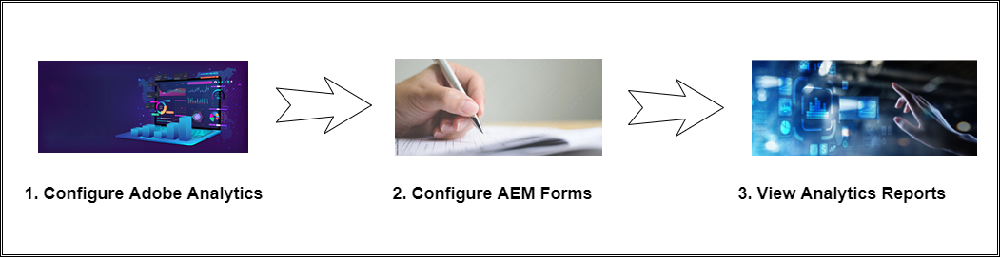
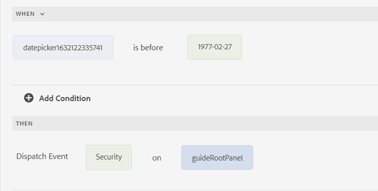

# 통합: AEM Forms [!DNL Adobe Analytics] {#integrate-aem-forms-with-adobe-analytics}

| 버전 | 문서 링크 |
| -------- | ---------------------------- |
| AEM 6.5 | [여기 클릭](https://experienceleague.adobe.com/docs/experience-manager-65/forms/integrate-aem-forms-with-experience-cloud-solutions/configure-analytics-forms-documents.html) |
| AEM as a Cloud Service | 이 문서 |

<span class="preview"> 이 문서에서는 적응형 양식에서 Adobe Analytics을 활성화하는 수동 절차에 대해 간략히 설명합니다. 그러나 Adobe은 [Experience Cloud 설정 자동화를 사용하여 적응형 양식용 Adobe Analytics 활성화](/help/forms/enable-adobe-analytics-adaptive-form-using-experience-cloud-setup-automation.md). </span>

AEM Forms은 와 통합됩니다. [Adobe Analytics](https://experienceleague.adobe.com/docs/analytics-learn/tutorials/overview.html?lang=en) 을 사용하여 게시된 양식에 대한 성능 지표를 캡처하고 추적할 수 있습니다. 이러한 지표를 분석하는 목표는 비즈니스 사용자가 최종 사용자 동작에 대한 통찰력을 얻고 데이터 캡처 경험을 최적화할 수 있도록 하는 것입니다. 적응형 Forms용 Adobe Analytics을 통해 로그인한 사용자와 로그인하지 않은(익명) 사용자의 행동을 모두 캡처하고 추적할 수 있습니다.

이 문서에서 설명하는 작업을 수행한 후에서 보고서를 구성하고 볼 수 있습니다. [!DNL Adobe Analytics]다음 비디오에서 확인할 수 있습니다.

>[!VIDEO](https://video.tv.adobe.com/v/337262)

다음을 사용할 수 있습니다. [!DNL Adobe Analytics] 적응형 양식을 사용하는 동안 사용자가 직면한 상호 작용 패턴 및 문제를 발견할 수 있습니다. 기본, [!DNL Adobe Analytics] 다음 이벤트에 대한 정보를 추적 및 저장합니다.

* **렌더링**: 양식 열기 횟수

* **제출**: 양식 제출 횟수.

* **중단**: 양식을 완료하지 않고 사용자가 나가는 횟수입니다.

* **오류**: 패널 및 패널의 필드에서 발생한 오류 수.

* **도움말**: 사용자가 패널 및 패널의 필드에 대한 도움말을 연 횟수입니다.

* **현장 방문**: 사용자가 양식의 필드를 방문한 횟수입니다.

* **저장**: 사용자가 Forms 포털에 양식을 저장한 횟수입니다.

기본 이벤트 외에도 규칙 편집기를 사용하여 적응형 양식에서 사용자 지정 이벤트를 정의하고 이러한 이벤트를 의 이벤트에 매핑할 수 있습니다 [!DNL Adobe Analytics]

다음 그림은 보고서를 보기 전에 수행해야 하는 작업을 보여 줍니다 [!DNL Adobe Analytics]:



## 1. 구성 [!DNL Adobe Analytics] {#Configure-adobe-analytics}

구성하기 전에 [!DNL Adobe Analytics], 만들기:

* 로그온할 Adobe ID [Adobe Experience Cloud](https://experience.adobe.com/#/home).
* A [보고서 세트](https://experienceleague.adobe.com/docs/analytics/admin/manage-report-suites/new-report-suite/t-create-a-report-suite.html).


### AEM Forms 설치 및 [!DNL Adobe Analytics] 확장 {#install-extensions}

AEM Forms을 구성하려면 다음 단계를 수행하십시오. [Adobe Analytics](https://experienceleague.adobe.com/docs/experience-platform/tags/extensions/adobe/analytics/overview.html) 확장:

1. Adobe Experience Cloud에 로그온하고 회사에 적합한 이름을 선택합니다.

1. 누르기 **[!UICONTROL Launch/데이터 수집]** 및 탭 **[!UICONTROL Launch/Data Collection으로 이동]**.

1. 누르기 **[!UICONTROL 새 속성]** 구성의 이름을 지정합니다.

1. 도메인 이름을 지정하고 을 누릅니다 **[!UICONTROL 저장]** 속성을 저장합니다.

1. 태그 속성 목록에서 사용할 수 있는 구성 이름을 탭합니다.

1. 다음에서 **[!UICONTROL 작성]** 섹션, 탭 **[!UICONTROL 확장]**.

1. 누르기 **[!UICONTROL 카탈로그]** 및 탭 **[!UICONTROL 설치]** 대상: **[!UICONTROL Adobe Experience Manager Forms]** 확장명. **[!UICONTROL Adobe Experience Manager Forms]** 에서 사용할 수 있는 설치된 확장 목록에 이 표시됩니다. **설치됨** 탭.

1. 누르기 **[!UICONTROL 설치]** 대상: **[!UICONTROL Adobe Analytics]** 확장명.
1. 에서 보고서 세트 이름 선택 **[!UICONTROL 개발 보고서 세트]**, **[!UICONTROL 스테이징 보고서 세트]**, 및 **[!UICONTROL 제품 보고서 세트]** 드롭다운 목록 및 탭 **[!UICONTROL 저장]** 확장을 저장합니다.

### 데이터 요소 구성 {#configure-data-elements}

이벤트에 대해 만들어진 규칙에서 구성된 데이터 요소를 선택할 수 있습니다. 적응형 양식에서 이벤트가 발생하면 AEM Forms은 이러한 데이터 요소를 [!DNL Adobe Analytics].

설치 후 **[!UICONTROL Adobe Experience Manager Forms]** 확장에서는 다음 데이터 요소를 만들 수 있습니다.

<table>
 <tbody>
  <tr>
   <td>필드 이름</th>
   <td>필드 제목</th>
   <td>FormInstance</th>
  </tr>
  <tr>
   <td>FormName<br /> </td>
   <td>FormTitle<br /> </td>
   <td>PageName</td>
  </tr>
  <tr>
   <td>PageURL<br /> </td>
   <td>패널 제목<br /> </td>
   <td>체류 시간</td>
  </tr>
 </tbody>
</table>

데이터 요소를 구성하려면 다음 단계를 수행하십시오.

1. 다음에서 **[!UICONTROL 작성]** 섹션, 탭 **[!UICONTROL 데이터 요소]**.

1. 누르기 **[!UICONTROL 새 데이터 요소 만들기]**.

1. 데이터 요소의 이름을 지정합니다. 예: FormTitle 데이터 요소 유형에 대한 Form Title.

1. 지정 **[!UICONTROL Adobe Experience Manager Forms]** 를 확장 이름으로 사용하십시오.

1. 다음 항목 선택 **[!UICONTROL 데이터 요소 유형]**.

1. 누르기 **[!UICONTROL 저장]** 를 클릭하여 데이터 요소를 저장합니다.

   >[!VIDEO](https://video.tv.adobe.com/v/337472)

### 규칙 구성 {#configure-rules}

다음을 수행하여 을 기반으로 규칙을 만듭니다. **[!UICONTROL Adobe Experience Manager Forms]** 확장:

1. 다음에서 **[!UICONTROL 작성]** 섹션, 탭 **[!UICONTROL 규칙]**.

1. 누르기 **[!UICONTROL 새 규칙 만들기]**.

1. 규칙 이름을 지정합니다. 예를 들어 양식 제출을 사용하여 양식 제출을 기록할 수 있습니다.

1. 다음에서 **[!UICONTROL 이벤트]** 섹션, 탭 **[!UICONTROL 추가]**.

1. 지정 **[!UICONTROL Adobe Experience Manager Forms]** 를 확장 이름으로 사용하십시오.

1. 이벤트 유형을 선택합니다. 에 대한 입력 **[!UICONTROL 이름]** 필드는 선택한 이벤트 유형에 따라 자동으로 채워집니다.

1. 누르기 **[!UICONTROL 변경 내용 유지]** 이벤트를 저장합니다.

1. 다음에서 **[!UICONTROL 작업]** 섹션, 탭 **[!UICONTROL 추가]**.

1. 지정 **[!UICONTROL Adobe Analytics]** 를 확장 이름으로 사용하십시오.

1. 선택 **[!UICONTROL 변수 설정]** 를 작업 유형으로 사용하십시오. 드롭다운 목록에서 사용할 수 있는 옵션은 다음과 같습니다.

   * **[!UICONTROL 변수 설정]**: 이 작업 유형을 사용하여 선택한 데이터 요소를 AEM Forms에서 (으)로 전송하는 이벤트 유형을 정의합니다. [!DNL Adobe Analytics].

   * **[!UICONTROL 비콘 보내기]**: 이 작업 유형을 사용하여 AEM Forms에서 로 데이터를 전송합니다 [!DNL Adobe Analytics].

   * **[!UICONTROL 변수 지우기]**: 이벤트가 한 번만 등록되도록 데이터 추적을 지우려면 이 작업 유형을 사용하십시오. [!DNL Adobe Analytics].

     권장되는 접근 방법은 **[!UICONTROL 변수 설정]** 작업 유형을 사용하여 이벤트 및 데이터 요소를 구성한 다음 **[!UICONTROL 비콘 보내기]** 데이터를 보낸 다음 **[!UICONTROL 변수 지우기]** 데이터 추적을 지웁니다.

1. 다음에서 **[!UICONTROL Prop]** 섹션에서 드롭다운 목록에서 사용할 수 있는 보고서 세트 옵션을 를 사용하여 정의된 데이터 요소와 매핑합니다. [데이터 요소 구성](#configure-data-elements).

   예를 들어 를 보냅니다. **양식 제목** AEM Forms에서 (으)로 데이터 요소 [!DNL Adobe Analytics] 양식을 제출할 때:
   1. 다음에서 **[!UICONTROL Prop]** 섹션에서 보고서 세트에 사용할 수 있는 양식 제목 을 위한 prop을 선택한 다음 를 누릅니다  에서 만든 양식 제목에 매핑하려면 [데이터 요소 구성](#configure-data-elements).

      

   1. 누르기 **[!UICONTROL 다른 항목 추가]** 목록에 더 많은 데이터 요소를 추가합니다.

1. 다음에서 **[!UICONTROL 이벤트]** 섹션에서 보고서 세트에 사용할 수 있는 옵션에서 이벤트를 선택하고 을 누릅니다 **[!UICONTROL 변경 내용 유지]**.

1. 다음에서 **[!UICONTROL 작업]** 섹션, + 탭 및 지정 **[!UICONTROL Adobe Analytics]** 를 확장 이름으로 사용하십시오.

1. 선택 **[!UICONTROL 비콘 보내기]** 를 작업 유형으로 사용하십시오. 오른쪽 창에서 다음을 선택합니다. **[!UICONTROL s.t()]** 로 데이터 보내기 [!DNL Adobe Analytics] 및 를 페이지 보기로 처리하거나 **[!UICONTROL s.tl()]** 로 데이터 보내기 [!DNL Adobe Analytics] 페이지 보기로 취급하지 마십시오. 누르기 **[!UICONTROL 변경 내용 유지]**.

1. 다음에서 **[!UICONTROL 작업]** 섹션, + 탭 및 지정 **[!UICONTROL Adobe Analytics]** 를 확장 이름으로 사용하십시오.

1. 선택 **[!UICONTROL 변수 지우기]** 를 작업 유형으로 사용하십시오. 누르기 **[!UICONTROL 변경 내용 유지]**. 다음 단계를 수행한 후 **[!UICONTROL 작업]** 섹션은 다음과 같이 표시됩니다.
   

   사용자 지정 **[!UICONTROL 작업]** 섹션에 있는 마지막 항목이 될 필요가 없습니다. 예를 들어, 다음 두 가지를 정의할 수 있습니다 **비콘 보내기** 작업 흐름의 단계로 데이터를 보낼 대상 [!DNL Adobe Analytics] 한 번에 페이지 보기로 취급하고 데이터를에 보냅니다. [!DNL Adobe Analytics] 두 번째 단계에서는 페이지 보기로 취급하지 마십시오.

   

1. 누르기 **[!UICONTROL 저장]** 을 눌러 규칙을 저장합니다.

   중단, 오류, 필드 방문, 도움말, 렌더링, 저장 및 제출과 같은 모든 이벤트 유형에 대한 규칙을 만들 수 있습니다.

   >[!VIDEO](https://video.tv.adobe.com/v/337425)


### 플로우 게시 {#publish-flow}

데이터 요소를 만들어 규칙에서 사용한 후에서 양식 데이터를 수집하도록 구성을 게시합니다 [!DNL Adobe Analytics].

구성을 게시하려면 다음 단계를 수행하십시오.

1. 다음에서 **[!UICONTROL 게시]** 섹션, 탭 **[!UICONTROL 게시 플로우]**.

1. 누르기 **[!UICONTROL 라이브러리 추가]** 이름을 지정하고 라이브러리에 사용할 환경을 선택합니다.

1. 누르기 **[!UICONTROL 변경된 모든 리소스 추가]** 그런 다음 을 누릅니다 **[!UICONTROL 개발에 저장 및 구축]**.

1. 다음에서 **[!UICONTROL 개발]** 섹션, 탭  그런 다음 을 누릅니다 **[!UICONTROL 승인 및 프로덕션에 게시]**.

1. 변경 사항 및 게시 플로우가에 곧 표시되는지 확인합니다. **[!UICONTROL 게시됨]** 섹션.


## 2. AEM Forms 구성 {#configure-aem-forms}

Adobe Launch 구성을 만들기 전에 [Adobe Launch as a Cloud Solution을 사용한 Adobe IMS 구성](https://experienceleague.adobe.com/docs/experience-manager-learn/sites/integrations/experience-platform-launch/connect-aem-launch-adobe-io.html).

### Adobe Launch 구성 만들기 {#create-adobe-launch-configuration}

Adobe Launch 구성을 만들려면 다음 단계를 수행하십시오.

1. AEM Forms 작성자 인스턴스에서 **[!UICONTROL 도구]** > **[!UICONTROL Cloud Service]** > **[!UICONTROL Adobe 실행 구성]**.

1. 구성을 만들 폴더를 선택하고 을 누릅니다 **[!UICONTROL 만들기]**.

1. 에서 구성의 제목을 지정합니다. **[!UICONTROL 제목]** 필드.

1. 다음 항목 선택 [연결된 Adobe IMS 구성](https://experienceleague.adobe.com/docs/experience-manager-learn/sites/integrations/experience-platform-launch/connect-aem-launch-adobe-io.html).

1. 다음 기간 동안 사용된 회사 이름 선택: [Adobe Analytics 구성](#Configure-adobe-analytics).

1. 다음 기간 동안 생성된 속성의 이름 선택 [Adobe Analytics 구성](#install-extensions).

1. 누르기 **[!UICONTROL 저장 및 닫기]**.

1. 구성을 게시합니다.

### 사용 [!DNL Adobe Analytics] 적응형 양식용 {#enable-analytics-adaptive-form}

을(를) 사용하려면 [!DNL Adobe Launch] 기존 적응형 양식의 구성:

1. AEM Forms 작성자 인스턴스에서 **[!UICONTROL Adobe Experience Manager]** > **[!UICONTROL Forms]** > **[!UICONTROL Forms 및 문서]**.
1. 적응형 양식을 선택하고 을 누릅니다 **[!UICONTROL 속성]**.
1. 다음에서 **[!UICONTROL 기본]** 탭에서 [구성 컨테이너](#create-adobe-launch-configuration) Adobe 실행 구성을 만드는 동안 사용됩니다.
1. 누르기 **[!UICONTROL 저장 및 닫기]**. 적응형 양식이 다음에 대해 활성화되어 있습니다. [!DNL Adobe Analytics].
1. 양식을 게시합니다.

활성화한 후 [!DNL Adobe Analytics] 적응형 양식의 경우 다음을 수행할 수 있습니다 [유효성 검사](https://experienceleague.adobe.com/docs/launch-learn/implementing-in-websites-with-launch/implement-solutions/analytics.html?lang=en#validate-the-page-view-beacon) AEM Forms과 간에 적절한 데이터 이벤트 흐름이 있는 경우 [!DNL Adobe Analytics]. AEM Forms과 Adobe Analytics 통합이 완료되었습니다. 이제 다음을 수행할 수 있습니다. [Adobe Analytics에서 보고서 구성 및 보기](#view-reports-adobe-analytics).

### 사용자 지정 이벤트 캡처를 위한 규칙 만들기(선택 사항) {#capture-custom-events}

규칙 편집기를 사용하여 적응형 양식의 특정 필드에 대한 규칙을 만들어 적응형 양식에서 로 Analytics 데이터를 전송합니다. [!DNL Adobe Analytics].

2단계 프로세스에서는 적응형 양식의 필드에 규칙을 정의합니다. 규칙이 이벤트를 전달합니다. 이벤트 이름은 Adobe Launch의 사용자 지정 캡처 이벤트에 매핑됩니다.

적응형 양식에서 규칙 편집기를 사용하여 규칙을 만들려면 다음 작업을 수행하십시오.

1. 필드를 탭하고 선택  규칙 편집기 페이지를 엽니다.
1. 에서 조건 정의 [!UICONTROL 날짜] 규칙 섹션에 자세히 설명되어 있습니다.
1. 다음에서 [!UICONTROL 그러면] 규칙의 섹션에서 다음을 선택합니다. **[!UICONTROL 이벤트 발송]** 다음에서 **[!UICONTROL 작업 선택]** 드롭다운 목록입니다.
1. 에서 이벤트의 이름을 지정합니다. **[!UICONTROL 이벤트 이름 입력]** 필드.

예를 들어 생년월일이 특정 날짜 이전인 경우 AEM Forms은 **보안** 이벤트.



에서 이벤트를 사용자 지정 캡처 이벤트에 매핑하려면 [!DNL Adobe Analytics]:

1. [규칙 만들기](#configure-rules).

1. 다음에서 **[!UICONTROL 이벤트]** 섹션, 탭 **[!UICONTROL 추가]**.

1. 지정 **[!UICONTROL Adobe Experience Manager Forms]** 를 확장 이름으로 사용하십시오.

1. 선택 **[!UICONTROL 사용자 지정 이벤트 캡처]** 다음에서 **[!UICONTROL 이벤트 유형]** 드롭다운 목록입니다.

1. 규칙 편집기를 사용하여 규칙을 만드는 동안 4단계에서 지정한 이벤트의 이름을 지정합니다.

1. 누르기 **변경 내용 유지** 및에 지정된 나머지 작업 수행 [규칙 구성](#configure-rules).

## 3. 보고서 구성 및 보기 [!DNL Adobe Analytics] {#view-reports-adobe-analytics}

이벤트 데이터를 보낼 적응형 양식 구성 후 [!DNL Adobe Analytics]에서 보고서 보기를 시작할 수 있습니다. [!DNL Adobe Analytics]:

1. 누르기  및 선택 **[!UICONTROL 분석]**.

1. 누르기 **[!UICONTROL 프로젝트 만들기]** 및 선택 **[!UICONTROL 빈 프로젝트]**.

1. 자유 형식의 오른쪽 상단에 있는 드롭다운 목록에서 보고서 세트 이름을 선택합니다.

1. 지정 **양식 제목** 다음에서 **[!UICONTROL 차원 항목 검색]** 모든 양식 제목을 보는 텍스트입니다.

1. 적응형 양식 제목을 **[!UICONTROL 여기에 세그먼트(또는 기타 구성 요소) 놓기]** 텍스트 상자입니다.

1. 다음에서 **[!UICONTROL 지표]** 섹션, 추적할 이벤트를 드롭합니다. **[!UICONTROL 여기에 지표(또는 기타 구성 요소)를 놓습니다.]** 텍스트 상자입니다.

1. 누르기  차트 유형을 자유 형식 섹션에 놓습니다. 마찬가지로 여러 차트 유형을 자유 형식 섹션에 추가할 수 있습니다.

1. Ctrl + S 키를 누르고 프로젝트를 저장할 이름을 지정합니다.

<!--

## Add AEM Forms and Adobe Analytics integration specific rules to Dispatcher {#forms-specific-rules-to-dispatcher}

Add AEM Forms and Adobe Analytics integration specific rules to filter the data traffic that is sent to the backend.

Perform the following steps to add AEM Forms and Adobe Analytics integration specific rules to Dispatcher for Experience Manager Forms as a Cloud Service:

1. Open your AEM Project and navigate to `\src\conf.dispatcher.d\filters`.
1. Open `filters.any` file for editing and add the following rule at the end of the file:

     ```json
     /00XX { /type "allow" /path "/content/forms/af/*" /method "POST" /selectors '(analyticsconfigparser)' /extension '(jsp|json)' }
     ```

1. Save and close the file.
1. Compile and deploy the project to your [!DNL AEM Forms] as a Cloud Service environment.


## Limitations {#limitations}

* Adobe Analytics can track form metrics only for authenticated users.

-->

>[!MORELIKETHIS]
>
>*[적응형 양식에 Adobe Analytics 활성화](/help/forms/enable-adobe-analytics-adaptive-form-using-experience-cloud-setup-automation.md)