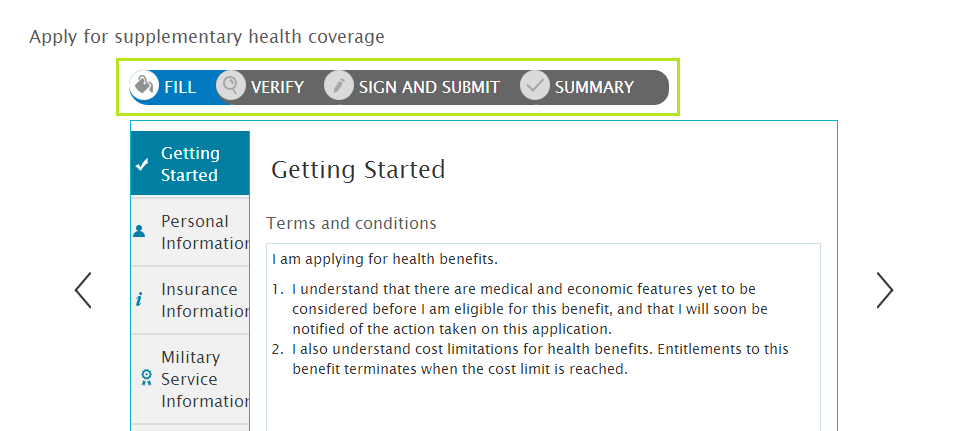

# 다단계 양식 시퀀스 소개 {#introduction-to-multi-step-form-sequence}

| 버전 | 문서 링크 |
| -------- | ---------------------------- |
| AEM 6.5 | [여기를 클릭하십시오.](https://experienceleague.adobe.com/docs/experience-manager-65/forms/adaptive-forms-basic-authoring/introduction-form-sequence.html) |
| AEM as a Cloud Service | 이 문서 |

적응형 양식을 사용하여 양식 작성자는 매우 쉽게 다단계 데이터 캡처 경험을 만들 수 있습니다. 여러 패널을 만들고 각 패널을 다른 탐색 패턴과 연결하는 기본 제공 지원이 제공됩니다. 양식 작성자는 논리 섹션의 양식 필드를 그룹화하고 그룹을 패널로 나타낼 수 있습니다. 패널 레이아웃을 사용하여 패널 간 전체 탐색을 제어합니다. 작성자는 다양한 레이아웃으로 패널 정렬을 선택할 수 있습니다. 예를 들어 마법사 레이아웃을 사용하여 순차적으로 배치하거나 탭 레이아웃을 사용하여 임시로 배치할 수 있습니다. 패널 레이아웃에 대한 자세한 내용은 [적응형 양식의 레이아웃 기능](layout-capabilities-adaptive-forms.md)을 참조하십시오.

일반적인 양식 작성 경험에는 단순히 데이터를 캡처하는 것 이외의 단계가 추가되어 있습니다. 완벽한 양식 제출에는 디지털 양식 서명, 양식에 채워진 정보 확인, 처리 결제 등 다른 단계가 포함될 수 있습니다. 상황에 따라 다릅니다.

사용 사례를 통해 데이터 캡처에 대한 일련의 단계를 요구하거나 특정 단계를 준수해야 하는 경우 [!DNL Experience Manager Forms]에서는 양식 전체에 공통된 구조를 적용하는 방법을 제공합니다. 양식 구조의 사전 계획된 구현은 양식에 대한 단계 시퀀스를 정의합니다. 

다단계 양식 시퀀스의 예

사용 사례를 통해 양식 채우기, 확인, 서명 및 확인 단계에 대한 시퀀스를 생성해야 합니다. 해당 시퀀스를 생성하는 단계는 다음과 같습니다.

1. 양식 템플릿을 정의하고 필요한 패널을 추가합니다. 시퀀스의 각 단계에는 한 개의 패널이 있어야 합니다. 단, 하위 패널이 패널 내부에 포함될 수 있습니다.

   이 예에서 다음 패널을 추가할 수 있습니다.

   * **[!UICONTROL 채우기]**: 데이터 캡처에 대한 양식 필드가 포함됩니다. 여기에서 중첩된 하위 패널을 포함하여 개인, 가족, 재무 등 여러 유형의 정보에 대한 섹션을 생성할 수 있습니다.

   <!--* **[!UICONTROL Verify]**: It contains the **[!UICONTROL Verify]** component that can be used in an XFA-based Adaptive Form. It displays the information captured in the Fill panel in read-only mode for verification.-->

   * **[!UICONTROL 전자 서명]**: XFA 기반 적응형 양식에서 사용할 수 있는 **[!UICONTROL 서명]** 구성 요소가 포함됩니다. 다음의 서명 서비스가 제공됩니다.

      * Adobe Document Cloud eSign 서비스
      * 스크리블 서명

   * **[!UICONTROL 확인]**: 사용자가 양식에 서명하고 시퀀스의 확인(요약) 단계에 도달하면 양식 제출 확인 메시지를 표시하는 **[!UICONTROL 요약]** 구성 요소가 포함됩니다. 작성자는 [!UICONTROL 요약] 구성 요소의 텍스트를 구성하고, 감사 메시지를 표시하고, 생성된 PDF 등의 링크를 표시합니다.

1. 루트 패널의 레이아웃을 **[!UICONTROL 마법사]**&#x200B;로 선택합니다.
1. 나머지 단계를 완료하여 양식 템플릿을 만듭니다. <!-- For more information, see [Creating a custom Adaptive Form template](custom-adaptive-forms-templates.md). -->

양식 템플릿에서 양식 시퀀스를 정의하고 나서 이를 사용하여 기본 구조를 시퀀스로 바로 정의하는 양식을 생성할 수 있지만 항상 요구 사항에 맞게 양식을 사용자 지정할 수 있습니다.
