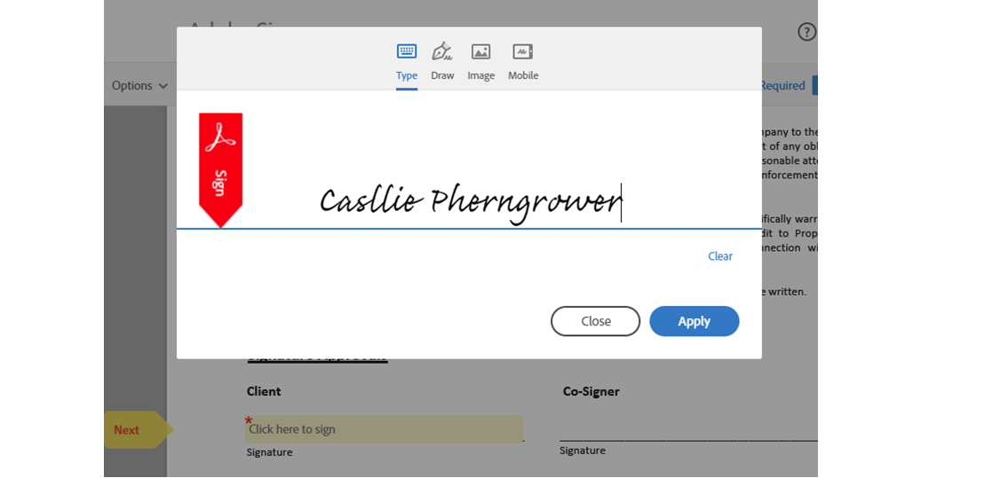
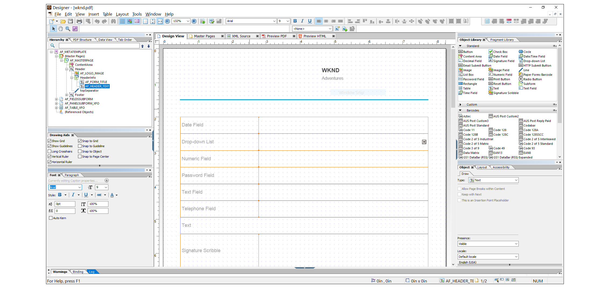

<!-- # Introduction to [!DNL AEM Forms] as a Cloud Service {#overview}

Adobe Experience Manager Forms as a Cloud Service offers a cloud-native, Platform as a Service (PaaS) solution for businesses to create, manage, publish, and update complex digital forms while integrating submitted data with back-end processes, business rules, and saving data in an external data store. The service is always current, always available, and always learning.

You can use the service to create and rollout  interactive and engaging digital forms. For example, an organization is looking to digitize their customer enrollment journey. They have multiple data sources with existing customer data, they are looking to pre-populate forms, add e-sign their forms, and archive filled forms as PDF files. Besides, the organization has multiple print forms (PDF forms), they are also looking to convert all of their print forms to digital forms.

The organization can use [!DNL AEM Forms] as a Cloud Service to create digital forms, connect forms to existing data sources, integrate forms with [!DNL Adobe Sign] to add e-signatures to forms, and generate Document of Record (DoR) to archive filled forms as PDF files. The organization can also use the service to convert their existing PDF forms to digital forms. 

An organization can sign up for [!DNL AEM Forms] as a Cloud Service and start using all these features without waiting to buy and set up a local infrastructure. The service also frees the organizations from the cycle of upgrades as it is always up to date and always offers the latest feature.  -->

# 주요 기능 및 기능 {#key-features}

[!DNL AEM Forms] as a Cloud Service은 클라우드 기본 아키텍처, 자동 확장, 업그레이드에 대한 다운타임 없이 수행할 수 있는 CDN(Content Delivery Network), 클라우드 기본 개발 환경 및 Cloud Manager를 통해 환경을 자체 처리할 수 있는 기능과 같은 클라우드 기반의 여러 기능을 제공합니다. 이 서비스를 사용하여 다음을 수행할 수 있습니다.

* [적응형 Forms 만들기](creating-adaptive-form.md#strong-create-an-adaptive-form-strong) 사용자의 장치 및 브라우저에 대해 자동으로 렌더링됩니다.

   

* [픽셀 퍼펙트 PDF forms 만들기](use-forms-designer.md#create-an-adaptive-form) 거의 종이와 비슷하네요

* 사용 [automated forms conversion 서비스](https://experienceleague.adobe.com/docs/aem-forms-automated-conversion-service/using/introduction.html?lang=ko) PDF 양식을 적응형 양식으로 전환하려면 다음을 수행하십시오. 조직의 데이터 캡처 경험을 디지털화하고 현대화할 수 있습니다.

   

* [비즈니스 프로세스 생성](aem-forms-workflow-step-reference.md#create-form-centric-workflows). 예를 들어 적응형 양식 제출 시 승인 및 거부 워크플로우를 만들고 트리거할 수 있습니다.

위에 추가 [!DNL AEM Forms] as a Cloud Service은 다음 기능을 제공합니다.

* 비즈니스 사용자가 손쉽게 양식을 가져오기, 관리, 미리 보기 및 게시할 수 있도록 하기 위한 사용하기 쉬운 그래픽 사용자 인터페이스
* 키워드, 태그 및 메타데이터를 사용하는 강력한 검색 기능을 사용하는 응답형 양식 디렉토리
* 웹 및 모바일 채널에서 양식을 적절하게 렌더링하기 위해 사용자의 장치 및 위치에 대한 동적 감지
* [Adobe Sign과 통합](adobe-sign-integration-adaptive-forms.md) 기밀 정보가 포함된 문서에 전자적으로 서명할 수 있는 서비스 또는 스크리블
* 기능 [다양한 유형의 데이터 소스에 서비스 연결](data-integration.md#create-an-adaptive-form) 를 입력하여 데이터를 보내고 검색합니다. 이 서비스는 RESTful 웹 서비스, SOAP 기반 웹 서비스 및 OData 지원 서비스에서 데이터 보내기 및 검색을 지원합니다.
* AEM Sites과 통합. AEM Sites 페이지에 적응형 양식을 포함할 수 있습니다. 적응형 양식을 모든 웹 페이지에 통합할 수도 있습니다.
* 입력한 정보를 기록하고 나중에 참조할 수 있도록 적응형 양식으로 제출하는 기록 문서(DoR)를 만들 수 있습니다. DoR은 양식의 PDF 버전입니다. 템플릿과 데이터가 모두 포함됩니다. 이 서비스는 사용자 지정 템플릿을 개발하기 위한 기본 DoR 템플릿 및 도구를 제공합니다.
* 스키마 준수 데이터를 생성하기 위한 적응형 Forms을 만드는 기능. 캡처한 데이터를 수정하거나 최소한의 수정 없이 기존 프로세스 및 데이터 소스에 제출하는 데 도움이 됩니다.
* 기준에 따라 기존 고객 데이터로 양식을 채우는 미리 채우기 서비스를 만드는 기능. 양식 채우기 프로세스를 강화하고 중단 속도를 줄이는 데 도움이 됩니다.

<!-- 

## Enterprise-class forms {#enterprise-class-forms}

You can create enterprise class forms (Adaptive Forms) and deliver beautiful, interactive, responsive, and personalized experiences to your customers. These forms change behavior and appearance based on the underlying device. You can also use themes and templates with Adaptive Forms to mandate a uniform structure and appearance for all the forms of an organization or a department.

## Automatic conversion of PDF forms to Adaptive Forms {#automatic-conversion-of-pdf-forms-to-adaptive-forms}

You can use Automated Forms Conversion service to convert a PDF Form to an Adaptive Form. It helps you accelerate digitization and modernization of data capture experiences of your organization.

## Data Integration {#data-integration}

You can connect the service to various types of data sources to send and retrieve data. The service supports sending and retrieving data from RESTful web services, SOAP-based web services, and OData enabled services.

## Integration with [!DNL Adobe Sign] {#integration-with-adobe-sign}

 You can integrate the service with [!DNL Adobe Sign] and add [!DNL Adobe Sign] fields to an Adaptive Form. It allows your users to e-sign an Adaptive Form and use [!DNL Adobe Sign] with AEM Workflows. You can use AEM Workflows to develop a business logic and send forms and documents to recipients for signatures based on the business logic.

## Integration with [!DNL AEM Sites] {#integration-with-aem-sites}

You can embed an adaptive form in an AEM Sites or an external webpage. The service provides a component out of the box to integrate an adaptive forms to an AEM Sites page.

## Business Processes Automation {#bpa}

You can use AEM Workflows to create business processes and automate operations. For example, You can create and trigger an approval and rejection workflow on submission of an Adaptive Form. 

## Document of Record {#dor}

You can create a Document of Record (DoR) to keep a record of the information that you provide and submit in an Adaptive Form so that you can refer to it later. A DoR is a PDF version of a form. It includes both a template and data. The service provides a default DoR template and tools to develop a custom template.

## Rule editor {#rule-editor}

Rule editor empowers you to build dynamism and interactivity to Adaptive Forms. These rules define actions to trigger on form objects based on preset conditions, user inputs, and user actions on the form. It helps  streamline the form filling experience while ensuring accuracy and speed.
  

## WYSIWYG editors {#wysiwyg-editor} 

The service provides several WYSIWYG editors: Adaptive Forms editor, Theme editor, and Template editor. These help you create and edit forms and related assets in WYSIWYG manner. The editors also provide out-of-the-box options to simulate views for popular mobile devices, tablets, and desktop screen configurations.

## Schema-compliant data {#schema-complaint-data}

You can create Adaptive Forms to produce schema-compliant data. It helps you submit captured data to existing processes and data sources without any or minimal modifications.

## Prefill a form

You can create a prefill service to fill a form with existing customer data based on a criteria. It helps fasten the form filling process and reduce the abandon rate.

## Submit Actions

A Submit Action allows you to persist and process captured data. The service provides several Submit Actions out-of-the-box. You can use these Submit Actions to send submitted data to a REST endpoint, database, or an AEM Workflow. You can also email submitted data along with attachments and Document of Record(DoR). You can also develop a custom Submit Action to perform an action specific to your business.

* **Emulators:** You can view an Adaptive Form in an in-built emulator. It helps you simulate how an Adaptive Form appears on different devices to an end user. It provides out-of-the-box options to simulate views for popular mobile devices, tablets, and desktop screen configurations. 

In addition to standard [!DNL AEM Forms] features, [!DNL AEM Forms] as a Cloud Service provides several cloud-native capabilities such as a cloud-native architecture, auto-scaling, zero downtime for upgrades, a CDN (Content Delivery Network), cloud-native development environment, and ability to self-Service the environments via Cloud Manager. -->
