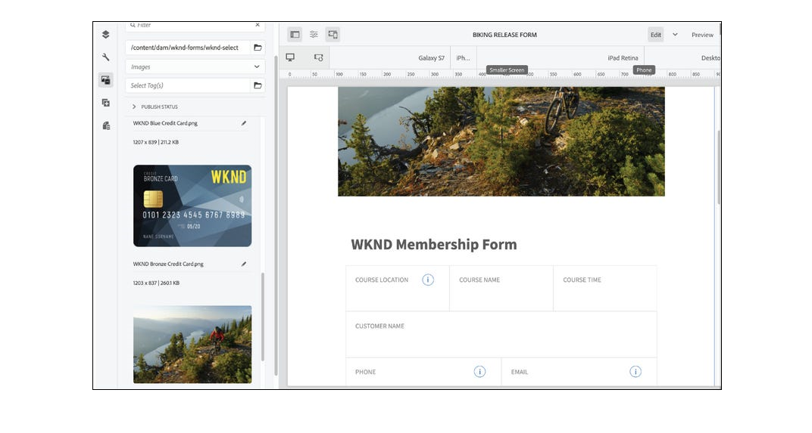

<!-- # Introduction to [!DNL AEM Forms] as a Cloud Service {#overview}

Adobe Experience Manager Forms as a Cloud Service offers a cloud-native, Platform as a Service (PaaS) solution for businesses to create, manage, publish, and update complex digital forms while integrating submitted data with back-end processes, business rules, and saving data in an external data store. The service is always current, always available, and always learning.

You can use the service to create and rollout  interactive and engaging digital forms. For example, an organization is looking to digitize their customer enrollment journey. They have multiple data sources with existing customer data, they are looking to pre-populate forms, add e-sign their forms, and archive filled forms as PDF files. Besides, the organization has multiple print forms (PDF forms), they are also looking to convert all of their print forms to digital forms.

The organization can use [!DNL AEM Forms] as a Cloud Service to create digital forms, connect forms to existing data sources, integrate forms with [!DNL Adobe Sign] to add e-signatures to forms, and generate Document of Record (DoR) to archive filled forms as PDF files. The organization can also use the service to convert their existing PDF forms to digital forms. 

An organization can sign up for [!DNL AEM Forms] as a Cloud Service and start using all these features without waiting to buy and set up a local infrastructure. The service also frees the organizations from the cycle of upgrades as it is always up to date and always offers the latest feature.  -->

# 최신 혁신 사항 {#latest-innovations}

AEM Forms as a Cloud Service의 최신 혁신 내용 중 일부는 다음과 같습니다.

| 기능 | 세부 사항 |
|---|---|
| 헤드리스 적응형 Forms | 만들기 및 관리 [헤드리스 적응형 Forms](https://experienceleague.corp.adobe.com/docs/experience-manager-headless-adaptive-forms/using/overview.html) Adobe Experience Manager 플랫폼 내에서 사용할 수 있습니다. 개발자는 기존의 그래픽 사용자 인터페이스를 통해서가 아니라 API를 통해 액세스 및 상호 작용할 수 있는 대화형 양식을 작성, 게시 및 관리할 수 있습니다.     이러한 양식은 기존 HTML 양식 인터페이스 없이도 제출할 수 있도록 설계되었습니다. 즉, 프런트 엔드에 표시되는 양식 요소가 없고 API 또는 백엔드 코드를 통해 양식 데이터를 프로그래밍 방식으로 제출할 수 있습니다.     헤드리스 양식은 단일 페이지 애플리케이션, 점진적 웹 앱 또는 모바일 애플리케이션을 작성할 때와 같이 기존 HTML 양식 인터페이스가 필요하지 않거나 실용적이지 않을 수 있는 다양한 시나리오에서 유용합니다. 개발자가 API 또는 백엔드 코드를 통해 직접 양식 데이터를 제출할 수 있도록 함으로써, 헤드리스 양식을 통해 워크플로우를 간소화하고 웹 애플리케이션의 전반적인 성능을 향상시킬 수 있습니다. |
| 핵심 구성 요소 | 다음 [응용 Forms 핵심 구성 요소](https://experienceleague.adobe.com/docs/experience-manager-core-components/using/adaptive-forms/introduction.html#features) 는 Adobe Experience Manager WCM 코어 구성 요소의 기초 위에 구축된 24개의 오픈 소스 BEM 준수 구성 요소 세트입니다. 사용자의 디바이스, 브라우저 및 화면 크기에 맞춰 조정되는 양식인 적응형 양식을 만드는 데 사용하도록 특별히 설계되었습니다.     이러한 구성 요소를 사용하면 텍스트 필드, 확인란, 드롭다운 메뉴 등을 포함한 다양한 양식 필드 옵션을 제공하여 탁월한 데이터 캡처 및 등록 경험을 만들 수 있습니다. 또한 여기에는 사용자 친화적이고 사용하기 쉬운 양식을 만드는 데 사용할 수 있는 유효성 검사, 조건부 논리 및 반응형 디자인과 같은 기능이 포함되어 있습니다.      이와 더불어 이러한 구성 요소는 오픈 소스이므로 개발자가 조직의 특정 요구 사항에 맞게 구성 요소를 쉽게 사용자 정의하고 확장할 수 있습니다. 그리고 이러한 구성 요소는 BEM 방법론을 기반으로 구축되어 있으므로 확장 및 유지 관리가 가능합니다. |
| Microsoft PowerAutomate 커넥터 | AEM Forms Power Automate Connector를 사용하면 Adobe Experience Manager(AEM) Forms을 Microsoft Power Automate(이전에 Microsoft Flow)와 통합할 수 있습니다. Power Automate 는 클라우드 기반 서비스로, 다양한 애플리케이션과 서비스 간에 자동화된 워크플로우를 만들 수 있습니다.      AEM Form Power 자동 커넥터를 사용하면 적응형 양식 제출을 기반으로 자동으로 트리거되는 워크플로우를 만들 수 있습니다. 예를 들어, 사용자가 양식을 제출하거나 사용자가 양식을 완료할 때 Microsoft Planner에서 작업을 만들 때 특정 사용자에게 전자 메일 알림을 자동으로 보내는 워크플로우를 만들 수 있습니다.       AEM Forms Power Automate Connector는 Microsoft Power Automate와 연결된 다른 애플리케이션 및 서비스와 Adaptive Forms을 자동화하고 통합할 수 있는 강력한 도구로서, 더 다양한 도구를 사용하여 작업할 수 있습니다. 사용자 지정 작업, 조건 및 트리거를 추가하는 기능을 사용하여 특정 요구에 맞는 워크플로우를 만들 수 있습니다. 또한 Power Automate는 세부 분석 및 보고를 제공하여 시간에 따라 워크플로우를 모니터링하고 최적화할 수 있습니다. |
| Microsoft Storage Connectors | AEM Forms Microsoft Storage Connectors for <a href="https://experienceleague.corp.adobe.com/docs/experience-manager-cloud-service/content/forms/adaptive-forms-authoring/authoring-adaptive-forms-foundation-components/configure-submit-actions-and-metadata-submission/configuring-submit-actions.html#submit-to-sharedrive">OneDrive</a>, <a href="https://experienceleague.corp.adobe.com/docs/experience-manager-cloud-service/content/forms/adaptive-forms-authoring/authoring-adaptive-forms-foundation-components/configure-submit-actions-and-metadata-submission/configuring-submit-actions.html?#submit-to-sharedrive"> SharePoint, </a> 및 <a href="https://experienceleague.corp.adobe.com/docs/experience-manager-cloud-service/content/forms/adaptive-forms-authoring/authoring-adaptive-forms-foundation-components/configure-submit-actions-and-metadata-submission/configuring-submit-actions.html?#submit-to-azure-blob-storage"> Azure Blob 저장소 </a> Adobe Experience Manager(AEM) Forms을 Microsoft OneDrive 및 SharePoint과 통합할 수 있는 커넥터입니다. 이 커넥터를 사용하여 적응형 Forms에서 직접 OneDrive 및 SharePoint에 데이터 파일과 첨부 파일을 업로드할 수 있습니다.     OneDrive와 SharePoint은 CRM 시스템, 회계 소프트웨어 및 프로젝트 관리 도구와 같은 다른 비즈니스 애플리케이션과 통합할 수 있습니다. 이를 통해 비즈니스 프로세스를 간소화하고, 수동 데이터 입력을 줄이고, 전체 효율성을 향상시킬 수 있습니다. |
| 마법사 UI | 적응형 Forms 마법사 UI는 적응형 양식을 빠르고 쉽게 생성할 수 있는 강력한 도구입니다. 사용자에게 친숙한 인터페이스 및 사용자 지정 옵션을 통해 기술 수준에 관계없이 모든 사용자가 액세스할 수 있습니다.     마법사 UI는 사용자를 양식 작성 프로세스를 단계별로 안내하여 적응형 양식을 만드는 프로세스를 단순화합니다. 마법사-UI는 여러 탭으로 나뉘어 있으며 각 탭에는 적응형 양식을 구성하는 옵션이 명확히 제공됩니다. 양식 작성자는 탭을 선형 방식으로 진행하여 템플릿, 제출 작업 및 양식 구성 요소에 대한 데이터 소스 등의 옵션을 선택합니다.     마법사 인터페이스를 사용하면 적응형 양식에 필요한 모든 옵션을 살펴보는 프로세스를 간소화할 수 있으며, 이 기술을 잘 모르는 사용자도 양식을 쉽게 만들 수 있습니다. |
| 빠른 추적 분석 | 양식 분석은 사용자 참여를 측정하고, 전환율을 최적화하고, 양식 성능을 모니터링하고, 사용자 경험을 개선하여 양식의 성능에 대한 중요한 통찰력을 제공할 수 있습니다.  사용자 행동 및 피드백을 추적하여 analytics는 양식의 영역에 좌절감이나 혼란을 주어 양식의 디자인 및 기능 개선을 안내할 수 있습니다.     Fast Track Analytics를 사용하면 한 번의 버튼을 사용하여 Forms Analytics를 활성화할 수 있습니다. 빠른 추적 분석을 사용하면 AEM Forms을 Experience Platform 태그 및 Adobe Analytics과 as a Cloud Service으로 연결하여 게시된 양식에 대한 성능 지표를 캡처하고 추적할 수 있습니다.         Forms as a Cloud Service은 Adobe Analytics 보고서 OOTB를 제공합니다. 양식의 성능을 쉽게 이해할 수 있도록 해줍니다. 양식 수준 지표는 변환, 방문자, 제출, 평균 채우기 시간과 같은 여러 주요 성과 지표(KPI)에서 양식이 어떻게 수행되는지에 대한 통찰력을 제공합니다.     또한 사용자가 정보를 제공하기 전에 정보를 찾도록 하는 필드를 확인할 수 있도록 패널의 필드에 대한 컨텍스트 내 도움말에 평균 액세스한 횟수에 대한 세부 사항을 제공합니다. 이러한 필드를 더 단순화하거나 콘텐츠를 활용하여 전환을 개선할 수 있습니다. |

<!-- 

# Key features and capabilities {#key-features}

[!DNL AEM Forms] as a Cloud Service provides several cloud-native capabilities such as a cloud-native architecture, auto-scaling, zero downtime for upgrades, a CDN (Content Delivery Network), cloud-native development environment, and ability to self-Service the environments via Cloud Manager. You can use the service to: 

* [Create Adaptive Forms](creating-adaptive-form.md#strong-create-an-adaptive-form-strong) that automatically render for a user's device and browser.

    

* [Create pixel-perfect PDF forms](use-forms-designer.md#create-an-adaptive-form) that look almost like paper.

* Use [Automated Forms Conversion service](https://experienceleague.adobe.com/docs/aem-forms-automated-conversion-service/using/introduction.html) to convert a PDF Form to an Adaptive Form. It helps you accelerate digitization and modernization of data capture experiences of your organization.

    

* [Create business processes](aem-forms-workflow-step-reference.md#create-form-centric-workflows). For example, You can create and trigger an approval and rejection workflow on submission of an Adaptive Form.

In addition to above [!DNL AEM Forms] as a Cloud Service offers the following features and capabilities:

* An easy-to-use graphical user interface to let business users easily import, manage, preview, and publish forms
* A responsive forms directory with powerful search features using keywords, tags, and metadata
* Dynamic detection of a user's device and location to render the form appropriately across web and mobile channels
* [Integration with Adobe Sign](adobe-sign-integration-adaptive-forms.md) services or Scribble to electronically sign documents containing confidential information
* Ability to [connect the service to various types of data sources](data-integration.md#create-an-adaptive-form) to send and retrieve data. The service supports sending and retrieving data from RESTful web services, SOAP-based web services, and OData enabled services.
* Integration with AEM Sites. It allows to embed an adaptive form in an AEM Sites page. You can also integrate an adaptive form to any webpage. 
* Ability to create a Document of Record (DoR) to keep a record of the information that you provide and submit in an Adaptive Form so that you can refer to it later. A DoR is a PDF version of a form. It includes both a template and data. The service provides a default DoR template and tools to develop a custom template.
* Ability to create Adaptive Forms to produce schema-compliant data. It helps you submit captured data to existing processes and data sources without any or minimal modifications.
* Ability to create a prefill service to fill a form with existing customer data based on a criteria. It helps fasten the form filling process and reduce the abandon rate.

<!-- 

## Enterprise-class forms {#enterprise-class-forms}

You can create enterprise class forms (Adaptive Forms) and deliver beautiful, interactive, responsive, and personalized experiences to your customers. These forms change behavior and appearance based on the underlying device. You can also use themes and templates with Adaptive Forms to mandate a uniform structure and appearance for all the forms of an organization or a department.

## Automatic conversion of PDF forms to Adaptive Forms {#automatic-conversion-of-pdf-forms-to-adaptive-forms}

You can use Automated Forms Conversion service to convert a PDF Form to an Adaptive Form. It helps you accelerate digitization and modernization of data capture experiences of your organization.

## Data Integration {#data-integration}

You can connect the service to various types of data sources to send and retrieve data. The service supports sending and retrieving data from RESTful web services, SOAP-based web services, and OData enabled services.

## Integration with [!DNL Adobe Sign] {#integration-with-adobe-sign}

 You can integrate the service with [!DNL Adobe Sign] and add [!DNL Adobe Sign] fields to an Adaptive Form. It allows your users to e-sign an Adaptive Form and use [!DNL Adobe Sign] with AEM Workflows. You can use AEM Workflows to develop a business logic and send forms and documents to recipients for signatures based on the business logic.

## Integration with [!DNL AEM Sites] {#integration-with-aem-sites}

You can embed an adaptive form in an AEM Sites or an external webpage. The service provides a component out of the box to integrate an adaptive forms to an AEM Sites page.

## Business Processes Automation {#bpa}

You can use AEM Workflows to create business processes and automate operations. For example, You can create and trigger an approval and rejection workflow on submission of an Adaptive Form. 

## Document of Record {#dor}

You can create a Document of Record (DoR) to keep a record of the information that you provide and submit in an Adaptive Form so that you can refer to it later. A DoR is a PDF version of a form. It includes both a template and data. The service provides a default DoR template and tools to develop a custom template.

## Rule editor {#rule-editor}

Rule editor empowers you to build dynamism and interactivity to Adaptive Forms. These rules define actions to trigger on form objects based on preset conditions, user inputs, and user actions on the form. It helps  streamline the form filling experience while ensuring accuracy and speed.
  

## WYSIWYG editors {#wysiwyg-editor} 

The service provides several WYSIWYG editors: Adaptive Forms editor, Theme editor, and Template editor. These help you create and edit forms and related assets in WYSIWYG manner. The editors also provide out-of-the-box options to simulate views for popular mobile devices, tablets, and desktop screen configurations.

## Schema-compliant data {#schema-complaint-data}

You can create Adaptive Forms to produce schema-compliant data. It helps you submit captured data to existing processes and data sources without any or minimal modifications.

## Prefill a form

You can create a prefill service to fill a form with existing customer data based on a criteria. It helps fasten the form filling process and reduce the abandon rate.

## Submit Actions

A Submit Action allows you to persist and process captured data. The service provides several Submit Actions out-of-the-box. You can use these Submit Actions to send submitted data to a REST endpoint, database, or an AEM Workflow. You can also email submitted data along with attachments and Document of Record(DoR). You can also develop a custom Submit Action to perform an action specific to your business.

* **Emulators:** You can view an Adaptive Form in an in-built emulator. It helps you simulate how an Adaptive Form appears on different devices to an end user. It provides out-of-the-box options to simulate views for popular mobile devices, tablets, and desktop screen configurations. 

In addition to standard [!DNL AEM Forms] features, [!DNL AEM Forms] as a Cloud Service provides several cloud-native capabilities such as a cloud-native architecture, auto-scaling, zero downtime for upgrades, a CDN (Content Delivery Network), cloud-native development environment, and ability to self-Service the environments via Cloud Manager. -->
