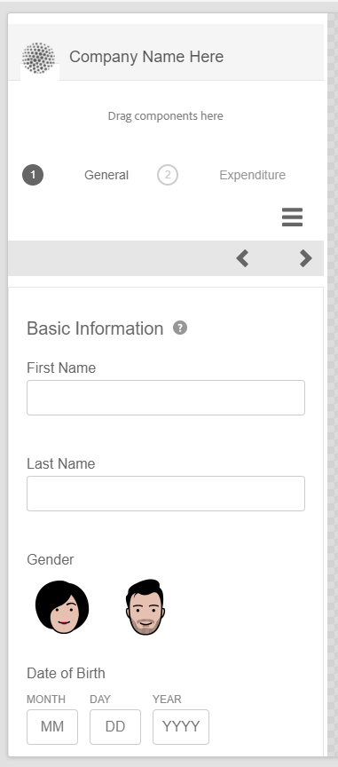

# 적응형 Forms의 레이아웃 기능 {#layout-capabilities-of-adaptive-forms}

<span class="preview"> [새 적응형 양식 만들기](/help/forms/creating-adaptive-form-core-components.md) 또는 [AEM Sites 페이지에 적응형 양식 추가](/help/forms/create-or-add-an-adaptive-form-to-aem-sites-page.md) 작업을 할 때 현대적이고 확장 가능한 데이터 캡처 [코어 구성 요소](https://experienceleague.adobe.com/docs/experience-manager-core-components/using/adaptive-forms/introduction.html)를 사용하는 것이 좋습니다. 이러한 구성 요소는 적응형 양식 만들기 작업이 대폭 개선되어 우수한 사용자 경험을 보장할 수 있게 되었음을 나타냅니다. 이 문서에서는 기초 구성 요소를 사용하여 적응형 양식을 작성하는 이전 접근법에 대해 설명합니다. </span>


| 버전 | 문서 링크 |
| -------- | ---------------------------- |
| AEM 6.5 | [여기 클릭](https://experienceleague.adobe.com/docs/experience-manager-65/forms/adaptive-forms-basic-authoring/layout-capabilities-adaptive-forms.html) |
| AEM as a Cloud Service | 이 문서 |

[!DNL Adobe Experience Manager] 최종 사용자에게 동적 경험을 제공하는 사용하기 쉬운 적응형 Forms을 만들 수 있습니다. 양식 레이아웃은 적응형 양식에 항목 또는 구성 요소가 표시되는 방식을 제어합니다.

<!-- ## Prerequisite knowledge {#prerequisite-knowledge}

Before learning about the different layout capabilities of Adaptive Forms, read [Introduction to authoring forms](introduction-forms-authoring.md) to know more about Adaptive Forms. -->

## 레이아웃 유형 {#types-of-layouts}

적응형 양식은 다음과 같은 유형의 레이아웃을 제공합니다.

**[!UICONTROL 패널 레이아웃]** 패널 내의 항목 또는 구성 요소가 장치에 표시되는 방식을 제어합니다.

**[!UICONTROL 모바일 레이아웃]** 모바일 장치에서 양식 탐색을 제어합니다. 디바이스 너비가 768픽셀 이상인 경우 레이아웃은 모바일 레이아웃으로 간주되어 모바일 디바이스에 최적화됩니다.

**[!UICONTROL 도구 모음 레이아웃]** 폼에서 도구 모음이나 패널 도구 모음의 작업 단추 배치를 제어합니다.

이러한 패널 레이아웃은 모두 `/libs/fd/af/layouts` 위치.

적응형 양식의 레이아웃을 변경하려면 의 작성 모드를 사용하십시오 [!DNL Experience Manager].

## [!UICONTROL 패널 레이아웃] {#panel-layout}

양식 작성자는 루트 패널을 포함하여 적응형 양식의 각 패널과 레이아웃을 연결할 수 있습니다.

패널 레이아웃은에서 사용할 수 있습니다. `/libs/fd/af/layouts/panel` 위치. 패널을 탭하고 을(를) 선택합니다  패널 속성을 봅니다.


### [!UICONTROL 반응형 - 탐색 없이 한 페이지에 모두 표시] {#responsive-everything-on-one-page-without-navigation-br}

이 패널 레이아웃을 사용하여 전문 탐색을 수행하지 않고도 디바이스의 화면 크기에 맞게 조정되는 응답형 레이아웃을 만들 수 있습니다.

이 레이아웃을 사용하여 여러 항목을 배치할 수 있습니다 **[!UICONTROL 패널 적응형 양식]** 패널 내의 구성 요소가 차례대로 포함됩니다.


### [!UICONTROL 마법사] {#wizard}

이 패널 레이아웃을 사용하여 양식 내에서 안내식 탐색을 제공할 수 있습니다. 예를 들어 사용자를 단계별로 안내하면서 양식의 필수 정보를 캡처하려는 경우 이 레이아웃을 사용하십시오.

사용 **[!UICONTROL 패널 적응형 양식]** 패널 내부에 단계별 탐색을 제공하는 구성 요소입니다. 이 레이아웃을 사용하는 경우 사용자는 현재 단계가 완료된 후에만 다음 단계로 이동합니다

```javascript
window.guideBridge.validate([], this.panel.navigationContext.currentItem.somExpression)
```


### [!UICONTROL 아코디언] {#layout-for-accordion-design}

이 레이아웃을 사용하여 **[!UICONTROL 패널 적응형 양식]** 아코디언 스타일 탐색이 있는 패널의 구성 요소입니다. 이 레이아웃을 사용하여 반복 가능한 패널을 만들 수도 있습니다. 반복 가능한 패널을 사용하면 필요에 따라 패널을 동적으로 추가하거나 제거할 수 있습니다. 패널이 반복되는 최소 및 최대 횟수를 정의할 수 있습니다. 또한 패널 항목에 제공된 정보에 따라 패널의 제목을 동적으로 결정할 수 있습니다.

요약 표현식을 사용하여 최소화된 패널의 제목에 최종 사용자가 제공한 값을 표시할 수 있습니다.


### [!UICONTROL 탭 레이아웃 - 왼쪽에 탭이 나타납니다.]{#tabbed-layout-tabs-appear-on-the-left}

이 레이아웃을 사용하여 **[!UICONTROL 패널 적응형 양식]** 탭 탐색이 있는 패널의 구성 요소입니다. 탭은 패널 콘텐츠의 왼쪽에 배치됩니다.


패널 왼쪽에 표시되는 탭

### [!UICONTROL 탭 레이아웃 - 맨 위에 탭이 표시됨] {#tabbed-layout-tabs-appear-on-the-top}

이 레이아웃을 사용하여 **[!UICONTROL 패널 적응형 양식]** 탭 탐색이 있는 패널의 구성 요소입니다. 탭은 패널 콘텐츠의 맨 위에 배치됩니다.


## 모바일 레이아웃 {#mobile-layouts}

모바일 레이아웃은 상대적으로 더 작은 화면들로 모바일 디바이스들 상에서 사용자 친화적인 탐색을 허용한다. 모바일 레이아웃에서는 양식 탐색에 탭 스타일이나 마법사 스타일을 사용합니다. 모바일 레이아웃을 적용하면 전체 양식에 대해 단일 레이아웃이 제공됩니다.

이 레이아웃은 탐색 모음과 탐색 메뉴를 사용하여 탐색을 제어합니다. 탐색 막대에 표시되는 항목 **&lt;** 및 **>** 아이콘 표시 **[!UICONTROL 다음]** 및 **[!UICONTROL 이전]** 양식의 탐색 단계.

모바일 레이아웃은에서 사용할 수 있습니다. `/libs/fd/af/layouts/mobile/` 위치. 적응형 Forms에서는 기본적으로 다음 모바일 레이아웃을 사용할 수 있습니다.


다음 항목 선택 **[!UICONTROL 응답형 레이아웃의 탐색 가능한 항목을 모바일 메뉴에 추가]** 옵션을 사용하여 [모바일 레이아웃]의 패널에 사용할 수 있는 탐색 가능한 옵션을 봅니다. 탐색 가능한 옵션은 다음을 선택하는 경우에만 표시됩니다 **[!UICONTROL 반응형]** 패널에 대한 레이아웃입니다.

모바일 레이아웃을 사용하는 경우 탭하여 다양한 양식 패널에 액세스하는 양식 메뉴를 사용할 수 있습니다  아이콘.

### [!UICONTROL 양식 헤더에 패널 제목이 있는 레이아웃] {#layout-with-panel-titles-in-the-form-header}

이름에서 알 수 있듯이 이 레이아웃은 탐색 메뉴 및 탐색 모음과 함께 패널 제목을 표시합니다. 이 레이아웃은 탐색에 다음 및 이전 아이콘도 제공합니다.



### [!UICONTROL 양식 헤더에 패널 제목이 없는 레이아웃]{#layout-without-panel-titles-in-the-form-header}

이 레이아웃은 이름에서 알 수 있듯이 패널 제목 없이 탐색 메뉴와 탐색 막대만 표시합니다. 이 레이아웃은 탐색에 다음 및 이전 아이콘도 제공합니다.


<!-- ## Toolbar layouts {#toolbar-layouts}

A Toolbar Layout controls positioning and display of any action buttons that you add to your Adaptive Forms. The layout can be added at a form level or at a panel level.


A list of Toolbar Layouts in Adaptive Forms

Toolbar layouts are available at `/libs/fd/af/layouts/toolbar` location. Adaptive Forms provide the following Toolbar Layouts, by default.

### [!UICONTROL Default layout for toolbar] {#default-layout-for-toolbar}

This layout is selected as the default layout when you add any action buttons in an Adaptive Form. Selecting this layout displays the same layout for both, desktop and mobile devices.

Also, you can add multiple toolbars containing action buttons configured with this layout. An action button is associated with a form control. You can configure the toolbars to be before or after a panel.


Default view for toolbar

### [!UICONTROL Mobile fixed layout for toolbar] {#mobile-fixed-layout-for-toolbar}

Select this layout to provide alternate layouts for desktop and mobile devices.

For the desktop layout, you can add Action buttons using some specific labels. Only one toolbar can be configured with this layout. If more than one toolbar is configured with this layout, there is an overlap for mobile devices and only one toolbar is visible. For example, you can have a toolbar at the bottom or the top of the form, or, after or before panels in the form.

For the Mobile layout, you can add action buttons using icons.


Mobile fixed layout for toolbar-->
