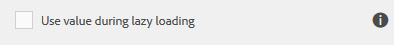

# 지연 로딩으로 대용량 양식의 성능 향상{#improve-performance-of-large-forms-with-lazy-loading}

## 지연 로드 소개 {#introduction-to-lazy-loading}

수백 개의 필드가 있고 양식이 복잡해지면 최종 사용자는 런타임 시 양식을 렌더링할 때 응답 시간이 오래 걸립니다. 응답 시간을 최소화하기 위해 적응형 Forms을 사용하면 양식을 논리 조각으로 나누고 조각을 볼 때까지 초기화 또는 조각 로드를 연기하도록 구성할 수 있습니다. 이를 지연 적재라고 합니다. 또한 지연 로드를 위해 구성된 조각은 사용자가 양식의 다른 섹션으로 이동한 후 조각이 더 이상 표시되지 않습니다.

지연 로드를 구성하기 전에 먼저 요구 사항 및 준비 단계를 이해하겠습니다.

## 지연 로드 구성 준비 {#preparing-to-configure-lazy-loading}

적응형 양식에 조각 로드를 지연하기 전에 조각을 만들고 스크립트를 통해 사용되거나 다른 조각에서 참조되는 값을 식별하며 규칙을 정의하여 느리게 로드된 조각에서 필드를 표시할 수 있는 전략을 정의하는 것이 중요합니다.

* **조각 식별 및 만들기**
지연 로드를 위해 적응형 양식 조각만 구성할 수 있습니다. 조각은 적응형 양식 외부에 있고 양식에서 재사용할 수 있는 독립형 세그먼트입니다. 따라서 지연 로드를 구현하는 첫 번째 단계는 양식의 논리 섹션을 식별하고 조각으로 변환하는 것입니다. 조각을 처음부터 만들거나 기존 양식 패널을 조각으로 저장할 수 있습니다.

   <!--For more information about creating fragments, see [Adaptive Form Fragments](adaptive-form-fragments.md).-->

* **글로벌 값 식별 및 표시**
Forms 기반 트랜잭션에는 동적 요소가 포함되어 있어 사용자로부터 관련 데이터를 캡처하고 처리하여 양식 채우기 환경을 단순화합니다. 예를 들어, 양식에는 값이 다른 조각에서 필드 B의 유효성을 결정하는 조각 X의 필드 A가 있습니다. 이 경우 조각 X가 지연 로딩으로 표시된 경우 조각 X가 로드되지 않은 경우에도 필드 B의 유효성을 확인하기 위해 필드 A 값을 사용할 수 있어야 합니다. 이를 위해 필드 A를 글로벌 로 표시하여 조각 X가 로드되지 않은 경우 필드 B의 유효성을 확인할 수 있습니다.

   필드 값을 전체적으로 만드는 방법에 대한 자세한 내용은 [지연 로드 구성](lazy-loading-adaptive-forms.md#p-configuring-lazy-loading-p).

* **규칙을 작성하여 필드 표시 제어**
Forms에는 모든 사용자와 모든 조건에 적용할 수 없는 일부 필드 및 섹션이 포함되어 있습니다. Forms 작성자 및 개발자는 가시성 또는 표시 숨기기 규칙을 사용하여 사용자 입력을 기반으로 가시성을 제어합니다. 예를 들어, Office 주소 필드는 양식의 고용 상태 필드에서 실직자를 선택하는 사용자에게 표시되지 않습니다. 규칙 작성에 대한 자세한 내용은 [규칙 편집기 사용](rule-editor.md).

   길게 로드된 조각에서 가시성 규칙을 사용하여 조건부 필드가 필요한 경우에만 표시되도록 할 수 있습니다. 또한 조건 필드를 전체적으로 선택하여 lazyly loaded 조각의 가시성 표현식에서 해당 필드를 참조합니다.

## 지연 로드 구성 {#configuring-lazy-loading}

적응형 양식 조각에서 레이지 로드를 활성화하려면 다음 단계를 수행하십시오.

1. 지연 로드를 위해 활성화할 조각이 포함된 작성 모드에서 적응형 양식 을 엽니다.
1. 적응형 양식 조각을 선택하고 탭합니다 .
1. 사이드바에서 **[!UICONTROL 로드 조각 지연]** 탭 **완료**.

   

   이제 지연 로드를 위해 조각이 활성화됩니다.

적재된 조각의 객체 값을 전역 값으로 표시할 수 있으므로 포함 조각이 로드되지 않은 경우 스크립트에서 사용할 수 있습니다. 다음을 수행합니다.

1. 작성 모드에서 적응형 양식 조각을 엽니다.
1. 값을 전역 값으로 표시할 필드를 탭한 다음, .
1. 사이드바에서 **[!UICONTROL 지연 로드 중 값 사용]**.

   

   이 값은 이제 글로벌 것으로 표시되며, 포함 조각을 언로드한 경우에도 스크립트에서 사용할 수 있습니다.

## 지연 로드 구성을 위한 고려 사항 및 우수 사례 {#considerations-and-best-practices-for-configuring-lazy-loading}

지연 로드를 사용하여 작업할 때 기억해야 할 몇 가지 제한 사항, 권장 사항 및 중요 사항은 다음과 같습니다.

* 대용량 양식에서 지연 로드를 구성하는 XFA 기반 적응형 Forms보다 XSD 스키마 기반 적응형 Forms을 사용하는 것이 좋습니다. XFA 기반 적응형 Forms의 지연 로드 구현으로 인한 성능 향상은 XSD 기반 적응형 Forms의 이득보다 상대적으로 작습니다.
* 를 사용하는 적응형 양식의 조각에 대해 레이지 로드를 구성하지 마십시오 **[!UICONTROL 응답형 - 탐색 없이 한 페이지의 모든 항목]** [루트] 패널의 레이아웃 응답형 레이아웃 구성의 결과로, 모든 조각이 적응형 양식에 동시에 로드됩니다. 성능이 저하될 수도 있습니다.
* 적응형 양식 로드 시 렌더링되는 첫 번째 패널에서 조각에 대한 레이지 로드를 구성하지 않는 것이 좋습니다.
* 지연 로드는 조각 계층 구조에서 최대 2개 수준에서 지원됩니다.
* 전역 필드로 표시된 필드가 적응형 양식에서 고유한지 확인합니다.
* 조건을 기반으로 표시하거나 숨겨야 하는 조각에 대한 가시성 규칙 작성을 고려하십시오. 예를 들어 사용자가 지정한 혼인 상태에 따라 배우자 세부 정보 조각을 표시하거나 숨길 수 있습니다.
* 파일 첨부 파일 및 약관 구성 요소는 느리게 로드된 조각에서 지원되지 않습니다.

### 지연 로드 구성을 위한 스크립팅 우수 사례 {#scripting-best-practices-for-configuring-lazy-loading}

지연 로드 패널에 대한 스크립트를 개발하는 동안 기억해야 할 중요한 사항은 다음과 같습니다.

* 지연 로드 조각의 필드에 사용된 스크립트 초기화 및 계산 이 본질적으로 동일한지 확인합니다. idempotent 스크립트는 여러 실행 후에도 동일한 효과를 가지는 스크립트입니다.
* 필드의 전역 사용 가능한 속성을 사용하여 레이지 로드 패널에 있는 필드의 값을 양식의 다른 모든 패널에서 사용할 수 있도록 합니다.
* 조각 간에 전체적으로 표시된 필드에 관계없이 레이지 패널 내의 필드의 참조 값을 전달하지 마십시오.
* 다음 클릭 표현식을 사용하여 패널에 표시되는 모든 것을 재설정하려면 패널 재설정 기능을 사용하십시오.\
   guideBridge.resolveNode(guideBridge.getFocus({&quot;focusOption&quot;: &quot;navigablePanel&quot;}).resetData()
