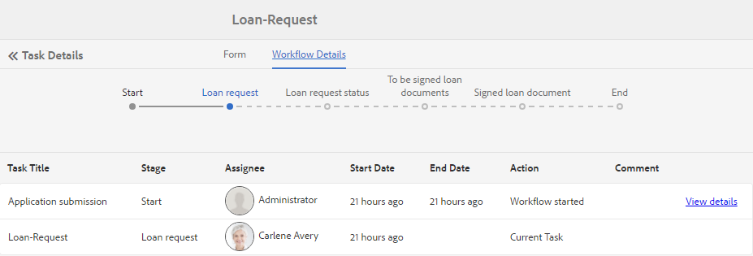

# AEM 받은 편지함에서 Forms 애플리케이션 및 작업 관리{#manage-forms-applications-and-tasks-in-aem-inbox}

Forms 중심 워크플로우를 시작하거나 트리거하는 여러 방법 중 하나는 AEM 받은 편지함의 애플리케이션을 통해 입니다. Forms 워크플로우를 받은 편지함에서 애플리케이션으로 사용할 수 있게 하려면 워크플로우 애플리케이션을 만들어야 합니다. 워크플로우 애플리케이션 및 Forms 워크플로우를 시작하는 기타 방법에 대한 자세한 내용은 [OSGi에서 Forms 중심의 워크플로우 시작](aem-forms-workflow.md#launch).

또한 AEM 받은 편지함 에서는 Forms 워크플로우를 비롯한 다양한 AEM 구성 요소의 알림과 작업을 통합합니다. 작업 할당 단계를 포함하는 양식 워크플로우가 트리거되면 연관된 응용 프로그램이 할당자의 받은 편지함에서 작업으로 나열됩니다. 할당자가 그룹인 경우 개별 요청이나 위임을 받을 때까지 모든 그룹 구성원의 받은 편지함에 작업이 나타납니다.

받은 편지함 사용자 인터페이스에서는 작업을 볼 수 있는 목록 및 달력 보기를 제공합니다. 보기 설정을 구성할 수도 있습니다. 다양한 매개 변수를 기반으로 작업을 필터링할 수 있습니다. 보기 및 필터에 대한 자세한 내용은 [받은 편지함](https://experienceleague.adobe.com/docs/experience-manager-cloud-service/sites/authoring/getting-started/inbox.html#inbox-in-the-header).

요약하면 받은 편지함에서 새 응용 프로그램을 만들고 할당된 작업을 관리할 수 있습니다.

>[!NOTE]
>
>회원이어야 합니다 [!DNL workflow-users] 그룹에 속해 있어야 합니다.

## 애플리케이션 만들기 {#create-application}

1. https://&#39;에서 AEM 받은 편지함으로 이동합니다.[server]:[포트]&#39;/aem/inbox.
1. 받은 편지함 UI에서 **[!UICONTROL 만들기 > 애플리케이션]**. [응용 프로그램 선택] 페이지가 나타납니다.
1. 응용 프로그램을 선택하고 **[!UICONTROL 만들기]**. 응용 프로그램과 연결된 응용 양식이 열립니다. 적응형 양식에 정보를 입력하고 **[!UICONTROL 제출]**. 연결된 워크플로우를 시작하고 할당자의 받은 편지함에서 작업을 만듭니다.

## 작업 관리 {#manage-tasks}

Forms 워크플로우가 트리거되고 사용자가 할당자 또는 할당자 그룹의 일부인 경우 작업이 받은 편지함에 나타납니다. 받은 편지함 내에서 작업 세부 사항을 보고 작업에 사용 가능한 작업을 수행할 수 있습니다.

### 청구 또는 위임 작업 {#claim-or-delegate-tasks}

그룹에 할당된 작업은 모든 그룹 구성원의 받은 편지함에 나타납니다. 모든 그룹 구성원이 해당 작업을 요청하거나 다른 그룹 구성원에게 위임할 수 있습니다. 방법은 다음과 같습니다.

1. 을 눌러 작업 축소판을 선택합니다. 작업을 열거나 위임하는 옵션이 맨 위에 나타납니다.

   

1. 다음 중 하나를 수행하십시오.

   * 작업을 위임하려면 **[!UICONTROL 위임]**. [항목 위임] 대화 상자가 열립니다. 사용자를 선택하고 필요에 따라 주석을 추가한 다음 **[!UICONTROL 확인]**.

   

   * 작업을 요청하려면 **[!UICONTROL 열기]**. 자체 할당 대화 상자가 열립니다. 탭 **[!UICONTROL 계속]** 작업 요청 요청된 작업이 받은 편지함에 할당자로 나타납니다.

   

### 세부 사항 보기 및 작업에 대한 작업 수행 {#view-details-and-perform-actions-on-tasks}

작업을 열면 작업 세부 사항을 보고 사용 가능한 작업을 수행할 수 있습니다. 작업에 사용할 수 있는 작업은 연결된 Forms 워크플로우의 지정 작업 단계에서 정의됩니다.

1. 을 눌러 작업 축소판을 선택합니다. 선택한 작업을 열거나 위임하는 옵션이 맨 위에 나타납니다.
1. 탭 **열기** 작업 세부 사항을 보고 작업을 수행하십시오. 세부 작업 보기가 열립니다. 이 보기에서 작업 세부 사항을 보고 작업에 대해 작업을 수행할 수 있습니다.

   >[!NOTE]
   >
   >작업이 그룹에 할당되어 있는 경우 해당 작업을 세부 보기에서 열 수 있도록 요청해야 합니다.


세부 작업 보기는 다음 섹션으로 구성됩니다.

* 작업 세부 정보
* 양식
* 워크플로우 세부 정보
* 작업 도구 모음

#### 작업 세부 정보 {#task-details}

작업 세부 정보 섹션에는 작업에 대한 정보가 표시됩니다. 표시되는 정보는 [작업 단계 할당](https://experienceleague.adobe.com/docs/experience-manager-65/developing/extending-aem/extending-workflows/workflows-step-ref.html#extending-aem) 을 입력합니다. 위의 예에는 작업에 사용된 설명, 상태, 시작 날짜 및 워크플로우가 표시됩니다. 또한 작업에 파일을 첨부할 수도 있습니다.

#### 양식 {#form}

기본 컨텐츠 영역의 양식 탭에는 제출된 양식과 필드 수준 첨부 파일이 있는 경우 표시됩니다.

#### 워크플로우 세부 정보 {#workflow-details}

맨 위에 있는 워크플로우 세부 정보 탭에는 워크플로우의 다양한 단계를 통한 작업 진행 상태가 표시됩니다. 작업에 대한 완료, 현재 및 보류 중인 단계가 표시됩니다. 워크플로우의 단계는 [작업 단계 할당](https://experienceleague.adobe.com/docs/experience-manager-65/developing/extending-aem/extending-workflows/workflows-step-ref.html#extending-aem) 연결된 워크플로우에 대한 것입니다.

또한 탭에는 워크플로우의 완료된 각 단계에 대한 작업 기록이 표시됩니다. 탭할 수 있습니다 **[!UICONTROL 세부 사항 보기]** 해당 단계에 대한 세부 사항을 알기 위한 단계를 완료했습니다. 작업에 대한 설명, 양식 및 작업 첨부 파일, 상태, 시작 및 종료 날짜 등이 표시됩니다.



#### 작업 도구 모음 {#actions-toolbar}

작업 도구 모음에는 작업에 사용 가능한 모든 옵션이 표시됩니다. 저장, 재설정 및 위임은 기본 작업이지만 사용 가능한 다른 작업은 [작업 단계 할당](https://experienceleague.adobe.com/docs/experience-manager-65/developing/extending-aem/extending-workflows/workflows-step-ref.html#extending-aem). 위의 예에서 승인 및 거부는 워크플로우에 구성됩니다.

작업에 대해 작업을 수행하면 워크플로우에서 더 진행됩니다.

### 완료된 작업 보기 {#view-completed-tasks}

AEM 받은 편지함은 활성 작업만 표시합니다. 완료된 작업이 목록에 표시되지 않습니다. 그러나 받은 편지함 필터를 사용하여 작업 유형, 상태, 시작 및 종료 날짜 등의 여러 매개 변수를 기반으로 작업을 필터링할 수 있습니다. 완료된 작업을 보려면

1. AEM 받은 편지함에서  을 눌러 필터 선택기를 엽니다.
1. 탭 **[!UICONTROL 작업 상태]** 아코디언을 선택하고 **[!UICONTROL 완료]**. 완료된 작업이 모두 나타납니다.

   

1. 작업을 선택하려면 탭하고 를 클릭합니다 **[!UICONTROL 열기]**.

작업이 열리고 작업과 연관된 적응형 양식 또는 문서가 표시됩니다. 적응형 양식의 경우 작업에는 [작업 워크플로우 지정 단계](https://experienceleague.adobe.com/docs/experience-manager-65/developing/extending-aem/extending-workflows/workflows-step-ref.html#extending-aem).

작업 세부 정보 섹션에는 수행한 작업, 작업 상태, 시작 날짜 및 종료 날짜 등의 정보가 표시됩니다.


다음 **[!UICONTROL 워크플로우 세부 사항]** 탭에는 워크플로우의 각 단계가 표시됩니다. 탭 **[!UICONTROL 세부 사항 보기]** 을 참조하십시오.


## 문제 해결 {#troubleshooting-workflows}

### AEM 받은 편지함에서 AEM Workflow와 관련된 항목을 볼 수 없습니다 {#unable-to-see-aem-worklow-items}

워크플로우 모델 소유자가 AEM 받은 편지함에서 AEM Workflow와 관련된 항목을 볼 수 없습니다. 문제를 해결하려면 아래 나열된 인덱스를 AEM 저장소에 추가하고 인덱스를 다시 작성합니다.

1. 다음 방법 중 하나를 사용하여 인덱스를 추가합니다.

   * 에서 CRX DE에 다음 노드를 만듭니다. `/oak:index/workflowDataLucene/indexRules/granite:InboxItem/properties` 다음 표에 지정된 대로 각 속성을 사용합니다.

      | 노드 | 속성 | 유형 |
      |---|---|---|
      | sharedWith | sharedWith | 문자열 |
      | 잠김 | 잠김 | 부울 |
      | 반환됨 | 반환됨 | 부울 |
      | allowInboxSharing | allowInboxSharing | 부울 |
      | allowExplicitSharing | allowExplicitSharing | 부울 |


   * AEM 패키지를 통해 인덱스를 배포합니다. 을(를) 사용할 수 있습니다 [AEM Archetype](https://experienceleague.adobe.com/docs/experience-manager-core-components/using/developing/archetype/overview.html?lang=en) 배포 가능한 AEM 패키지를 만드는 프로젝트입니다. 다음 샘플 코드를 사용하여 AEM Archetype 프로젝트에 인덱스를 추가합니다.

   ```Java
      .property("sharedWith", "sharedWith").type(TYPENAME_STRING).propertyIndex()
      .property("locked", "locked").type(TYPENAME_BOOLEAN).propertyIndex()
      .property("returned", "returned").type(TYPENAME_BOOLEAN).propertyIndex()
      .property("allowInboxSharing", "allowInboxSharing").type(TYPENAME_BOOLEAN).propertyIndex()
      .property("allowExplicitSharing", "allowExplicitSharing").type(TYPENAME_BOOLEAN).propertyIndex()
   ```

1. [속성 인덱스를 만들고 true로 설정합니다.](https://experienceleague.adobe.com/docs/experience-manager-65/deploying/deploying/queries-and-indexing.html?lang=en#the-property-index).

1. CRX DE에서 색인을 구성하거나 패키지를 통해 배포한 후 [리포지토리 다시 색인화](https://helpx.adobe.com/in/experience-manager/kb/HowToCheckLuceneIndex.html#Completelyrebuildtheindex).

