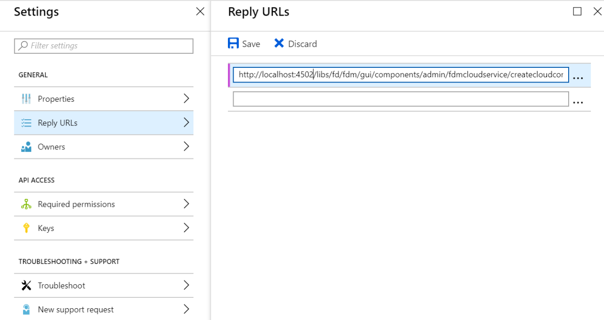

# [!DNL Microsoft Dynamics] OData 구성 {#microsoft-dynamics-odata-configuration}

| 버전 | 문서 링크 |
| -------- | ---------------------------- |
| AEM 6.5 | [여기 클릭](https://experienceleague.adobe.com/docs/experience-manager-65/forms/form-data-model/ms-dynamics-odata-configuration.html) |
| AEM as a Cloud Service | 이 문서 |


[!DNL Microsoft Dynamics] 은 고객 계정, 연락처, 리드, 기회 및 사례를 생성하고 관리하는 엔터프라이즈 솔루션을 제공하는 CRM(고객 관계 관리) 및 ERP(전사적 자원 관리) 소프트웨어입니다. [[!DNL Experience Manager Forms] 데이터 통합](data-integration.md) 은 Forms을 온라인 및 온프레미스와 통합하기 위한 OData 클라우드 서비스 구성을 제공합니다. [!DNL Microsoft Dynamics] 서버입니다. 에 정의된 엔티티, 속성 및 서비스를 기반으로 양식 데이터 모델을 만들 수 있습니다 [!DNL Microsoft Dynamics] 서비스. 양식 데이터 모델을 사용하여 와 상호 작용하는 적응형 Forms을 만들 수 있습니다 [!DNL Microsoft Dynamics] 비즈니스 워크플로를 활성화하는 서버입니다. 예:

* 쿼리 [!DNL Microsoft Dynamics] 데이터 서버 및 적응형 Forms 미리 채우기
* 에 데이터 쓰기 [!DNL Microsoft Dynamics] 적응형 양식 제출 시
* 데이터 쓰기 [!DNL Microsoft Dynamics] 를 통해 양식 데이터 모델에 정의된 사용자 지정 엔티티 및 그 반대

<!--[!DNL Experience Manager Forms] add-on package also includes reference OData configuration that you can use to quickly integrate [!DNL Microsoft Dynamics] with [!DNL Experience Manager Forms].-->

<!--When the package is installed, the following entities and services are available on your [!DNL Experience Manager Forms] instance:

* MS Dynamics OData Cloud Service (OData Service)-->
<!--* Form Data Model with preconfigured [!DNL Microsoft Dynamics] entities and services.-->

<!-- Preconfigured [!DNL Microsoft Dynamics] entities and services in a Form Data Model are available on your [!DNL Experience Manager Forms] instance only if the run mode for the [!DNL Experience Manager] instance is set as `samplecontent` (default). -->  MS Dynamics OData Cloud Service(OData 서비스)는 모든 실행 모드에서 사용할 수 있습니다. 의 실행 모드 구성에 대한 자세한 내용은 [!DNL Experience Manager] 인스턴스를 참조하십시오. [실행 모드](https://experienceleague.adobe.com/docs/experience-manager-cloud-service/implementing/deploying/overview.html#runmodes).

AEM as a Cloud Service에서는 양식 제출을 처리하기 위한 다양한 제출 액션을 제공합니다. 다음에서 이러한 옵션에 대해 자세히 알아볼 수 있습니다. [적응형 양식 제출 액션](/help/forms/configure-submit-actions-core-components.md)  기사.


## 사전 요구 사항 {#prerequisites}

설정 및 구성을 시작하기 전에 [!DNL Microsoft Dynamics], 다음 항목이 있는지 확인합니다.

<!--* Installed the [[!DNL Experience Manager Forms] add-on package](installing-configuring-aem-forms-osgi.md) -->
* 구성됨 [!DNL Microsoft Dynamics] 365 온라인 또는 다음 중 하나의 인스턴스를 설치함 [!DNL Microsoft Dynamics] 버전:

   * [!DNL Microsoft Dynamics] 365 온프레미스
   * [!DNL Microsoft Dynamics] 년 온프레미스

* [다음에 대한 애플리케이션을 등록했습니다. [!DNL Microsoft Dynamics] 온라인 서비스 [!DNL Microsoft Azure] Active Directory](https://docs.microsoft.com/en-us/dynamics365/customer-engagement/developer/walkthrough-register-dynamics-365-app-azure-active-directory). 등록된 서비스에 대한 클라이언트 ID(애플리케이션 ID라고도 함) 및 클라이언트 암호의 값을 기록해 두십시오. 이 값은 다음 기간 동안 사용됩니다. [용 cloud service 구성 [!DNL Microsoft Dynamics] 서비스](#configure-cloud-service-for-your-microsoft-dynamics-service).

## 등록된 회신 URL 설정 [!DNL Microsoft Dynamics] 애플리케이션 {#set-reply-url-for-registered-microsoft-dynamics-application}

등록에 대한 회신 URL을 설정하려면 다음을 수행하십시오 [!DNL Microsoft Dynamics] 애플리케이션:

>[!NOTE]
>
>을 통합하는 동안에만 이 절차를 사용하십시오. [!DNL Experience Manager Forms] 온라인 [!DNL Microsoft Dynamics] 서버입니다.

1. 다음으로 이동 [!DNL Microsoft Azure] Active Directory 계정 및에 다음 클라우드 서비스 구성 URL 추가 **[!UICONTROL 회신 URL]** 등록된 응용 프로그램에 대한 설정:

   `https://[server]:[port]/libs/fd/fdm/gui/components/admin/fdmcloudservice/createcloudconfigwizard/cloudservices.html`

   

1. 구성을 저장합니다.

## 구성 [!DNL Microsoft Dynamics] IFD용 {#configure-microsoft-dynamics-for-ifd}

[!DNL Microsoft Dynamics] 클레임 기반 인증을 사용하여 의 데이터에 대한 액세스 권한 제공 [!DNL Microsoft Dynamics] 외부 사용자에 대한 CRM 서버입니다. 이 기능을 활성화하려면 다음을 수행하여 을(를) 구성합니다 [!DNL Microsoft Dynamics] IFD(인터넷 연결 배포)용 및 클레임 설정 구성

>[!NOTE]
>
> 을 통합하는 동안에만 이 절차를 사용하십시오. [!DNL Experience Manager Forms] 온-프레미스 [!DNL Microsoft Dynamics] 서버입니다.

1. 구성 [!DNL Microsoft Dynamics] 에 설명된 대로 IFD에 대한 온-프레미스 인스턴스 [IFD 구성 [!DNL Microsoft Dynamics]](https://technet.microsoft.com/en-us/library/dn609803.aspx).
1. Windows PowerShell을 사용하여 다음 명령을 실행하여 IFD 사용 시 클레임 설정을 구성합니다. [!DNL Microsoft Dynamics]:

   ```shell
   Add-PSSnapin Microsoft.Crm.PowerShell
    $ClaimsSettings = Get-CrmSetting -SettingType OAuthClaimsSettings
    $ClaimsSettings.Enabled = $true
    Set-CrmSetting -Setting $ClaimsSettings
   ```

   다음을 참조하십시오 [CRM 온-프레미스(IFD)에 대한 앱 등록](https://msdn.microsoft.com/sl-si/library/dn531010(v=crm.7).aspx#bkmk_ifd) 을 참조하십시오.

## AD FS 컴퓨터에서 OAuth 클라이언트 구성 {#configure-oauth-client-on-ad-fs-machine}

AD FS(Active Directory Federation Services) 컴퓨터에 OAuth 클라이언트를 등록하고 AD FS 컴퓨터에 대한 액세스 권한을 부여하려면 다음을 수행하십시오.

>[!NOTE]
>
>을 통합하는 동안에만 이 절차를 사용하십시오. [!DNL Experience Manager Forms] 온-프레미스 [!DNL Microsoft Dynamics] 서버입니다.

1. 다음 명령을 실행합니다.

   `Add-AdfsClient -ClientId “<Client-ID>” -Name "<name>" -RedirectUri "<redirect-uri>" -GenerateClientSecret`

   위치:

   * `Client-ID` 는 GUID 생성기를 사용하여 생성할 수 있는 클라이언트 ID입니다.
   * `redirect-uri` 는 의 URL입니다. [!DNL Microsoft Dynamics] 의 OData 클라우드 서비스 [!DNL Experience Manager Forms]. 기본 클라우드 서비스는 [!DNL Experience Manager Forms] 는 다음 URL에 배포됩니다.
     `https://'[server]:[port]'/libs/fd/fdm/gui/components/admin/fdmcloudservice/createcloudconfigwizard/cloudservices.html`

1. 다음 명령을 실행하여 AD FS 컴퓨터에 대한 액세스 권한을 부여합니다.

   `Grant-AdfsApplicationPermission -ClientRoleIdentifier “<Client-ID>” -ServerRoleIdentifier <resource> -ScopeNames openid`

   위치:

   * `resource` 은(는) [!DNL Microsoft Dynamics] 조직 URL입니다.

1. [!DNL Microsoft Dynamics] 은 HTTPS 프로토콜을 사용합니다. 에서 AD FS 끝점을 호출하려면 [!DNL Forms] 서버, 설치 [!DNL Microsoft Dynamics] 를 사용하여 Java 인증서 저장소에 대한 사이트 인증서 `keytool` 실행 중인 컴퓨터의 명령 [!DNL Experience Manager Forms].

## 에 대한 클라우드 서비스 구성 [!DNL Microsoft Dynamics] 서비스 {#configure-cloud-service-for-your-microsoft-dynamics-service}

OData 서비스는 서비스 루트 URL로 식별됩니다. 에서 OData 서비스를 구성하려면 [!DNL Experience Manager] as a Cloud Service으로, 서비스에 대한 서비스 루트 URL이 있는지 확인하고 다음을 수행합니다.

<!--The **MS Dynamics OData Cloud Service (OData Service)** configuration comes with default OData configuration. To configure it to connect with your [!DNL Microsoft Dynamics] service, do the following.-->

>[!NOTE]
>
>를 구성하는 단계별 지침입니다. [!DNL Microsoft Dynamics 365], 온라인 또는 온프레미스에서 다음을 참조하십시오. [[!DNL Microsoft Dynamics] OData 구성](ms-dynamics-odata-configuration.md).

1. 다음으로 이동 **[!UICONTROL 도구 > Cloud Service > 데이터 소스]**. 클라우드 구성을 만들 폴더를 선택하려면 를 선택합니다.

   다음을 참조하십시오 [클라우드 서비스 구성을 위한 폴더 구성](#cloud-folder) 클라우드 서비스 구성을 위한 폴더 만들기 및 구성에 대한 정보를 제공합니다.

1. 선택 **[!UICONTROL 만들기]** 을(를) 열려면 **[!UICONTROL 데이터 소스 구성 만들기 마법사]**. 구성의 이름 및 제목(선택 사항)을 지정하고 다음을 선택합니다. **[!UICONTROL OData 서비스]** 다음에서 **[!UICONTROL 서비스 유형]** 드롭다운에서 필요한 경우 구성에 대한 썸네일 이미지를 검색하여 선택하고 **[!UICONTROL 다음]**.
다음에서 **[!UICONTROL 인증 설정]** 탭:

   1. 다음에 대한 값 입력 **[!UICONTROL 서비스 루트]** 필드. Dynamics 인스턴스로 이동하여 다음 위치로 이동 **[!UICONTROL 개발자 리소스]** 서비스 루트 필드에 대한 값을 보려면 다음을 수행하십시오. 예: https://&lt;tenant-name>/api/data/v9.1/

   1. 선택 **[!UICONTROL OAuth 2.0]** 를 인증 유형으로 사용하십시오.

   1. 에서 기본값 바꾸기 **[!UICONTROL 클라이언트 ID]** (또한으로 지칭됨) **애플리케이션 ID**), **[!UICONTROL 클라이언트 암호]**, **[!UICONTROL OAuth URL]**, **[!UICONTROL 토큰 URL 새로 고침]**, **[!UICONTROL 토큰 URL 액세스]**, 및 **[!UICONTROL 리소스]** 의 값이 있는 필드 [!DNL Microsoft Dynamics] 서비스 구성. 에서 dynamics 인스턴스 URL을 지정해야 합니다. **[!UICONTROL 리소스]** 구성할 필드 [!DNL Microsoft Dynamics] (양식 데이터 모델 포함) 서비스 루트 URL을 사용하여 dynamics 인스턴스 URL을 파생시킵니다. 예를 들어, [https://org.crm.dynamics.com](https://org.crm.dynamics.com/).

   1. 지정 **[!UICONTROL openid]** 다음에서 **[!UICONTROL 인증 범위]** 인증 프로세스용 필드 [!DNL Microsoft Dynamics].

      
양식 데이터 모델
1. 클릭 **[!UICONTROL OAuth에 연결]**. (으)로 리디렉션됩니다. [!DNL Microsoft Dynamics] 로그인 페이지입니다.
1. 로 로그인 [!DNL Microsoft Dynamics] 자격 증명 및 동의 를 선택하여 cloud service 구성 연결 [!DNL Microsoft Dynamics] 서비스. 클라우드 서비스와 서비스 간 양식 데이터 모델 수립이 일회성 작업이다.

   OData 구성이 성공적으로 저장되었다는 메시지를 표시하는 클라우드 서비스 구성 페이지의 양식 데이터 모델입니다.

MS Dynamics OData Cloud Service(OData 서비스) 클라우드 서비스가 구성되어 있으며 Dynamics 서비스와 연결되어 있습니다. 양식 데이터 모델 양식 데이터 모델

## 양식 데이터 모델 만들기 {#create-form-data-model}

<!--When you install the [!DNL Experience Manager Forms] package, a form data model, **[!DNL Microsoft Dynamics] FDM**, is deployed on your [!DNL Experience Manager] instance. By default, the Form Data Model uses [!DNL Microsoft Dynamics] service configured in the MS Dynamics OData Cloud Service (OData Service) as its data source.

On opening the Form Data Model for the first time, it connects to the configured [!DNL Microsoft Dynamics] service and fetches entities from your [!DNL Microsoft Dynamics] instance. The "contact" and "lead" entities from [!DNL Microsoft Dynamics] are already added in the form data model.

To review the form data model, go to **[!UICONTROL Form Data Model egrations]**. Select **[!DNL Microsoft Dynamics] FDM** and click **[!UICONTROL Edit]** to open the Form Data Model in edit mode. Alternatively, you can open the Form Data Model directly from the following URL:

`https://'[server]:[port]'/aem/fdm/editor.html/content/dam/formsanddocuments-fdm/ms-dynamics-fdm`
 Form Data Model 
-->

MS Dynamics OData 클라우드 서비스를 구성한 후 양식 데이터 모델을 만드는 동안 서비스를 사용할 수 있습니다. 자세한 내용은 [양식 데이터 모델 만들기](create-form-data-models.md).

다음으로, 적응형 양식 기반 양식 데이터 모델을 만들어 다음과 같은 다양한 적응형 양식 사용 사례에 사용할 수 있습니다.

* 다음에서 정보를 쿼리하여 적응형 양식 미리 채우기 [!DNL Microsoft Dynamics] 엔티티 및 서비스
* 호출 [!DNL Microsoft Dynamics] 적응형 양식 규칙을 사용하여 양식 데이터 모델에 정의된 서버 작업
* 제출된 양식 데이터를 다음에 쓰기 [!DNL Microsoft Dynamics] 엔티티

<!--It is recommended to create a copy of the Form Data Model provided with the [!DNL Experience Manager Forms] package and configure data models and services to suit your requirements. It will ensure that any future updates to the package do not override your form data model.-->

다음을 수행할 수 있습니다. [양식 데이터 모델 제출 액션 구성](/help/forms/using-form-data-model.md) 적응형 양식에서 Microsoft Dynamics OData로 데이터를 보낼 수 있습니다.

비즈니스 워크플로우에서 양식 데이터 모델을 만들고 사용하는 방법에 대한 자세한 내용은 다음을 참조하십시오. [데이터 통합](data-integration.md).
