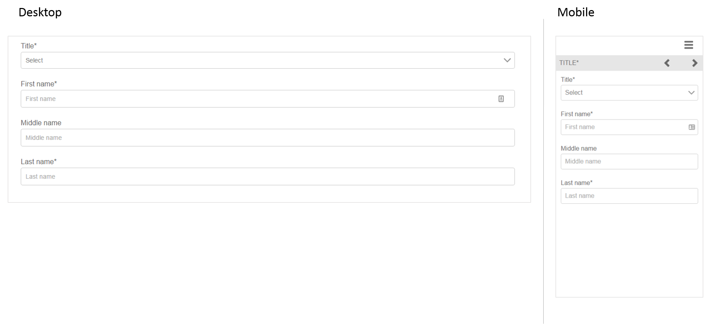

# 적응형 양식 단편 참조 {#reference-adaptive-form-fragments}

적응형 양식 조각은 필드 그룹이거나 양식을 만들 때 사용할 수 있는 필드 그룹이 포함된 패널입니다. 이를 통해 양식을 쉽고 빠르게 만들 수 있습니다. 사이드바의 에셋 브라우저를 사용하여 적응형 양식 조각을 양식으로 드래그 앤 드롭할 수 있으며 양식 편집기에서 편집할 수 있습니다.

적응형 Forms 작성자의 경우 참조 조각이 [!DNL AEM Forms] 패키지 [[!DNL AEM FORMS] 참조 조각](https://www.adobeaemcloud.com/content/marketplace/marketplaceProxy.html?packagePath=/content/companies/public/adobe/packages/cq630/fd/AEM-FORMS-6.3-REFERENCE-FRAGMENTS)에 제공됩니다. 여기에는 다음 조각이 포함됩니다.

* 주소
* 연락처 정보
* 신용 카드 정보
* 현재 고용
* 종속 정보
* 고용 내역
* 수입 및 지출
* 이름
* 약관
* 스크리블 사용 약관

패키지를 설치하면 Forms 및 문서 아래에 참조 조각이 포함된 참조 조각 폴더가 만들어집니다. 패키지를 설치하려면 [Cloud Manager 및 패키지 관리자를 통해 콘텐츠 패키지 배포](https://experienceleague.adobe.com/docs/experience-manager-cloud-service/implementing/deploying/overview.html#deploying-content-packages-via-cloud-manager-and-package-manager) 및 [패키지를 사용하여 작업하는 방법](https://experienceleague.adobe.com/docs/experience-manager-65/administering/contentmanagement/package-manager.html)을 참조하십시오.

## 주소 {#address}

우편 주소를 지정하는 필드를 포함합니다. 사용 가능한 필드는 주소, 우편 번호, 도시, 주 및 국가입니다. 또한 지정된 미국 우편번호에 대해 시 및 주를 채우는 사전 구성된 웹 서비스가 포함되어 있습니다.

<!--[Click to enlarge

](assets/address-1.png)-->

## 연락처 정보 {#contact-information}

전화 번호 및 이메일 주소를 캡처하는 필드를 포함합니다.

<!--[Click to enlarge

](assets/contact-info-1.png)-->

## 신용 카드 정보 {#credit-card-information}

결제를 처리하는 데 사용할 수 있는 신용 카드 정보를 캡처하는 필드를 포함합니다.

## 현재 고용 {#current-employment}

고용 상태, 고용 분야, 지정, 조직, 가입 날짜 등 현재 고용 세부 정보를 캡처하는 필드를 포함합니다.

<!--[Click to enlarge

](assets/current-emp-1.png)-->

## 종속 정보 {#dependents-information}

하나 이상의 종속 항목에 대한 정보(예: 이름, 관계 및 기간)를 테이블 형식으로 지정하는 필드를 포함합니다.

<!--[Click to enlarge

](assets/dependents-info-1.png)-->

## 고용 내역 {#employment-history}

고용 내역을 캡처하는 필드를 포함합니다. 여러 조직을 추가할 수 있습니다.

<!--[Click to enlarge

](assets/emp-history-1.png)-->

## 수입 및 지출 {#income-expenditure}

월별 현금 흐름 및 비용을 캡처하는 필드를 포함합니다. 사용자가 재무 세부 정보를 제공해야 하는 Forms은 이 조각을 사용하여 수입 및 지출을 캡처할 수 있습니다.

<!--[Click to enlarge

](assets/income-1.png)-->

## 이름 {#name}

제목, 이름, 가운데 이름 및 성을 지정하는 필드를 포함합니다.

<!--[Click to enlarge

](assets/name-1.png)-->

## 약관 {#terms-conditions}

사용자가 양식을 제출하기 전에 동의할 약관을 지정합니다.

<!--[Click to enlarge

](assets/tnc-1.png)-->

## 스크리블 사용 약관 {#terms-conditions-with-scribble}

사용자가 양식을 제출하기 전에 동의하고 서명할 수 있는 약관을 지정합니다.

<!--[Click to enlarge

](assets/tnc-scribble-1.png)-->
