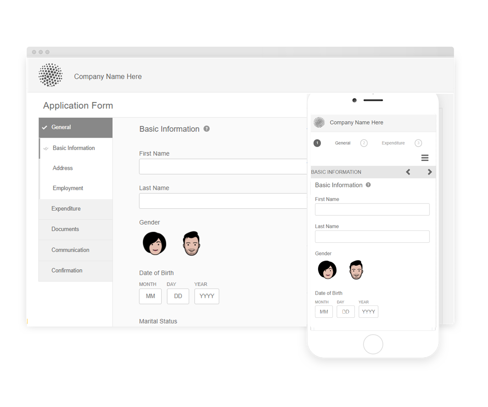

# 참조 테마, 템플릿 및 양식 데이터 모델 {#reference-themes-templates-and-data-models}

| 적용 대상 | 문서 링크 |
| -------- | ---------------------------- |
| 핵심 구성 요소를 기반으로 하는 적응형 양식 | [여기 클릭](https://experienceleague.adobe.com/docs/experience-manager-core-components/using/adaptive-forms/sample-themes-templates-form-data-models-core-components.html) |
| 기초 구성 요소를 기반으로 하는 적응형 양식 | 이 문서 |

 [새 적응형 양식 만들기](/help/forms/creating-adaptive-form-core-components.md) 또는 [AEM Sites 페이지에 적응형 양식 추가](/help/forms/create-or-add-an-adaptive-form-to-aem-sites-page.md) 작업을 할 때 현대적이고 확장 가능한 데이터 캡처 [핵심 구성 요소](https://experienceleague.adobe.com/docs/experience-manager-core-components/using/adaptive-forms/introduction.html)를 사용하는 것이 좋습니다. 이러한 구성 요소는 적응형 양식 만들기 작업이 대폭 개선되어 우수한 사용자 경험을 보장할 수 있게 되었음을 나타냅니다. 이 문서에서는 기초 구성 요소를 사용하여 적응형 양식을 작성하는 이전 접근법에 대해 설명합니다. 

AEM Forms as a Cloud Service 및 여러 참조 테마와 양식 데이터 모델(FDM)을 제공하여 적응형 Forms 생성을 신속하게 시작할 수 있습니다. 다음을 다운로드할 수 있습니다. [소프트웨어 배포 포털의 콘텐츠 패키지 참조](https://experience.adobe.com/#/downloads/content/software-distribution/en/aemcloud.html?package=/content/software-distribution/en/details.html/content/dam/aemcloud/public/aem-forms-reference-content.ui.content-2.1.0.zip) 및 사용 [패키지 관리자](/help/implementing/developing/tools/package-manager.md) 을(를) 설치하려면 [참조 콘텐츠 패키지](https://experience.adobe.com/#/downloads/content/software-distribution/en/aemcloud.html?package=/content/software-distribution/en/details.html/content/dam/aemcloud/public/aem-forms-reference-content.ui.content-2.1.0.zip) 프로덕션, 개발 또는 로컬 개발 환경에서 이러한 참조 자산을 사용자 환경에 가져올 수 있습니다.

참조 콘텐츠 패키지에 포함된 테마, 템플릿 및 양식 데이터 모델(FDM)은 다음과 같습니다.

| 테마 | 템플릿 | 양식 데이터 모델(FDM) |
---------|----------|---------
| 캔버스 3.0 | 기본 | Microsoft Dynamics 365 |
| 고요해 | 비어 있음 | Salesforce |
| 우르바네 |   |  |
| 울트라마린 |  |  |
| 베릴 |  |  |
| 헬스 케어 |  |   |
| FSI |   |   |

## 참조 테마 {#reference-themes}

[테마](/help/forms/themes.md) css에 대한 깊은 지식 없이 양식을 스타일링할 수 있습니다. 다음을 설치하여 다음 테마를 가져올 수 있습니다. [참조 컨텐츠 패키지](https://experience.adobe.com/#/downloads/content/software-distribution/en/aemcloud.html?package=/content/software-distribution/en/details.html/content/dam/aemcloud/public/aem-forms-reference-content.ui.content-2.1.0.zip):

* 베릴
* 캔버스 3.0
* 고요해
* 우르바네
* 울트라마린
* 헬스 케어
* FSI(금융 서비스 및 보험)

각 테마에는 사용자를 위한 쾌적한 적응형 양식을 만드는 데 사용할 수 있는 고유하고 우아한 스타일이 포함되어 있습니다. 여기에는 패널, 텍스트 상자, 숫자 상자, 라디오 단추, 테이블 및 스위치와 같은 선택기에 대한 고유한 스타일이 포함되어 있습니다. 이러한 테마의 스타일링은 요구 사항을 기반으로 합니다. 예를 들어 특정 시나리오에서는 깔끔한 글꼴을 사용하는 미니멀리즘 테마가 필요합니다. 자유 테마는 이러한 모습을 달성할 수 있도록 해줍니다.

이 패키지에 포함된 테마는 응답형이며, 이러한 테마의 스타일은 모바일 및 데스크탑 디스플레이에 대해 정의됩니다. 다양한 장치의 최신 브라우저는 이러한 테마 중 하나와 함께 적용된 양식을 번거로움 없이 렌더링할 수 있습니다.

패키지 설치에 대한 자세한 내용은 [패키지를 사용하여 작업하는 방법](/help/implementing/developing/tools/package-manager.md).

## 베릴 {#beryl}

베릴 테마는 배경 이미지, 투명도 및 크고 평평한 아이콘의 사용을 강조합니다. 아래 스크린샷에서는 베릴 테마의 모양과 양식의 스타일을 향상시키는 방법을 확인할 수 있습니다.

## 캔버스 3.0 {#canvas}

Canvas 3.0은 적응형 Forms의 기본 테마이며 기본 색상, 투명도 및 플랫 아이콘 사용을 강조합니다. 아래 스크린샷에서는 캔버스 3.0 테마의 모양을 확인할 수 있습니다.

## 고요해 {#tranquil}

고요한 테마는 고요한 색상 구성표의 밝은 색조와 어두운 색조를 제공하여 양식의 다양한 구성 요소를 강조 표시합니다. 예를 들어 라디오 단추, 패널 및 탭의 녹색 음영이 다릅니다.

## 우르바네 {#urbane}

Urbane theme는 귀하의 양식에 대해 미니멀하고 기능적인 모습을 강조합니다. 양식에 도시 테마를 적용하면 구성 요소가 균일함을 알 수 있습니다. 패널의 윤곽선이 얇아 현대적인 느낌을 줍니다.

## 울트라마린 {#ultramarine}

울트라마린 테마는 진한 파란색 음영을 사용하여 탭, 패널, 텍스트 상자 및 버튼과 같은 구성 요소를 강조 표시합니다.

## 헬스 케어 {#healthcare}

헬스케어 테마는 진한 녹색 음영을 사용하여 탭, 패널, 텍스트 상자 및 버튼과 같은 구성 요소를 강조 표시합니다.

## FSI(금융 서비스 및 보험)

FSI 테마는 양식에 대한 미니멀하고 기능적인 모양을 강조합니다. 양식에 FSI 테마를 적용하면 패널 구성 요소가 노란색으로 표시됩니다.

## 참조 템플릿 {#reference-templates}

[템플릿](/help/forms/themes.md) 에서는 양식에 대한 초기 양식 구조, 콘텐츠 및 작업을 정의할 수 있습니다. 다음을 설치하여 다음 템플릿을 가져올 수 있습니다. [참조 컨텐츠 패키지](https://experience.adobe.com/#/downloads/content/software-distribution/en/aemcloud.html?package=/content/software-distribution/en/details.html/content/dam/aemcloud/public/aem-forms-reference-content.ui.content-2.1.0.zip):

* 기본
* 비어 있음

기본 템플릿을 사용하면 등록 양식을 신속하게 만들 수 있습니다. 적응형 Forms 기초 구성 요소의 기능을 미리 보는 데에도 사용할 수 있습니다. 또한 데이터의 섹션별 표시를 위한 마법사 레이아웃을 제공합니다. 빈 템플릿을 사용하여 빈 캔버스에서 적응형 양식을 만들기 시작합니다.

## 참조 양식 데이터 모델(FDM) {#reference-models}

그런 다음 적응형 Forms은 Microsoft Dynamics 365 및 Salesforce 서버와 상호 작용하여 비즈니스 워크플로우를 가능하게 할 수 있습니다. 예:

* 적응형 양식 제출 시 Microsoft Dynamics 365 및 Salesforce에 데이터를 작성합니다.
* FDM(양식 데이터 모델)에 정의된 사용자 정의 엔티티를 통해 그리고 역으로 Microsoft Dynamics 365 및 Salesforce에서 데이터를 기록합니다.
* Microsoft Dynamics 365 및 Salesforce 서버에 데이터를 쿼리하고 적응형 Forms을 미리 채웁니다.
* Microsoft Dynamics 365 및 Salesforce 서버에서 데이터를 읽습니다.

다음을 설치하여 다음 양식 데이터 모델(FDM)을 가져올 수 있습니다 [참조 컨텐츠 패키지](https://experience.adobe.com/#/downloads/content/software-distribution/en/aemcloud.html?package=/content/software-distribution/en/details.html/content/dam/aemcloud/public/aem-forms-reference-content.ui.content-2.1.0.zip):

* Microsoft® Dynamics 365
* Salesforce

이러한 모델 사용에 대한 자세한 내용은 [Microsoft Dynamics 365 및 Salesforce 클라우드 서비스 구성](https://experienceleague.adobe.com/docs/experience-manager-cloud-service/content/forms/integrate/use-form-data-model/configure-msdynamics-salesforce.html?lang=en#configure-dynamics-cloud-service)

## 추가 참조 {#see-also}

{{see-also}}