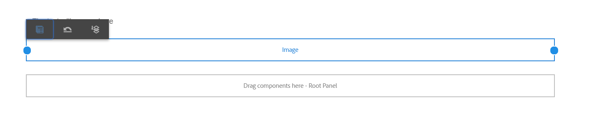

# 레이아웃 모드를 사용하여 적응형 Forms에 대한 구성 요소 크기 조정 {#use-layout-mode-to-resize-components}

 [새 적응형 양식 만들기](/help/forms/creating-adaptive-form-core-components.md) 또는 [AEM Sites 페이지에 적응형 양식 추가](/help/forms/create-or-add-an-adaptive-form-to-aem-sites-page.md) 작업을 할 때 현대적이고 확장 가능한 데이터 캡처 [핵심 구성 요소](https://experienceleague.adobe.com/docs/experience-manager-core-components/using/adaptive-forms/introduction.html)를 사용하는 것이 좋습니다. 이러한 구성 요소는 적응형 양식 만들기 작업이 대폭 개선되어 우수한 사용자 경험을 보장할 수 있게 되었음을 나타냅니다. 이 문서에서는 기초 구성 요소를 사용하여 적응형 양식을 작성하는 이전 접근법에 대해 설명합니다. 

| 버전 | 문서 링크 |
| -------- | ---------------------------- |
| AEM 6.5 | [여기 클릭](https://experienceleague.adobe.com/docs/experience-manager-65/forms/adaptive-forms-basic-authoring/resize-using-layout-mode.html) |
| AEM as a Cloud Service | 이 문서 |

적응형 양식 작성 인터페이스를 사용하면 레이아웃 모드를 사용하여 구성 요소의 크기를 조정할 수 있습니다. 열 내의 파란색 점을 드래그하여 구성 요소를 배치할 시작점과 끝점을 정의합니다. 응답형 격자 내에서 구성 요소를 탭하면 파란색 점이 표시됩니다. 응답형 격자는 12개의 동일한 열로 구성됩니다. 대체 열의 흰색과 파란색 색상 음영은 한 열을 다른 열과 구분합니다.

레이아웃 모드를 사용하여 데스크탑, 태블릿, 휴대폰 및 기타 작은 장치와 같은 모든 장치 유형에 대한 구성 요소의 크기를 조정할 수 있습니다. 태블릿은 자동으로 데스크탑 버전에서 레이아웃 구성을 파생시키고 작은 장치는 전화에서 레이아웃 구성을 파생시킵니다. 그러나 자동으로 파생된 구성을 재정의하여 각 장치 유형에 대해 다른 구성을 정의할 수 있습니다.

## 레이아웃 모드 액세스 {#access-layout-mode}

선택 **[!UICONTROL 레이아웃]** 다음 옆에 있는 적응형 양식 작성 인터페이스 맨 위에 표시되는 드롭다운 목록에서 **[!UICONTROL 미리 보기]** 옵션을 선택합니다. 양식이 레이아웃 모드로 표시됩니다.

1. 에 로그인합니다 [!DNL Adobe Experience Manager] 작성자 인스턴스 및 다음으로 이동 **[!UICONTROL Adobe Experience Manager]** > **[!UICONTROL Forms]** > **[!UICONTROL Forms 및 문서]**.
1. 새로 만들기 또는 기존 열기 [적응형 양식](creating-adaptive-form.md).
1. 선택 **[!UICONTROL 레이아웃]** (이)가 표시되는 드롭다운 목록에서 **[!UICONTROL 미리 보기]** 옵션을 선택합니다. 양식이 레이아웃 모드로 표시됩니다.

   

## 구성 요소 크기 조정 {#resize-components}

1. 레이아웃 모드에서 크기를 조정할 구성 요소를 선택합니다. 파란색 점은 응답형 격자의 시작과 끝에 표시됩니다.
1. 파란색 점을 드래그 앤 드롭하여 응답형 격자에서 구성 요소의 위치를 정의합니다.

   

   구성 요소를 탭한 후 표시되는 도구 모음은 다음 옵션으로 구성됩니다.

   * **[!UICONTROL 상위]**: 구성 요소의 상위 항목을 선택합니다.
   * **[!UICONTROL 중단점 레이아웃 되돌리기]**: 모든 크기 변경 내용을 실행 취소하고 구성 요소에 기본 레이아웃을 적용합니다.
   * **[!UICONTROL 새 라인으로 이동]**: 동일한 행 내에 여러 구성 요소가 있는 경우 구성 요소를 다음 행으로 이동합니다.

   다음을 사용할 수도 있습니다 **[!UICONTROL 중단점 레이아웃 되돌리기]** ( ) 모든 크기 변경 내용을 실행 취소할 수 있는 패널 수준의 옵션입니다.

   >[!NOTE]
   >
   >레이아웃 모드를 사용하여 표 열, 도구 모음, 도구 모음 단추 및 대상 영역 구성 요소의 크기를 조정할 수 없습니다. 이러한 구성 요소의 크기를 조정하려면 스타일 모드를 사용하십시오.

### 예 {#example}

**목표:** 표 구성 요소와 이미지 구성 요소를 삽입하고 적응형 양식에서 서로 평행하게 배치하려고 합니다.

1. 다음을 사용하여 표 및 이미지 구성 요소 삽입 [!UICONTROL 편집] 를 입력합니다. 이미지 구성 요소가 테이블 구성 요소 뒤에 표시됩니다.
1. 다음으로 전환 [!UICONTROL 레이아웃] 을(를) 클릭하고 [!UICONTROL 표] 구성 요소. 구성 요소 크기를 조정하기 위한 파란색 점이 1열과 12열에 표시됩니다.
1. 열 12의 파란색 점을 응답형 격자의 열 6으로 드래그합니다.

   

1. 마찬가지로 [!UICONTROL 이미지] 구성 요소를 클릭하고 열 1의 파란색 점을 응답형 격자의 열 7로 드래그합니다. 테이블 및 이미지 구성 요소는 서로 평행하게 표시됩니다.

   

   이미지 구성 요소를 선택하고 **[!UICONTROL 새 라인으로 이동]** 도구 모음에서 다음 줄로 이미지 구성 요소를 이동할 수 있는 옵션을 사용할 수 있습니다.

## 패널 크기 조정 {#resize-panels-layout-mode}

개별 구성 요소 대신 전체 패널의 크기를 조정하려면 다음 단계를 수행하십시오.

1. 패널에서 크기를 조정할 구성 요소를 선택하고 패널 이 구성 요소의 바로 상위 항목인 경우 드롭다운 목록에서 첫 번째 옵션을 선택합니다.

   파란색 점은 응답형 격자의 시작과 끝에 표시됩니다.

1. 파란색 점을 드래그 앤 드롭하여 응답형 격자에서 패널의 위치를 정의합니다.
1단계와 2단계를 반복하고 를 선택할 수 있습니다  크기 조정된 패널을 다음 줄로 이동합니다.

## 패널의 다중 열 레이아웃 정의

다음 단계를 실행하여 패널의 열 수를 정의합니다.

1. 위치 **[!UICONTROL 편집]** 모드, 패널 선택, 선택 , 및 선택 **[!UICONTROL 응답형 - 탐색 없이 페이지에 있는 모든 항목]** 옵션에서 **[!UICONTROL 패널 레이아웃]** 드롭다운 목록입니다.

1. 선택  속성을 저장합니다.

1. 다음에서 **[!UICONTROL 레이아웃]** 모드, 패널에서 구성 요소 중 하나를 선택하고 을 누르고 패널을 선택합니다.

1. 선택  드롭다운 목록에서 열 수를 선택합니다. 열의 수는 1에서 12 사이일 수 있습니다. 패널은 다중 열 레이아웃으로 나뉘어집니다.

## 이전 반응형 레이아웃에 새 반응형 그리드 활성화 {#enableresponsivegrid}

을 사용하여 만드는 양식의 새 반응형 그리드 활성화 [!DNL Adobe Experience Manager] Forms 6.4 이하 버전으로 구성 요소 크기를 조정할 수 있습니다.

>[!NOTE]
>
>새 반응형 격자로 전환하면 양식에 사용된 구성 요소에 대해 이미 정의된 레이아웃 속성이 삭제됩니다.

새 응답형 격자를 활성화하려면 다음 단계를 수행하십시오.

1. 선택 **[!UICONTROL 레이아웃]** (이)가 표시되는 드롭다운 목록에서 **[!UICONTROL 미리 보기]** 옵션을 선택합니다. 레이아웃 모드 활성화 확인이 표시됩니다.
1. 선택 **[!UICONTROL 예]** 을(를) 활성화하려면 **[!UICONTROL 레이아웃]** 를 입력합니다.

### 새 반응형 레이아웃으로 적응형 양식에 이전 단편 포함 {#embed-an-old-fragment-in-an-adaptive-form-with-new-responsive-layout}

적응형 양식에 대한 새 반응형 레이아웃을 사용하면 이전 반응형 레이아웃이 포함된 적응형 양식 단편을 양식에 추가할 수 있습니다. 그러나 새 레이아웃은 조각에 사용된 구성 요소에 대해 이미 정의된 레이아웃 속성을 삭제합니다. 레이아웃 모드로 전환하여 조각에 사용된 구성 요소의 레이아웃 속성을 정의할 수 있습니다.

### 이전 적응형 양식에 새 반응형 레이아웃이 포함된 단편 포함 {#embed-a-fragment-with-new-responsive-layout-in-an-old-adaptive-form}

새 반응형 레이아웃이 포함된 조각을 이전 반응형 레이아웃이 있는 적응형 양식에 포함하는 경우, 양식에 대해 레이아웃 모드를 활성화하고 조각을 다시 포함할 것인지 묻는 메시지가 표시됩니다.

레이아웃 모드를 활성화하려면 **[!UICONTROL 레이아웃]** (이)가 표시되는 드롭다운 목록에서 **[!UICONTROL 미리 보기]** 옵션 및 선택 **[!UICONTROL 예]** 확인할 수 있습니다. 선택 **[!UICONTROL 편집]** 를 입력하여 조각을 다시 포함할 수 있습니다.

## 이전 반응형 레이아웃이 있는 양식의 레이아웃 모드 비활성화 {#disable-layout-mode-for-forms-with-old-responsive-layout}

양식에 사용된 템플릿의 속성을 편집하여 이전 반응형 레이아웃이 있는 양식의 레이아웃 모드를 비활성화할 수 있습니다.

레이아웃 모드를 비활성화하려면 다음 단계를 수행하십시오.

1. 선택 **[!UICONTROL 도구]** > **[!UICONTROL 일반]** > **[!UICONTROL 템플릿]** 및 의 양식에 사용된 템플릿 열기 **[!UICONTROL 편집]** 모드.
1. 왼쪽 창에서 양식 컨테이너 를 선택하고 을(를) 선택합니다. **[!UICONTROL 정책.]**

   

1. 다음 항목 선택 **[!UICONTROL 레이아웃 설정]** 탭하고 선택 **[!UICONTROL 레이아웃 모드 비활성화]**.
1. 선택  템플릿 속성을 저장합니다.

## 추가 참조 {#see-also}

{{see-also}}