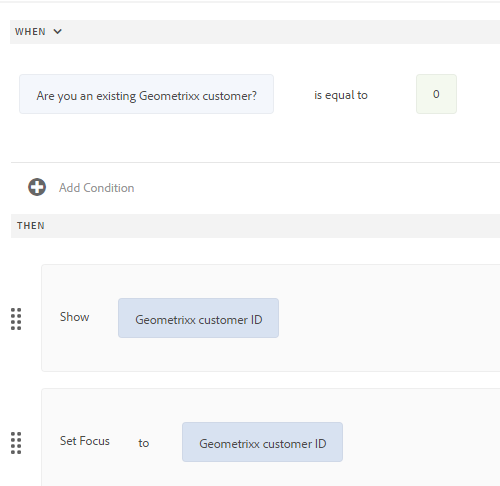

<span class="preview"> 이 문서에는 일부 프리릴리스 기능에 대한 내용이 포함되어 있습니다. 이러한 프리릴리스 기능은 다음을 통해서만 액세스할 수 있습니다. [프리릴리스 채널](https://experienceleague.adobe.com/docs/experience-manager-cloud-service/content/release-notes/prerelease.html#new-features). 프리릴리스 프로그램의 기능은 다음과 같습니다.
* When-else 기능을 사용하여 중첩된 조건 구현 지원
* 필드를 포함한 패널 및 양식의 유효성 검사 또는 재설정
* 사용자 지정 함수 내에서 let 및 arrow 함수(ES10 지원)와 같은 최신 JavaScript 기능을 지원합니다.
</span>

# 적응형 양식에 규칙 추가(핵심 구성 요소) {#adaptive-forms-rule-editor}

규칙 편집기 기능을 사용하면 forms 비즈니스 사용자 및 개발자가 적응형 양식 개체에 대한 규칙을 작성할 수 있습니다. 이러한 규칙은 양식에 대한 사전 설정 조건, 사용자 입력 및 사용자 작업을 기반으로 양식 개체에서 트리거하는 작업을 정의합니다. 정확성과 속도를 보장하는 양식 채우기 환경을 더욱 간소화하는 데 도움이 됩니다.

규칙 편집기는 규칙을 작성하는 직관적이고 간단한 사용자 인터페이스를 제공합니다. 규칙 편집기는 모든 사용자를 위한 시각적 편집기를 제공합니다.<!-- In addition, only for forms power users, rule editor provides a code editor to write rules and scripts. --> 규칙을 사용하여 적응형 양식 개체에 대해 수행할 수 있는 몇 가지 주요 작업은 다음과 같습니다.

* 개체 표시 또는 숨기기
* 개체 활성화 또는 비활성화
* 개체에 대한 값 설정
* 개체 값의 유효성 검사
* 개체의 값을 계산하는 함수 실행
* FDM(양식 데이터 모델) 서비스 호출 및 작업 수행
* 개체의 속성 설정

<!-- Rule editor replaces the scripting capabilities in [!DNL Experience Manager 6.1 Forms] and earlier releases. However, your existing scripts are preserved in the new rule editor. For more information about working with existing scripts in the rule editor, see [Impact of rule editor on existing scripts](rule-editor.md#p-impact-of-rule-editor-on-existing-scripts-p). -->

forms-power-users 그룹 에 추가된 사용자는 스크립트를 만들고 기존 스크립트를 편집할 수 있습니다. 그룹 사용자는 [!DNL forms-users] 스크립트를 사용할 수 있지만 스크립트를 만들거나 편집할 수는 없습니다.

## 규칙 이해 {#understanding-a-rule}

규칙은 작업과 조건의 조합입니다. 규칙 편집기에서 작업에는 폼의 개체 값 숨기기, 표시, 활성화, 비활성화 또는 계산과 같은 활동이 포함됩니다. 조건은 양식 객체의 상태, 값 또는 속성에 대한 검사 및 작업을 수행하여 평가되는 부울 표현식입니다. 작업은 값 ( )을 기반으로 수행됩니다. `True` 또는 `False`)가 조건을 평가하여 반환되었습니다.

규칙 편집기는 규칙을 작성하는 데 도움이 되는 시기, 표시, 숨기기, 활성화, 비활성화, 값 설정 및 유효성 검사와 같은 사전 정의된 규칙 유형 집합을 제공합니다. 각 규칙 유형을 사용하면 규칙에서 조건 및 작업을 정의할 수 있습니다. 이 문서에서는 각 규칙 유형에 대해 자세히 설명합니다.

규칙은 일반적으로 다음 구문 중 하나를 따릅니다.

**조건-작업** 이 구문에서는 먼저 규칙이 조건이 정의된 후 트리거할 작업을 정의합니다. 이 구문은 프로그래밍 언어의 if-then 문과 비슷합니다.

규칙 편집기에서 **날짜** 규칙 유형은 조건-작업 구문을 적용합니다.

**Action-Condition** 이 구문에서는 먼저 규칙이 작업을 트리거한 다음 평가 조건을 정의합니다. 이 구문의 또 다른 변형은 action-condition-alternate 매크로 함수이며, 이 매크로 함수는 조건이 False를 반환하는 경우 트리거할 대체 매크로 함수도 정의합니다.

규칙 편집기의 규칙 유형 표시, 숨기기, 활성화, 비활성화, 값 설정 및 유효성 검사는 작업 조건 규칙 구성을 적용합니다. 기본적으로 표시에 대한 대체 작업은 숨기기이고 활성화에 대한 대체 작업은 비활성화이며 그 반대입니다. 기본 대체 작업은 변경할 수 없습니다.

>[!NOTE]
>
>규칙 편집기에서 정의하는 조건 및 작업을 포함한 사용 가능한 규칙 유형은 규칙을 만드는 양식 객체의 유형에 따라 다릅니다. 규칙 편집기에는 특정 양식 객체 유형에 대한 조건 및 작업 문을 작성하기 위한 유효한 규칙 유형 및 옵션만 표시됩니다. 예를 들어 패널 객체에 대한 유형의 유효성 검사 및 값 설정 은 표시되지 않습니다.

규칙 편집기에서 사용할 수 있는 규칙 유형에 대한 자세한 내용은 [규칙 편집기에서 사용 가능한 규칙 유형](rule-editor.md#p-available-rule-types-in-rule-editor-p).

### 규칙 구성 선택 지침 {#guidelines-for-choosing-a-rule-construct}

모든 규칙 구문을 사용하여 대부분의 사용 사례를 달성할 수 있지만, 다음은 한 구문을 다른 구문보다 선택하는 몇 가지 지침입니다. 규칙 편집기에서 사용할 수 있는 규칙에 대한 자세한 내용은 [규칙 편집기에서 사용 가능한 규칙 유형](rule-editor.md#p-available-rule-types-in-rule-editor-p).

* 규칙을 작성할 때 일반적으로 경험하는 규칙은 규칙을 작성하는 객체의 컨텍스트에서 생각하는 것입니다. 필드 A에서 사용자가 지정하는 값에 따라 필드 B를 숨기거나 표시하려고 한다고 가정합니다. 이 경우 필드 A에서 조건을 평가하고 반환되는 값을 기반으로 필드 B에서 작업을 트리거합니다.

  따라서 필드 B(조건을 평가하는 객체)에 규칙을 작성하는 경우 조건-작업 구문 또는 시기 규칙 유형을 사용합니다. 마찬가지로 필드 A에서 작업 조건 구문 또는 표시 또는 숨기기 규칙 유형을 사용합니다.

* 한 가지 조건을 기반으로 여러 작업을 수행해야 하는 경우가 있습니다. 이러한 경우 조건-작업 구문을 사용하는 것이 좋습니다. 이 구문에서는 한 번 조건을 평가하고 여러 작업 문을 지정할 수 있습니다.

  예를 들어, 사용자가 필드 A에 지정한 값을 확인하는 조건에 따라 필드 B, C 및 D를 숨기려면 조건-작업 구문 또는 필드 A에 규칙 유형을 입력할 때 하나의 규칙을 작성하고 필드 B, C 및 D의 가시성을 제어하는 작업을 지정합니다. 그렇지 않으면 필드 B, C 및 D에 세 개의 별도 규칙이 필요합니다. 여기서 각 규칙은 조건을 확인하고 해당 필드를 표시하거나 숨깁니다. 이 예제에서는 3개의 객체에 대한 규칙 유형 표시 또는 숨기기보다 When 규칙 유형을 하나의 객체에 작성하는 것이 더 효율적입니다.

* 여러 조건을 기반으로 작업을 트리거하려면 작업 조건 구문을 사용하는 것이 좋습니다. 예를 들어 필드 B, C 및 D의 조건을 평가하여 필드 A를 표시하거나 숨기려면 필드 A에서 규칙 유형 표시 또는 숨기기를 사용합니다.
* 규칙에 한 조건에 대한 한 가지 작업이 포함된 경우 조건-작업 또는 작업 조건 구문을 사용합니다.
* 규칙이 조건을 확인하고 필드에 값을 제공하거나 필드를 종료할 때 즉시 작업을 수행하는 경우 조건이 평가되는 필드에 조건-작업 구문 또는 When 규칙 유형이 있는 규칙을 작성하는 것이 좋습니다.
* 사용자가 When 규칙이 적용되는 객체의 값을 변경할 때 When 규칙의 조건이 평가됩니다. 그러나 값을 미리 채우는 경우처럼 값이 서버측에서 변경될 때 작업을 트리거하려면 필드가 초기화될 때 작업을 트리거하는 When 규칙을 작성하는 것이 좋습니다.
* 드롭다운, 라디오 단추 또는 확인란 개체에 대한 규칙을 작성할 때 양식에 있는 이러한 양식 개체의 옵션 또는 값이 규칙 편집기에 미리 채워집니다.

## 규칙 편집기에서 사용 가능한 연산자 유형 및 이벤트 {#available-operator-types-and-events-in-rule-editor}

규칙 편집기는 규칙을 만들 수 있는 다음과 같은 논리 연산자 및 이벤트를 제공합니다.

* **다음과 같음**
* **다음과 같지 않음**
* **다음으로 시작**
* **종료 문자**
* **다음 포함**
* **다음을 포함하지 않음**
* **비어 있음**
* **비어 있지 않음**
* **다음을 선택함:** 사용자가 확인란, 드롭다운, 라디오 버튼에 대한 특정 옵션을 선택하면 true를 반환합니다.
* **초기화됨(이벤트):** 브라우저에서 양식 개체가 렌더링될 때 true를 반환합니다.
* **변경됨(이벤트):** 사용자가 양식 개체에 대해 입력한 값 또는 선택한 옵션을 변경하면 true를 반환합니다.

<!--
* **Navigation(event):** Returns true when the user clicks a navigation object. Navigation objects are used to move between panels. 
* **Step Completion(event):** Returns true when a step of a rule completes.
* **Successful Submission(event):** Returns true on successful submission of data to a form data model.
* **Error in Submission(event):**  Returns true on unsuccessful submission of data to a form data model. -->

## 규칙 편집기에서 사용 가능한 규칙 유형 {#available-rule-types-in-rule-editor}

규칙 편집기는 규칙을 작성하는 데 사용할 수 있는 사전 정의된 규칙 유형 집합을 제공합니다. 각 규칙 유형을 자세히 살펴보겠습니다. 규칙 편집기에서 규칙 작성에 대한 자세한 내용은 [규칙 작성](rule-editor.md#p-write-rules-p).

### [!UICONTROL 날짜] {#whenruletype}

다음 **[!UICONTROL 날짜]** 규칙 유형은 **condition-action-alternate action** 규칙 구문 또는 경우에 따라 **조건-작용** 구문입니다. 이 규칙 유형에서는 먼저 평가할 조건을 지정하고 조건이 충족되면 트리거할 작업을 지정합니다( `True`). When 규칙 유형을 사용하는 동안 여러 AND 및 OR 연산자를 사용하여 다음을 만들 수 있습니다 [중첩된 표현식](#nestedexpressions).

When 규칙 유형을 사용하면 양식 개체에 대한 조건을 평가하고 하나 이상의 개체에 대해 작업을 수행할 수 있습니다.

쉽게 말해, 일반적인 When 규칙은 다음과 같이 구성됩니다.

`When on Object A:`

`(Condition 1 AND Condition 2 OR Condition 3) is TRUE;`

`Then, do the following:`

객체 B에 대한 작업 2 및 객체 C에 대한 작업 3

`Else, do the following:`

오브젝트 C에 대한 작업 2; _

라디오 버튼이나 목록과 같은 다중 값 구성 요소가 있는 경우 해당 구성 요소에 대한 규칙을 만드는 동안 해당 옵션이 자동으로 검색되어 규칙 작성자에게 제공됩니다. 옵션 값을 다시 입력할 필요는 없습니다.

예를 들어 목록에는 빨간색, 파란색, 녹색 및 노란색의 네 가지 옵션이 있습니다. 규칙을 만드는 동안 옵션(라디오 단추)이 자동으로 검색되어 규칙 작성자가 다음과 같이 사용할 수 있습니다.


When 규칙 작성 중에 값 지우기 작업을 트리거할 수 있습니다. 작업의 값 지우기 지정된 개체의 값을 지웁니다. When 문에서 Clear 값 를 옵션으로 사용하면 여러 필드가 있는 복잡한 조건을 만들 수 있습니다. Else 문을 추가하여 조건을 더 추가할 수 있습니다


>[!NOTE]
>
> 규칙 유형이 단일 수준 then-else 문만 지원하는 경우.

**[!UICONTROL 숨기기]** 지정된 개체를 숨깁니다.

**[!UICONTROL 표시]** 지정된 개체를 표시합니다.

**[!UICONTROL 사용]** 지정된 개체를 활성화합니다.

**[!UICONTROL 사용 안 함]** 지정된 개체를 비활성화합니다.

**[!UICONTROL 서비스 호출]** 양식 데이터 모델(FDM)로 구성된 서비스를 호출합니다. 서비스 호출 작업을 선택하면 필드가 나타납니다. 필드를 탭하면 의 모든 양식 데이터 모델(FDM)에 구성된 모든 서비스가 표시됩니다. [!DNL Experience Manager] 인스턴스. 양식 데이터 모델 서비스를 선택하면 양식 개체를 지정된 서비스에 대한 입력 및 출력 매개 변수와 매핑할 수 있는 필드가 더 많이 나타납니다. 양식 데이터 모델(FDM) 서비스를 호출하는 예제 규칙을 참조하십시오.

양식 데이터 모델 서비스 외에 웹 서비스를 호출할 직접 WSDL URL을 지정할 수 있습니다. 그러나 양식 데이터 모델 서비스에는 많은 이점이 있으며 서비스를 호출하는 데 권장되는 방법이 있습니다.

FDM(양식 데이터 모델)에서 서비스를 구성하는 방법에 대한 자세한 내용은 [[!DNL Experience Manager Forms] 데이터 통합](data-integration.md).

**[!UICONTROL 값 설정]** 지정한 개체의 값을 계산하고 설정합니다. 개체 값을 문자열, 다른 개체의 값, 수학 식이나 함수를 사용하여 계산된 값, 개체의 속성 값 또는 구성된 양식 데이터 모델 서비스의 출력 값으로 설정할 수 있습니다. 웹 서비스 옵션을 선택하면 모든 양식 데이터 모델(FDM)에 구성된 모든 서비스가 표시됩니다. [!DNL Experience Manager] 인스턴스. 양식 데이터 모델 서비스를 선택하면 양식 개체를 지정된 서비스에 대한 입력 및 출력 매개 변수와 매핑할 수 있는 필드가 더 많이 나타납니다.

FDM(양식 데이터 모델)에서 서비스를 구성하는 방법에 대한 자세한 내용은 [[!DNL Experience Manager Forms] 데이터 통합](data-integration.md).

다음 **[!UICONTROL 속성 설정]** 규칙 유형을 사용하면 조건 작업을 기반으로 지정된 객체의 속성 값을 설정할 수 있습니다. 속성을 다음 중 하나로 설정할 수 있습니다.
* 표시(부울)
* label.value (문자열)
* label.visible (부울)
* 설명(문자열)
* 활성화됨(부울)
* readOnly(부울)
* 필수(부울)
* screenReaderText(문자열)
* 유효(부울)
* errorMessage(문자열)
* 기본값(숫자, 문자열, 날짜)
* enumNames(문자열)[])
* chartType (String)

예를 들어, 단추를 클릭할 때 텍스트 상자를 표시하는 규칙을 정의할 수 있습니다. 사용자 지정 함수, 양식 개체, 개체 속성 또는 서비스 출력을 사용하여 규칙을 정의할 수 있습니다.


사용자 지정 함수를 기반으로 규칙을 정의하려면 다음을 선택합니다 **[!UICONTROL 함수 출력]** 드롭다운 목록에서 사용자 지정 함수를 **[!UICONTROL 함수]** 탭. 조건 작업이 충족되면 텍스트 입력 상자가 표시됩니다.

양식 객체를 기반으로 규칙을 정의하려면 다음을 선택합니다. **[!UICONTROL 양식 개체]** 드롭다운 목록에서 양식 개체를 **[!UICONTROL 양식 개체]** 탭. 조건 작업이 충족되면 텍스트 입력 상자가 적응형 양식에 표시됩니다.

개체 속성을 기반으로 속성 설정 규칙을 사용하면 적응형 양식에 포함된 다른 개체 속성을 기반으로 적응형 양식에 텍스트 입력 상자가 표시되도록 할 수 있습니다.

다음 그림은 적응형 양식에서 텍스트 상자의 숨김이나 표시를 기반으로 확인란을 동적으로 활성화하는 예를 보여 줍니다.


**[!UICONTROL 값 지우기]** 지정된 객체의 값을 지웁니다.

**[!UICONTROL 포커스 설정]** 지정한 개체에 포커스를 설정합니다.

**[!UICONTROL 양식 제출]** 양식을 제출합니다.

**[!UICONTROL 재설정]** 양식 또는 지정된 개체를 재설정합니다.

**[!UICONTROL 유효성 검사]** 양식 또는 지정된 개체의 유효성을 검사합니다.

**[!UICONTROL 인스턴스]** 추가: 지정된 반복 가능 패널 또는 테이블 행의 인스턴스 를 추가합니다.

**[!UICONTROL 인스턴스 제거]** 지정된 반복 가능한 패널 또는 테이블 행의 인스턴스를 제거합니다.

**[!UICONTROL 함수 출력]** 사전 정의된 함수 또는 사용자 지정 함수를 기반으로 규칙을 정의합니다.

**[!UICONTROL 다음으로 이동]** 기타 탐색 <!--Interactive Communications,--> 적응형 Forms, 이미지 또는 문서 조각과 같은 기타 에셋 또는 외부 URL <!-- For more information, see [Add button to the Interactive Communication](create-interactive-communication.md#addbuttontothewebchannel). -->

**[!UICONTROL 이벤트 발송]** 사전 정의된 조건 또는 이벤트를 기반으로 특정 작업 또는 동작을 트리거합니다.


### [!UICONTROL 값 설정] {#set-value-of}

다음 **[!UICONTROL 값 설정]** 규칙 유형을 사용하면 지정된 조건의 충족 여부에 따라 양식 객체의 값을 설정할 수 있습니다. 값은 다른 개체의 값, 리터럴 문자열, 수학적 식이나 함수에서 파생된 값, 다른 개체의 속성 값 또는 양식 데이터 모델 서비스의 출력으로 설정할 수 있습니다. 마찬가지로 구성 요소, 문자열, 속성 또는 함수나 수학 표현식에서 파생된 값에 대한 조건을 확인할 수 있습니다.

다음 **값 설정** 규칙 유형은 패널 및 도구 모음 버튼과 같은 일부 양식 오브젝트에 사용할 수 없습니다. 표준 규칙 값 설정(Set Value Of rule)의 구조는 다음과 같습니다.

개체 A의 값을 다음으로 설정:

(문자열 ABC) OR (개체 C의 개체 속성 X) OR (함수의 값) OR (수학 표현식의 값) OR (데이터 모델 서비스의 출력 값);

다음과 같은 경우(선택 사항):

(조건 1 및 조건 2 및 조건 3)은 TRUE입니다.

다음 예제에서는 as `True` 의 `Question2` 값을 선택하고 as`correct`의 `Result` 값을 설정합니다.


양식 데이터 모델 서비스를 사용한 값 규칙 설정의 예.

### [!UICONTROL 표시] {#show}

사용 **[!UICONTROL 표시]** 규칙 유형을 사용하면 조건 충족 여부에 따라 양식 객체를 표시하거나 숨기는 규칙을 작성할 수 있습니다. 또한 Show 규칙 유형은 조건이 충족되지 않거나 반환되는 경우 숨기기 작업을 트리거합니다 `False`.

일반적인 표시 규칙은 다음과 같이 구성됩니다.

`Show Object A;`

`When:`

`(Condition 1 OR Condition 2 OR Condition 3) is TRUE;`

`Else:`

`Hide Object A;`

### [!UICONTROL 숨기기] {#hide}

Show 규칙 유형과 유사한 방식으로 **[!UICONTROL 숨기기]** 조건 충족 여부에 따라 양식 개체를 표시하거나 숨기는 규칙 유형입니다. 또한 Hide 규칙 유형은 조건이 충족되지 않거나 반환되는 경우 Show 작업을 트리거합니다 `False`.

일반적인 숨기기 규칙은 다음과 같이 구성됩니다.

`Hide Object A;`

`When:`

`(Condition 1 AND Condition 2 AND Condition 3) is TRUE;`

`Else:`

`Show Object A;`

### [!UICONTROL 사용] {#enable}

다음 **[!UICONTROL 사용]** 규칙 유형을 사용하면 조건 충족 여부에 따라 양식 객체를 활성화하거나 비활성화할 수 있습니다. 또한 Enable 규칙 유형은 조건이 충족되지 않거나 반환되는 경우 Disable 작업을 트리거합니다 `False`.

일반적인 Enable 규칙은 다음과 같이 구성됩니다.

`Enable Object A;`

`When:`

`(Condition 1 AND Condition 2 AND Condition 3) is TRUE;`

`Else:`

`Disable Object A;`

### [!UICONTROL 사용 안 함] {#disable}

Enable 규칙 유형과 유사한 **[!UICONTROL 사용 안 함]** 규칙 유형을 사용하면 조건 충족 여부에 따라 양식 객체를 활성화하거나 비활성화할 수 있습니다. 또한 Disable 규칙 유형은 조건이 충족되지 않거나 반환되는 경우 Enable 작업을 트리거합니다 `False`.

일반적인 비활성화 규칙은 다음과 같이 구성됩니다.

`Disable Object A;`

`When:`

`(Condition 1 OR Condition 2 OR Condition 3) is TRUE;`

`Else:`

`Enable Object A;`

### [!UICONTROL 유효성 검사] {#validate}

다음 **[!UICONTROL 유효성 검사]** 규칙 유형은 표현식을 사용하여 필드의 값을 확인합니다. 예를들어, 이름을 지정하는 텍스트 상자에 특수 문자나 숫자가 들어 있지 않은지 확인하는 식을 작성할 수 있습니다.

일반적인 유효성 검사 규칙은 다음과 같이 구성됩니다.

`Validate Object A;`

`Using:`

`(Expression 1 AND Expression 2 AND Expression 3) is TRUE;`

>[!NOTE]
>
>지정된 값이 유효성 검사 규칙을 준수하지 않으면 사용자에게 유효성 검사 메시지를 표시할 수 있습니다. 다음에서 메시지를 지정할 수 있습니다. **[!UICONTROL 스크립트 유효성 메시지]** 사이드바의 구성 요소 속성에 있는 필드입니다.


<!--
### [!UICONTROL Set Options Of] {#setoptionsof}

The **[!UICONTROL Set Options Of]** rule type enables you to define rules to add check boxes dynamically to the Adaptive Form. You can use a Form Data Model or a custom function to define the rule.

To define a rule based on a custom function, select **[!UICONTROL Function Output]** from the drop-down list, and drag-and-drop a custom function from the **[!UICONTROL Functions]** tab. The number of checkboxes defined in the custom function are added to the Adaptive Form.


To create a custom function, see [custom functions in rule editor](#custom-functions).

To define a rule based on a form data model:

1. Select **[!UICONTROL Service Output]** from the drop-down list.
1. Select the data model object.
1. Select a data model object property from the **[!UICONTROL Display Value]** drop-down list. The number of checkboxes in the Adaptive Form is derived from the number of instances defined for that property in the database.
1. Select a data model object property from the **[!UICONTROL Save Value]** drop-down list.

 -->

## 규칙 편집기 사용자 인터페이스 이해 {#understanding-the-rule-editor-user-interface}

규칙 편집기는 규칙을 작성하고 관리할 수 있는 포괄적이면서도 간단한 사용자 인터페이스를 제공합니다. 작성 모드의 적응형 양식 내에서 규칙 편집기 사용자 인터페이스를 시작할 수 있습니다.

규칙 편집기 사용자 인터페이스를 시작하려면 다음을 수행합니다.

1. 작성 모드에서 적응형 양식을 엽니다.
1. 규칙을 작성할 양식 객체를 선택하고 구성 요소 도구 모음에서 를 선택합니다 . 규칙 편집기 사용자 인터페이스가 나타납니다.

   

   선택한 양식 객체에 대한 기존 규칙이 이 뷰에 나열됩니다. 기존 규칙 관리에 대한 자세한 내용은 [규칙 관리](rule-editor.md#p-manage-rules-p).

1. 선택 **[!UICONTROL 만들기]** 새 규칙을 작성할 수 있습니다. 규칙 편집기 사용자 인터페이스의 시각적 편집기는 규칙 편집기를 처음 실행할 때 기본적으로 열립니다.

   

규칙 편집기 UI의 각 구성 요소를 자세히 살펴보겠습니다.

### A. 구성 요소 규칙 표시 {#a-component-rule-display}

규칙 편집기를 시작한 적응형 양식 개체의 제목과 현재 선택된 규칙 유형을 표시합니다. 위의 예에서 규칙 편집기는 질문 1이라는 적응형 양식 객체에서 시작되며 선택한 규칙 유형은 때입니다.

### B. 양식 개체 및 함수 {#b-form-objects-and-functions-br}

규칙 편집기 사용자 인터페이스의 왼쪽 창에는 두 개의 탭이 있습니다. **[!UICONTROL Forms 개체]** 및 **[!UICONTROL 함수]**.

양식 개체 탭은 적응형 양식에 포함된 모든 개체의 계층 구조 보기를 표시합니다. 객체의 제목과 유형이 표시됩니다. 규칙을 작성할 때 양식 개체를 규칙 편집기로 드래그 앤 드롭할 수 있습니다. 개체 또는 함수를 자리 표시자로 드래그 앤 드롭할 때 규칙을 만들거나 편집할 때 자리 표시자는 자동으로 적절한 값 유형을 사용합니다.

하나 이상의 유효한 규칙이 적용된 양식 개체는 녹색 점으로 표시됩니다. 양식 객체에 적용된 규칙 중 하나라도 유효하지 않으면 양식 객체가 노란색 점으로 표시됩니다.

함수 탭에는 Sum Of, Min Of, Max Of, Average Of, Number 및 Validate Form과 같은 기본 함수 집합이 포함되어 있습니다. 이러한 함수를 사용하여 반복 가능한 패널 및 테이블 행에서 값을 계산하고 규칙을 작성할 때 작업 및 조건 문에서 사용할 수 있습니다. 그러나 사용자 정의 함수를 만들 수도 있습니다.

일부 함수 목록이 그림에 표시됩니다.


>[!NOTE]
>
>Forms 개체 및 함수 탭에서 개체 및 함수 이름과 제목에 대해 텍스트 검색을 수행할 수 있습니다.

양식 객체의 왼쪽 트리에서 양식 객체를 선택하여 각 객체에 적용된 규칙을 표시할 수 있습니다. 다양한 양식 객체의 규칙을 탐색할 수 있을 뿐만 아니라 양식 객체 간에 규칙을 복사하여 붙여넣을 수도 있습니다. 자세한 내용은 [규칙 복사/붙여넣기](rule-editor.md#p-copy-paste-rules-p).

### C. 양식 개체 및 함수 전환 {#c-form-objects-and-functions-toggle-br}

전환 단추를 누르면 양식 개체 및 함수 창이 전환됩니다.

### D. 시각적 규칙 편집기 {#visual-rule-editor}

시각적 규칙 편집기는 규칙 편집기 사용자 인터페이스의 시각적 편집기 모드에서 규칙을 작성하는 영역입니다. 이를 통해 규칙 유형을 선택하고 그에 따라 조건과 작업을 정의할 수 있습니다. 규칙에서 조건 및 작업을 정의할 때 양식 개체 및 함수 창에서 양식 개체 및 함수를 드래그 앤 드롭할 수 있습니다.

시각적 규칙 편집기 사용에 대한 자세한 내용은 [규칙 작성](rule-editor.md#p-write-rules-p).
<!-- 
### E. Visual-code editors switcher {#e-visual-code-editors-switcher}

Users in the forms-power-users group can access code editor. For other users, code editor is not available. If you have the rights, you can switch from visual editor mode to code editor mode of the rule editor, and conversely, using the switcher right above the rule editor. When you launch rule editor the first time, it opens in the visual editor mode. You can write rules in the visual editor mode or switch to the code editor mode to write a rule script. However, note that if you modify a rule or write a rule in code editor, you cannot switch back to the visual editor for that rule unless you clear the code editor.

[!DNL Experience Manager Forms] tracks the rule editor mode you used last to write a rule. When you launch the rule editor next time, it opens in that mode. However, you can also configure a default mode to open the rule editor in the specified mode. To do so:

1. Go to [!DNL Experience Manager] web console at `https://[host]:[port]/system/console/configMgr`.
1. Click to edit **[!UICONTROL Adaptive Form Configuration Service]**.
1. choose **[!UICONTROL Visual Editor]** or **[!UICONTROL Code Editor]** from the **[!UICONTROL Default Mode for Rule Editor]** drop-down

1. Click **[!UICONTROL Save]**.
-->

### E. 완료 및 취소 단추 {#done-and-cancel-buttons}

다음 **[!UICONTROL 완료]** 버튼을 사용하여 규칙을 저장합니다. 불완전한 규칙을 저장할 수 있습니다. 그러나 미완료는 유효하지 않으며 실행되지 않습니다. 양식 개체에 저장된 규칙은 다음에 동일한 양식 개체에서 규칙 편집기 실행 때 나열됩니다. 해당 보기에서 기존 규칙을 관리 할 수 있습니다. 자세한 내용은 규칙](rule-editor.md#p-manage-rules-p) 관리를 참조하세요[.

다음 **[!UICONTROL 취소]** 단추는 규칙에 대한 모든 변경 사항을 무시하고 규칙 편집기를 닫습니다.

## 규칙 작성 {#write-rules}

시각적 규칙 편집기를 사용하여 규칙을 작성할 수 있습니다 <!-- or the code editor. When you launch the rule editor the first time, it opens in the visual editor mode. You can switch to the code editor mode and write rules. However, if you write or modify a rule in code editor, you cannot switch to the visual editor for that rule unless you clear the code editor. When you launch the rule editor next time, it opens in the mode that you used last to create rule. -->

먼저 시각적 편집기를 사용하여 규칙을 작성하는 방법을 살펴보겠습니다.

### 시각적 편집기 사용 {#using-visual-editor}

다음 예제 양식을 사용하여 시각적 편집기에서 규칙을 만드는 방법을 살펴보겠습니다.


예제 대출 신청서의 대출 요건 섹션에서는 신청자가 결혼 여부, 급여 및 기혼인 경우 배우자의 급여를 지정해야 합니다. 사용자 입력을 기반으로 규칙이 대출 자격 금액을 계산하고 대출 자격 필드에 표시합니다. 다음 규칙을 적용하여 시나리오를 구현합니다.

* [배우자 임금] 필드는 [결혼 상태]가 [기혼]인 경우에만 표시됩니다.
* 대출 가능 금액은 총 급여의 50%입니다.

규칙을 작성하려면 다음 단계를 수행하십시오.

1. 먼저 혼인 상태 라디오 버튼에 대해 사용자가 선택한 옵션에 따라 배우자 임금 필드의 가시성을 제어하는 규칙을 작성합니다.

   작성 모드에서 대출 신청 양식을 엽니다. 다음 항목 선택 **[!UICONTROL 결혼 상태]** 구성 요소 및 선택 . 그런 다음 을 선택합니다. **[!UICONTROL 만들기]** 규칙 편집기를 시작합니다.

   

   규칙 편집기를 실행하면 기본적으로 시기 규칙이 선택됩니다. 또한 규칙 편집기를 시작한 양식 개체(이 경우 결혼 상태)는 When 문에 지정됩니다.

   선택한 객체를 변경하거나 수정할 수 없지만 아래 표시된 대로 규칙 드롭다운을 사용하여 다른 규칙 유형을 선택할 수 있습니다. 다른 객체에 규칙을 작성하려면 취소를 선택하여 규칙 편집기를 종료하고 원하는 양식 객체에서 규칙을 다시 시작합니다.

1. 선택 **[!UICONTROL 상태 선택]** 드롭다운 및 선택 **[!UICONTROL 다음과 같음]**. 다음 **[!UICONTROL 문자열 입력]** 필드가 나타납니다.

   

<!--  In the Marital Status radio button, **[!UICONTROL Married]** and **[!UICONTROL Single]** options are assigned **0** and **1** values, respectively. You can verify assigned values in the Title tab of the Edit radio button dialog as shown below.

   -->

1. 다음에서 **[!UICONTROL 문자열 입력]** 규칙의 필드에서 다음을 선택합니다. **기혼** 드롭다운 메뉴에서

   

   조건을 다음으로 정의했습니다. `When Marital Status is equal to Married`. 그런 다음 이 조건이 True인 경우 수행할 작업을 정의합니다.

1. Then 문에서 **[!UICONTROL 표시]** 다음에서 **[!UICONTROL 작업 선택]** 드롭다운.

   

1. 드래그 앤 드롭 **[!UICONTROL 배우자 급여]** 의 양식 개체 탭에 있는 필드 **[!UICONTROL 개체를 놓거나 여기를 선택]** 필드. 또는 **[!UICONTROL 개체를 놓거나 여기를 선택]** 필드 및 선택 **[!UICONTROL 배우자 급여]** 폼의 모든 양식 개체를 나열하는 팝업 메뉴의 필드입니다.

   

   그런 다음 이 조건이 False인 경우 수행할 작업을 정의합니다.
1. 클릭 **[!UICONTROL Else 섹션 추가]** 에 대한 다른 조건을 추가하려면 **[!UICONTROL 배우자 급여]** [결혼 상태]를 싱글로 선택하는 경우 필드.

   


1. Else 문에서 **[!UICONTROL 숨기기]** 다음에서 **[!UICONTROL 작업 선택]** 드롭다운.
   

1. 드래그 앤 드롭 **[!UICONTROL 배우자 급여]** 의 양식 개체 탭에 있는 필드 **[!UICONTROL 개체를 놓거나 여기를 선택]** 필드. 또는 **[!UICONTROL 개체를 놓거나 여기를 선택]** 필드 및 선택 **[!UICONTROL 배우자 급여]** 폼의 모든 양식 개체를 나열하는 팝업 메뉴의 필드입니다.
   

   규칙은 규칙 편집기에 다음과 같이 표시됩니다.

   


1. 선택 **[!UICONTROL 완료]** 을 눌러 규칙을 저장합니다.

<!--
1. Repeat steps 1 through 5 to define another rule to hide the Spouse Salary field if the marital Status is Single. The rule appears as follows in the rule editor.

    -->

>[!NOTE]
>
> 또는 혼인 상태 필드의 [시기] 규칙 대신 [배우자 임금] 필드에 표시 규칙을 작성하여 동일한 동작을 구현할 수 있습니다.


1. 다음으로, 총 급여의 50%인 대출 자격 금액을 계산하는 규칙을 작성하여 대출 자격 필드에 표시합니다. 이 결과를 얻으려면 다음을 만드십시오. **[!UICONTROL 값 설정]** 대출 자격 필드에 대한 규칙.

   작성 모드에서 **[!UICONTROL 대출 자격 요건]** 필드 및 선택 . 그런 다음 을 선택합니다. **[!UICONTROL 만들기]** 규칙 편집기를 시작합니다.

1. 선택 **[!UICONTROL 값 설정]** 규칙 드롭다운에서 규칙을 가져옵니다.

   

1. 선택 **[!UICONTROL 옵션 선택]** 및 선택 **[!UICONTROL 수학 표현식]**. 수학 표현식을 작성할 필드가 열립니다.

   

1. 표현식 필드에서:

   * Forms 개체 탭에서 을(를) 선택하거나 끌어서 놓습니다. **[!UICONTROL 급여]** 첫 번째 필드 **[!UICONTROL 개체를 놓거나 여기를 선택]** 필드.

   * 선택 **[!UICONTROL 플러스]** 다음에서 **[!UICONTROL 연산자 선택]** 필드.

   * Forms 개체 탭에서 을(를) 선택하거나 끌어서 놓습니다. **[!UICONTROL 배우자 급여]** 다른 필드의 필드 **[!UICONTROL 개체를 놓거나 여기를 선택]** 필드.

   

1. 그런 다음 표현식 필드 주위의 강조 표시된 영역에서 을 선택하고 을 선택합니다 **[!UICONTROL 표현식 확장]**.

   

   확장 표현식 필드에서 다음을 선택합니다. **[!UICONTROL 다음으로 나눔]** 다음에서 **[!UICONTROL 연산자 선택]** 필드 및 **[!UICONTROL 숫자]** 다음에서 **[!UICONTROL 옵션 선택]** 필드. 그런 다음 을 지정합니다 **[!UICONTROL 2]** 번호 필드에서 을 클릭합니다.

   

   >[!NOTE]
   >
   >옵션 선택 필드에서 구성 요소, 함수, 수학 표현식 및 등록 정보 값을 사용하여 복잡한 표현식을 생성할 수 있습니다.

   그런 다음 조건을 만들어 True를 반환하면 표현식이 실행됩니다.

1. 선택 **[!UICONTROL 조건 추가]** When 문을 추가합니다.

   

   When 문에서:

   * Forms 개체 탭에서 을(를) 선택하거나 끌어서 놓습니다. **[!UICONTROL 결혼 상태]** 첫 번째 필드 **[!UICONTROL 개체를 놓거나 여기를 선택]** 필드.

   * 선택 **[!UICONTROL 다음과 같음]** 다음에서 **[!UICONTROL 연산자 선택]** 필드.

   * 다른 하나에서 문자열 선택 **[!UICONTROL 개체를 놓거나 여기를 선택]** 필드 및 지정 **[!UICONTROL 기혼]** 다음에서 **[!UICONTROL 문자열 입력]** 필드.

   규칙이 최종적으로 규칙 편집기에 다음과 같이 표시됩니다.  

1. 선택 **[!UICONTROL 완료]**. 규칙을 저장합니다.

1. 혼인 상태가 싱글인 경우 대출 자격을 계산하는 다른 규칙을 정의하려면 단계 7 - 14를 반복합니다. 규칙은 규칙 편집기에 다음과 같이 표시됩니다.

   

또는, 값 설정 규칙을 사용하여 배우자 임금 필드를 표시-숨기기 위해 생성한 시기 규칙에서 대출 자격을 계산할 수 있습니다. 혼인 상태가 싱글인 경우 결합된 결과 규칙은 규칙 편집기에 다음과 같이 표시됩니다.


혼합 규칙을 작성하여 배우자 임금 필드의 가시성을 통제하고 결혼 상태가 기혼인 경우 기타 조건을 사용하여 대출 자격을 계산할 수 있습니다.


<!-- ### Using code editor {#using-code-editor}

Users added to the forms-power-users group can use code editor. The rule editor auto generates the JavaScript code for any rule you create using visual editor. You can switch from visual editor to the code editor to view the generated code. However, if you modify the rule code in the code editor, you cannot switch back to the visual editor. If you prefer writing rules in code editor rather than visual editor, you can write rules afresh in the code editor. The visual-code editors switcher helps you switch between the two modes.

The code editor JavaScript is the expression language of Adaptive Forms. All the expressions are valid JavaScript expressions and use Adaptive Forms scripting model APIs. These expressions return values of certain types. For the complete list of Adaptive Forms classes, events, objects, and public APIs, see [JavaScript Library API reference for Adaptive Forms](https://helpx.adobe.com/experience-manager/6-5/forms/javascript-api/index.html).

For more information about guidelines to write rules in the code editor, see [Adaptive Form Expressions](adaptive-form-expressions.md).

While writing JavaScript code in the rule editor, the following visual cues help you with the structure and syntax:

* Syntax highlights

* Auto Indentation

* Hints and suggestions for Form objects, functions, and their properties

* Auto completion of form component names and common JavaScript functions


-->

#### 규칙 편집기의 사용자 정의 함수 {#custom-functions}

다음과 같은 기본 기능 외에도 *합계* 아래에 나열되어 있는 **함수 출력**, 규칙 편집기에서 사용자 지정 함수를 사용할 수도 있습니다. 규칙 편집기는 스크립트 및 사용자 지정 함수에 대한 JavaScript ECMAScript 2019 구문을 지원합니다. 사용자 지정 함수 만들기에 대한 지침은 문서 를 참조하십시오 [적응형 Forms의 사용자 정의 기능](/help/forms/create-and-use-custom-functions.md).

<!--

Ensure that the function you write is accompanied by the `jsdoc` above it. Adaptive Form supports the various [JavaScript annotations for custom functions](/help/forms/create-and-use-custom-functions.md#js-annotations).

For more information, see [jsdoc.app](https://jsdoc.app/).

Accompanying `jsdoc` is required:

* If you want custom configuration and description
* Because there are multiple ways to declare a function in `JavaScript,` and comments let you keep a track of the functions.

Supported `jsdoc` tags:

* **Private**
  Syntax: `@private`
  A private function is not included as a custom function.

* **Name**
  Syntax: `@name funcName <Function Name>`
  Alternatively `,` you can use: `@function funcName <Function Name>` **or** `@func` `funcName <Function Name>`.
  `funcName` is the name of the function (no spaces allowed).
  `<Function Name>` is the display name of the function.

* **Parameter**
  Syntax: `@param {type} name <Parameter Description>`
  Alternatively, you can use: `@argument` `{type} name <Parameter Description>` **or** `@arg` `{type}` `name <Parameter Description>`.
  Shows parameters used by the function. A function can have multiple parameter tags, one tag for each parameter in the order of occurrence.
  `{type}` represents parameter type. Allowed parameter types are:

    1. string
    2. number
    3. boolean
    4. scope
    5. string[]
    6. number[]
    7. boolean[]
    8. date
    9. date[]
    10. array
    11. object

   `scope` refers to a special globals object which is provided by forms runtime. It must be the last parameter and is not be visible to the user in the rule editor. You can use scope to access readable form and field proxy object to read properties, event which triggered the rule and a set of functions to manipulate the form.

   `object` type is used to pass readable field object in parameter to a custom function instead of passing the value.

   All parameter types are categorized under one of the above. None is not supported. Ensure that you select one of the types above. Types are not case-sensitive. Spaces are not allowed in the parameter name.  Parameter description can have multiple words.

* **Optional Parameter**
Syntax: `@param {type=} name <Parameter Description>` 
Alternatively, you can use: `@param {type} [name] <Parameter Description>`
By default all parameters are mandatory. You can mark a parameter optional by adding `=` in type of the parameter or by putting param name in square brackets.
   
   For example, let us declare `Input1` as optional parameter:
    * `@param {type=} Input1`
    * `@param {type} [Input1]`

* **Return Type**
  Syntax: `@return {type}`
  Alternatively, you can use `@returns {type}`.
  Adds information about the function, such as its objective.
  {type} represents the return type of the function. Allowed return types are:

    1. string
    2. number
    3. boolean
    4. string[]
    5. number[]
    6. boolean[]
    7. date
    8. date[]
    9. array
    10. object

  All other return types are categorized under one of the above. None is not supported. Ensure that you select one of the types above. Return types are not case-sensitive.

**Adding a custom function**

For example, you want to add a custom function which calculates area of a square. Side length is the user input to the custom function, which is accepted using a numeric box in your form. The calculated output is displayed in another numeric box in your form. To add a custom function, you have to first create a client library, and then add it to the CRX repository.

To create a client library and add it in the CRX repository, perform the following steps:

1. Create a client library. For more information, see [Using Client-Side Libraries](https://experienceleague.adobe.com/docs/experience-manager-cloud-service/implementing/developing/full-stack/clientlibs.html#developing).
2. In CRXDE, add a property `categories`with string type value as `customfunction` to the `clientlib` folder.

   >[!NOTE]
   >
   >`customfunction`is an example category. You can choose any name for the category you create in the `clientlib`folder.

After you have added your client library in the CRX repository, use it in your Adaptive Form. It lets you use your custom function as a rule in your form. To add the client library in your Adaptive Form, perform the following steps:

1. Open your form in edit mode.
   To open a form in edit mode, select a form and select **[!UICONTROL Open]**.
1. In the edit mode, select a component, then select  &gt; **[!UICONTROL Adaptive Form Container]**, and then select .
1. In the sidebar, under Name of Client Library, add your client library. ( `customfunction` in the example.)

   

1. Select the input numeric box, and select  to open the rule editor.
1. Select **[!UICONTROL Create Rule]**. Using options shown below, create a rule to save the squared value of the input in the Output field of your form.

   [](assets/add-custom-rule.png)
  
1. Select **[!UICONTROL Done]**. Your custom function is added.

   >[!NOTE]
   >
   > To invoke a form data model from rule editor using custom functions, [see here](/help/forms/using-form-data-model.md#invoke-services-in-adaptive-forms-using-rules-invoke-services). 

#### Function declaration supported types {#function-declaration-supported-types}

**Function Statement**

```javascript
function area(len) {
    return len*len;
}
```

This function is included without `jsdoc` comments.

**Function Expression**

```javascript
var area;
//Some codes later
/** */
area = function(len) {
    return len*len;
};
```

**Function Expression and Statement**

```javascript
var b={};
/** */
b.area = function(len) {
    return len*len;
}
```

**Function Declaration as Variable**

```javascript
/** */
var x1,
    area = function(len) {
        return len*len;
    },
    x2 =5, x3 =true;
```

Limitation: custom function picks only the first function declaration from the variable list, if together. You can use function expression for every function declared.

**Function Declaration as Object**

```javascript
var c = {
    b : {
        /** */
        area : function(len) {
            return len*len;
        }
    }
};
```

>[!NOTE]
>
>Ensure that you use `jsdoc` for every custom function. Although `jsdoc`comments are encouraged, include an empty `jsdoc`comment to mark your function as custom function. It enables default handling of your custom function.
-->

## 규칙 관리 {#manage-rules}

양식 객체에 대한 기존 규칙은 객체를 선택하고 을 선택하면 나열됩니다 . 제목을 보고 규칙 요약을 미리 볼 수 있습니다. 또한 UI를 사용하여 전체 규칙 요약을 확장 및 보고, 규칙 순서를 변경하고, 규칙을 편집하고, 규칙을 삭제할 수 있습니다.


규칙에 대해 다음 작업을 수행할 수 있습니다.

* **확장/축소**: 규칙 목록의 콘텐츠 열에 규칙 콘텐츠가 표시됩니다. 전체 규칙 콘텐츠가 기본 보기에 표시되지 않으면 다음을 선택합니다.  확장하기 위해

* **순서 바꾸기**: 새로 만드는 규칙은 규칙 목록의 맨 아래에 스택됩니다. 규칙은 위에서 아래로 실행됩니다. 맨 위에 있는 규칙이 먼저 실행되고 같은 유형의 다른 규칙이 실행됩니다. 예를 들어, 위에서부터 각각 첫 번째, 두 번째, 세 번째 및 네 번째 위치에 When, Show, Enable 및 When 규칙이 있는 경우 맨 위에 있는 When 규칙이 먼저 실행되고 네 번째 위치에 있는 When 규칙이 실행됩니다. 그런 다음 표시 및 활성화 규칙이 실행됩니다.
를 탭하여 규칙의 순서를 변경할 수 있습니다  를 클릭하거나 목록에서 원하는 순서로 드래그 앤 드롭합니다.

* **편집**: 규칙을 편집하려면 규칙 제목 옆에 있는 확인란을 선택합니다. 규칙을 편집하고 삭제하는 옵션이 나타납니다. 선택 **[!UICONTROL 편집]** 규칙 편집기에서 선택한 규칙을 열려면 <!-- in visual  or code editor mode depending on the mode used to create the rule -->.

* **삭제**: 규칙을 삭제하려면 규칙을 선택하고 를 선택합니다 **[!UICONTROL 삭제]**.

* **활성화/비활성화**: 규칙 사용을 일시 중단해야 하는 경우 하나 이상의 규칙을 선택하고 을(를) 선택할 수 있습니다 **[!UICONTROL 사용 안 함]** 을 클릭하여 비활성화합니다. 규칙이 비활성화되어 있으면 런타임에 실행되지 않습니다. 비활성화된 규칙을 활성화하려면 해당 규칙을 선택하고 작업 도구 모음에서 활성화 를 선택할 수 있습니다. 규칙의 상태 열에는 규칙의 활성화 여부가 표시됩니다.


## 규칙 복사/붙여넣기 {#copy-paste-rules}

한 필드에서 유사한 다른 필드로 규칙을 복사하여 붙여넣으면 시간을 절약할 수 있습니다.

규칙을 복사하여 붙여넣으려면 다음을 수행합니다.

1. 규칙을 복사할 양식 객체를 선택하고 구성 요소 도구 모음에서 를 선택합니다 . 양식 객체가 선택되고 기존 규칙이 나타나는 규칙 편집기 사용자 인터페이스가 나타납니다.

   

   기존 규칙 관리에 대한 자세한 내용은 [규칙 관리](rule-editor.md#p-manage-rules-p).

1. 규칙 제목 옆에 있는 확인란을 선택하면 규칙을 관리하는 옵션이 나타납니다. 선택 **[!UICONTROL 복사]**.

   

1. 규칙을 붙여넣을 다른 양식 객체를 선택하고 을 선택합니다 **[!UICONTROL 붙여넣기]**. 또한 규칙을 편집하여 변경할 수 있습니다.

   >[!NOTE]
   >
   >해당 양식 객체가 복사된 규칙의 이벤트를 지원하는 경우에만 다른 양식 객체에 규칙을 붙여넣을 수 있습니다. 예를 들어 버튼은 클릭 이벤트를 지원합니다. 클릭 이벤트가 있는 규칙을 단추에는 붙여넣을 수 있지만 확인란에는 붙여넣을 수 없습니다.

1. 선택 **[!UICONTROL 완료]** 을 눌러 규칙을 저장합니다.

## 중첩된 표현식 {#nestedexpressions}

규칙 편집기를 사용하면 여러 AND 및 OR 연산자를 사용하여 중첩된 규칙을 만들 수 있습니다. 규칙에서 여러 AND 및 OR 연산자를 혼합할 수 있습니다.

다음은 필수 조건이 충족될 때 자녀 양육권 자격에 대한 메시지를 사용자에게 표시하는 중첩된 규칙의 예입니다.


규칙 내에서 조건을 드래그 앤 드롭하여 편집할 수도 있습니다. 을(를) 선택하고 핸들을 마우스로 가리킵니다( ) 아래에 그룹화됩니다. 포인터가 아래 표시된 대로 손 기호로 바뀌면 규칙을 규칙 내의 아무 곳에나 드래그하여 놓습니다. 규칙 구조가 변경됩니다.


## 날짜 표현식 조건 {#dateexpression}

규칙 편집기를 사용하면 날짜 비교를 사용하여 조건을 만들 수 있습니다.

다음은 주택에 대한 담보대출이 이미 실행된 경우 정적 텍스트 객체를 표시하는 예제 조건입니다. 이 조건은 사용자가 날짜 필드를 채워 나타냅니다.

사용자가 입력한 부동산의 담보대출 일자가 과거인 경우 적응형 양식에 소득 계산에 대한 메모가 표시됩니다. 다음 규칙은 사용자가 입력한 날짜와 현재 날짜를 비교하며 사용자가 입력한 날짜가 현재 날짜보다 이전인 경우 양식에 텍스트 메시지(소득)가 표시됩니다.


채워진 일자가 현재 일자보다 이전인 경우 양식에 다음과 같은 텍스트 메시지(수입)가 표시됩니다.


## 숫자 비교 조건 {#number-comparison-conditions}

규칙 편집기를 사용하면 두 숫자를 비교하는 조건을 만들 수 있습니다.

다음은 지원자가 현재 주소에 있는 개월 수가 36개월 미만인 경우 정적 텍스트 객체를 표시하는 예제 조건입니다.


사용자가 현재 거주 주소에서 36개월 미만 거주한다고 표시하면 양식에 더 많은 거주 증명을 요청할 수 있다는 알림이 표시됩니다.


<!-- ## Impact of rule editor on existing scripts {#impact-of-rule-editor-on-existing-scripts}

In [!DNL Experience Manager Forms] versions prior to [!DNL Experience Manager 6.1 Forms] feature pack 1, form authors and developers used to write expressions in the Scripts tab of the Edit component dialog to add dynamic behavior to Adaptive Forms. The Scripts tab is now replaced by the rule editor.

Any scripts or expressions that you must have written in the Scripts tab are available in the rule editor. While you cannot view or edit them in visual editor, if you are a part of the forms-power-users group you can edit scripts in code editor. -->

## 규칙 예 {#example}

### 양식 데이터 모델 서비스 호출 {#invoke}

웹 서비스 고려 `GetInterestRates` 그것은 대출 금액, 종신 기간, 신청자의 신용 점수를 입력으로 취하여 EMI 금액과 이자율을 포함한 대출 계획을 반환합니다. 웹 서비스를 데이터 소스로 사용하여 양식 데이터 모델(FDM)을 만듭니다. 데이터 모델 개체 및 `get` 양식 모델에 대한 서비스입니다. 이 서비스는 양식 데이터 모델(FDM)의 [서비스] 탭에 나타납니다. 그런 다음 데이터 모델 객체의 필드를 포함하는 적응형 양식을 만들어 대출 금액, 근속 기간 및 신용 점수에 대한 사용자 입력을 캡처합니다. 웹 서비스를 트리거하는 단추를 추가하여 계획 세부 정보를 가져옵니다. 해당 필드에 출력이 채워집니다.

다음 규칙은 예제 시나리오를 수행하기 위해 서비스 호출 작업을 구성하는 방법을 보여 줍니다.


>[!NOTE]
>
>입력이 배열 유형인 경우 배열을 지원하는 필드가 출력 드롭다운 섹션에 표시됩니다.

### When 규칙을 사용하여 여러 작업 트리거 {#triggering-multiple-actions-using-the-when-rule}

대출 신청 양식에서 대출 신청자가 기존 고객인지 여부를 캡처하려고 합니다. 사용자가 제공하는 정보를 기반으로 고객 ID 필드가 표시되거나 숨겨져야 합니다. 또한 사용자가 기존 고객인 경우 고객 ID 필드에 포커스를 설정할 수 있습니다. 대출 신청 양식에는 다음과 같은 구성 요소가 있습니다.

* 라디오 버튼 **[!UICONTROL 기존 Geometrixx 고객이십니까?]**, [!UICONTROL 예] 및 [!UICONTROL 아니요] 옵션. 예 값은 입니다. **0** 그리고 아니요 **1**.

* 텍스트 필드, **[!UICONTROL Geometrixx 고객 ID]**&#x200B;를 입력하여 고객 ID를 지정합니다.

이 동작을 구현하기 위해 라디오 단추에 When 규칙을 작성할 때 시각적 규칙 편집기에 다음과 같이 규칙이 나타납니다.



시각적 편집기의 규칙

예제 규칙에서 When 섹션의 문은 True를 반환하는 경우 Then 섹션에 지정된 작업을 실행하는 조건입니다.

<!-- The rule appears as follows in the code editor.

 

Rule in the code editor -->

### 규칙에서 함수 출력 사용 {#using-a-function-output-in-a-rule}

구매 주문 양식에는 사용자가 주문을 작성하는 다음 표가 있습니다. 이 표에서:

* 첫 번째 행은 반복 가능하므로 사용자는 여러 제품을 주문하고 다른 수량을 지정할 수 있습니다. 요소 이름은 입니다. `Row1`.
* 반복 가능 행의 제품 수량 열에 있는 셀의 제목은 수량입니다. 이 셀의 요소 이름은 입니다. `productquantity`.
* 테이블의 두 번째 행은 반복될 수 없으며 이 행의 제품 수량 열에 있는 셀 제목은 총 수량입니다.


**A.** Row1 **B.** 수량 **C.** 총 수량

이제 모든 제품에 대해 제품 수량 열에 지정된 수량을 추가하고 총 수량 셀에 합계를 표시합니다. 아래와 같이 총 수량 셀에 규칙 값 설정을 작성하면 이 합계를 달성할 수 있습니다.


시각적 편집기의 규칙

<!-- he rule appears as follows in the code editor.


Rule in the code editor -->

### 표현식을 사용하여 필드 값 확인 {#validating-a-field-value-using-expression}

앞의 예제에서 설명한 구매 주문 양식에서는 사용자가 가격이 더 비싼 제품을 두 개 이상 주문하지 못하도록 10000. 이 유효성 검사를 수행하려면 아래와 같이 유효성 검사 규칙을 작성할 수 있습니다.


시각적 편집기의 규칙

<!-- The rule appears as follows in the code editor.


Rule in the code editor -->
