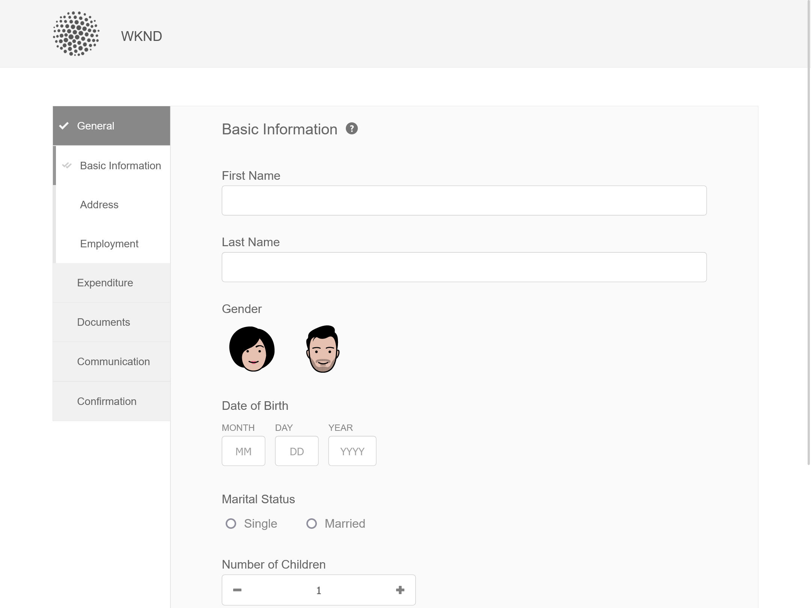
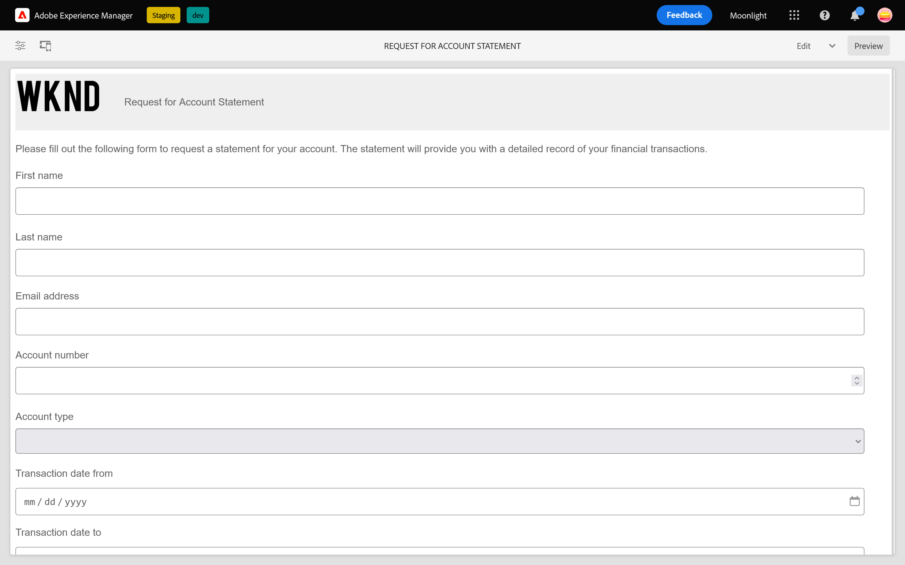
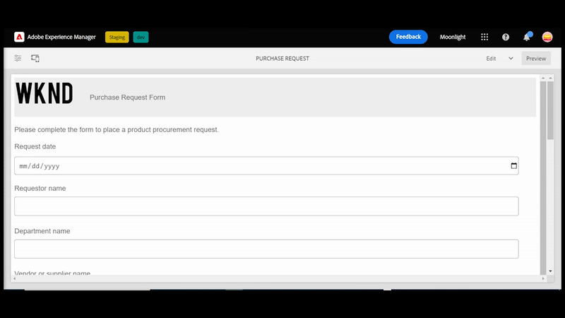

# 핵심 구성 요소의 샘플 테마, 템플릿 및 양식 데이터 모델 {#sample-themes-templates-and-data-models}

AEM Forms as a Cloud Service에서는 샘플 참조 테마, 템플릿 및 양식 데이터 모델을 제공하여 핵심 구성 요소로 적응형 Forms을 신속하게 만들 수 있습니다. 다음을 수행할 수 있습니다. [적응형 Forms 핵심 구성 요소 활성화](https://experienceleague.adobe.com/docs/experience-manager-cloud-service/content/forms/setup-configure-migrate/enable-adaptive-forms-core-components.html) AEM Forms as a Cloud Service 및 로컬 개발 환경에서 샘플 OOTB 템플릿을 가져와 [샘플 테마 사용 및 사용자 지정](https://experienceleague.adobe.com/docs/experience-manager-cloud-service/content/forms/adaptive-forms-authoring/authoring-adaptive-forms-core-components/create-an-adaptive-form-on-forms-cs/using-themes-in-core-components.html) 위치: [!DNL AEM Forms].

참조 콘텐츠 패키지에 포함된 샘플 테마, 템플릿 및 양식 데이터 모델은 다음과 같습니다.

| 템플릿 | 테마 | 양식 데이터 모델 |
---------|----------|---------
| 기본 | 캔버스 | Microsoft® Dynamics 365 |
| 비어 있음 | WKND | Salesforce |
| 연락처 | 이젤 |  |
| 연락처 세부 정보 업데이트 |   |   |
| 동의 양식 | |  |
| 로그 서비스 요청 |  |  |
| 피드백 제공 |  |  |
| 복리후생 등록 |  |   |
| 직원 복리후생 요약 |   |   |
| 계정 명세서 요청 |   |   |
| 안전 검사 양식 |   |   |
| 품질 관리 검사 |   |   |
| 구매 요청 |  |  |

## 샘플 테마 {#Sample-Themes}

참조 샘플 테마를 사용하면 작성자가 양식에 맞게 스타일을 정의하고 맞춤화할 수 있으며, CSS에 대한 기본 지식을 갖춘 작성자가 요구 사항에 따라 테마를 맞춤화할 수 있습니다. 양식 작성자 [적응형 Forms 핵심 구성 요소 활성화](https://experienceleague.adobe.com/docs/experience-manager-cloud-service/content/forms/setup-configure-migrate/enable-adaptive-forms-core-components.html) AEM Forms as a Cloud Service 및 로컬 개발 환경에서 다음과 같이 이러한 테마를 얻을 수 있습니다.

### 캔버스 {#Canvas}

캔버스 테마는 양식의 기본 테마이며 기본 색상, 투명도 및 플랫 아이콘 사용을 강조합니다. 아래 스크린샷에서는 캔버스 테마의 모양을 확인할 수 있습니다.

### WKND {#WKND}

WKND 테마는 생동감 있고 상상력이 풍부하며 매력적인 디자인을 구현하여 스타일리시한 모습을 양식에 선보이고 있습니다. 테마는 의 모양과 스타일을 기반으로 합니다. [WKND 사이트](https://wknd.site/us/en.html) 에 여행 및 모험 웹 사이트 빌드 [Adobe Experience Manager 핵심 구성 요소](https://experienceleague.adobe.com/docs/experience-manager-core-components/using/introduction).

### 이젤 {#Easel}

이젤 테마는 매력적이고 설정하기 쉬운 양식 모양을 만드는 데 도움이, 그것은 단순성과 사용자 친화성을 위해 사용자 지정. 이젤 테마는 작가가 그림을 그리는 동안 캔버스를 지탱하기 위해 사용하는 휴대용 스탠드를 콘셉트로 하고 있다.

## 샘플 템플릿 {#Sample-templates}

템플릿은 초기 양식 구조, 콘텐츠 및 작업을 정의하여 양식에서 복제하거나 양식과 유사한 템플릿 구조(예: 동의 양식, 혜택 등록 양식 등)를 사용합니다. 다음 템플릿은 다음 방법으로 가져올 수 있습니다. [적응형 Forms 핵심 구성 요소 활성화](https://experienceleague.adobe.com/docs/experience-manager-cloud-service/content/forms/setup-configure-migrate/enable-adaptive-forms-core-components.html) AEM Forms as a Cloud Service 또는 로컬 개발 환경에서. 적응형 Forms 핵심 구성 요소의 샘플 템플릿은 다음과 같습니다.

### 기본 {#Basic}

기본 템플릿을 사용하면 등록 경험 양식을 신속하게 만들 수 있습니다. 이 구성 요소를 사용하여 의 기능을 미리 볼 수도 있습니다. [적응형 Forms 핵심 구성 요소](https://experienceleague.adobe.com/docs/experience-manager-core-components/using/adaptive-forms/introduction). 또한 데이터의 섹션별 표시를 위한 마법사 레이아웃을 제공합니다.

>[!BEGINTABS]

>[!TAB 데스크탑]

>[!TAB 전화]

>[!TAB 태블릿]

>[!ENDTABS]

### 비어 있음 {#Blank}

빈 캔버스 템플릿을 사용하여 적응형 양식 구조, 콘텐츠 및 규칙을 처음부터 만듭니다. 빈 템플릿에는 양식 구성 요소가 미리 통합되어 있지 않습니다.

### 연락처 {#Contact-Us}

연락처 양식 템플릿은 웹 사이트 방문자와 관리자 간의 원활한 커뮤니케이션을 위한 양식을 만드는 데 사용됩니다. 사용자는 양식을 통해 쿼리, 피드백 또는 지원 요청을 제출할 수 있습니다.

### 연락처 세부 정보 업데이트 {#Contact-Details-Update}

연락처 세부 정보 업데이트 템플릿 작성자가 고객의 주소 및 연락처 세부 정보 업데이트에 대한 양식을 만들 수 있도록 지원합니다. 또한 이 양식은 원활한 의사 소통과 서비스 또는 혜택에 대한 중단 없는 액세스를 보장하기 위해 고객이 구독 또는 혜택과 관련된 개인 정보를 업데이트할 수 있도록 지원합니다.

### 동의 양식 {#Consent-Form}

동의 양식 템플릿은 특정 활동, 연구 연구, 의료 절차 또는 개인 정보나 권리가 개입될 수 있는 모든 상황에 참여하는 참여자로부터 법적 문서를 받을 수 있는 양식을 만드는 데 사용됩니다. 그 형태는 투명성을 보장하고, 참여자의 권리를 보호하며, 개인이 동의하는 것에 대한 명확한 이해를 확립한다.

### 로그 서비스 요청 {#Log-Service-Request}

로그 서비스 요청 템플릿은 서비스 공급자로부터 특정 로깅 서비스를 요청하는 양식을 만드는 데 도움이 됩니다. 이 양식은 특정 이벤트, 활동 또는 상태 모니터링 또는 추적을 위해 기록된 데이터가 있는 티켓을 만들기 위한 공식적인 요청 역할을 합니다.

### 피드백 제공 {#Give-Feedback}

피드백 양식 템플릿 제공은 다른 사람 또는 팀에 건설적인 피드백을 제공하는 양식을 작성하는 데 도움이 됩니다. 이 양식은 피드백이 명확하고 구체적이며 실행 가능하고 개방형 커뮤니케이션 및 개선을 촉진하도록 하는 데 도움이 됩니다.

### 복리후생 등록 {#Benefits-Enrollment}

복리후생 등록 양식 템플리트는 사원으로부터 선호 복리후생 및 수혜범위 선택사항에 관한 필수 정보를 수집하는 양식을 생성하는 데 사용됩니다. 이는 일반적으로 연간 복리후생 등록 기간과 동반됩니다.

### 직원 복리후생 요약 {#Employee-Benefits-Summary}

직원 복리후생 요약 양식 템플릿을 사용하여 양식을 작성하여 개인의 복리후생에 대한 중요한 세부 정보를 수집합니다. 효율적인 지원 및 지원을 위한 포괄적인 개요를 제공하여 적용 범위를 빠르고 정확하게 평가하는 데 도움이 됩니다.

### 계정 명세서 요청 {#Request-for-Account-Statement}

계정 명세서 요청 템플릿을 사용하면 고객의 정확한 최신 명세서를 가져오는 프로세스를 시작하는 양식을 만들 수 있습니다. 명세서는 이 양식을 사용하는 고객에 대한 금융 거래, 활동 또는 기타 관련 정보에 대한 자세한 기록을 제공합니다.

### 안전 검사 {#Safety-Inspection}

안전 검사 양식 서식 파일은 안전한 작업 환경을 위해 세부 정보를 입력하는 양식을 만드는 데 도움이 됩니다. 이 양식을 활용하여 정기적인 검사를 실시함으로써 잠재적인 위험요소를 파악할 수 있다. 이 양식은 직원, 방문자 및 고객의 안전과 복지를 위해 비상구, 화재 안전, 전기 안전, 위험 물질, 개인 보호 장비, 워크스테이션 인체공학 등 다양한 측면을 다룹니다.

### 품질 관리 검사 {#Quality-Control-Inspection}

품질 관리 검사 양식 서식 파일은 제품이나 항목의 시각적 모양, 차원, 기능, 설명서, 테스트 결과 및 전체 품질을 평가하고 문서화하는 양식을 만드는 데 사용됩니다. 품질 표준 준수를 보장하는 데 필요한 결함, 부적합 및 시정 조치를 식별하는 데 도움이 됩니다.

### 구매 요청 {#Purchase-Request}

구매 요청 양식 템플릿을 사용하면 조달 프로세스를 시작하고 직원들이 작업에 필요한 물품 또는 서비스의 구매를 공식적으로 요청할 수 있는 양식을 작성할 수 있습니다. 이 양식에는 품목 설명, 수량, 선호 공급자(해당되는 경우), 예산 할당, 구매 사유, 납품 정보 및 필수 승인과 같은 필수 세부 정보가 캡처됩니다.

## 참조 양식 데이터 모델 {#reference-models}

을(를) 만든 후 [적응형 양식](https://experienceleague.adobe.com/docs/experience-manager-core-components/using/adaptive-forms/introduction.html?lang=en#adaptive-forms-core-components) 기준 [핵심 구성 요소](https://experienceleague.adobe.com/docs/experience-manager-core-components/using/adaptive-forms/introduction.html?lang=en#adaptive-forms-core-components), 양식의 백엔드를 데이터베이스 Microsoft® Dynamics 365 및 Salesforce 서버와 연결하여 비즈니스 워크플로우를 활성화할 수 있습니다. 예:

* 적응형 양식 제출 시 Microsoft® Dynamics 365 및 Salesforce로 데이터를 작성합니다.
* 양식 데이터 모델에 정의된 사용자 지정 엔터티를 통해 Microsoft® Dynamics 365 및 Salesforce에서 데이터를 쓰고 그 반대로 할 수 있습니다.
* Microsoft® Dynamics 365 및 Salesforce 서버에 데이터를 쿼리하고 적응형 Forms을 미리 채웁니다.
* Microsoft® Dynamics 365 및 Salesforce 서버에서 데이터를 읽습니다.

다음을 설치하여 다음 양식 데이터 모델을 가져올 수 있습니다. [참조 컨텐츠 패키지](https://experience.adobe.com/#/downloads/content/software-distribution/en/aemcloud.html?package=/content/software-distribution/en/details.html/content/dam/aemcloud/public/aem-forms-reference-content.ui.content-2.1.0.zip):

* Microsoft® Dynamics 365
* Salesforce

이러한 모델 사용에 대한 자세한 내용은 [Microsoft® Dynamics 365 및 Salesforce 클라우드 서비스 구성](https://experienceleague.adobe.com/docs/experience-manager-cloud-service/content/forms/integrate/use-form-data-model/configure-msdynamics-salesforce.html?lang=en#configure-dynamics-cloud-service)
