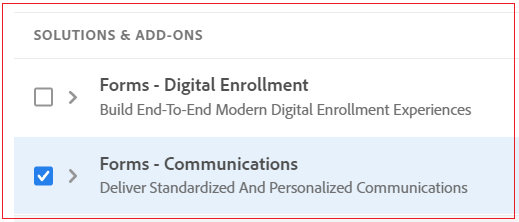
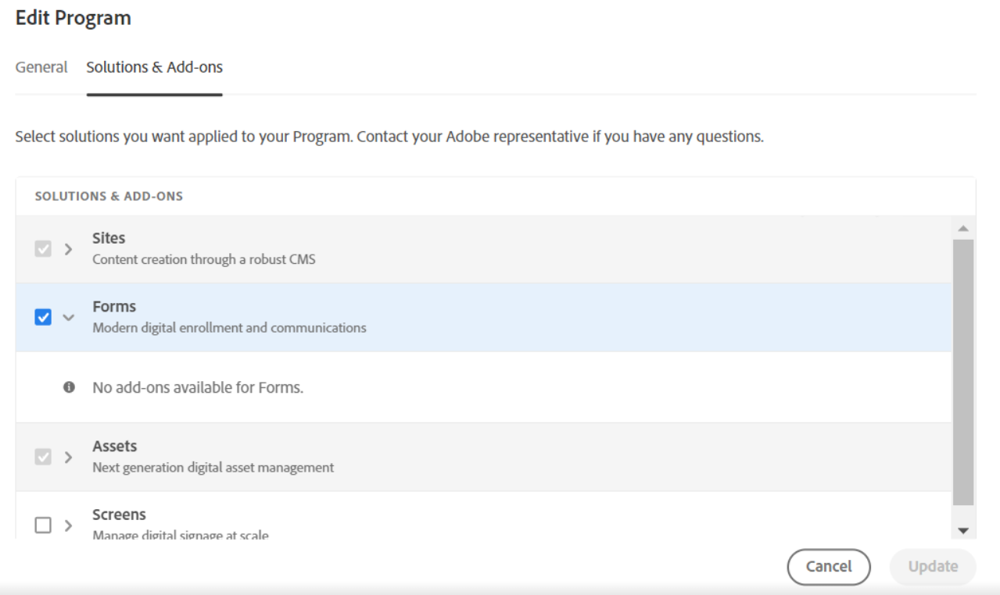

# 에 온보드 [!DNL AEM Forms] as a Cloud Service {#overview}

| 버전 | 문서 링크 |
| -------- | ---------------------------- |
| AEM 6.5 | [여기 클릭](https://experienceleague.adobe.com/docs/experience-manager-65/forms/install-aem-forms/osgi-installation/installing-configuring-aem-forms-osgi.html) |
| AEM as a Cloud Service | 이 문서 |

## 성향 결정 {#personas-aem-forms-project}

<!-- When you sign up for the service, Adobe creates an Organization identifier for your company in the Adobe Identity Management System (IMS), where your users and their permissions can be managed. So, --> Adobe Experience Manager(AEM) Forms as a Cloud Service 환경에 온보딩하기 전에 사원을 결정하고 프로젝트를 위한 팀을 구성하십시오. 일반 [!DNL AEM Forms] 프로젝트 팀에는 다음과 같은 담당자가 있습니다.

* **사용자 경험(UX) 디자이너**: 사용자 경험(UX) 디자이너는 의 스타일, 레이아웃 및 브랜딩을 정의합니다 [!DNL AEM Forms] 에셋.

* **Forms 실무자**: Forms 전문가는 UX 디자이너가 제공하는 스타일, 레이아웃 및 브랜딩에 따라 적응형 Forms, 테마 및 템플릿을 만듭니다. 또한 전문가가 적응형 양식을 만들어 양식 데이터 모델 및 AEM 워크플로우와 통합합니다. Forms 전문가는 일반적으로 프론트엔드 관련 작업을 수행합니다.

* **Forms 개발자**: Forms 개발자는 사용자 정의 양식 솔루션을 개발합니다. Forms 개발자는 일반적으로 사용자 지정 구성 요소 개발, AEM 워크플로, 미리 채우기 서비스 등과 같은 백엔드 개발을 수행합니다.

* **AEM 관리자**: AEM 관리자는 사용자 설정, 환경 강화, 데이터 소스 구성, 이메일 구성 및 타사 소프트웨어와 같은 전반적인 구성을 지원합니다. AEM 관리자는 Adobe Analytics, Adobe Target 및 Adobe Sign과 통합하는 것과 같은 통합도 지원합니다.

* **최종 사용자**: 사용자가 게시된 양식과 상호 작용하여 양식을 제출하고, 제출된 양식에 서명하고, 웹 포털을 통해 제출된 애플리케이션을 추적하고, 개인화된 통신을 수신합니다.

<!-- While onboarding to the service, assign the following AEM groups to [!DNL AEM Forms] as a Cloud Service based on their role:

| User type | AEM group |
|---|---|
| Form Practitioner | forms-users (AEM Forms Users), template-authors, workflow-user, workflow-editors, and fdm-author  |
| UX Designer| forms-users, template-authors|
| End-User| <ul> <li>When a user must login to view and submit an Adaptive Form, add such users to forms-users group. </li> <li>When no user authentication is required to access Adaptive Forms, do not assign any group to such users. </li> </ul>| -->

## 서비스 온보드 {#onboarding}

* [온보드](https://experienceleague.adobe.com/docs/experience-manager-cloud-service/content/onboarding/journey/overview.html) (으)로 [!DNL Adobe Experience Manager] as a Cloud Service.

* (샌드박스만 해당) 서비스를 온보딩한 후 [만들기](https://experienceleague.adobe.com/docs/experience-manager-cloud-manager/content/using/pipelines/production-pipelines.html?lang=en) 및 [실행](https://experienceleague.adobe.com/docs/experience-manager-cloud-manager/content/using/code-deployment.html) 프로덕션 및 비프로덕션 파이프라인 모두. 의 최신 기능을 활성화하고 제공합니다. [!DNL AEM Forms] as a Cloud Service으로 사용 가능합니다.

Forms as a Cloud Service을 사용하여 적응형 양식(디지털 등록)을 만들거나 고객 커뮤니케이션을 생성할 수 있습니다. 완료 후 [온보딩](https://experienceleague.adobe.com/docs/experience-manager-cloud-service/content/onboarding/journey/overview.html) (으)로 [!DNL Adobe Experience Manager] as a Cloud Service으로 다음 작업을 수행하여 Forms - 디지털 등록 또는 고객 커뮤니케이션 기능을 활성화합니다. <!--You can also enable both the features-->:

1. Cloud Manager에 로그인하고 AEM Forms as a Cloud Service 인스턴스를 엽니다.
1. 프로그램 편집 옵션을 열고 솔루션 및 추가 기능 탭으로 이동합니다.

   * 프로덕션 환경이 있는 경우 다음을 선택합니다 **[!UICONTROL Forms - 커뮤니케이션]** Forms - 디지털 등록 및 Forms - 커뮤니케이션 추가 기능을 활성화하는 옵션입니다.

     

   <!-- If you have already enabled the **[!UICONTROL Forms - Digital Enrollment]** option, then select the **[!UICONTROL Forms - Communications Add-On]** option.  -->

   * 샌드박스 환경이 있는 경우 다음을 선택합니다. **[!UICONTROL Forms]** Forms - 디지털 등록 및 Forms - 통신 추가 기능을 활성화하려면 다음을 수행하십시오.

     

1. **[!UICONTROL 업데이트]**&#x200B;를 클릭합니다.
1. 빌드 파이프라인을 실행합니다. 빌드 파이프라인이 성공하면 선택한 솔루션이 환경에 대해 활성화됩니다.

>[!NOTE]
>
> 문서 조작 API를 활성화하고 구성하려면 다음 규칙을 [Dispatcher 구성](setup-local-development-environment.md#forms-specific-rules-to-dispatcher):
>
> `# Allow Forms Doc Generation requests`
> `/0062 { /type "allow" /method "POST" /url "/adobe/forms/assembler/*" }`

## 사용자 구성 {#config-users}

서비스에 대한 온보딩을 완료한 후 [!DNL AEM Forms] as a Cloud Service 환경, 작성자 및 게시 인스턴스 열기, Forms 관련 사용자 추가 [AEM 그룹](https://experienceleague.adobe.com/docs/experience-manager-learn/cloud-service/accessing/aem-users-groups-and-permissions.html#accessing), 자신의 성향에 따라 지정합니다. 다음 표에는 즉시 사용 가능한 Forms 관련 AEM 그룹 및 해당 사용자 유형이 나열되어 있습니다. 이 표에서는 각 사용자 유형에 대한 AEM 인스턴스 유형도 제공합니다.

| 사용자 유형(가상 사용자) | 사용자 그룹 | AEM 인스턴스 |
|---|---|---|
| 양식 전문가 /Forms 개발자 | <ul> <li> [!DNL forms-users] </li><li> [!DNL template-author] </li><li> [!DNL workflow-users] </li><li> [!DNL workflow-editors] </li><li> [!DNL fdm-authors] </li></ul> | 작성자 인스턴스 |
| 사용자 경험(UX) 디자이너 | <ul> <li> [!DNL forms-users]</li><li> [!DNL template-author] </li></ul> | 작성자 인스턴스 |
| AEM 관리자 | <ul> <li>[!DNL aem-administrators],</li> <li>[!DNL fd-administrators] </li> </ul> | 작성자 및 게시 인스턴스 |
| 최종 사용자 | <ul> <li>사용자가 적응형 양식을 보고 제출하기 위해 로그인해야 하는 경우 해당 사용자를 [!DNL forms-users] 그룹입니다. </li> <li>적응형 Forms에 액세스하는 데 사용자 인증이 필요하지 않은 경우 해당 사용자에게 그룹을 할당하지 마십시오. </li> </ul> | 작성자 및 게시 인스턴스 |

Forms 관련 AEM 그룹 및 해당 권한에 대한 자세한 내용은 [그룹 및 권한](forms-groups-privileges-tasks.md).

<!-- You can also create  [user groups](https://experienceleague.adobe.com/docs/experience-manager-learn/cloud-service/accessing/aem-users-groups-and-permissions.html#accessing) specific  to your organization, assign policies, and [users](https://experienceleague.adobe.com/docs/experience-manager-learn/cloud-service/accessing/aem-users-groups-and-permissions.html#accessing) to the groups. The policies help control permissions of the users that are part of the group. For information a -->

## 다음 단계 {#next-steps}

[로컬 개발 환경 설정](setup-local-development-environment.md). 로컬 개발 환경을 사용하여 적응형 양식 및 관련 에셋(테마, 템플릿, 사용자 지정 제출 작업, 미리 채우기 서비스 등)을 만들 수 있습니다. 및, [PDF forms을 적응형 Forms으로 변환](https://experienceleague.adobe.com/docs/aem-forms-automated-conversion-service/using/introduction.html) 클라우드 개발 환경에 로그인하지 않아도 됩니다.

<!-- ### Business unit and end-users {#business-unit-and-end-users}

| Role| Organization| Description|
|-----|-------|-----|
| UX Designer                  | Customer/System Integrator/Partner | Defines user experience design (style, layout, branding) as per organizational requirements for Adaptive Forms to allow AEM Forms practitioners to design the corresponding themes and templates.                                     |
| Forms Practitioner           | Customer                           | Authors Adaptive Forms, creates Form Data Model integrations, and creates business workflows using the Experience Manager Workflows. Typically undertakes the front-end work.                                                         |
| Business Executive - Digital | Customer                           | Responsible for business unit's product marketing strategy and revenues, main business stakeholders for digital use cases, solutions, and service offerings for the end-users, signs off on the use case implementation and delivery. |
| Customer Experience Lead     | Customer                           | Business user persona. Authors, personalizes and updates Adaptive Forms fields/rules/styling, identifies, and prioritizes business needs. Validates business use-case with SI/Partner developers/practitioners during UAT.            |
| Forms Back-Office User       | Customer                           | End-user internal to organization filling forms, participating in back-office Forms workflows such as review/approval of applications and so on.                                                                                            |
| Forms End-User               | External to customer               | Interacts with and submits the published form as end customer or citizen, signs submitted forms, tracks her applications through web portal, receives personalized interactive communications.                                        |

### Project team {#project-team}

| Role | Org | Description|
|-----|-----|-----|
| Experience Manager Administrator | System Integrator /Partner/Customer | Helps with overall installation, configures SSL certificates, configures data sources, email, and other third-party software, integrations like Adobe Analytics, Adobe Target, Automated Forms Conversion Services with Experience Manager instance. |
| Project Manager                  | System Integrator /Partner/Customer | Converts customer use-case into technical requirements, manages schedule/cost/scope for overall project.                                                                                                                                             |
| Product Owner                    | System Integrator /Partner/Customer | Prioritizes and evaluates scrum team's work for high-quality delivery on time.                                                                                                                                                                       |
| Scrum Master                     | System Integrator /Partner/Customer | Ensures agile values and processes in place to deliver on defined requirements as per prioritization by PO.                                                                                                                                          |
| Infrastructure / security expert | System Integrator /Partner/Customer | Provisions and configures best possible infrastructure, security controls and infra processes to address current and projected RASP requirements.                                                                                                    |
| Technical Architect              | System Integrator /Partner/Customer | Provides best high-level architecture and infrastructure guidance for use-case implementation and address RASP (Reliability, Availability, Scalability, and Performance) and security challenges.                                                    | -->

<!-- ## Onboard to the service {#onboarding}

[Onboard](https://experienceleague.adobe.com/docs/experience-manager-cloud-service/onboarding/home.html) to the [!DNL Adobe Experience Manager] as a Cloud Service. 

After you onboard the service, configure a [local development environment](setup-local-development-environment.md). 

Administrators are responsible for managing Adobe software and services for their organization. Administrators grant access to developers in their organization to connect and use your [!DNL AEM Forms] as a Cloud Service program. When an administrator is provisioned for an organization, the administrator receives an email with title 'You now have administrator rights to manage Adobe software and services for your organization'. If you are an administrator, check your mailbox for email with previously mentioned title and proceed to [add users](https://experienceleague.adobe.com/docs/experience-manager-cloud-service/security/ims-support.html?lang=en#onboarding-users-in-admin-console) by way of IMS and assign [form-specific groups](forms-groups-privileges-tasks.md) to users based on their role.

## Next step {#next-steps} -->

<!-- ## Prerequisites {#prerequisites}

If you are new to AEM as a cloud service, contact your Adobe representative to create an organization identifier for your company in the Adobe Identity Management System (IMS). Once Adobe has created an organization for your company, your designated administrator is added as the first member of the organization. The administrator can setup an [!DNL AEM Forms] as a Cloud Service instance. 

## Onboard and set up a new environment {#onboard-and-setup-a-new-environment}

Log in to Cloud Manager and create a program. After the program is ready, create environments, add developers or users to environments, and run the pipeline to get the latest version of [!DNL AEM Forms] as a Cloud Service and start developing for your environment. The detailed steps are:

1. Contact your Adobe representative to create an organization identifier for your company in the Adobe Identity Management System (IMS) and provide access to an administrator in your organization.
1. Configure [Automated Forms Conversion Service](https://experienceleague.adobe.com/docs/aem-forms-automated-conversion-service/using/configure-service.html?lang=en). After a configuration is complete, a profile for Automated Forms Conversion Service is available in [Admin Console](https://adminconsole.adobe.com/).

    If the service is not available, log in to [Admin Console](https://adminconsole.adobe.com/). Use Adobe ID of administrator provisioned to use Automated Forms Conversion Service to login. Do not use any other ID or Federated ID to login.
    1. Click **[!UICONTROL Automated Forms Conversion Service]** option.
    1. Click **[!UICONTROL New Profile]** in the Products tab.
    1. Specify **[!UICONTROL Name]**, **[!UICONTROL Display Name]**, and **[!UICONTROL Description]** for the profile. Click **[!UICONTROL Done]**. A profile is created. 
1. Log in to [Cloud Manager](https://experience.adobe.com/#/@marketinghub/experiencemanager) and [create a program](https://docs.adobe.com/content/help/en/experience-manager-cloud-service/onboarding/getting-access/cloud-service-programs/creating-a-program.html) for your organization.
1. [Create environments](https://experienceleague.adobe.com/docs/experience-manager-cloud-service/implementing/using-cloud-manager/manage-environments.html?lang=en#adding-environments) within your program.
1. Log in to [Admin console](https://docs.adobe.com/content/help/en/experience-manager-cloud-service/onboarding/what-is-required/add-users-roles.html) and add developers or users to your organization.
1. Run the [build pipeline](https://docs.adobe.com/content/help/en/experience-manager-cloud-manager/using/how-to-use/deploying-code.html). It brings latest [!DNL Experience Manager Forms] as a Cloud Service features to your environment.
1. [Start developing](https://docs.adobe.com/content/help/en/experience-manager-cloud-service/implementing/developing/aem-project-content-package-structure.html) and creating Adaptive Forms on [!DNL Experience Manager Forms] as a Cloud Service environment.
1. Configure the [local development environment](setup-local-development-environment.md) for rapid development

## Configure dispatcher caching {#caching}

You can make dispatcher caching related configuration changes to code on your local development instance and deploy the changes to your [!DNL AEM Forms] as a Cloud Service instance. For details, see [update dispatcher configuration](setup-local-development-environment.md).
 -->
