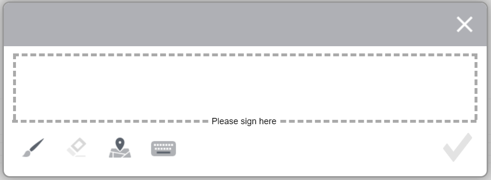

# 스크리블 서명을 사용하여 양식에 전자 서명{#apply-electronic-signatures-to-a-form-using-deprecated-scribble-signatures}

 [새 적응형 양식 만들기](/help/forms/creating-adaptive-form-core-components.md) 또는 [AEM Sites 페이지에 적응형 양식 추가](/help/forms/create-or-add-an-adaptive-form-to-aem-sites-page.md) 작업을 할 때 현대적이고 확장 가능한 데이터 캡처 [핵심 구성 요소](https://experienceleague.adobe.com/docs/experience-manager-core-components/using/adaptive-forms/introduction.html)를 사용하는 것이 좋습니다. 이러한 구성 요소는 적응형 양식 만들기 작업이 대폭 개선되어 우수한 사용자 경험을 보장할 수 있게 되었음을 나타냅니다. 이 문서에서는 기초 구성 요소를 사용하여 적응형 양식을 작성하는 이전 접근법에 대해 설명합니다. 

| 버전 | 문서 링크 |
| -------- | ---------------------------- |
| AEM 6.5 | [여기 클릭](https://experienceleague.adobe.com/docs/experience-manager-65/forms/adaptive-forms-basic-authoring/signing-forms-using-scribble.html) |
| AEM as a Cloud Service | 이 문서 |

다음을 사용할 수 있습니다. **낙서 서명** 구성 요소 및 **서명 단계** 적응형 양식에 그릴(스크리블) 구성 요소입니다. 서명 단계 구성 요소는 적응형 양식의 PDF 버전을 표시합니다. 서명 단계 구성 요소를 사용하려면 기록 문서 옵션을 활성화하거나 양식 템플릿 기반의 적응형 Forms이 필요합니다.

## 서명 창에서 사용할 수 있는 다양한 옵션

* **A:** 다음을 클릭합니다. **페인트 브러시** 캔버스에 서명을 그리는 아이콘.
* **B:** 다음을 클릭합니다. **지우기** 아이콘을 클릭하여 캔버스에서 서명을 지웁니다.
* **C:** 다음을 클릭합니다. **지리적 위치** 아이콘 - 서명과 함께 지리적 위치를 추가합니다.
* **D:** 다음을 클릭합니다. **키보드** 캔버스에 사용자 이름을 입력하는 아이콘입니다.

완료를 선택하면  아이콘을 클릭하면 서명을 편집할 수 없습니다. 서명을 편집하려면 현재 서명을 무시하고 위의 [페인트 브러쉬/키보드] 옵션을 사용하여 다시 서명해야 합니다.

다음을 선택할 수 있습니다. **구성**  아이콘을 클릭하여 스크리블 서명 캔버스의 가로/세로 비율을 설정합니다.
* 스크리블 서명 캔버스의 종횡비가 1보다 작은 경우 지리적 위치 정보가 스크리블 서명 캔버스의 맨 아래에 추가됩니다.

* 스크리블 서명 캔버스의 종횡비가 1보다 큰 경우 지리적 위치 정보가 스크리블 서명 캔버스의 오른쪽에 추가됩니다.

>[!NOTE]
>
>서명은 항상 PNG 형식으로 저장됩니다.
>

## 스크리블 서명을 사용하도록 적응형 양식 구성 {#configure-an-adaptive-form-to-use-scribble-signature}

1. 적응형 양식 기반의 양식 템플릿 또는 활성화된 기록 문서 옵션 만들기 단계별 정보는 [적응형 양식 만들기](creating-adaptive-form.md).
1. 을(를) 드래그 앤 드롭합니다 **낙서 서명** 구성 요소 브라우저의 구성 요소를 적응형 양식으로 전환합니다.
1. 다음 항목 선택 **구성**  아이콘. 속성 브라우저를 열고 스크리블 서명 구성 요소의 속성을 표시합니다. 스크리블 서명 구성 요소의 속성을 구성합니다.
1. 구성 요소 브라우저의 서명 단계 구성 요소를 적응형 양식으로 드래그 앤 드롭합니다.

   >[!NOTE]
   >
   >서명 단계 구성 요소는 양식에 사용할 수 있는 전체 너비를 차지합니다. 서명 단계 구성 요소가 포함된 섹션에는 다른 구성 요소가 없는 것이 좋습니다.

1. 콘텐츠 브라우저에서 다음을 선택합니다 **양식 컨테이너**&#x200B;을(를) 클릭하고 **구성**  아이콘. 속성 브라우저를 열고 적응형 양식 컨테이너 속성을 표시합니다. 다음으로 이동 **적응형 양식 컨테이너** > **전자 서명** 및 선택 취소 **Adobe Sign 활성화** 옵션을 선택합니다. 완료 선택  아이콘 을 클릭하여 변경 내용을 저장합니다.

   >[!NOTE]
   >
   >적응형 양식에 서명 단계 구성 요소를 추가하면 Adobe Sign 활성화 옵션이 자동으로 선택됩니다.

1. 다음 항목 선택 **구성**  아이콘. 속성 브라우저를 열고 서명 단계 속성을 표시합니다. 다음 속성을 구성합니다.

   * **요소 이름**: 구성 요소의 이름을 지정합니다.

   * **제목:** 구성 요소의 고유 제목을 지정합니다.
   * **템플릿 메시지:** 서명 PDF을 로드하는 동안 표시할 메시지를 지정합니다. Adobe Sign 서비스는 서명 PDF을 준비하고 로드하는 데 시간이 소요됩니다.
   * **서명 서비스:** 다음 항목 선택 **낙서 서명** 옵션을 선택합니다.

   * **CSS 클래스**: 클라이언트 라이브러리의 CSS 클래스(있는 경우)를 지정합니다. Adobe은 다음을 권장합니다. [테마](themes.md) 및 [인라인 스타일](inline-style-adaptive-forms.md) CSS 클래스 대신

   완료 선택  아이콘 을 클릭하여 변경 내용을 저장합니다. 서명이 구성되었습니다.

   이제 양식을 채울 때 적응형 양식의 PDF 버전이 표시되고 PDF 문서에 서명할 수 있는 옵션이 제공됩니다. 자세한 내용은 [스크리블 서명을 사용하여 적응형 양식에 서명](signing-forms-using-scribble.md#sign-an-adaptive-form-using-scribble-signature).

## 스크리블 서명을 사용하여 적응형 양식에 서명 {#sign-an-adaptive-form-using-scribble-signature}

1. 적응형 양식을 작성하고 서명 단계 페이지에 도달하면 서명 화면이 표시됩니다.

   

1. 클릭 **[!UICONTROL 서명]**. 낙서 기호 대화 상자가 나타납니다. 양식에 서명하고 완료를 클릭합니다  아이콘을 클릭하여 서명을 저장합니다.

   

1. 완료 를 클릭하여 서명 프로세스를 완료합니다.

   

서명이 양식에 추가되고 양식 컨트롤이 다음 패널로 이동합니다.

## 추가 참조 {#see-also}

{{see-also}}