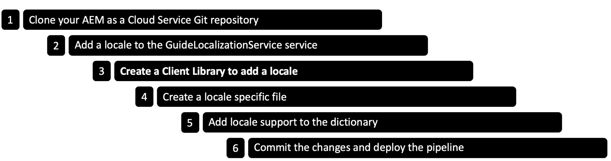

# 핵심 구성 요소를 기반으로 적응형 Forms에 대한 로케일 추가 {#supporting-new-locales-for-adaptive-forms-localization}


| 버전 | 문서 링크 |
| -------- | ---------------------------- |
| 기초 구성 요소 | [여기 클릭](supporting-new-language-localization.md) |
| 핵심 구성 요소 | 이 문서 |

AEM Forms은 영어(en), 스페인어(es), 프랑스어(fr), 이탈리아어(it), 독일어(de), 일본어(ja), 포르투갈어-브라질어(pt-BR), 중국어(zh-CN), 중국어-대만(zh-TW) 및 한국어(ko-KR) 로케일을 즉시 지원합니다.

힌디어(hi_IN)와 같은 더 많은 로케일에 대한 지원을 추가할 수도 있습니다.

<!-- 
## Understanding locale dictionaries {#about-locale-dictionaries}

The localization of adaptive forms relies on two types of locale dictionaries:

*   **Form-specific dictionary** Contains strings used in adaptive forms. For example, labels, field names, error messages, help descriptions. It is managed as a set of XLIFF files for each locale and you can access it at `[AEM Forms as a Cloud Service Author instance]/libs/cq/i18n/gui/translator.html`.

*   **Global dictionaries** There are two global dictionaries, managed as JSON objects, in AEM client library. These dictionaries contain default error messages, month names, currency symbols, date and time patterns, and so on.  These locations contain separate folders for each locale. Because global dictionaries are not updated frequently, keeping separate JavaScript files for each locale enables browsers to cache them and reduce network bandwidth usage when accessing different adaptive forms on same server.

-->

## 사전 요구 사항 {#prerequistes}

새 로케일에 대한 지원을 추가하기 전에

* 보다 쉬운 편집을 위해 일반 텍스트 편집기(IDE)를 설치합니다. 이 문서의 예제는 Microsoft VS 코드를 기반으로 합니다.
* 적응형 Forms 핵심 구성 요소 저장소를 복제합니다. 저장소를 복제하려면 다음을 수행하십시오.
   1. 명령줄 또는 터미널 창을 열고 저장소를 저장할 위치로 이동합니다. 예 `/adaptive-forms-core-components`
   1. 다음 명령을 실행하여 저장소를 복제합니다.

      ```SHELL
          git clone https://github.com/adobe/aem-core-forms-components.git
      ```

  저장소에는 로케일을 추가하는 데 필요한 클라이언트 라이브러리가 포함되어 있습니다.


## 로케일 추가 {#add-localization-support-for-non-supported-locales}

새 로케일에 대한 지원을 추가하려면 다음 단계를 수행합니다.



### AEM as a Cloud Service Git 리포지토리 복제 {#clone-the-repository}

1. 명령줄을 열고 다음과 같이 저장소를 저장할 디렉토리를 선택합니다 `/cloud-service-repository/`.

1. 다음 명령을 실행하여 저장소를 복제합니다.

   ```SHELL
   git clone https://git.cloudmanager.adobe.com/<my-org>/<my-program>/
   ```

   바꾸기 `<my-org>` 및 `<my-program>` 조직 이름과 프로그램 이름이 있는 위의 URL에서. 조직 이름, 프로그램 이름 또는 Git 저장소의 전체 경로와 저장소 복제에 필요한 자격 증명을 얻는 방법에 대한 자세한 지침은 다음을 참조하십시오. [Git 액세스](https://experienceleague.adobe.com/docs/experience-manager-cloud-service/content/onboarding/journey/developers.html#accessing-git) 기사.

   명령을 성공적으로 완료하면 폴더가 `<my-program>` 이(가) 만들어졌습니다. 여기에는 Git 저장소에서 복제된 콘텐츠가 포함됩니다. 문서의 나머지 부분에서 폴더는 다음과 같이 표시됩니다. `[AEM Forms as a Cloud Service Git repostory]`.


### 가이드 현지화 서비스에 새 로케일 추가 {#add-a-locale-to-the-guide-localization-service}

1. 이전 섹션에서 복제된 저장소 폴더를 일반 텍스트 편집기에서 엽니다.
1. `[AEM Forms as a Cloud Service Git repostory]/ui.config/src/main/content/jcr_root/apps/<appid>/osgiconfig/config` 폴더로 이동합니다. 다음을 찾을 수 있습니다. `<appid>` 다음에서 `archetype.properties` 프로젝트의 파일입니다.
1. 편집할 `[AEM Forms as a Cloud Service Git repostory]/ui.config/src/main/content/jcr_root/apps/<appid>/osgiconfig/config/Guide Localization Service.cfg.json` 페이지를 엽니다. 파일이 없으면 만듭니다. 지원되는 로케일이 있는 샘플 파일은 다음과 같습니다.

   

1. 추가 [언어의 로케일 코드](https://en.wikipedia.org/wiki/List_of_ISO_639-1_codes) 예를 들어 힌디어에 대해 &#39;hi&#39;를 추가하려는 경우
1. 파일을 저장하고 닫습니다.

### 로케일을 추가할 클라이언트 라이브러리 만들기

AEM Forms은 새 로케일을 쉽게 추가하는 데 도움이 되는 샘플 클라이언트 라이브러리를 제공합니다. 을(를) 다운로드하고 추가할 수 있습니다. `clientlib-it-custom-locale` 클라이언트 라이브러리: GitHub의 적응형 Forms 핵심 구성 요소 저장소에서 Forms as a Cloud Service 저장소로. 클라이언트 라이브러리를 추가하려면 다음 단계를 수행합니다.

1. 일반 텍스트 편집기에서 적응형 Forms 핵심 구성 요소 저장소를 엽니다. 복제된 저장소가 없는 경우 [전제 조건](#prerequistes) 저장소 복제 지침
1. 다음 위치로 이동 `/aem-core-forms-components/it/apps/src/main/content/jcr_root/apps/forms-core-components-it/clientlibs` 디렉토리.
1. 다음을 복사합니다. `clientlib-it-custom-locale` 디렉토리.
1. 다음으로 이동 `[AEM Forms as a Cloud Service Git repostory]/ui.apps/src/main/content/jcr_root/apps/moonlightprodprogram/clientlibs` 및 붙여넣기 `clientlib-it-custom-locale` 디렉토리.


### 로케일별 파일 만들기 {#locale-specific-file}

1. 다음으로 이동 `[AEM Forms as a Cloud Service Git repostory]/ui.apps/src/main/content/jcr_root/apps/<program-id>/clientlibs/clientlib-it-custom-locale/resources/i18n/`
1. 를 찾습니다. [GitHub의 영어 로케일 .json 파일](https://github.com/adobe/aem-core-forms-components/blob/master/ui.af.apps/src/main/content/jcr_root/apps/core/fd/af-clientlibs/core-forms-components-runtime-all/resources/i18n/en.json)제품에 포함된 최신 기본 문자열 세트가 들어 있습니다.
1. 특정 로케일에 대한 새 .json 파일을 만듭니다.
1. 새로 만든 .json 파일에서 영어 로케일 파일의 구조를 미러링합니다.
1. .json 파일의 영어 문자열을 해당 언어에 해당하는 현지화된 문자열로 바꿉니다.
1. 파일을 저장하고 닫습니다.


### 사전에 로케일 지원 추가 {#add-locale-support-for-the-dictionary}

다음 경우에만 이 단계를 수행하십시오. `<locale>` 을(를) 추가하고 있는 이(가) 다음에 없습니다. `en`, `de`, `es`, `fr`, `it`, `pt-br`, `zh-cn`, `zh-tw`, `ja`, `ko-kr`.

1. `[AEM Forms as a Cloud Service Git repostory]/ui.content/src/main/content/jcr_root/etc/` 폴더로 이동합니다.

1. 만들기 `etc` 폴더 `jcr_root` 폴더가 아직 없는 경우 입니다.

1. 폴더 만들기 `languages` 다음 아래에 `etc` 폴더가 아직 없는 경우 입니다.

   

1. 만들기 `.content.xml` 파일 아래 `languages` 폴더를 삭제합니다. 파일에 다음 내용을 추가합니다.

   ```XML
   <?xml version="1.0" encoding="UTF-8"?>
   <jcr:root xmlns:jcr="http://www.jcp.org/jcr/1.0" xmlns:nt="http://www.jcp.org/jcr/nt/1.0"
   jcr:primaryType="nt:unstructured"
   languages="[de,es,fr,it,pt-br,zh-cn,zh-tw,ja,ko-kr]"/>
   ```

1. 로케일 코드를 `languages` 속성. 예를 들어 다음 예제 코드에 hindi에 대한 hi가 추가되었습니다.


   ```XML
   <?xml version="1.0" encoding="UTF-8"?>
   <jcr:root xmlns:jcr="http://www.jcp.org/jcr/1.0" xmlns:nt="http://www.jcp.org/jcr/nt/1.0"
   jcr:primaryType="nt:unstructured"
   languages="[de,es,fr,it,pt-br,zh-cn,zh-tw,ja,ko-kr,hi]"/>
   ```

1. 에서 새로 만든 폴더 추가 `filter.xml` 아래에 `/ui.content/src/main/content/meta-inf/vault/filter.xml` 다음으로:

   ```
   <filter root="/etc/languages"/>
   ```

   

### 변경 사항을 커밋하고 파이프라인 배포 {#commit-changes-in-repo-deploy-pipeline}

새 로케일 지원을 추가한 후 GIT 저장소에 변경 사항을 커밋합니다. 전체 스택 파이프라인을 사용하여 코드를 배포합니다. 학습 [파이프라인 설정 방법](https://experienceleague.adobe.com/docs/experience-manager-cloud-service/content/onboarding/journey/developers.html?lang=en#setup-pipeline) 새 로케일 지원을 추가합니다.

파이프라인 실행이 성공하면 새로 추가된 로케일을 사용할 수 있습니다.

## 새로 추가된 로케일이 있는 적응형 양식 미리 보기 {#use-added-locale-in-af}

새로 추가된 로케일을 사용하여 적응형 양식을 미리 보려면 다음 단계를 수행하십시오.

1. AEM Forms as a Cloud Service 인스턴스에 로그인합니다.
1. 다음으로 이동 **Forms** >  **Forms 및 문서**.
1. 적응형 양식을 선택하고 **사전 추가** 및 **사전을 번역 프로젝트에 추가** 마법사가 나타납니다.
1. 다음을 지정합니다. **프로젝트 제목** 및 선택 **타겟 언어** 드롭다운 메뉴 아래의 **사전을 번역 프로젝트에 추가** 마법사.
1. 클릭 **완료** 생성된 번역 프로젝트를 실행합니다.
1. 적응형 양식을 선택하고 **HTML으로 미리 보기**.
1. 추가 `&afAcceptLang=<locale-name>` 를 입력합니다.
1. 페이지를 새로 고치면 적응형 양식이 지정된 로케일로 렌더링됩니다.

적응형 양식의 로케일을 식별하는 방법에는 두 가지가 있습니다. 적응형 양식이 렌더링되면 다음 방법으로 요청된 로케일을 식별합니다.

* 검색 중 `[local]` 적응형 양식 URL의 선택기. URL 형식은 `http:/[AEM Forms Server URL]/content/forms/af/[afName].[locale].html?wcmmode=disabled`입니다. 사용 `[local]` 선택기를 사용하여 적응형 양식을 캐싱할 수 있습니다.

* 나열된 순서로 다음 매개 변수를 검색합니다.

   * 요청 매개 변수 `afAcceptLang`
사용자의 브라우저 로케일을 재정의하려면 `afAcceptLang` 로케일을 강제 적용하기 위한 매개 변수를 요청합니다. 예를 들어 다음 URL은 캐나다-프랑스어 로케일로 양식을 렌더링하도록 강제합니다.
     `https://'[server]:[port]'/<contextPath>/<formFolder>/<formName>.html?wcmmode=disabled&afAcceptLang=ca-fr`

   * 을 사용하여 요청에 지정된 사용자에 대한 브라우저 로케일 집합입니다. `Accept-Language` 머리글입니다.

요청한 로케일에 대한 클라이언트 라이브러리가 없으면 로케일에 있는 언어 코드에 대한 클라이언트 라이브러리를 확인합니다. 예를 들어 요청된 로케일이 `en_ZA` (남아프리카 영어) 및 클라이언트 라이브러리 `en_ZA` 이(가) 존재하지 않습니다. 적응형 양식은 클라이언트 라이브러리를 사용합니다. `en` (영어) 언어(있는 경우). 단, 존재하지 않는 경우 적응형 양식은 다음 용도로 사전을 사용합니다 `en` 로케일.

로케일이 식별되면 적응형 양식에서 양식별 사전을 선택합니다. 요청된 로케일에 대한 양식 특정 사전을 찾을 수 없는 경우 적응형 양식이 작성된 언어로 사전을 사용합니다.

사용 가능한 로케일 정보가 없는 경우 적응형 양식이 양식 개발 중에 사용된 언어인 원래 언어로 표시됩니다.

<!--
Get [sample client library](/help/forms/assets/locale-support-sample.zip) to add support for new locale. You need to change the content of the folder in the required locale.

## Best Practices to support for new localization {#best-practices}

*   Adobe recommends creating a translation project after creating an Adaptive Form.

*   When new fields are added in an existing Adaptive Form:
    * **For machine translation**: Re-create the dictionary and run the translation project. Fields added to an Adaptive Form after creating a translation project remain untranslated. 
    * **For human translation**: Export the dictionary through `[server:port]/libs/cq/i18n/gui/translator.html`. Update the dictionary for the newly added fields and upload it.
-->
