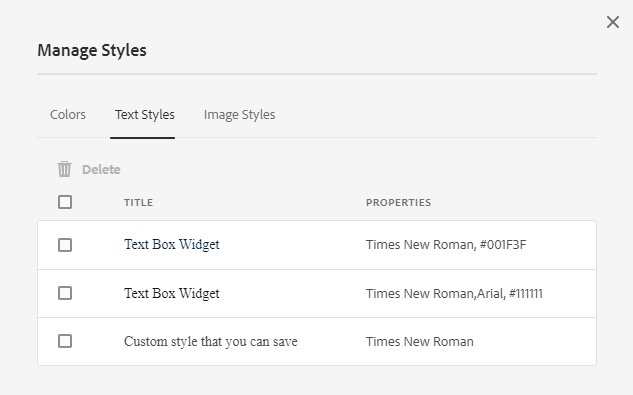

# 테마 만들기 및 사용 {#creating-and-using-themes}

테마를 만들고 적용하여 적응형 양식을 스타일링할 수 있습니다<!-- or an interactive communication-->. 테마에는 구성 요소 및 패널에 대한 스타일 지정 세부 사항이 포함되어 있습니다. 스타일에는 배경색, 상태 색상, 투명도, 정렬 및 크기와 같은 속성이 포함됩니다. 테마를 적용하면 지정된 스타일이 해당 구성 요소에 반영됩니다. 테마는 적응형 양식에 대한 참조 없이 독립적으로 관리됩니다<!-- or interactive communication -->.

다운로드하여 설치할 수 있습니다. [!DNL AEM Forms] 다음에서 콘텐츠 패키지 참조: [소프트웨어 배포](https://experience.adobe.com/#/downloads/content/software-distribution/en/aemcloud.html) 포털을 통해 참조 테마 및 템플릿을 환경으로 가져올 수 있습니다.

## 테마 만들기, 다운로드 또는 업로드 {#creating-downloading-or-uploading-a-theme}

테마는 별도의 엔티티로 만들어지고 저장되며 적응형 Forms과 같은 메타 속성과 함께 완료됩니다. 여러 적응형 Forms에서 테마를 재사용할 수 있습니다<!-- or  and interactive communications-->. 테마를 다른 인스턴스로 이동하여 다시 사용할 수도 있습니다.

### 테마 만들기 {#creating-a-theme}

테마를 만들려면 다음 작업을 수행하십시오.

1. 클릭 **[!UICONTROL Adobe Experience Manager]**, 클릭 **[!UICONTROL Forms]**, 및 클릭 **[!UICONTROL 테마]**.

1. 테마 페이지에서 **[!UICONTROL 만들기]** > **[!UICONTROL 테마]**.
테마를 만드는 마법사가 실행됩니다.

1. 지정 **[!UICONTROL 이름]** 을 참조하십시오.

1. 다음에서 테마를 미리 볼 양식 지정 **[!UICONTROL 이 테마의 기본 미리 보기]** 필드. 클릭 **[!UICONTROL 기본값 사용]** 기본 양식을 사용하여 테마를 미리 봅니다.

1. 지정 **[!UICONTROL 구성 컨테이너]**. 다음을 선택할 수 있습니다. **[!UICONTROL 구성 컨테이너]** 계정에 대한 Adobe 글꼴의 구성 세부 정보가 포함되어 있습니다. 지금 옵션을 비워 두고 나중에 세부 사항을 지정할 수도 있습니다. [테마 속성](#metadata-of-a-theme).

1. 클릭 **[!UICONTROL 만들기]** 그런 다음 을 클릭합니다. **[!UICONTROL 편집]** 테마 편집기에서 테마를 열려면 **[!UICONTROL 완료]** 테마 페이지로 돌아갑니다.

### Experience Manager 6.5 Forms 및 이전 버전의 테마와 차이점 {#difference-in-themes}

Cloud Service 인스턴스에서 만든 테마:

* 버전 번호가 2입니다.

* 다음 위치에 저장됩니다. `/content/dam/formsanddocuments-themes/<theme-name>/`

* 클라이언트 라이브러리 옵션을 제공하지 마십시오. 클라이언트 라이브러리 범주 및 경로는 지정할 수 없습니다.

* /apps 위치에 쓰기 및 업데이트 권한이 없습니다(Forms-user 그룹에는 /apps 위치에 쓰기 및 업데이트 권한이 없음).

* 에 생성된 테마 업로드 전 [!DNL Experience Manager Forms] Cloud Service 인스턴스에 대한 6.5 또는 이전 버전에서는 클라이언트 라이브러리 위치가 `etc/clientlibs/fd/themes`. 클라이언트 라이브러리가에 없는 경우 `etc` 폴더, 수동으로 위치 업데이트 `etc/clientlibs/fd/themes`.  다음에서 변경할 수 있습니다. [!DNL Experience Manager Forms] 6.5 또는 이전 버전 인스턴스. 관리자는 클라이언트 라이브러리의 위치를 설정한 후 테마를 Cloud Service 인스턴스에 업로드하거나 컨텐츠 전송 도구를 사용하여 테마를 6.5 또는 이전 버전 인스턴스에서 Cloud Service 인스턴스로 마이그레이션할 수 있습니다.

  또한 카테고리 이름을 변경합니다. 이름을 변경하지 않으면 오류가 발생합니다. `theme with same category name exists` 발생할 수 있습니다. 카테고리 이름을 변경해도 테마를 사용하는 적응형 Forms에는 영향을 주지 않습니다.

### 테마 다운로드 {#downloading-a-theme}

테마를 zip 파일로 내보내고 다른 프로젝트 또는 Experience Manager 인스턴스에서 이러한 테마를 사용할 수 있습니다. 테마를 다운로드하려면:

1. 클릭 **[!UICONTROL Adobe Experience Manager]**, 클릭 **[!UICONTROL Forms]**&#x200B;을 클릭한 다음 을 클릭합니다 **[!UICONTROL 테마]**.

1. 테마 페이지에서 **[!UICONTROL 선택]** 테마 및 클릭 **[!UICONTROL 다운로드]**. 테마의 세부 정보가 포함된 대화 상자가 표시됩니다.

1. **[!UICONTROL 다운로드]**&#x200B;를 클릭합니다. 테마는 zip 파일로 다운로드됩니다.

>[!NOTE]
>
>관련 적응형 양식이 있는 테마를 다운로드하고 관련 적응형 양식이 사용자 지정 템플릿을 기반으로 하는 경우 사용자 지정 템플릿도 다운로드합니다. 다운로드한 테마 및 적응형 양식을 업로드할 때 관련 사용자 지정 템플릿도 업로드합니다.

### 테마 업로드 {#uploading-a-theme}

관리자 권한이 있는 사용자는에서 만든 테마를 업로드할 수 있습니다. [!DNL Experience Manager Forms] 6.5 이하 버전입니다.

테마를 업로드하려면:

1. 클릭 **[!UICONTROL Adobe Experience Manager]**, 클릭 **[!UICONTROL Forms]**&#x200B;을 클릭한 다음 을 클릭합니다 **[!UICONTROL 테마]**.

1. 테마 페이지에서 **[!UICONTROL 만들기]** > **[!UICONTROL 파일 업로드]**.
1. 파일 업로드 프롬프트에서 컴퓨터에서 테마 패키지를 찾아 선택하고 을(를) 클릭합니다. **[!UICONTROL 업로드]**.
업로드한 테마는 테마 페이지에서 사용할 수 있습니다.

## 테마의 메타데이터 {#metadata-of-a-theme}

테마의 메타 속성 목록(테마의 속성 페이지에 있음).

<table>
 <tbody>
  <tr>
   <th>
<strong>ID</strong>
 
 
 </th>
   <th><strong>이름</strong></th>
   <th><strong>편집 가능</strong></th>
   <th><strong>속성 설명</strong></th>
  </tr>
  <tr>
   <td>1.</td>
   <td>제목</td>
   <td>예</td>
   <td>테마의 표시 이름입니다.</td>
  </tr>
  <tr>
   <td>2.</td>
   <td>설명</td>
   <td>예</td>
   <td>테마에 대한 설명입니다.</td>
  </tr>
  <tr>
   <td>3.</td>
   <td>유형</td>
   <td>아니요</td>
   <td>
    <ul>
     <li>에셋 유형.</li>
     <li>값은 항상 테마입니다.</li>
    </ul> </td>
  </tr>
  <tr>
   <td>4.</td>
   <td>작성일</td>
   <td>아니요</td>
   <td>테마 생성 날짜</td>
  </tr>
  <tr>
   <td>5.</td>
   <td>작성자 이름</td>
   <td>예</td>
   <td>테마 작성자. 테마 생성 시 계산됩니다.</td>
  </tr>
  <tr>
   <td>6.</td>
   <td>마지막 수정 일자</td>
   <td>아니요</td>
   <td>테마를 마지막으로 수정한 날짜입니다.</td>
  </tr>
  <tr>
   <td>7.</td>
   <td>상태</td>
   <td>아니요</td>
   <td>테마의 상태(수정됨/게시됨)입니다.</td>
  </tr>
  <tr>
   <td>8.</td>
   <td>게시 시간</td>
   <td>예</td>
   <td>테마를 자동으로 게시할 시간입니다.</td>
  </tr>
  <tr>
   <td>9.</td>
   <td>게시 해제 시간</td>
   <td>예</td>
   <td>테마를 자동으로 게시 취소하는 시간입니다.</td>
  </tr>
  <tr>
   <td>10.</td>
   <td>태그</td>
   <td>예</td>
   <td>검색을 개선하는 데 사용되는 식별을 위해 테마에 첨부된 레이블입니다.</td>
  </tr>
  <!-- <tr>
   <td>11.</td>
   <td>References</td>
   <td>Links</td>
   <td>
    <ul>
     <li>Contains 'Referred by' section. Lists forms that use the theme.</li>
     <li>Since the theme does not refer to any other asset, there is no 'Refers' section.</li>
    </ul> </td>
  </tr>
   <tr>
   <td>12.</td>
   <td>Clientlib Location</td>
   <td>Yes</td>
   <td>
    <ul>
     <li>The user-defined repository path within '/etc' where the clientlibs corresponding to this theme are stored.</li>
     <li>Default value - '/etc/clientlibs/fd/themes' + relative path of theme asset.</li>
     <li>If the location does not exist, the folder hierarchy is auto-generated.</li>
     <li>When this value is changed, the clientlib node structure is moved to the new location entered.  <em><strong>Note:</strong> If you change default clientlib location, in the CRXDE repository assign <code>crx:replicate, rep:write, rep:glob:*, rep:itemNames:: js.txt, jcr:read </code>to <code>forms-users</code> and <code>crx:replicate</code>, <code>jcr:read </code>to <code>fd-service</code> in the new location. Also attach another ACL by adding <code>deny jcr:addChildNodes</code> for <code>forms-user</code></em></li>
    </ul> </td>
  </tr> 
  <tr>
   <td>13.</td>
   <td>Clientlib Category Name</td>
   <td>Yes</td>
   <td>
    <ul>
     <li>The user-defined clientlib category name for this theme.</li>
     <li>An error is displayed if the name is already in use by some other existing theme.</li>
     <li>Default value - computed using theme location.</li>
     <li>When this value is changed, the category name is updated on the corresponding clientlib node. Updating Clientlib Category Name in the jsp files is not required because clientlib category name is used by reference.</li>
    </ul> </td>
  </tr> -->
 </tbody>
</table>

## 테마 편집기 정보 {#about-the-theme-editor}

테마 편집기는 다양한 적응형 양식의 스타일을 지정하는 데 필요한 기능을 제공하는 비즈니스 사용자 및 웹 디자이너/개발자에게 친숙한 인터페이스입니다 <!-- and interactive communication --> 쉽게 요소를 생성할 수 있습니다. 테마를 만들면 폼과 같은 별도의 엔티티로 저장됩니다 <!--  , interactive communications, letters, document fragments, and data dictionaries-->.

테마 편집기 를 사용하여 테마에서 스타일링된 구성 요소의 스타일을 맞춤화할 수 있습니다. 양식 작성 방법을 사용자 지정할 수 있습니다 <!-- or interactive communication --> 장치를 봅니다.

테마 편집기는 다음 두 개의 패널로 나뉘어 있습니다.

* **캔버스** - 오른쪽에 나타납니다. 샘플 적응형 양식을 표시합니다. <!--  or interactive communication --> 모든 스타일 변경이 순식간에 반영되는. 캔버스에서 직접 오브젝트를 선택하여 해당 오브젝트와 연관된 스타일을 조회하고 해당 스타일을 편집할 수도 있습니다. 맨 위에 있는 장치 해상도 눈금자가 캔버스를 제어합니다. 눈금자에서 해상도 중단점을 선택하면 샘플 양식의 미리 보기가 표시됩니다 <!--  or interactive communication --> (해당 해상도). 캔버스는 자세히 논의됩니다. [아래](themes.md#using-canvas).

* **사이드바**- 왼쪽에 표시됩니다. 여기에는 다음 항목이 있습니다.

   * **선택기:** 스타일링을 위해 선택한 구성 요소와 스타일을 지정할 수 있는 해당 속성을 표시합니다. 선택기는 유형의 모든 구성 요소를 나타냅니다. 스타일을 지정할 테마에서 텍스트 상자 구성 요소를 선택하면 양식의 모든 텍스트 상자가 표시됩니다 <!-- or interactive communication --> 스타일 상속. 선택기를 사용하여 일반 구성 요소나 스타일을 지정할 특정 구성 요소를 선택할 수 있습니다. 예를 들어, 필드 구성 요소는 일반 구성 요소이고 텍스트 상자는 특정 구성 요소입니다.

     **일반 구성 요소 스타일링:**
필드는 age와 같은 숫자 상자 필드이거나 address와 같은 텍스트 상자 필드일 수 있습니다.
필드 스타일을 지정하면 나이, 이름, 주소 등 모든 필드에 스타일이 지정됩니다.

     **특정 구성 요소 스타일링**: 특정 구성 요소는 특정 카테고리의 오브젝트에 영향을 줍니다. 테마에서 숫자 상자 구성 요소의 스타일을 지정할 때 의 숫자 상자 개체만 스타일을 상속합니다.

     예를 들어, 주소가 더 긴 텍스트 상자 필드와 age와 같은 숫자 상자 필드가 더 짧습니다. 숫자 상자 필드를 선택하고 길이를 줄인 다음 양식에 적용할 수 있습니다. 양식에서 모든 숫자 상자 필드의 너비가 줄어듭니다.

     특정 배경색으로 모든 필드 구성 요소를 사용자 지정하면 나이, 이름, 주소와 같은 모든 필드가 배경색을 상속합니다. age와 같은 숫자 상자를 선택하고 그 너비를 줄이면 age, 가족 구성원 수와 같은 모든 숫자 상자의 너비가 줄어듭니다. 텍스트 상자의 너비는 변경되지 않습니다.

   * **상태:** 특정 상태의 오브젝트 스타일을 사용자 지정할 수 있습니다. 예를 들어, 객체가 기본값, 포커스, 비활성화됨, 마우스로 가리키거나 오류 상태인 경우 객체의 모양을 지정할 수 있습니다.
   * **속성 범주:** 스타일 속성은 다양한 카테고리로 나뉩니다. 예를 들어 Dimension 및 위치, 텍스트, 배경, 테두리 및 효과 등이 있습니다. 각 카테고리 아래에 스타일 정보를 제공합니다. 예를 들어 [배경]에서 [배경색]과 [이미지 및 그라디언트]를 제공할 수 있습니다.

   * **고급:** 사용자 지정 CSS를 오브젝트에 추가할 수 있습니다. 이렇게 하면 겹치는 경우 시각적 컨트롤이 정의하는 속성을 재정의합니다.

   * **CSS 보기**: 선택한 구성 요소의 CSS를 볼 수 있습니다.

  또한 사이드바에 아래쪽 화살표가 있습니다. 화살표를 클릭하면 다음 두 가지 옵션이 추가로 제공됩니다. **시뮬레이트 성공** 및 **시뮬레이트 오류.** 위에서 설명한 옵션과 함께 이러한 옵션에 대해 자세히 설명합니다 [아래](themes.md#using-rail).

 **A.** 사이드바 **B.** 캔버스

### 구성 요소 스타일링 {#styling-components}

여러 적응형 Forms에서 테마를 사용할 수 있습니다<!-- and interactive communications -->테마에 지정한 구성 요소 형식을 가져옵니다. 제목, 설명, 패널, 필드, 아이콘 및 텍스트 상자와 같은 다양한 구성 요소의 스타일을 지정할 수 있습니다. 위젯을 사용하여 테마에서 구성 요소 속성을 구성합니다. CSS 무시 섹션을 통해 CSS 코드를 작성하거나 사용자 지정 선택기를 제공할 수 있지만 CSS 이하에 대한 사전 지식은 필요하지 않지만 원하는 것입니다. 사이드바에서 구성 요소를 선택하면 CSS Overrides 섹션이 나타납니다.

다른 구성 요소를 선택하고 스타일을 지정할 수 있는 사이드바의 옵션입니다.

사이드바의 구성 요소에 대해 편집 버튼을 클릭하면 캔버스에서 구성 요소가 선택되고 사이드바의 옵션을 사용하여 구성 요소의 스타일을 지정할 수 있습니다.

텍스트 상자, 숫자 상자, 라디오 단추 및 확인란과 같은 특정 구성 요소는 필드와 같은 일반 구성 요소 아래에 분류됩니다. 예를 들어 라디오 단추의 스타일을 사용자 지정할 수 있습니다. 스타일을 지정할 라디오 단추를 선택하려면 **[!UICONTROL 필드]** > **[!UICONTROL 위젯]** > **[!UICONTROL 라디오 단추]**.

### 스타일 패널 레이아웃 {#styling-panel-layouts-br}

의 테마 [!DNL AEM Forms] 양식의 패널 레이아웃에서 요소 스타일링 지원<!-- and  interactive communications -->. 기본 레이아웃 및 사용자 정의 레이아웃의 요소 스타일링이 지원됩니다.

기본 제공 패널은 다음과 같습니다.

* 왼쪽 탭
* 상단 탭
* 아코디언
* 반응형
* 마법사
* 모바일 레이아웃

   * 헤더의 패널 제목
   * 헤더에 패널 제목 없음

선택기는 각 레이아웃에 따라 다릅니다.
테마 편집기에서 사용자 지정 레이아웃 스타일링에는 다음이 포함됩니다.

* 스타일을 지정할 수 있는 레이아웃의 구성 요소와 이러한 구성 요소를 고유하게 식별하기 위한 CSS 선택기를 정의합니다.
* 이러한 구성 요소에 적용할 수 있는 CSS 속성을 정의합니다.
* 사용자 인터페이스에서 대화식으로 이러한 구성 요소의 스타일을 정의합니다.

### 화면 크기마다 다른 스타일 {#different-styles-for-different-screen-sizes-br}

데스크탑 및 모바일 레이아웃은 약간 또는 완전히 다른 스타일을 가질 수 있습니다. 모바일 장치의 경우, 구성 요소 크기를 제외하고 태블릿과 전화기가 유사한 레이아웃을 공유합니다.

테마 편집기 중단점을 사용하여 다양한 화면 크기에 대한 대체 스타일을 정의합니다. 테마 작성을 시작하는 기본 장치 또는 해상도를 선택할 수 있으며, 다른 해상도의 스타일 변형이 자동으로 생성됩니다. 모든 해상도의 스타일을 명시적으로 수정할 수 있습니다.

>[!NOTE]
>
>테마는 먼저 양식을 사용하여 만들어집니다.<!-- or interactive communication-->을 클릭한 다음 다른 양식에 적용합니다<!-- or interactive communications-->. 테마 만들기에 사용된 중단점은 양식과 다를 수 있습니다 <!-- or interactive communication --> 테마를 적용할 수 있습니다. CSS 미디어 쿼리는 양식을 기반으로 합니다 <!-- or interactive communication --> 양식이 아닌 테마 만들기에 사용됨 <!-- or interactive communication --> 테마를 적용할 수 있습니다.

### 개체 선택 시 사이드바의 스타일 속성 컨텍스트 변경 사항 {#styling-properties-context-changes-in-sidebar-on-selecting-objects}

캔버스에서 구성 요소를 선택하면 스타일 속성이 사이드바에 나열됩니다. 객체 유형과 해당 상태를 선택한 다음 스타일을 제공합니다.

### 테마 편집기에서 최근에 사용된 스타일 {#recently-used-styles-in-theme-editor}

테마 편집기는 구성 요소에 적용된 최대 10개의 스타일을 캐시합니다. 캐싱된 스타일을 테마의 다른 구성 요소와 함께 사용할 수 있습니다. 최근에 사용한 스타일은 사이드바에서 선택한 구성 요소 바로 아래에 목록 상자로 사용할 수 있습니다. 처음에는 최근에 사용된 스타일 목록이 비어 있습니다.

구성 요소의 스타일을 지정하면 스타일이 캐시되어 목록 상자에 나열됩니다. 이 예제에서 텍스트 상자의 레이블은 글꼴 크기와 색상을 변경하도록 스타일이 지정됩니다. 이미지를 선택하거나 색상을 변경하여 구성 요소의 스타일을 지정하는 유사한 단계를 따를 수 있습니다. 필드 레이블 스타일이 변경될 때 스타일이 캐시되어 목록 상자에 나열되는지 확인합니다.

이 예에서 필드 레이블의 스타일이 변경되고, 스타일에 대해 반응형 패널 설명 을 선택하면 자산 라이브러리에 목록 항목이 추가됩니다. 에셋 라이브러리의 항목을 사용하여 반응형 패널 설명의 스타일을 변경할 수 있습니다.

에셋 라이브러리에 스타일이 추가되면 다른 테마와 [스타일 모드](inline-style-adaptive-forms.md) 양식 편집기 UI 마찬가지로 양식 편집기의 스타일 모드를 사용할 때 <!-- or interactive communication editor --> 구성 요소의 스타일을 지정하는 UI입니다. 스타일은 캐시되며 테마에서 사용할 수 있습니다.

에셋 라이브러리에 대한 더하기 버튼을 사용하면 제공된 이름으로 스타일을 영구적으로 저장할 수 있습니다. 구성 요소에 스타일을 적용하기 위해 사이드바에서 저장 버튼을 클릭하지 않아도 더하기 버튼에 스타일이 저장됩니다. 나중에 사용할 수 있도록 스타일을 저장하는 더하기 버튼은 스타일 모드에서 사용할 수 없습니다.

스타일에 대한 사용자 지정 이름을 제공하면 해당 스타일은 테마에 연결되어 더 이상 다른 테마에서 사용할 수 없습니다. 저장된 스타일을 삭제하려면

1. 캔버스 도구 모음에서 를 클릭합니다 **[!UICONTROL 테마 옵션]**  > **[!UICONTROL 스타일 관리]**.
1. 스타일 관리 대화 상자에서 저장된 스타일을 선택하고 **[!UICONTROL 삭제]**.

   

### 실시간 미리 보기, 저장 및 변경 내용 버리기 {#live-preview-save-and-discard-changes}

스타일링을 수정하면 양식에 즉시 반영됩니다 <!-- or interactive communication --> 캔버스에 로드되었습니다. 라이브 미리 보기를 통해 상호 작용 방식으로 스타일을 정의하고 스타일링의 영향을 확인할 수 있습니다. 구성 요소의 스타일을 변경하면 **[!UICONTROL 완료]** 사이드바에서 버튼을 사용할 수 있습니다. 변경 내용을 유지하려면 **[!UICONTROL 완료]** 단추를 클릭합니다.

>[!NOTE]
>
>필드에 잘못된 문자를 입력하면 필드 경계 색상이 빨간색으로 변경되고 화면 왼쪽 상단 모서리에 오류 메시지가 표시됩니다. 예를 들어, 숫자 문자를 입력으로 받는 텍스트 상자에 알파벳을 입력하면 입력 상자 경계 색상이 빨간색으로 변경되었습니다. 화면 중앙 하단에 표시된 오류를 해결하지 않으면 이러한 테마를 저장할 수 없습니다.

### 다른 적응형 양식이 있는 테마 {#theme-with-another-adaptive-form}

테마를 만들면 테마 편집기와 함께 제공되는 양식으로 만들어집니다. 이 양식의 구성 요소에 스타일을 제공합니다. 테마 편집기와 함께 제공되는 양식 대신 양식을 선택할 수 있습니다 <!-- or interactive communication --> 스타일링을 제공하고 결과를 미리 보기 위해 선택한 옵션입니다.

현재 양식을 바꾸려면 <!-- interactive communication --> 테마 편집기 캔버스에서:

1. 테마 편집기 패널에서 **[!UICONTROL 테마 옵션]**  > **[!UICONTROL 구성]**.

1. 일반 탭에서 양식을 찾아 선택합니다 <!-- or interactive communication --> 대상: **[!UICONTROL 적응형 양식]** 필드.

### 다시 실행/실행 취소 {#redo-undo}

실수로 발생한 원하지 않는 변경 사항을 실행 취소하거나 재실행할 수 있습니다. 캔버스에서 재실행/실행 취소 단추를 사용합니다.

테마 편집기에서 구성 요소 스타일을 지정할 때 다시 실행/실행 취소 버튼이 표시됩니다.

## 테마 편집기 사용 {#using-the-theme-editor}

테마 편집기 를 사용하여 만들거나 업로드한 테마를 편집할 수 있습니다. 다음으로 이동 **[!UICONTROL Forms 및 문서]** > **[!UICONTROL 테마]**&#x200B;을 클릭하고 테마를 선택한 다음 엽니다. 테마가 테마 편집기에서 열립니다.

위에서 설명한 대로 테마 편집기에는 사이드바와 캔버스라는 두 개의 패널이 있습니다.

테마 편집기에서 텍스트 상자 위젯 구성 요소의 성공 상태 스타일 맞춤화. 구성 요소가 캔버스에서 선택되고 상태가 사이드바에서 선택됩니다. 사이드바에서 사용할 수 있는 스타일 옵션은 구성 요소의 모양을 사용자 지정하는 데 사용됩니다.

### 캔버스 사용 {#using-canvas}

테마는 기본 양식을 사용하거나 양식을 사용하여 만들어집니다 <!-- or interactive communication --> 원하는 대로 선택할 수 있습니다. 캔버스에는 양식 또는 의 미리보기가 표시됩니다. <!-- interactive communication --> 테마에 지정된 맞춤화를 사용하여 테마를 만드는 데 사용됩니다. 양식 위의 눈금자는 장치의 디스플레이 크기에 따라 레이아웃을 결정하는 데 사용됩니다.

캔버스 도구 모음에는 다음이 표시됩니다.

* **[!UICONTROL 사이드 패널 전환]** : 사이드바를 표시하거나 숨길 수 있습니다.
* **[!UICONTROL 테마 옵션]** : 세 가지 옵션을 제공합니다

   * 구성: 미리보기 양식 선택 옵션을 제공합니다. <!-- or interactive communication , base clientlib, -->및 Adobe Fonts 구성.
   * 테마 CSS 보기: 선택한 테마에 대한 CSS를 생성합니다.
   * 스타일 관리: 텍스트 및 이미지 스타일을 관리하는 옵션을 제공합니다.
   * 도움말: 테마 편집기의 이미지 가이드 둘러보기를 실행합니다.

* **[!UICONTROL 에뮬레이터]** : 다양한 디스플레이 크기에 대해 테마 디자인을 에뮬레이션합니다. 표시 크기가 에뮬레이터에서 중단점으로 처리됩니다. 중단점을 선택하고 그 스타일을 지정할 수 있습니다. 예를 들어, 데스크탑과 태블릿은 두 개의 중단점입니다. 각 중단점에 대해 서로 다른 스타일을 지정할 수 있습니다.

캔버스에서 구성 요소를 선택하면 그 위에 구성 요소 도구 모음이 표시됩니다. 구성 요소 도구 모음을 사용하여 구성 요소를 선택하거나 일반 구성 요소로 전환할 수 있습니다. 예를 들어, 패널에서 숫자 텍스트 상자를 선택합니다. 구성 요소 도구 모음에는 다음 옵션이 표시됩니다.

* **[!UICONTROL 숫자 상자 위젯]**: 사이드바에서 모양을 사용자 지정할 구성 요소를 선택할 수 있습니다.
* **[!UICONTROL 필드 위젯]**: 스타일을 지정할 일반 구성 요소를 선택할 수 있습니다. 이 예제에서는 모든 텍스트 입력 구성 요소(텍스트 상자/숫자 상자/숫자 스텝퍼/날짜 입력)를 스타일링에 대해 선택합니다.

* : 스타일을 지정할 상위 구성 요소를 선택할 수 있습니다. 숫자 상자를 선택하고 이 아이콘을 탭하면 필드 구성 요소가 선택됩니다. 필드 구성 요소를 선택하고 이 아이콘을 탭하면 패널이 선택됩니다. 선택할 수 있도록 이 아이콘을 계속 탭하면 스타일을 지정할 레이아웃이 선택됩니다.

>[!NOTE]
>
>구성 요소 도구 모음에서 사용할 수 있는 옵션은 선택하는 구성 요소에 따라 다릅니다.

### 사이드바 사용 {#using-rail}

테마 편집기의 사이드바는 테마의 구성 요소에 대해 스타일을 맞춤화하고 선택기를 사용할 수 있는 옵션을 제공합니다. 선택기를 사용하여 구성 요소 그룹이나 개별 구성 요소를 선택할 수 있으며, 사이드바에서 선택기를 검색할 수 있습니다. 사용자 지정 구성 요소에 대해 선택기를 작성할 수 있습니다.

캔버스 또는 사이드바의 선택기에서 구성 요소를 선택하면 사이드바에 스타일을 맞춤화할 수 있는 모든 옵션이 표시됩니다.
구성 요소를 선택할 때 사이드바에 표시되는 옵션은 다음과 같습니다.

* 상태
* 속성 시트
* 시뮬레이트 오류/성공

#### 상태 {#state}

상태는 구성 요소와의 사용자 상호 작용을 나타내는 지표입니다. 예를 들어 사용자가 텍스트 상자에 잘못된 데이터를 입력하면 텍스트 상자의 상태가 오류 상태로 변경됩니다. 테마 편집기를 사용하여 특정 상태에 대한 스타일을 지정할 수 있습니다.

상태 스타일을 사용자 지정하는 옵션은 구성 요소마다 다릅니다.

#### 속성 시트 {#property-sheet}

<table>
 <tbody>
  <tr>
   <td><strong>속성</strong></td>
   <td><strong>사용</strong></td>
  </tr>
  <tr>
   <td>
치수 및 위치
 </td>
   <td>
테마에서 구성 요소의 정렬, 크기, 위치 및 배치 스타일을 지정할 수 있습니다. 
 
옵션은 디스플레이 설정, 패딩, 여백, 너비, 높이 및 Z 색인입니다.
 
레이아웃 모드를 사용하여 구성 요소의 너비를 손쉽게 드래그 앤 드롭 인터페이스로 정의할 수도 있습니다. 자세한 내용은 <a href="resize-using-layout-mode.md">레이아웃 모드를 사용하여 구성 요소의크기 조정</a>을 참조하십시오.
 </td>
  </tr>
  <tr>
   <td>
텍스트
 </td>
   <td>
테마의 구성 요소에서 텍스트 스타일을 사용자 지정할 수 있습니다.
 
예를들어 텍스트 상자에 입력한 텍스트의 모양을 변경합니다.
 
옵션은 글꼴 패밀리, 두께, 색상, 크기, 선 높이, 텍스트 정렬, 문자 간격, 텍스트 들여쓰기, 밑줄, 기울임체, 텍스트 변형, 세로 정렬, 기준선 및 방향입니다. 
 </td>
  </tr>
  <tr>
   <td>
배경 
 </td>
   <td>
이미지 또는 색상으로 구성 요소의 배경을 채울 수 있습니다. 
 </td>
  </tr>
  <tr>
   <td>
테두리
 </td>
   <td>
구성 요소의 테두리 모양을 선택할 수 있습니다. 예를 들어 텍스트 상자에 점선이 있는 진한 빨간색 테두리가 나타나도록 할 수 있습니다. 
 
테두리의 폭, 스타일, 반경 및 색상을 선택할 수 있습니다.
 </td>
  </tr>
  <tr>
   <td>
효과
 </td>
   <td>
불투명도, 블렌드 모드 및 그림자와 같은 특수 효과를 구성 요소에 추가할 수 있습니다. 
 </td>
  </tr>
  <tr>
   <td>
고급
 </td>
   <td>
다음을 추가할 수 있습니다.

    <ul>
     <li>속성 <code>::before</code> 및 <code>::after</code> 선택기에서 기본 콘텐츠 뒤 또는 앞에 콘텐츠를 추가하고 스타일을 지정하는 의사 요소.  다음을 참조하십시오 <a href="https://www.w3schools.com/css/css_pseudo_elements.asp" target="_blank">CSS 의사 요소</a>.</li>
     <li>구성 요소에 인라인 사용자 지정 CSS 코드.</li>
    </ul> 
사용자 지정 CSS 코드를 추가하면 사이드바의 옵션을 사용하여 추가한 사용자 지정이 무시됩니다. 
 </td>
  </tr>
 </tbody>
</table>

#### 시뮬레이트 오류/성공 {#simulate-error-success}

사이드바 하단에서 오류 및 성공 시뮬레이트 옵션을 사용할 수 있습니다. 사이드바 아래쪽에 표시되는 표시/숨기기 화살표를 사용하여 이를 볼 수 있습니다. 테마 편집기를 사용하여 구성 요소의 다양한 상태에 스타일을 지정할 수 있습니다.

예를 들어 양식에 숫자 필드를 추가하고 테마 편집기에서 스타일을 지정합니다. 사용자가 필드에 영숫자 값을 입력할 때 텍스트 상자의 배경색을 변경할 수 있습니다. 테마의 숫자 필드를 선택하고 사이드바에서 상태 옵션을 사용합니다. 사이드바에서 오류 상태를 선택하고 배경색을 빨간색으로 변경합니다. 비헤이비어를 미리 보려면 사이드바에서 사용할 수 있는 오류 시뮬레이트 옵션을 사용할 수 있습니다. 시뮬레이트 오류 및 성공 옵션은 아래에 자세히 설명되어 있습니다.

* **시뮬레이트 성공**: 성공 상태에 대한 스타일을 지정하는 경우 구성 요소의 모양을 확인할 수 있습니다. 예를 들어 양식에서 고객은 암호를 설정합니다. 사용자는 사용자가 제공하는 지침에 따라 암호를 설정할 수 있습니다. 사용자가 제공하는 모든 지침에 따라 암호를 입력하면 텍스트 상자가 녹색으로 바뀝니다. 텍스트 상자가 녹색으로 바뀌면 성공 상태가 됩니다. 성공 상태의 구성 요소에 대해 스타일을 지정하고 성공 시뮬레이트 옵션을 사용하여 구성 요소의 모양을 시뮬레이션할 수 있습니다.

* **시뮬레이트 오류**: 오류 상태에 대한 스타일을 지정하는 경우 구성 요소의 모양을 확인할 수 있습니다. 예를 들어 양식에서 고객은 암호를 설정합니다. 사용자는 사용자가 제공하는 지침에 따라 암호를 설정할 수 있습니다. 사용자가 제공한 모든 지침을 따르지 않는 암호를 입력하면 텍스트 상자가 빨간색으로 바뀝니다. 텍스트 상자가 빨간색으로 바뀌면 오류 상태가 됩니다. 오류 상태의 구성 요소에 대해 스타일을 지정하고 오류 시뮬레이트 옵션을 사용하여 구성 요소의 모양을 시뮬레이션할 수 있습니다.

### 구성 요소 스타일링 {#styling-a-component}

예를들어 폼에는 숫자 값만 입력할 수 있는 텍스트 상자와 영숫자 값을 입력할 수 있는 텍스트 상자의 두 가지 유형이 있습니다. 숫자 값만 허용하는 텍스트 상자(숫자 상자)의 스타일을 사용자 지정할 수 있습니다.

특정 구성 요소(이 예제의 숫자 상자)의 스타일을 사용자 지정하려면 다음 단계를 수행하십시오.

1. 테마 편집기에서 캔버스에서 숫자 상자를 선택합니다.
1. 숫자 상자를 선택하면 다음 세 가지 옵션이 있는 구성 요소 도구 모음을 볼 수 있습니다.

   * **[!UICONTROL 숫자 상자 위젯]**
   * **[!UICONTROL 필드 위젯]**

1. 선택 **[!UICONTROL 숫자 상자 위젯]**.
1. 사이드바 제목이 숫자 상자 위젯으로 변경되고 모양을 사용자 지정하는 옵션이 표시됩니다.
사용 **[!UICONTROL Dimension 및 위치]** 구성 요소 크기를 사용자 지정하는 사이드바 옵션. 상태가 인지 확인합니다. **[!UICONTROL 기본값]**.

을(를) 선택하는 대신 **[!UICONTROL 숫자 상자 위젯]**, 선택 **[!UICONTROL 필드 위젯]** 구성 요소 도구 모음에서 를 클릭하고 위의 단계를 수행합니다. 다음에 대한 차원을 선택할 때 **[!UICONTROL 필드 위젯]** 옵션을 사용하면 숫자 상자를 제외한 모든 텍스트 상자의 크기가 같습니다.

### 주어진 상태에 대한 필드 스타일 지정 {#styling-fields-given-state}

구성 요소 도구 모음을 사용하여 서로 다른 상태에 대한 구성 요소의 스타일을 지정할 수도 있습니다. 예를 들어 구성 요소가 비활성화되어 있으면 비활성화 상태입니다. 테마 편집기에서 스타일링할 수 있는 구성 요소의 일반적으로 사용되는 상태는 기본값, 포커스, 사용 안 함, 오류, 성공 및 가리키기입니다. 캔버스에서 구성 요소를 선택하고 사이드바의 상태 옵션을 사용하여 모양을 사용자 정의할 수 있습니다.

특정 상태의 구성 요소에 대해 스타일을 사용자 지정하려면 다음 단계를 수행하십시오.

1. 캔버스에서 구성 요소를 선택하고 구성 요소 도구 모음에서 적절한 옵션을 선택합니다.
사이드바에는 구성 요소의 스타일을 사용자 지정하는 옵션이 표시됩니다.
1. 사이드바에서 상태를 선택합니다. 예를 들어 오류 상태입니다.
1. 다음과 같은 옵션 사용 **[!UICONTROL 테두리, 배경]** 구성 요소 모양을 사용자 지정할 수 있습니다.
1. 사용 **[!UICONTROL 시뮬레이트 오류]** 사이드바 하단에 있는 옵션을 사용하여 편집 시 스타일이 어떻게 보이는지 확인할 수 있습니다.

상태를 지정한 후 구성 요소의 스타일을 사용자 지정하면 지정된 상태에 대해서만 구성 요소에 대한 사용자 지정이 표시됩니다. 예를 들어 마우스로 가리키기 상태를 선택할 때 구성 요소에 대한 스타일을 사용자 지정하는 경우. 렌더링된 양식의 구성 요소 위로 포인터를 이동하면 구성 요소에 대한 사용자 지정이 표시됩니다 <!-- or interactive communication --> 테마를 적용할 대상.

오류 및 성공 이외의 상태의 비헤이비어를 시뮬레이션하려면 미리보기 모드를 사용합니다. 미리보기 모드를 사용하려면 **[!UICONTROL 미리 보기]** 을 클릭하여 제품에서 사용할 수 있습니다.

### 더 작은 디스플레이를 위한 레이아웃 스타일링 {#styling-layouts-for-smaller-displays}

캔버스에서 눈금자를 사용하여 디스플레이가 작은 장치의 중단점을 선택합니다. 에뮬레이터 클릭  캔버스에서 눈금자와 중단점을 볼 수 있습니다. 중단점을 사용하면 양식을 미리 볼 수 있습니다 <!-- or interactive communication --> 휴대폰 및 태블릿과 같은 다양한 장치와 관련된 디스플레이 크기의 경우. 테마 편집기에서 여러 디스플레이 크기가 지원됩니다.

다른 중단점에 대해 구성 요소의 스타일을 지정하려면 다음을 수행합니다.

1. 캔버스에서 눈금자 위에 있는 중단점을 선택합니다.
중단점은 모바일 장치와 표시 크기를 나타냅니다.
1. 사이드바를 사용하여 양식 스타일 사용자 지정 <!-- or interactive communication --> 선택한 디스플레이 크기에 대한 테마의 구성 요소.
1. 사용자 지정이 저장되었는지 확인합니다.

양식의 스타일을 지정할 수 있습니다. <!-- or interactive communication --> 여러 디바이스용 구성 요소 양식 <!-- and interactive communication --> 데스크탑 및 모바일 장치용 구성 요소는 완전히 다른 스타일을 가질 수 있습니다.

### 테마에서 Web Fonts 사용 {#using-web-fonts-in-a-theme}

이제 적응형 양식의 웹 서비스에서 사용할 수 있는 글꼴을 사용할 수 있습니다 <!-- or interactive communication -->. 기본 제공, [Adobe Fonts](https://fonts.adobe.com/), Adobe의 웹 글꼴 서비스를 구성으로 사용할 수 있습니다. Adobe Fonts을 사용하려면 키트를 만들고 키트에 글꼴을 추가한 다음 [Adobe Fonts](https://fonts.adobe.com/).

Experience Manager에서 Adobe Fonts을 구성하려면 다음 단계를 수행하십시오.

1. 작성자 인스턴스에서 **[!UICONTROL Adobe Experience Manager ]**>**[!UICONTROL &#x200B;도구&#x200B;]** >**[!UICONTROL &#x200B;배포&#x200B;]**>**[!UICONTROL  Cloud Services ]**.
1. 다음에서 **[!UICONTROL Cloud Services]** 페이지에서 로 이동하여 **[!UICONTROL Adobe Fonts]** 옵션을 선택합니다. 구성 폴더를 열고 **[!UICONTROL 만들기]**.
1. 다음에서 **[!UICONTROL 구성 만들기]** 대화 상자에서 구성의 제목을 지정하고 **[!UICONTROL 만들기]**.

   구성 페이지로 리디렉션됩니다.

1. 표시되는 구성 요소 편집 대화 상자에서 키트 ID를 입력하고 를 클릭합니다 **[!UICONTROL 확인]**.

Adobe Fonts 구성을 사용하도록 테마를 구성하려면 다음 단계를 수행하십시오.

1. 작성자 인스턴스에서 테마 편집기에서 테마를 엽니다.
1. 테마 편집기에서 다음으로 이동 **[!UICONTROL 테마 옵션]**  > **[!UICONTROL 구성]**.
1. 위치 **[!UICONTROL Adobe Fonts 구성]** 필드를 선택하고 키트를 선택한 다음 **[!UICONTROL 저장]**.

   이제 테마의 font-family 속성에 글꼴이 추가되었음을 확인할 수 있습니다.

<!-- >
### Listing and selecting fonts in theme editor {#listing-and-selecting-fonts-in-theme-editor}

You can use the theme configuration service to add more fonts to the theme editor. Perform the following steps to add fonts:

1. Log in to Experience Manager Web Console with administrative privileges. URL for the Experience Manager Web Console is `https://'[server]:[port]'/system/console/configMgr`.
1. Open **[!UICONTROL Adaptive Form Theme Configuration Service]**.

   

1. Click +, specify the name of the font, and click **Save**. The font is added and available in theme editor. -->

#### 테마 편집기에서 글꼴 선택 {#selecting-fonts-in-theme-editor}

+ 단추를 사용하여 글꼴을 추가할 수 있습니다. 글꼴을 추가하면 사이드바에 나열됩니다.

테마 구성 옵션뿐만 아니라 테마 편집기 자체에서 글꼴을 추가할 수도 있습니다. 사이드바 아래의 글꼴 모음 필드에 사용할 글꼴을 입력하고 키보드에서 Return 키를 누릅니다.

글꼴을 선택하면 글꼴 패밀리 목록 아래에 글꼴이 추가됩니다. 테마 편집기의 마스크 옵션을 사용하여 나열된 글꼴을 비활성화하거나 활성화할 수 있습니다.

구성 요소 글꼴이 변경된 것을 볼 수 있습니다.

글꼴 모음 필드는 여러 글꼴을 지원합니다. 글꼴을 입력하면 브라우저가 글꼴을 찾아 선택한 구성 요소에 적용합니다. 브라우저가 글꼴을 찾을 수 없으면 패밀리에서 글꼴 옆에 있는 글꼴을 찾습니다. 원하는 특정 글꼴을 입력하는 것부터 시작할 수 있습니다. 사용할 글꼴을 찾지 못한 경우 패밀리에 일반 글꼴을 입력하여 사용할 수 있습니다.

#### 테마 편집기에 적용된 마스크 스타일 {#mask-styles-applied-in-theme-editor}

테마에 적용된 스타일을 마스크할 수 있습니다. 테마 편집기 사이드바에서 아이콘을 클릭하여 적용된 스타일을 비활성화합니다. 예를 들어 양식의 구성 요소 차원을 변경하는 경우 <!-- or interactive communication -->그런 다음 속성 왼쪽에 있는 마스크 단추를 사용하여 비활성화할 수 있습니다. 테마를 저장하면 선택한 마스킹 옵션이 유지됩니다.

아래 예제는 테마의 마스크된 스타일과 마스크되지 않은 스타일을 보여 줍니다.

## 양식에 테마 적용 {#applying-a-theme-to-a-form-or-interactive-communication-br}

적응형 양식에 테마를 적용하려면 다음을 수행합니다.

1. 편집 모드에서 양식을 엽니다. 편집 모드에서 양식을 열려면 양식을 선택하고 **[!UICONTROL 열기]**.
1. 편집 모드에서 구성 요소를 선택하고  > **[!UICONTROL 적응형 양식 컨테이너]**&#x200B;을 클릭한 다음 을 클릭합니다 .

   사이드바에서 양식의 속성을 편집할 수 있습니다.

1. 사이드바에서 를 클릭합니다. **[!UICONTROL 스타일링]**.
1. 에서 테마 선택 **[!UICONTROL 적응형 양식 테마]** 드롭다운 및 클릭 **[!UICONTROL 완료]** .

적응형 양식을 만들 때 사용할 테마를 정의할 수도 있습니다.

<!-- To apply a theme to an interactive communication:

1. Open your interactive communication in edit mode. To open a interactive communication in edit mode, select a form and click **Open**.
1. In the edit mode, select a component, then click  &gt;**Document Container**, and then click .

   You can edit properties of your form in the sidebar.

1. In the sidebar, under **Basic**, select your theme from the **Theme** drop-down and click **Done**  -->

### 런타임 시 양식의 테마 변경 {#change-theme-of-a-form-at-runtime}

테마는 양식의 다양한 구성 요소를 스타일링합니다. 다음을 사용할 수 있습니다. `themeOverride` 속성을 사용하여 폼의 테마를 동적으로 변경할 수 있습니다. 양식의 일반적인 URL은 다음과 같습니다.

`https://<server>:<port>/content/forms/af/test.html`

themeOverride 매개 변수를 사용하여 런타임에 테마를 적용할 수 있습니다.

`https://<server>:<port>/content/forms/af/test.html?themeOverride=/content/dam/formsanddocuments-themes/simpleEnrollmentTheme`

다음 `themeOverride` 옵션을 사용하면 테마에 대한 경로를 제공할 수 있습니다. 양식의 테마를 변경하고 업데이트된 스타일로 양식을 새로 고칩니다.

## 테마를 사용하여 특정 모양 가져오기 {#specific-af-appearance}

포함 [!DNL AEM Forms], 기본 제공 캔버스 테마와 함께 다른 많은 테마가 있습니다. 양식을 디자인하려는 경우 <!-- or interactive communication --> 다른 테마를 사용하여 더 많은 변경 사항과 함께 테마 라이브러리 폴더에서 테마를 복사합니다. 복사된 테마를 테마 라이브러리 폴더 외부에 붙여넣고, 원하는 변경 내용에 따라 복사된 테마를 편집합니다.

테마를 복사하려면 다음 단계를 수행하십시오.

1. 작성 인스턴스에서 다음으로 이동합니다. **[!UICONTROL Adobe Experience Manager]** > **[!UICONTROL Forms]** > **[!UICONTROL 테마]**.
1. 테마 라이브러리 폴더를 엽니다.
1. 테마 라이브러리 폴더에서 해당 기본 테마 위로 포인터를 가져간 다음 을 누릅니다 **[!UICONTROL 복사]**.
1. 복사된 테마를 테마 라이브러리 폴더 외부에 붙여넣습니다.
1. 복사된 테마를 사용자 지정합니다.

테마를 맞춤화한 후 양식에 적용합니다 <!-- or interactive communication -->.

>[!NOTE]
>
>테마 라이브러리 폴더에서 사용할 수 있는 테마를 수정하지 마십시오. 이 폴더에는 시스템 테마가 포함되어 있습니다. 이 테마에 대한 변경 사항은 의 최신 버전 또는 핫픽스를 설치할 때 덮어쓰여집니다. [!DNL AEM Forms].

## 다른 적응형 양식 사용 사례에 미치는 영향 {#impact-on-other-adaptive-form-use-cases}

* **양식 게시/게시 취소:** 양식을 게시할 때에에 적용된 테마도 게시됩니다(아직 게시되지 않은 경우)
* **양식 가져오기/내보내기:** 양식을 가져오거나 내보낼 때 관련 테마를 자동으로 가져오거나 내보냅니다.
* **양식의 참조:** 양식 참조의 참조 섹션에는 테마에 대한 추가 항목이 포함되어 있습니다.
* **양식의 마지막 수정 시간:** 연결된 테마가 변경되면 업데이트됩니다.
<!-- * **A/B Testing:** You can apply a different theme to two versions of the form in A/B testing. The information of the two themes is individually stored on the two guide containers. -->

## CSS 생성 시퀀스 {#css-generation-sequence}

CSS 보기를 선택하면 테마 편집기에서 모든 스타일 정보를 수집하고 CSS를 빌드합니다. 다음 순서로 정보를 수집합니다.

<!-- 1. Styling defined in the theme's base client library. -->
1. 사이드바의 속성을 사용하여 지정된 사용자 정의 스타일링입니다.
1. CSS 무시 옵션을 사용하여 제공된 CSS 스타일입니다.

예를들어 텍스트 상자의 배경색은 파란색입니다<!-- in the base client library-->. 사이드바의 속성을 사용하여 분홍색으로 변경합니다. CSS를 생성하면 텍스트 상자의 배경색이 분홍색으로 표시됩니다. 속성을 사용하여 배경색을 변경한 후 다른 작성자는 CSS 무시 옵션을 사용하여 배경색 텍스트 상자를 흰색으로 변경합니다. CSS를 생성하면 생성된 CSS에서 배경색이 흰색으로 표시됩니다.

## 디버깅 스타일 {#debugging-styles}

테마 편집기에서 구성 요소의 스타일을 지정하면 CSS가 생성됩니다. 원본 컴포넌트의 스타일을 지정하면 해당 컴포넌트에 포함된 여러 컴포넌트도 스타일이 지정됩니다. 예를 들어 필드의 스타일을 지정하면 텍스트 상자와 그 안의 레이블도 스타일이 지정됩니다. 필드 내의 텍스트 상자를 스타일링하면 자체 CSS가 만들어집니다. 필드 및 구성 요소에 대해 생성된 CSS를 디버깅하려면 테마 편집기에서 CSS를 볼 수 있는 옵션을 제공합니다.

다음 옵션을 사용하여 생성된 CSS를 볼 수 있습니다.

* **CSS 보기** 사이드바의 옵션: 테마에서 구성 요소를 선택하면 사이드바에 CSS 보기 옵션이 표시됩니다. 에 대한 CSS를 포함하여 생성된 CSS를 표시합니다. `::before` 및 `::after` 의사 요소.
* **테마 CSS 보기** 캔버스 도구 모음의 옵션: 캔버스 도구 모음에서  > **[!UICONTROL 테마 CSS 보기]**. 테마 편집기에서 정의한 속성에서 생성된 전체 테마 CSS를 볼 수 있습니다.

## 문제 해결, 권장 사항 및 모범 사례 {#troubleshooting-recommendations-and-best-practices}

* **다른 테마의 에셋 방지**

  테마를 편집할 때 다른 테마의 에셋(예: 이미지)을 찾아보고 추가할 수 있습니다. 예를 들어 페이지의 배경을 편집하는 경우 예를 들어 다음을 선택할 경우 **[!UICONTROL 페이지]** > **[!UICONTROL 배경]** > **[!UICONTROL 추가]** > **[!UICONTROL 이미지]**&#x200B;다른 테마의 이미지를 찾아보고 추가할 수 있는 대화 상자가 표시됩니다.

* 자산이 다른 테마에서 추가되고 다른 테마가 이동 또는 삭제되는 경우 현재 테마와 관련된 문제에 직면할 수 있습니다. 다른 테마에서 에셋을 찾아보거나 추가하지 않는 것이 좋습니다.

<!-- * **Using base clientlib, theme editor, and inline styling**

    * **Base clientlib**:

      Base client library contains styling information. To use styling information in client-side libraries in themes.

        1. Navigate to **[!UICONTROL Experience Manager]** &gt; **[!UICONTROL Forms]** &gt; **[!UICONTROL Themes]**.
        1. In the Themes page, select a theme and click **[!UICONTROL Properties]**.
        1. In the Properties page that opens, click **[!UICONTROL Advanced]**.
        1. In the Advanced tab, in the Clientlib Location field, browse, and select the client-library you want to use.
        1. Click **[!UICONTROL Save]**.

      The styling you specify in client library is imported in the theme that uses it. For example, you specify styling for text box, numeric box, and switch in the client library. When you import your client library in the theme, styling for text box, numeric box, and switch is imported. You can then style other components using theme editor. -->
    테마를 만들고 복사본을 만든 다음 유사한 사용 사례에 대해 복사된 테마에 제공된 스타일을 수정할 수도 있습니다.
    참조: [테마를 사용하여 특정 모양 가져오기](#specific-af-appearance)
    
    * **테마 편집기:**
    
    테마 편집기를 사용하여 테마를 만들어 양식의 스타일을 지정할 수 있습니다 &lt;!>— 또는 대화형 통신 —> 여러 양식 간에 모양과 느낌의 일관성을 활성화하는 테마에서 구성 요소의 스타일을 지정할 수 있습니다 &lt;!>— 또는 대화형 커뮤니케이션 —> 을 개발할 수 있습니다. 테마에서 스타일 정보를 지정한 다음 테마를 양식에 적용하는 것이 좋습니다.
    
    * **인라인 스타일:**
    
    양식의 스타일 모드를 사용하여 구성 요소의 스타일을 지정할 수 있습니다 &lt;!>— 또는 대화형 통신 —> 다중 채널 편집기 를 사용할 수 있습니다. 스타일 모드를 사용하여 양식 구성 요소 스타일을 변경하면 테마에 지정된 스타일이 무시됩니다. 특정 양식의 특정 구성 요소에 대한 스타일을 변경하려면 [구성 요소의 인라인 스타일 지정](inline-style-adaptive-forms.md)을 참조하십시오.

<!-- * **Using client-side libraries**

  If you want to create client libraries to import styling information, see [Using Client-Side Libraries](https://experienceleague.adobe.com/docs/experience-manager-cloud-service/implementing/developing/clientlibs.html). After you create a client library, you can import it in your theme using the steps mentioned above. -->

* **컨테이너 패널 레이아웃 폭 변경**

  컨테이너 패널 레이아웃 너비는 변경하지 않는 것이 좋습니다. 컨테이너 패널의 너비를 지정하면 정적 패널이 되어 다른 디스플레이에 맞게 조정되지 않습니다.

* **머리글 및 바닥글 작업에 양식 편집기 또는 테마 편집기를 사용해야 하는 경우**

  글꼴 스타일, 배경 및 투명도와 같은 스타일 옵션을 사용하여 머리글과 바닥글의 스타일을 지정하려면 테마 편집기를 사용하십시오.
로고 이미지, 머리글에 회사 이름, 바닥글에 저작권 정보 등의 정보를 제공하려면 양식 편집기 옵션을 사용합니다.
