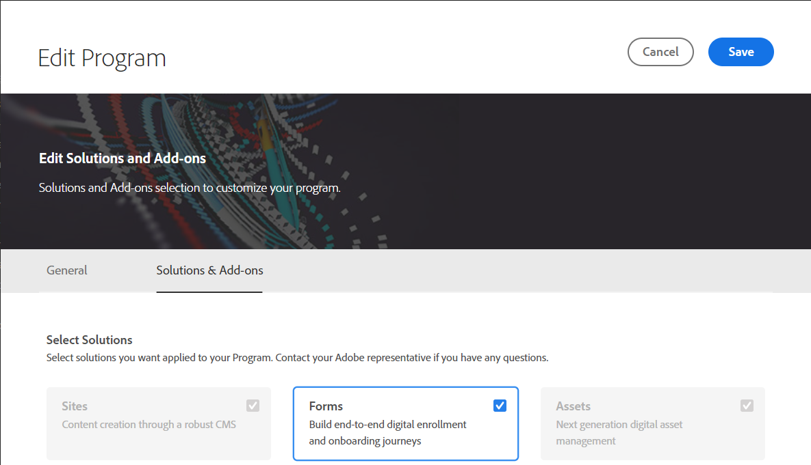

# 구성 {#installation-and-configuration}

Cloud Service 환경을 구성하는 동안 다음 문제 중 일부가 발생할 수 있습니다.

## Forms 옵션을 사용할 수 없음

다음 **[!UICONTROL Forms]** 옵션은에서 사용할 수 없음 **[!UICONTROL 탐색]** 페이지를 가리키도록 업데이트하는 중입니다.

활성화하려면 **[!UICONTROL Forms]** 옵션:

1. 에 로그인 [Cloud Manager](https://experience.adobe.com/)
1. 프로그램을 찾은 다음  아이콘. 프로그램의 프로그램 편집 페이지가 열립니다.
1. 를 엽니다. **[!UICONTROL 솔루션 및 추가 기능]** 탭.
1. 다음 항목 선택 **[!UICONTROL Forms]** option 및 클릭 **[!UICONTROL 저장]**.

   
1. [만들기](https://experienceleague.adobe.com/docs/experience-manager-cloud-manager/using/how-to-use/configuring-pipeline.html?lang=en#how-to-use) 및 [실행](https://experienceleague.adobe.com/docs/experience-manager-cloud-manager/using/how-to-use/deploying-code.html) 프로덕션 및 비프로덕션 파이프라인 모두.

파이프라인이 빌드되고 배포되면 **[!UICONTROL Forms]** 옵션 **[!UICONTROL 탐색]** 페이지를 가리키도록 업데이트하는 중입니다.

<!--  
## Environment creation fails {#environment-creation-fails}

Users are unable to create an [!DNL AEM Forms] as a Cloud Service environment. The environment creation fails after running for some time.

A missing profile can lead to environment creation failure. Check that the profile exists in Admin Console. If the profile does not exist, perform the following steps to create the profile:

1. Log in to [Admin Console](https://adminconsole.adobe.com/). Use Adobe ID of administrator provisioned to use Automated Forms Conversion Service to login. Do not any other ID or Federated ID to login.
1. Click the **[!UICONTROL Automated Forms Conversion Service]** option.
1. Click **[!UICONTROL New Profile]** in the Products tab.
1. Specify Name, Display Name, and Description for the profile. Click **[!UICONTROL Done]**. A profile is created.

If the profile exists and issues still persist, contact Adobe Support. -->

## 파이프라인 빌드 실패 {#build-pipeline-fails}

사용자가 빌드 파이프라인을 실행할 수 없습니다. 파이프라인이 일정 시간 동안 실행된 후 실패합니다.

문제를 해결하려면 Cloud Manager를 열고 다음을 선택합니다. **[!UICONTROL 업데이트]** 를 설정하는 것이 좋습니다.
