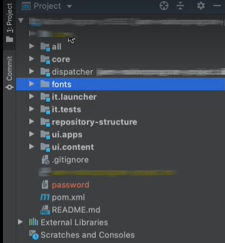

# 사용자 정의 글꼴 사용

**Cloud Service 커뮤니케이션 설명서는 베타 버전입니다.**

Forms as a Cloud Service 통신을 사용하여 XDP 템플릿, XDP 기반 PDF 문서 또는 Acrobat 양식(AcroForm)을 XML 데이터와 결합하여 PDF 문서를 생성할 수 있습니다. 또한 커뮤니케이션 을 사용하여 PDF 및 XDP 문서를 결합, 재배열 및 보강하고 PDF 문서에 대한 정보를 얻을 수 있습니다.

앞에서 언급한 작업과 함께 Cloud Service 또는 사용자 정의 글꼴(조직 승인 글꼴)에 포함된 글꼴을 사용하여 생성된 PDF 문서를 렌더링할 수 있습니다. Cloud Service 개발 프로젝트를 사용하여 Cloud Service 환경에 사용자 정의 글꼴을 추가할 수 있습니다.

## PDF 문서 동작

다음을 수행할 수 있습니다. [글꼴 포함](https://adobedocs.github.io/experience-manager-forms-cloud-service-developer-reference/references/output-sync/#tag/PrintedOutputOptions) PDF 문서로 이동합니다. 글꼴이 포함되면 PDF 문서가 모든 플랫폼에서 동일하게 나타납니다(모양). 또한 임베드된 글꼴을 사용하여 일관된 모양과 느낌을 유지합니다. 글꼴이 포함되지 않은 경우 글꼴 렌더링은 Acrobat 또는 Acrobat Reader과 같은 PDF 뷰어 클라이언트의 렌더링 설정에 따라 달라집니다. 글꼴을 클라이언트 시스템에서 사용할 수 있는 경우 PDF은 지정된 글꼴을 사용하고, 그렇지 않으면 PDF은 기본 대체 글꼴로 렌더링됩니다.

## Forms as a Cloud Service 환경에 사용자 정의 글꼴 추가 {#custom-fonts-cloud-service}

Cloud Service 환경에 사용자 정의 글꼴을 추가하려면 다음을 수행합니다.

1. 설정 및 열기 [지역 개발 프로젝트](setup-local-development-environment.md). 원하는 IDE를 사용할 수 있습니다.
1. 프로젝트의 최상위 폴더 구조에서 폴더(모듈)를 만들어 사용자 정의 글꼴을 저장하고 폴더에 사용자 정의 글꼴을 추가합니다. 예: fonts/src/main/resources
   

1. 개발 프로젝트의 글꼴 모듈에 대한 pom.xml 파일을 엽니다.
1. jar 플러그인을 pom 파일에 추가합니다.

   ```xml
   <plugin>
       <groupId>org.apache.maven.plugins</groupId>
       <artifactId>maven-jar-plugin</artifactId>
       <version>3.1.2</version>
       <configuration>
           <archive>
               <manifest>
                   <addDefaultEntries/>
                   <addDefaultImplementationEntries/>
               </manifest>
           </archive>
       </configuration>
   </plugin>
   ```

1. 추가 `<Font-Archive-Version>` manifest 항목을 .pom 파일로 만들고 버전 값을 1로 설정합니다.

   ```xml
   <plugin>
       <groupId>org.apache.maven.plugins</groupId>
       <artifactId>maven-jar-plugin</artifactId>
       <version>3.1.2</version>
       <configuration>
           <archive>
               <manifest>
                   <addDefaultEntries/>
                   <addDefaultImplementationEntries/>
               </manifest>
               <manifestEntries>
                   <Font-Archive-Version>1</Font-Archive-Version>
                   <Font-Archive-Contents>/</Font-Archive-Contents>
               </manifestEntries> 
           </archive>
       </configuration>
   </plugin>
   ```

1. 글꼴 폴더를에 추가 `<modules>` pom 파일에 나열됩니다. 예:

   ```xml
   <modules>
       <module>all</module>
       <module>core</module>
       <module>ui.frontend</module>
       <module>ui.apps</module>
       <module>ui.apps.structure</module>
       <module>ui.config</module>
       <module>ui.content</module>
       <module>it.tests</module>
       <module>dispatcher</module>
       <module>dispatcher.ams</module>
       <module>dispatcher.cloud</module>
       <module>ui.tests</module>
       <module>fonts</module>
   </modules>
   ```

   글꼴 폴더에는 모든 사용자 정의 글꼴이 포함됩니다.

1. 업데이트된 코드를 체크인하고 [파이프라인 실행](/help/implementing/cloud-manager/deploy-code.md) Cloud Service 환경에 글꼴을 배포합니다.

1. (선택 사항) 명령 프롬프트를 열고 로컬 프로젝트 폴더로 이동한 다음 아래 명령을 실행합니다. 이 명령은 관련 정보와 함께 .jar 파일의 글꼴을 패키지합니다. .jar 파일을 사용하여 Forms Cloud Service 로컬 개발 환경에 사용자 정의 글꼴을 추가할 수 있습니다.

   ```shell
   mvn clean install
   ```

## 로컬 Forms Cloud Service 개발 환경에 사용자 정의 글꼴 추가 {#custom-fonts-cloud-service-sdk}

1. 로컬 개발 환경을 시작합니다.
1. 다음으로 이동 `<aem install directory>/crx-quickstart/install` 폴더를 삭제합니다.
1. 배치 `<jar file contaning custom fonts and relevant deployment code>.jar` 설치 폴더로 이동합니다. .jar 파일이 없는 경우 다음 단계를 수행합니다. [Forms as a Cloud Service 환경에 사용자 정의 글꼴 추가](#custom-fonts-cloud-service) 섹션을 참조하십시오.
1. 실행 [도커 기반 SDK 환경](setup-local-development-environment.md#docker-microservices)


   >[!NOTE]
   >
   >업데이트된 사용자 지정 글꼴 .jar 파일을 로컬 개발 환경에 배포할 때마다 도커 기반 SDK 환경을 다시 시작합니다.
